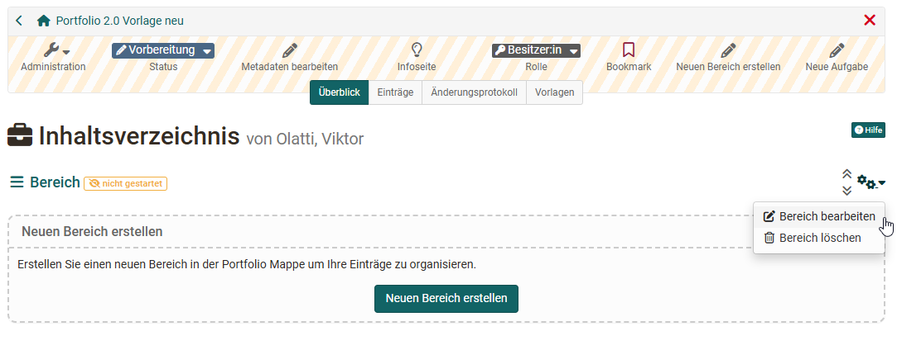
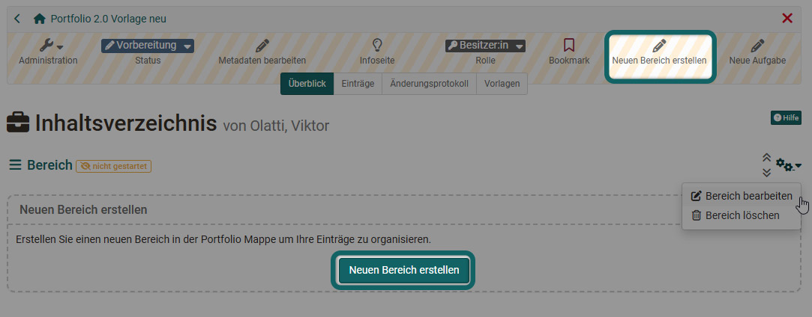
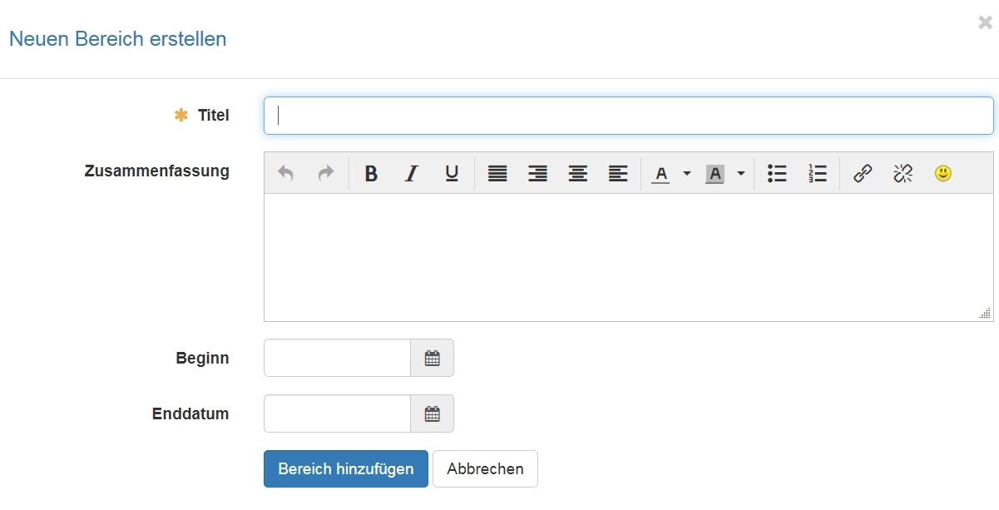
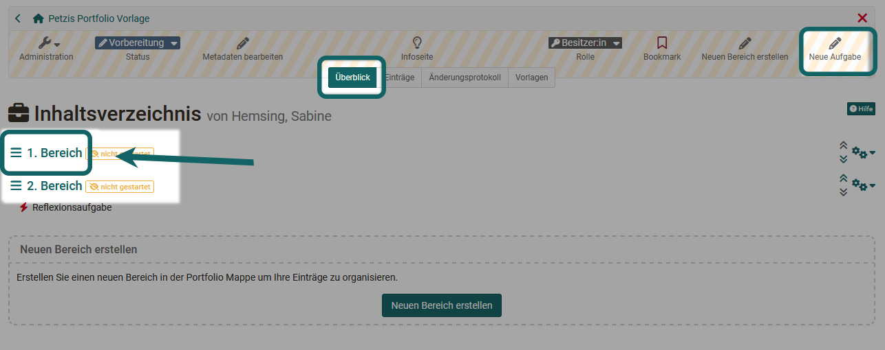
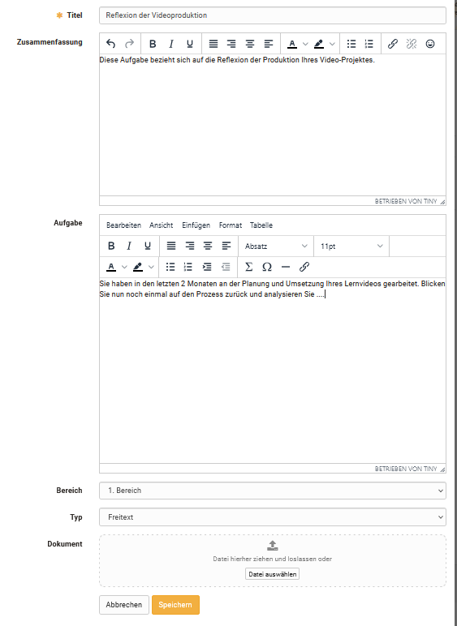
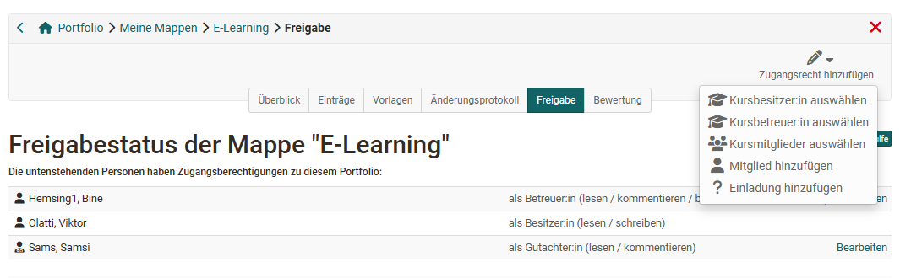
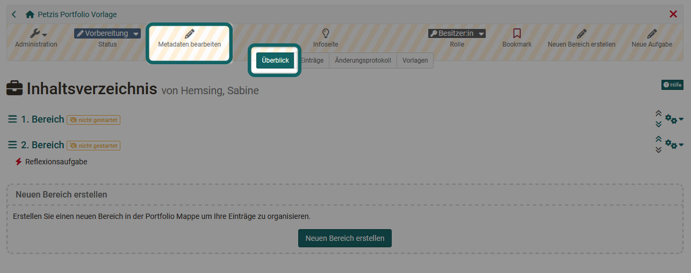

#  Portfoliovorlage: Administration und Bearbeitung

Öffnen sie Im Autorenbereich unter "Meine Einträge" die gewünschte Portfolio 2.0 Vorlage.

Wenn sie eine Portfolio 2.0 Vorlage neu erstellt haben enthält diese bereits einen "Bereich" den sie umbenennen und weiter ausgestalten können.

Ferner können sie neue Bereiche und Aufgaben für diese Bereiche erstellen.

## Bereich erstellen 
  
1. Wählen Sie "Neuen Bereich erstellen" entweder über die Menüleiste oder den Erstellungsblock.
 
  
2. Vergeben Sie einen Namen/Titel für diesen Bereich.
  
  
3. Optional kann noch eine Zusammenfassung für einen kurzen Überblick hinzugefügt sowie ein Beginn und Enddatum für die Sichtbarkeit dieses Bereichs eingerichtet werden.  

!!! info "Hinweis"

    Bereiche können nur unter "Überblick" bearbeitet, gelöscht und verschoben
    werden.

    Bereiche können nicht in Unterbereiche unterteilt werden. Jedem Bereich können allerdings mehrere "Aufgaben" hinzugefügt werden.

## Eine Aufgabe vom Typ "Freitext" erstellen und bearbeiten   
 
Öffnen Sie die gewünschte Portfolio 2.0 Vorlage. 
  
1. Wählen Sie im Tab "Überblick" den gewünschten Bereich aus und klicken Sie auf "Neue Aufgabe" erstellen oder wählen Sie direkt den Link "Neue Aufgabe" aus und ordnen Sie anschliessend die Aufgabe einen Bereich zu. 
  
  
2. Kurzen Titel eingeben und möglichst auch eine Zusammenfassung zur besseren Übersicht für die User ergänzen.

3. Unter Typ "Freitext" auswählen. Der Typ "Formular" wird im nächsten Abschnitt beschrieben.

4. Die konkrete Aufgabenstellung kann als Text im Bereich "Aufgabe" eingegeben oder als Dokument im Bereich "Dokument" hochgeladen und gespeichert werden.  
  
5. Unter "Bereich" gegebenenfalls den gewünschten Bereich der Aufgabe auswählen. In dieser Sektion wird dann die Aufgabe erscheinen.  
  
6. Zum Schluss alles Speichern.  

Im Tab "Einträge" können bestehende Aufgaben bearbeitet, verschoben oder gelöscht werden.

## Eine Aufgabe vom Typ "Formular" erstellen und bearbeiten 
  
1. Wählen Sie im Tab "Überblick" den gewünschten Bereich aus und klicken Sie auf  "Neue Aufgabe" erstellen oder wählen Sie direkt den Link "Neue Aufgabe" aus und ordnen Sie anschliessend die Aufgabe einen Bereich zu. 
  
2. Kurzen Titel eingeben und möglichst auch eine Zusammenfassung zur besseren Übersicht für die User ergänzen.

3. Als Typ "Formular" auswählen. 

4. Unter "Formular auswählen" können Sie anschliessend eine zuvor erstellte Lernressource "Formular" auswählen oder ein neues Formular erstellen. Es erscheint ein entsprechender Dialog. Wenn Sie hier ein neues Formular erstellen, müssen Sie es später noch im Autorenbereich aufrufen und ausgestalten. 

    !!! Tip "Tipp"

        Der Typ "Formular", insbesondere der Fragetyp "Rubrik", bietet sich besonders für Peer-Reviews, Kriterien bezogenen Feedbacks oder übersichtlichen Bewertungen an.

    Wir empfehlen die Lernressource "Formular" im Vorfeld zu erstellen und dann anschliessend in die Portfoliovorlage einzubinden.  

    Die eigentliche Aufgabe kann als Text im Bereich "Aufgabe" eingegeben, als Dokument im Bereich "Dokument" hochgeladen und gespeichert werden oder direkt in das Formular integriert werden. 
  
5. Anschliessend kann die Art der Einschätzung bzw. des Assessments näher bestimmt werden.

    * **Nur Selbsteinschätzung**: Benutzer:innen erstellen ein Self-Assessment und beantworten die Fragen des Formulars. Sie können z.B. die eigene Kompetenz bezüglich bestimmter Aspekte einschätzen. Eine Fremdeinschätzung entlang des Formulars z.B. durch Lehrende ist nicht möglich.

    * **Selbst- und Fremdeinschätzung**:    
    Es können sowohl eine Selbst-, wie auch mehrere Fremdeinschätzungen vorgenommen werden. Die Selbsteinschätzung wird für die Person, welche eine Fremdeinschätzung abgibt, nicht angezeigt.

    * **Selbsteinschätzung an eingeladene Benutzer:innen anzeigen**: Mit dieser Option wird die Selbsteinschätzung der Person angezeigt, welche eine Fremdeinschätzung abgibt. Die Selbsteinschätzung wird erst nach Abgabe der Fremdeinschätzung angezeigt.

    * **Anonyme Fremdeinschätzung**: Die Fremdeinschätzungen sind anonym. Für die User ist nicht sichtbar, wer welche Fremdeinschätzung abgegeben hat.  

6. Unter "Bereich" gegebenenfalls den gewünschten Bereich der Aufgabe auswählen. In dieser Sektion wird dann die Aufgabe erscheinen.  

7. Zum Schluss alles Speichern.  
  
!!! info "Hinweis"

    Damit eine Fremdeinschätzung erfolgen kann, muss der User, nachdem er die Portfolio Aufgabe abgeholt hat, im Tab "Freigabe" Personen für die Bewertung freischalten, z.B. alle Kursmitglieder oder Kursbetreuer:innen oder bestimmte einzelne Personen. 

    Anschliessend können diese Personen das Formular nutzen und Bewertungen vornehmen. Mehrere Bewertungen können darüber hinaus auch in einer Art Spinnennetz dargestellt werden.

!!! info "Hinweis"

    Vom Ersteller einer Portfolio 2.0 Vorlage werden grundsätzlich "Aufgaben" und keine "Einträge" erstellt.

## Weitere Einstellungen

Weitere Konfigurationen der Lernressource Portfolio 2.0 Vorlage sind über die Portfolio Toolleiste und das Menü "Administration" möglich.

### Administration

In der "Administration" können im Menü "Einstellungen" weitere Konfigurationen vorgenommen werden. Neben den Informationen für die Infoseite (Tab Info und Metadaten), der Einrichtung der Freigabemodalitäten und dem Eintrag in den Katalog, können im Tab "Einstellungen" folgende weitere Konfigurationen vorgenommen werden:

+ Benutzer:innen erlauben neue Einträge zu erstellen (nicht nur die Aufgaben zu bearbeiten)

+ Benutzer:innen erlauben die eigene Mappe zu löschen. Wählen Sie diese Option nicht, haben die Benutzer:innen keine Chance die Portfoliomappe wieder zu löschen.
  
+ Benutzer:innen einen Vorlageordner mit weiteren Dateien und/oder Formularen zur Auswahl zur Verfügung stellen. Aktivieren Sie den Vorlagenordner können Sie zusätzlich definieren, ob die Benutzer neue Einträge nur basierend auf dem Vorlagenordner erstellen können.

### Toolleiste 

Im Tab "Überblick" der Toolleiste können  die Metadaten der Portfoliovorlage bearbeitet werden.

