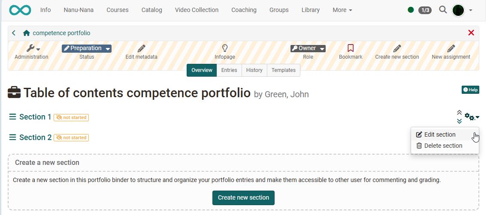
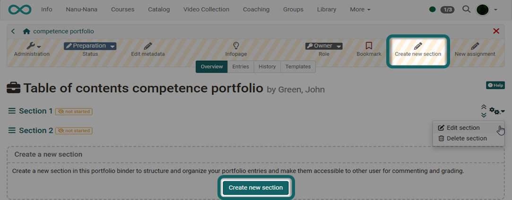
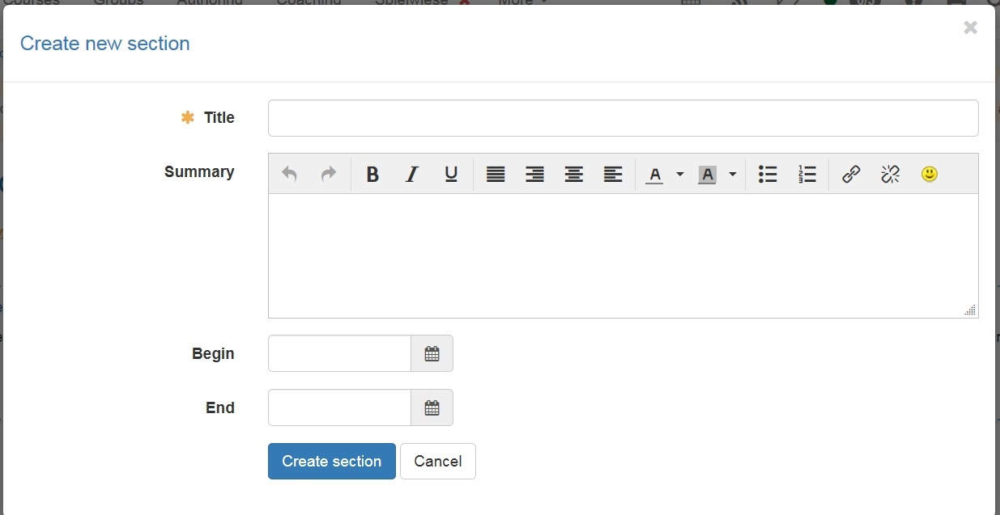
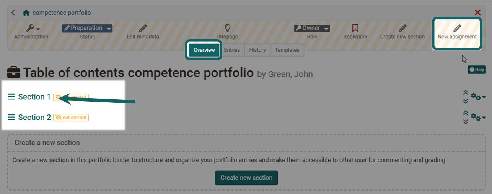
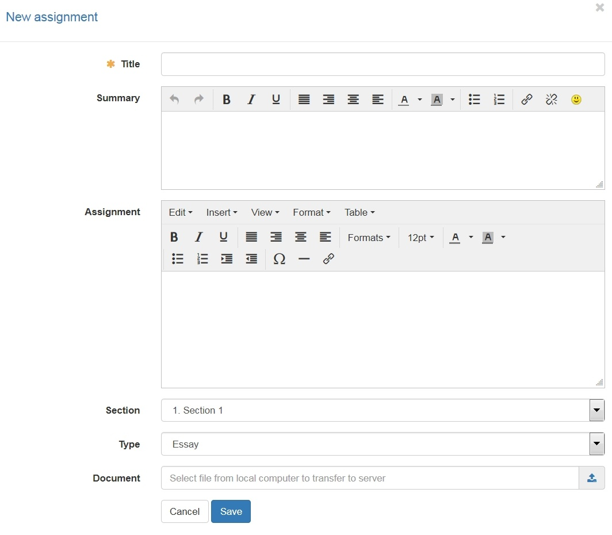
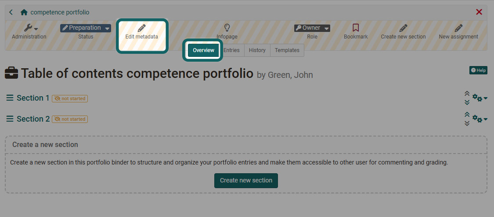

# Portfolio template: Administration and editing

Open the desired Portfolio 2.0 template in the authoring area under "My entries".

If you have created a new Portfolio 2.0 template, it already contains a "section", which you can rename and further develop.

{ class="shadow lightbox" }

You can also create new sections and assignments for these sections.

## Create a section

1. Choose "Create new section" via the menu bar or the creation block.
{ class="shadow lightbox" }

2. Enter a title for the section.
{ class="shadow lightbox" }

3. In addition, you can write a summary for a short overview and set a start and end date for the visibility of the section.

!!! info "Note"

    Sections can only be edited, deleted and moved in "Overview".

    Sections cannot be divided into subsections. However, several "assignments" can be added to each section.

## Create and edit an assignment of type "Essay"

Open the desired Portfolio 2.0 template.

1. Select the desired section in the "Overview" tab and click "New assignment" to create it, or select the link "New assignment" directly and then assign it to a section.
{ class="shadow lightbox" }

2. Enter a short title and, if possible, also add a summary for a better overview for the users.
{ class="shadow lightbox" }

3. Under type, select "Essay". The "Form" type is described in the next section.

4. The concrete task description can be entered as text in the "Assignment" area or uploaded and saved as a document in the "Document" area.

5. Under "Section", select the desired section for the assignment if needed. The assignment will then appear in this section.

6. Finally, save everything.

In the "Entries" tab, existing assignments can be edited, moved or deleted.

## Create and edit an assignment of type "Form"

1. Select the desired section in the "Overview" tab and click "New assignment" to create it, or select the link "New assignment" directly and then assign it to a section.

2. Enter a short title and, if possible, also add a summary for a better overview for the users.

3. Select "Form" as the type.

4. Under "Select form", you can then select a previously created "Form" learning resource or create a new form. A corresponding dialog appears. If you create a new form here, you will have to call it up and design it later in the authoring area.

    !!! tip "Tip"

        The "Form" type, especially the "Rubric" question type, is particularly suitable for peer reviews, criteria-related feedback or clear evaluations.

    We recommend creating the learning resource "Form" in advance and then including it in the portfolio template afterwards.

    The actual assignment can be entered as text in the "Assignment" area, uploaded and saved as a document in the "Document" area, or integrated directly into the form.

5. The evaluation mode can then be defined in more detail.

    * **Only self evaluation**: Users create a self evaluation and answer the questions in the form. For example, they can assess their own competence regarding certain aspects. An external evaluation based on the form, e.g. by teachers, is not possible.

    * **Auto and external evaluation**: Both a self evaluation and several external evaluations can be made. The self evaluation is not shown to the person giving an external evaluation.

    * **Invitee can see self evaluation**: With this option, the self evaluation is shown to the person giving an external evaluation. The self evaluation is only shown after the external evaluation has been submitted.

    * **Anonymous external evaluation**: The external evaluations are anonymous. Users cannot see who gave which external evaluation.

6. Under "Section", select the desired section for the assignment if needed. The assignment will then appear in this section.

7. Finally, save everything.

!!! info "Note"

    For an external evaluation to take place, the user must activate people for the assessment in the "Release" tab after collecting the portfolio assignment, e.g. all course members, course coaches or specific individual people. { class="shadow lightbox" }

    These people can then use the form and submit evaluations. Several evaluations can also be displayed in a kind of spider diagram.

!!! info "Note"

    The creators of a Portfolio 2.0 template always create "assignments" and not "entries".

## Further configurations

Further configurations of the Portfolio 2.0 template learning resource are possible via the Portfolio toolbar and the "Administration" menu.

### Administration

Further settings can be made in the "Administration" menu in the "Settings" menu. In addition to the information for the info page, the setup of the release modalities and the entry in the catalog, the following further configurations can be made in the tab "Settings":

  * Allow users to create new entries (not just edit the assignments)

  * Allow users to delete their own binder. If you do not select this option, the users have no chance to delete the portfolio binder again.

  * Allow users to provide a template folder with additional files and/or forms for selection. If you activate the template folder, you can also define whether users can only create new entries based on the template folder.

### Toolbar

In the "Overview" tab of the toolbar, you can edit the metadata of the portfolio template.

{ class="shadow lightbox" }
