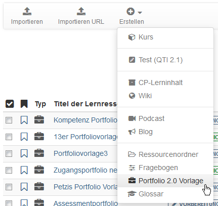

# Portfoliovorlage: Erstellung

Für ein vom Lehrenden gesteuertes Assessment-Portfolio, das beispielsweise im
Rahmen von OpenOlat Kursen eingesetzt wird, benötigt man als erstes eine Portfoliovorlage.

Die "Portfolio 2.0 Vorlage" ist eine Lernressource, die wie alle Lernressourcen im "Autorenbereich" erstellt und eingerichtet wird. Die
folgenden Schritte beschreiben, wie eine Portfoliovorlage erstellt wird.

Portfolio Vorlage erstellen  
---  
1. Gehen Sie in den Autorenbereich und klicken Sie auf den Button "Erstellen". Wählen Sie in der erscheinenden Lernressourcen Liste
"Portfolio 2.0 Vorlage" aus.

      
  
2. Geben Sie den Titel der Lernressource ein und klicken Sie auf "Erstellen".

3. Sie gelangen nun direkt zur Lernressource "Portfolio 2.0 Vorlage" und befinden sich im Einstellungsmenü der Lernressource. 
  
4. Die einzelnen Tabs der "Einstellungen" können nun weiter eingerichtet werden. Besonders im Tab "Einstellungen" können Portfolio spezifische Einstellungen vorgenommen werden. Hierzu gehören:
    * ob Benutzer neben den Aufgabenbearbeitungen auch eigene unabhängige Einträge im Portfolio vornehmen dürfen
    * ob Benutzer eine Mappe auch wieder löschen dürfen (was häufig sinnvoll ist)
    * ob ein zusätzlicher Vorlagenordner verwendet werden soll und ob diese Vorlagen notwendig sind um neue Einträge zu erstellen.

5. Auch die weiteren Tabs Metadaten, Freigabe und Katalog können weiter eingerichtet werden  
  
Anschließend die Ansicht über das X rechts oben schliessen oder in der Bread-Crumb-Leiste auf den Titel der gerade erstellten Portfolio Vorlage klicken.  

Nun kann mit der Ausgestaltung der Portfolio 2.0 Vorlage begonnen werden.  

Weitere Informationen zur Bearbeitung und Gestaltung der Portfolio Vorlage 2.0
finden Sie
[hier](Portfolio_template_Administration_and_editing.de.md).  
  
Wenn Sie in Ihrer Portfolio 2.0 Vorlage auch den Aufgaben Typ Formular nutzen
möchten, müssen sie zusätzlich noch eine entsprechende [Lernressource "Formular"](../learningresources/Forms_in_the_ePortfolio_template.de.md) erstellen und einbinden. Das Vorgehen zur Erstellung der Lernressource ist identisch wie bei der Erstellung der Portfolio Vorlage.

Um eine erstellte und eingerichtete Portfolio 2.0 Vorlage in einen OpenOlat
Kurs einzubinden fügen sie ihrem Kurs den Kursbaustein [Portfolioaufgabe
](Creating_Portfolio_Tasks.de.md)hinzu.

