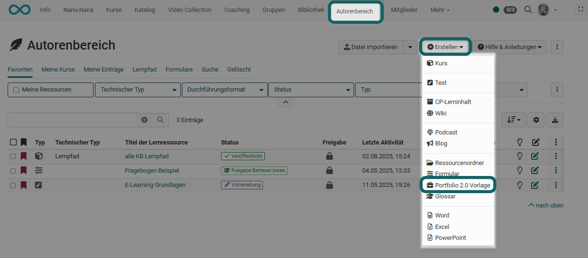

# Portfoliovorlage: Erstellung {: #portfolio_template_creation}

Für ein vom Lehrenden gesteuertes Bewertungsportfolio, das beispielsweise im Rahmen von OpenOlat Kursen eingesetzt wird, benötigt man als erstes eine Portfoliovorlage.

Die "Portfolio 2.0 Vorlage" ist eine Lernressource, die wie alle Lernressourcen im "Autorenbereich" erstellt und eingerichtet wird. Die folgenden Schritte beschreiben, wie eine Portfoliovorlage erstellt wird.

Portfolio 2.0 Vorlage erstellen
---
1. Gehen Sie in den Autorenbereich und klicken Sie auf den Button "Erstellen". Wählen Sie in der erscheinenden Lernressourcenliste "Portfolio 2.0 Vorlage" aus.

    { class="shadow lightbox" }

2. Geben Sie den Titel der Lernressource ein und klicken Sie auf "Erstellen".

3. Sie gelangen nun direkt zur Lernressource "Portfolio 2.0 Vorlage" und befinden sich im Einstellungsmenü der Lernressource. 

4. Die einzelnen Tabs der "Einstellungen" können nun weiter eingerichtet werden. Besonders im Tab "Einstellungen" können Portfolio-spezifische Einstellungen vorgenommen werden.
Hierzu gehören:

    * ob Benutzer:innen neben den Aufgabenbearbeitungen auch eigene unabhängige Einträge im Portfolio vornehmen dürfen
    * ob Benutzer:innen eine Mappe auch wieder löschen dürfen (was häufig sinnvoll ist)
    * ob ein zusätzlicher Vorlagenordner verwendet werden soll und ob diese Vorlagen notwendig sind um neue Einträge zu erstellen.

5. Auch die weiteren Tabs [Info](../learningresources/Course_Settings_Info.de.md), [Metadaten](../learningresources/Course_Settings_Metadata.de.md) und [Freigabe](../learningresources/Access_configuration.de.md) können weiter eingerichtet werden.  

Anschliessend die Ansicht über das X rechts oben schliessen oder in der Breadcrumb-Leiste auf den Titel der gerade erstellten Portfolio 2.0 Vorlage klicken.  

Nun kann mit der Ausgestaltung der Portfolio 2.0 Vorlage begonnen werden.  

Weitere Informationen zur Bearbeitung und Gestaltung der Portfolio 2.0 Vorlage finden Sie [hier](Portfolio_template_Administration_and_editing.de.md).  

Wenn Sie in Ihrer Portfolio 2.0 Vorlage auch den Aufgabentyp Formular nutzen möchten, müssen Sie zusätzlich noch eine entsprechende [Lernressource "Formular"](../learningresources/Forms_in_the_ePortfolio_template.de.md) erstellen und einbinden. Das Vorgehen zur Erstellung der Lernressource ist identisch wie bei der Erstellung der Portfolio 2.0 Vorlage.

Um eine erstellte und eingerichtete Portfolio 2.0 Vorlage in einen OpenOlat Kurs einzubinden fügen Sie Ihrem Kurs den [Kursbaustein Portfolioaufgabe](../learningresources/Course_Element_Portfolio_Task.de.md) hinzu.

## Weiterführende Informationen {: #further_information}

**Auf dieser Seite erwähnt** 
[Kurseinstellungen - Tab Info >](../learningresources/Course_Settings_Info.de.md) 
[Kurseinstellungen - Tab Metadaten >](../learningresources/Course_Settings_Metadata.de.md) 
[Zugangskonfiguration / Freigabe >](../learningresources/Access_configuration.de.md) 
[Portfoliovorlage: Administration und Bearbeitung >](../learningresources/Portfolio_template_Administration_and_editing.de.md) 
[Formular in der Portfolio 2.0 Vorlage >](../learningresources/Forms_in_the_ePortfolio_template.de.md) 
[Kursbaustein "Portfolioaufgabe" >](../learningresources/Course_Element_Portfolio_Task.de.md)

[Zum Seitenanfang ^](#portfolio_template_creation)

