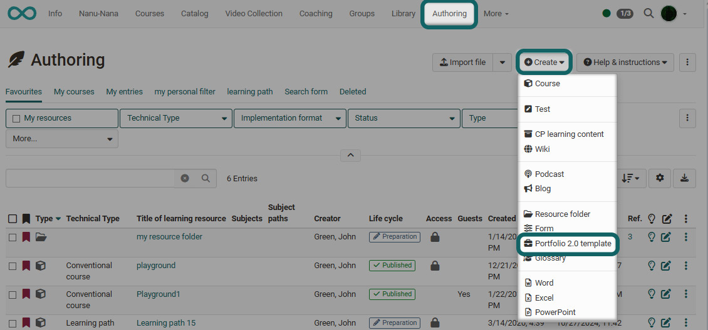

# Portfolio template: Creation {: #portfolio_template_creation}

For a teacher-led assessment portfolio, which is used in OpenOlat courses for example, the first thing you need is a portfolio template.

The "Portfolio 2.0 template" is a learning resource that, like all learning resources, is created and set up under "Authoring". The following steps describe how a portfolio template is created.

Create a Portfolio 2.0 template
---
1. Go to the author area and click the "Create" button. Select "Portfolio 2.0 template" from the list of learning resources that appears.

    { class="shadow lightbox" }

2. Insert the title of the learning resource and click "Create".  

3. You will now be taken directly to the "Portfolio 2.0 template" learning resource and are in the settings menu of the learning resource.

4. In the tab "Settings" further configurations of the portfolio can be made. Portfolio-specific settings can be made in the "Options" tab in particular.
These include:

    * whether users are allowed to make their own independent entries in the portfolio in addition to editing tasks
    * whether users are allowed to delete a binder (which is often useful)
    * whether an additional template folder should be used and whether these templates are necessary to create new entries.

5. The other tabs [Info](../learningresources/Course_Settings_Info.md), [Metadata](../learningresources/Course_Settings_Metadata.md) and [Share](../learningresources/Access_configuration.md) can also be configured further.  

Then close the view via the X at the top right or click on the title of the Portfolio 2.0 template just created in the breadcrumb bar.

Now you can start editing the portfolio 2.0 template.

Further information on editing and designing the Portfolio 2.0 template can be found [here](Portfolio_template_Administration_and_editing.md).  

If you also want to use the task type "Form" in your Portfolio 2.0 template, you must also create and integrate a corresponding [learning resource "Form"](../learningresources/Forms_in_the_ePortfolio_template.md). The procedure for creating the learning resource is identical to creating the Portfolio 2.0 template.

To integrate an already created and configured Portfolio 2.0 template in an OpenOlat course you have to add the [course element "Portfolio task"](../learningresources/Course_Element_Portfolio_Task.md) to this course.

## Further information {: #further_information}

**Mentioned on this page** 
[Course Settings - Tab Info >](../learningresources/Course_Settings_Info.md) 
[Course Settings - Tab Metadata >](../learningresources/Course_Settings_Metadata.md) 
[Access configuration >](../learningresources/Access_configuration.md) 
[Portfolio template: Administration and editing >](../learningresources/Portfolio_template_Administration_and_editing.md) 
[Form in the Portfolio 2.0 template >](../learningresources/Forms_in_the_ePortfolio_template.md) 
[Course Element "Portfolio Task" >](../learningresources/Course_Element_Portfolio_Task.md)

[To the top of the page ^](#portfolio_template_creation)

