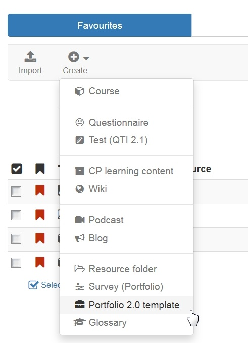

# Portfolio template: Creation

For a teacher-led assessment portfolio, which is used in OpenOlat courses for example, the first thing you need is a portfolio template.

The "Portfolio 2.0 template" is a learning resource you can create under "Authoring". The following steps describe how a portfolio template is created.

Create a template  
---  
1. Go to the author area and click on the "Create" option. Select "Portfolio 2.0 Template" from the list of learning resources that appears.

      
  
2. Insert the title of the learning resource and click "Create".  

3. You will now be taken directly to the "Portfolio 2.0 template" learning resource and are in the settings menu of the learning resource.
  
4. In the tab "Settings" further configurations of the portfolio can be made. Portfolio-specific settings can be made in the "Settings" tab in particular.
These include:

    * whether users are allowed to make their own independent entries in the portfolio in addition to editing tasks
    * whether users are allowed to delete a folder (which is often useful)
    * whether an additional template folder should be used and whether these templates are necessary to create new entries.

6. The other tabs Metadata, Access and Catalog can also be configured further.  

Then close the view via the X at the top right or click on the title of the portfolio template just created in the bread-crumb bar.

Now you can start editing the portfolio 2.0 template.

Further information on editing and designing the Portfolio Template 2.0 can be found [here](Portfolio_template_Administration_and_editing.md).  
  
If you want to use the type "Form" in your assignement, you must also create and integrate a corresponding [learning resource "Form"](../learningresources/Forms_in_the_ePortfolio_template.md). The procedure for creating the learning resource is the same as for other learning resources like portfolio template.

To integrate an already created Portfolio 2.0 template in an OpenOlat course you have to add the course element "[Portfolio task](Creating_Portfolio_Tasks.md)" to this course.

