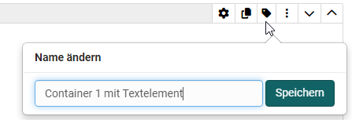

# Frageregeln

Mit Frageregeln kann die Anzeige von Layout-Bereichen in Abhängigkeit von bestimmten Antworten der Einzel- oder Mehrfachwahl (Bedingungsfeld) gesetzt werden. So wird ein Layout-Container mit den jeweiligen Elementen nur dann angezeigt, wenn der User eine bestimmte vorgegebene Antwort ausgewählt hat.

Einem Formular können mehrere Regeln hinzugefügt werden.  Dadurch können unterschiedliche Fragestränge erstellt werden.

## Erstellung einer Regel

Überlegen Sie sich zunächst, welche Bereiche Sie bei welcher Auswahl anzeigen wollen und setzen diese dann mit Hilfe der Fragergeln für das Formular um.

### Voraussetzungen 
Um eine Frageregel zu erstellen, müssen folgende Bedingungen erfüllt sein:

* Mehrfachauswahl oder Einfachauswahl mit mind. 1 Antwort
* Ein Container-Layout, das einen anderen Fragebaustein oder Inhalt besitzt und nicht die oben genannten Fragebausteine.

Falls die Bedingungen nicht erfüllt sind, erfolgt eine Warnung und sie können keine Regeln erstellen.

### Passende Namen vergeben

Wichtig, um den Überblick zu behalten sollten Sie unbedingt für alle Layout und Inhaltselemente, die Sie für die Frageregeln benötigen, sinnvolle Bezeichnungen vergeben. Dies erfolgt für Layouts über das Icon bzw. im Inspektor bei den Inhaltselementen.  

{ class="shadow lightbox" }
{ class="shadow lightbox" }

### Frageregeln im Menü hinterlegen
 Die Frageregeln können oben, rechts neben dem Administrationsmenü, aufgerufen werden.

{ class="shadow lightbox" }

Ein neues Popup-Fenster erscheint Fragereln können erstellt und angezeigt werden.

{ class="shadow lightbox" }

Eine Frageregel besteht immer aus einer Bedingung mit verschiedenen Optionen und einer zugeordneten Aktion, die angezeigt wird. Die Bedingung ist eine MC oder SC Auswahl mit den konkreten Antwortmöglichkeiten. Für jede Antwortmöglichkeit kann dann ein Layout-Container ausgewählt werden, der z.B. konkrete Informationen oder weitere Fragen enthält. Speichern nicht vergessen.

 { class="shadow lightbox" }
