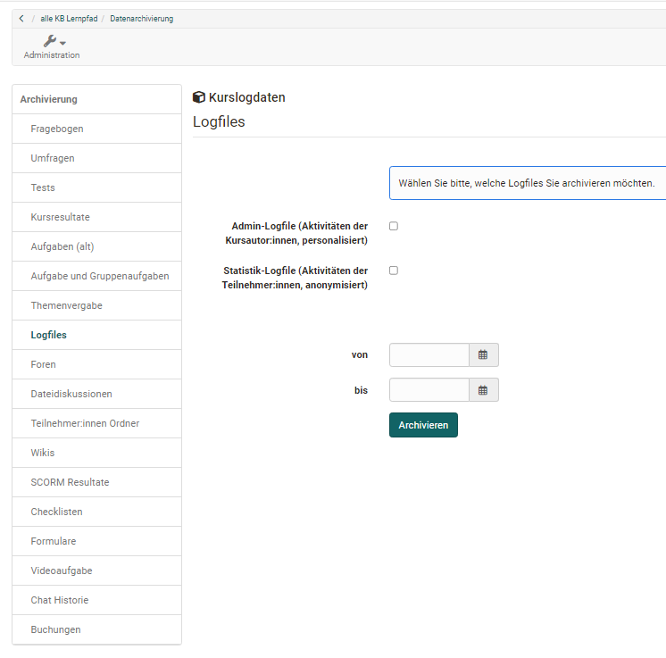
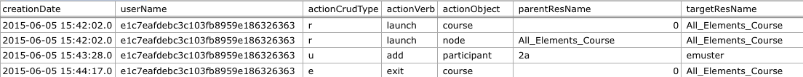

# Aufzeichnung der Kursaktivitäten {: #record_of_course_activities}

OpenOlat zeichnet Kursaktivitäten der Teilnehmenden und Kursautor:innen in Logfiles auf.

Innerhalb eines Kurses archivieren Sie die Logfiles im Werkzeug [Archivierung & Reports](../learningresources/Course_Archiving.de.md) [:octicons-tag-16:{ title="ab Release 21.0 (OO-9620)" }](https://track.frentix.com/issue/OO-9620) unter: 
`Kurs > Administration > Archivierung & Reports > Logfiles`

Zur Auswahl stehen:

* Admin-Logfile mit personalisierten Daten der Kursautor:innen
* Statistik-Logfile mit den anonymisierten Daten der Teilnehmenden
* Teilnehmer:innen-Logfile mit detaillierten, personalisierten Daten der Teilnehmenden

{ class="shadow lightbox" }

!!! info "Datenschutz"

    Aus Datenschutzgründen ist das Teilnehmer:innen-Logfile mit den personalisierten Daten der Teilnehmenden nur für Systemadministrator:innen verfügbar.

Logfiles archivieren können Besitzer:innen des Kurses und Personen mit dem Kursrecht "Datenarchivierung". OpenOlat legt die gewählten Logfiles als ZIP-Datei (z.B. _CourseLogFiles_2010-01-28_14-55-55.zip_) in den [persönlichen Dateien](../personal_menu/File_Hub.de.md#personal_files) im Ordner `private/archive` ab. Die ZIP-Datei enthält dann die ausgewählten Dateien _course_statistic_log.xlsx_, _course_admin_log.xlsx_ und _course_user_log.xlsx_.

Beachten Sie, dass in der Datei course_statistic_log.xlsx die Teilnehmenden folgendermassen anonymisiert sind: 
Jede:r Kursteilnehmer:in erhält eine zufällig erzeugte Nummer (z.B. *7FFBA8C371B1A3DACCF5F12227A75CE82D6C4CE6), die innerhalb eines Kurses konstant bleibt. Sie können so die Aktivitäten von Kursteilnehmer:in X im Kurs Y verfolgen, jedoch keine Vergleiche mit den Aktivitäten im Kurs Z machen, da Kursteilnehmer:in X im Kurs Z eine neue Nummer erhält.

Mögliche Einträge in den Logfile-Spalten **actionCrudType** (Datenbankoperation), **actionVerb** (Aktion) und **actionObject** (bearbeitetes Kursobjekt) (alphabetisch zusammengefasst):

actionCrudType| actionVerb| actionObject
---|---|---
c | add | calendar, chat, course, cpgetfile
r | copy | editor, efficency
u | denied | feed, feeditem, file, folder, forummessage, forumthread
d | do | glossary, gotonode, groupmanagement, group, grouparea, groupareaempty
e | edit | help
|  | exit | layout
|  | hide | node
|  | launch | owner
|  | lock | participant, publisher
|  | move | quota
|  | open | resource, rights, rightsempty
|  | remove | sharedfolder, spgetfile
|  | view | testattempts, testcomment, testid, testscore, testsuccess, tools, toolsempty
|  |  | waitingperson

In der Spalte **actionCrudType** werden die ausgeführten Aktionen in grundlegenden Datenbankoperationen zusammengefasst. Da diese in der Spalte actionVerb weiter aufgeschlüsselt werden, ist sie nicht weiter relevant.

Dennoch hier der Schlüssel:

* C=Create (erstellen)
* R=Read / Retrieve (lesen/holen)
* U= Update / Modify (Verändern)
* D=Delete (entfernen)
* E=Exit (beenden)

In der Spalte **actionVerb** wird nun genauer betrachtet, welche Aktion die Benutzer:innen unter „userName“ mit dem Kursobjekt aus Spalte actionObject vorgenommen haben. Der Eintrag in der Spalte **actionObject** ist also das Objekt das "verändert" wurde, zumindest aus Datenbanksicht.

{ class="shadow lightbox" }

Die dritte Zeile

`u / add / participant / [Gruppenname] / [Benutzername]`

wird folgendermassen gelesen (Datenbankoperation: update / modify):

`Füge Benutzer [Benutzername] zu [Gruppe] hinzu`

## Weiterführende Informationen {: #further_information}

[Kursadministration - Archivierung & Reports >](../learningresources/Course_Archiving.de.md) 
[Persönliche Werkzeuge: File Hub >](../personal_menu/File_Hub.de.md) 
[Mitgliederverwaltung >](../learningresources/Members_management.de.md)

[Zum Seitenanfang ^](#record_of_course_activities)

