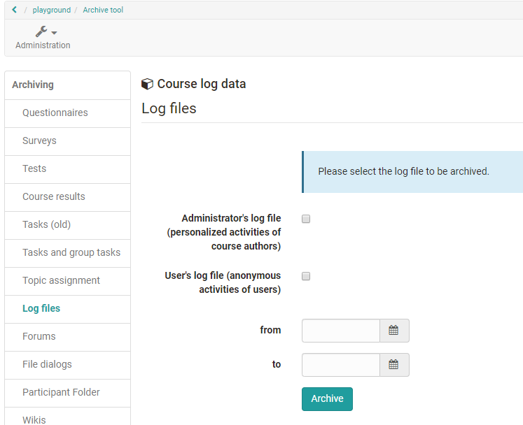

# Record of Course Activities {: #record_of_course_activities}

OpenOlat records course activities of participants and course authors in log files.

Within a course, you archive the log files in the [Archiving & Reporting](../learningresources/Course_Archiving.md) tool [:octicons-tag-16:{ title="from Release 21.0 (OO-9620)" }](https://track.frentix.com/issue/OO-9620) under: 
`Course > Administration > Archiving & Reporting > Log files`

The following log files are available:

* Admin log file with personalized data of the course authors
* Statistics log file with the anonymized data of the participants
* Participants log file with detailed, personalized data of the participants

{ class="shadow lightbox" }

!!! info "Privacy protection"

    For privacy reasons, the participants log file with the personalized data of the participants is only available to system administrators.

Owners of the course and persons with the course right "Archive tool" can archive log files. OpenOlat stores the selected log files as a ZIP file (e.g. _CourseLogFiles_2010-01-28_14-55-55.zip_) in the [personal files](../personal_menu/File_Hub.md#personal_files) in the folder `private/archive`. The ZIP file then contains the selected files _course_statistic_log.xlsx_, _course_admin_log.xlsx_ and _course_user_log.xlsx_.

Please note that in the file course_statistic_log.xlsx the participants are anonymized as follows: 
Each participant receives a randomly generated number (e.g. *7FFBA8C371B1A3DACCF5F12227A75CE82D6C4CE6), which remains constant within a course. This allows you to track the activities of participant X in course Y, but not to compare them with their activities in course Z, since participant X receives a new number in course Z.

Possible entries in the log file columns **actionCrudType** (database operation), **actionVerb** (action) and **actionObject** (course object handled) (grouped alphabetically):

actionCrudType| actionVerb| actionObject
---|---|---
c | add | calendar, chat, course, cpgetfile
r | copy | editor, efficency
u | denied | feed, feeditem, file, folder, forummessage, forumthread
d | do | glossary, gotonode, groupmanagement, group, grouparea, groupareaempty
e | edit | help
|  | exit | layout
|  | hide | node
|  | launch | owner
|  | lock | participant, publisher
|  | move | quota
|  | open | resource, rights, rightsempty
|  | remove | sharedfolder, spgetfile
|  | view | testattempts, testcomment, testid, testscore, testsuccess, tools, toolsempty
|  |  | waitingperson

The column **actionCrudType** summarizes the actions performed in basic database operations. Since these are further broken down in the actionVerb column, actionCrudType is not further relevant.

Nevertheless, here is the key:

* C=Create
* R=Read / Retrieve
* U=Update / Modify
* D=Delete
* E=Exit

The column **actionVerb** then examines in more detail which action the users under "userName" performed on the course object from the actionObject column. The entry in the **actionObject** column is thus the object that was "changed", at least from a database perspective.

{ class="shadow lightbox" }

The third row

`u / add / participant / [group name] / [username]`

is read as follows (database operation: update / modify):

`Add user [username] to [group]`

## Further information {: #further_information}

[Course administration - Archiving & Reports >](../learningresources/Course_Archiving.md) 
[Personal tools: File Hub >](../personal_menu/File_Hub.md) 
[Members management >](../learningresources/Members_management.md)

[To the top of the page ^](#record_of_course_activities)
