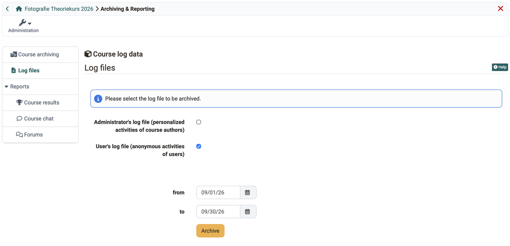
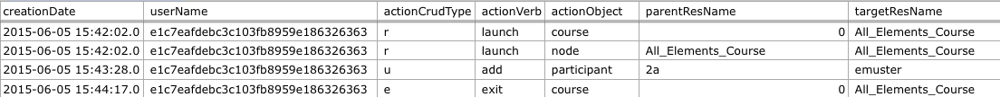

# Record of Course Activities {: #record_of_course_activities}

OpenOlat records course activities of participants and course authors in log files.

Within a course, you archive the log files in the [Archiving & Reporting](../learningresources/Course_Archiving.md) tool [:octicons-tag-16:{ title="from Release 21.0 (OO-9620)" }](https://track.frentix.com/issue/OO-9620) under: 
`Course > Administration > Archiving & Reporting > Log files`

The following log files are available:

* Admin log file, shown as "Administrator's log file (personalized activities of course authors)", with personalized data of the course authors
* Statistics log file, shown as "User's log file (anonymous activities of users)", with pseudonymized data of the participants
* Participants log file, shown as "User's log file (personalized, detailed activities of all users)", with detailed, personalized data of the participants

Owners of the course as well as learning resource managers and administrators of the organisation the course belongs to can archive log files. Owners and learning resource managers choose between the admin log file and the statistics log file. The course right "Archive tool" opens the Archiving & Reporting tool, but not the log files. Persons who only have this course right see the message "You have no rights to archive log files." under Log files.

Use the fields "from" and "to" to limit the log files to a period; both fields are optional. The period includes the day in the "to" field. With **Archive**, OpenOlat creates the selected log files and notifies you by e-mail as soon as the ZIP file is ready. The image shows the selection as owners see it.

{ class="shadow lightbox" title="Log files in the Archiving & Reporting tool · 2026.10.02" }

!!! info "Privacy protection"

    For privacy reasons, the participants log file with the personalized data of the participants is only available to administrators of the organisation the course belongs to.

OpenOlat stores the selected log files as a ZIP file (e.g. _CourseLogFiles_2010-01-28_14-55-55.zip_) in the [personal files](../personal_menu/File_Hub.md#personal_files) in the folder `private/archive/"Course title"`. The ZIP file then contains the selected files _course_statistic_log.xlsx_, _course_admin_log.xlsx_ and _course_user_log.xlsx_.

In the file _course_statistic_log.xlsx_, each participant receives an identifier of 32 characters instead of their name (e.g. `e1c7eafdebc3c103fb8959e186326363`), which remains the same within a course. This allows you to track the activities of participant X in course Y, but not to compare them with their activities in course Z, since participant X receives a different identifier in course Z. The identifier is a pseudonym: combined with other information, such as the time of a forum post, it can be linked to a person. Therefore, treat the file as personal data.

Possible entries in the log file columns **actionCrudType** (database operation), **actionVerb** (action) and **actionObject** (course object handled) (grouped alphabetically):

actionCrudType| actionVerb| actionObject
---|---|---
c | add | calendar, chat, course, cpgetfile
r | copy | editor, efficency
u | denied | feed, feeditem, file, folder, forummessage, forumthread
d | do | glossary, gotonode, groupmanagement, group, grouparea, groupareaempty
e | edit | help
|  | exit | layout
|  | hide | node
|  | launch | owner
|  | lock | participant, publisher
|  | move | quota
|  | open | resource, rights, rightsempty
|  | remove | sharedfolder, spgetfile
|  | view | testattempts, testcomment, testid, testscore, testsuccess, tools, toolsempty
|  |  | waitingperson

The column **actionCrudType** summarizes the actions performed in basic database operations. Since these are further broken down in the actionVerb column, actionCrudType is not further relevant.

Nevertheless, here is the key:

* C=Create
* R=Read / Retrieve
* U=Update / Modify
* D=Delete
* E=Exit

The column **actionVerb** then examines in more detail which action the users under "userName" performed on the course object from the actionObject column. The entry in the **actionObject** column is thus the object that was "changed", at least from a database perspective.

{ class="shadow lightbox" title="Statistics log file course_statistic_log.xlsx" }

The third row

`u / add / participant / [group name] / [username]`

is read as follows (database operation: update / modify):

`Add user [username] to [group]`

## Further information {: #further_information}

[Course administration - Archiving & Reports >](../learningresources/Course_Archiving.md) 
[User tools: File Hub >](../personal_menu/File_Hub.md) 
[Members management >](../learningresources/Members_management.md)

[To the top of the page ^](#record_of_course_activities)
