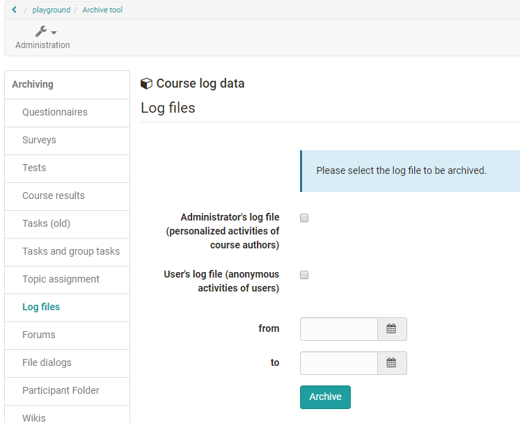

# Record of Course Activities

OpenOlat records course activities of participants and authors in so-called log files. By using the [data archiving](Using_Course_Tools.md#UsingCourseTools-_datenarchivierung) tool you can download those log files to your personal folder.

* administrator's log file with personalized data of the course authors
* user's log file Statistics log file with the anonymized data of the course participants
* user's log file with personalized activities of the users

{ class="shadow lightbox" }

!!! info "Privacy protection"

    The user log file with personalized data is only available for system administrators for privacy reasons.

Users with the right to archive (usually course administrators) can save the desired log files as a ZIP file (e.g. _CourseLogFiles_2010-01-28_14-55-55.zip_) in their personal folder ( _Personal folder_ -> _private_ -> _archive_ ). This ZIP file contains the selected files _course_statistic_log.csv_ , _course_admin_log.csv_ or _course_user_log.csv_.

Please note that in the file _course_statistic_log.csv_ course participants are anonymized as follows:
Each course participant receives a number (e.g. *7FFBA8C371B1A3DACCF5F12227A75CE82D6C4CE6) generated at random; this number remains unchanged within a course. This number persists throughout the course. Thus it is possible to observe activities of participant X in course Y but you will not be able to compare these data with course Z since your participant will get another number in course Z.

Possible entries in the log file columns actionCrudType (database operation), actionVerb (action) and actionObject (handled course object)(sorted):

actionCrudType| actionVerb| actionObject  
---|---|---  
c | add | calendart, chat, course, cpgetfile
r | copy | editor, efficency
u | denied | feed, feeditem, file, folder, forummessage, forumthread
d | do | glossar, gotonode, groupmanagement, group, grouparea, groupareaempty
e | edit | help
|  | exit | layout
|  | hide | node
|  | launch | owner
|  | lock | participant, publisher
|  | move | quota
|  | open | resource, rights, rightsempty
|  | remove | sharedfolder, spgetfile
|  | view | testattempts, testcomment, testid, testscore, testsuccess, tools, toolsempty
|  |  | waitingperson
  
The column **actionCrudType** summarizes the executed actions in basic database operations. As these are broken down in the column actionVerb, the column actionCrudType is not relevant for you. Nevertheless, the operations as follows:

* C=Create
* R=Read / Retrieve
* U= Update / Modify
* D=Delete
* E=Exit

The column actionVerb now further examines what the user (from "userName) actually did with the course object from column actionObject. The entry from column **actionObject** thus represents the course object being altered, at least from the database's perspective.

{ class="shadow lightbox" }

So, the third row

`u / add / participant / [group name] / [username]`

would be read accordingly (database operation: update / modify):

`Add user [username] to [group]`

Options to analyze log files graphically will be further described in the section ["Statistics"](Using_Course_Tools.md#UsingCourseTools-_statistiken).
