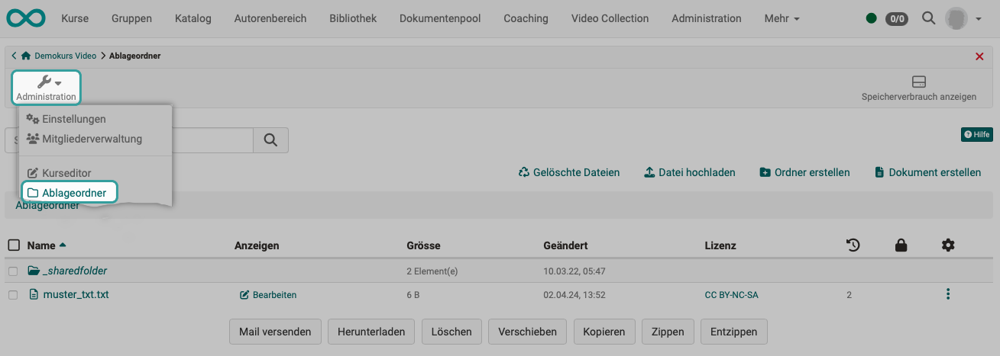
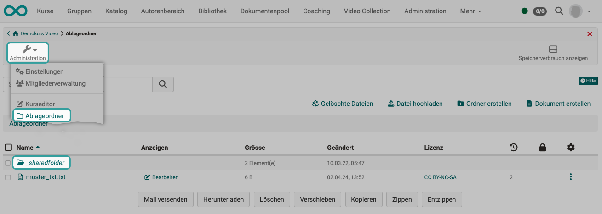

# Ressourcenordner {: #resource_folder}

Mit Hilfe des Ressourcenordners können Dateien (Inhalte, Informationen, Grafiken usw.) in mehreren Kursen verwendet werden. Dabei werden die Dateien aus dem Ressourcenordner referenziert und brauchen somit nicht mehrfach erstellt werden. Änderungen an den Dateien im Ressourcenordner gelten dann für alle verknüpften Kurse.

## Ablageordner - Ressourcenordner

Die in einem Kurs verwendeten Medien-Dateien (Bilder, Videos, u.a.) werden zu einem grossen Teil im [Ablageordner](../learningresources/Storage_folder.de.md) des Kurses gespeichert. (Sie können aber auch verlinkt werden, wie z.B. Youtube-Videos.)

Der Zugriff auf den Ablageordner erfolgt über **Administration > Ablageordner**.

{ class="shadow lightbox" }

Sollen die Mediendateien mehrfach verwendet werden (in verschiedenen Kursen), kann auch ein gemeinsamer **Ressourcenordner** angelegt werden. Es ist sozusagen ein kursübergreifender Ablageordner.

Der Ressourcenordner erscheint innerhalb des Ablageordners als Unterordner **_sharedfolder**.

Zu beachten ist, dass nur **ein** Ressourcenordner pro Kurs hinzugefügt werden kann.

{ class="shadow lightbox" }

## Einbindung

Soll in einem Kurs neben dem kursspezifischen [Ablageordner](../learningresources/Storage_folder.de.md) ein kursübergreifend genutzter Ressourcenordner verwendet werden, muss er [eingebunden](../learningresources/Course_Settings.de.md#ressourcenordner-einbinden) werden: 
**Administration > Einstellungen > Optionen**

Er kann auch schreibgeschützt eingebunden werden.

{ class="shadow lightbox" }

## Links

Ressourcenordner einbinden: 
[Benutzerhandbuch > Lernressourcen > Kurs > Einstellungen](../learningresources/Course_Settings.de.md#ressourcenordner-einbinden)

Schritt-für-Schritt-Anleitung zur Einbindung eines Ressourcenorders: 
[How-to > Allgemeine Arbeitsweisen > Wie kann ich dieselben Dateien in mehreren Kursen einsetzen?](../../manual_how-to/multiple_use/multiple_use.de.md)

Ablageordner: 
[Benutzerhandbuch > Lernressourcen > Kurs > Administration > Ablageordner](../learningresources/Storage_folder.de.md)

!!! note "Hinweis"
      
    Auf den Ressourcenordner kann auch via WebDAV zugegriffen werden.

