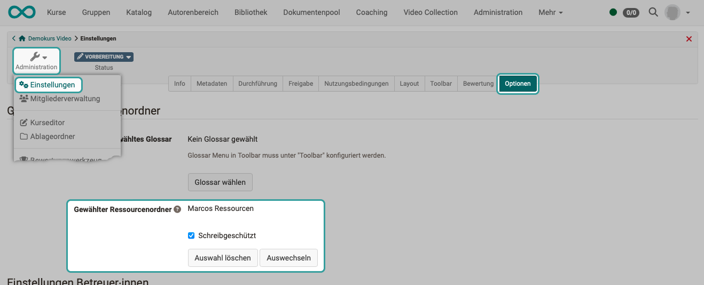
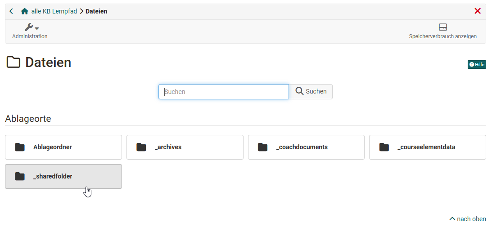
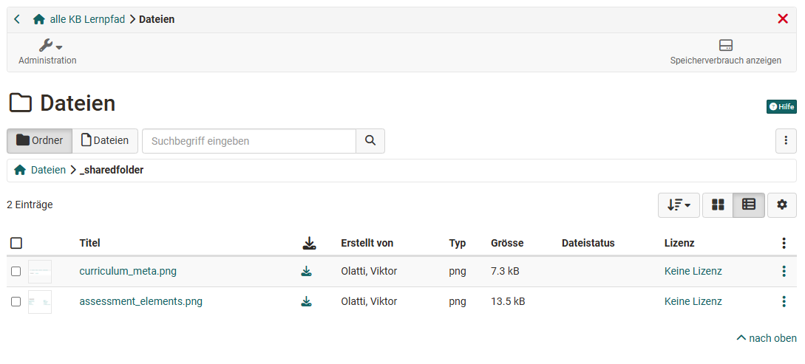

# Ressourcenordner {: #resource_folder}

Ressourcenordner zählen in OpenOlat zu den Lernressourcen und werden im Autorenbereich erstellt. Sie können stand-alone oder verknüpft mit Kursen verwendet werden. 

Um neben den normalen Kurs Dateiein auch kursübergreifende Dateien für die Kurserstellung verwenden zu können sollte ein Ressourcenordner verwendet werden.

## Ressourcenorder im Kurs verwenden

Mit einem Ressourcenordner lassen sich Dateien (z. B. Inhalte, Informationen, Grafiken) zentral organisieren und in mehreren Kursen nutzen.

Um einen Ressourcenordner mit einem Kurs zu verbinden, wählen Sie im Kurs unter Administration → Einstellungen → Optionen den gewünschten Ressourcenordner aus oder erstellen einen neuen. Pro Kurs kann nur ein Ressourcenordner verknüpft werden.

Bei der Einbindung gibt es zwei Varianten: schreibgeschützt oder ohne Schreibschutz.

{ class="shadow lightbox" }

**Schreibgeschützt**: Die Dateien werden nur referenziert. Im Kurs können sie weder verändert noch gelöscht oder ergänzt werden. Damit ist sichergestellt, dass alle Kurse stets dieselben aktuellen Dateien nutzen.

**Ohne Schreibschutz**: Kursbesitzerinnen können Dateien ändern, löschen oder neue hinzufügen. Diese Anpassungen werden direkt im Ressourcenordner übernommen und wirken sich damit auf alle verknüpften Kurse aus – auch wenn die betreffenden Personen keine Besitzerinnen des Ressourcenordners sind.

Überlegen Sie daher sorgfältig, ob der Schreibschutz aufgehoben werden soll.

### Hier findet man die Dateien des Ressourcenordners
Wurde ein Ressourcenordner mit dem Kurs verbunden erscheint er in der Kurs-Administration unter "Dateien" als "**_sharedfolder**" mit allen Dateien, die im Rssourcenordner hinterlegt wurden. 

{ class="shadow lightbox" }

{ class="shadow lightbox" }

In der Standard Einstellung sind die Dateien des Ressourcenordners schreibgeschützt und können nicht verändert werden. 

### Zugriff auf die Dateien
Die Dateien des Ressourcenordners können genau wie alle anderen Dateien des Ablageordner eines Kurses verwendet und auch mit unterschiedlichen Kursbausteien verknüpft werden. 

So könnten zentrale Dateien z.B. für die einheitliche Kurslayouts verwendet, oder Dokumente über den Kursbaustein Dokument bereitgestellt oder Bilder im Kursbaustein "HTML Seite" integriert werden usw. Immer dann, wenn innerhal bdes Kurses Zugriff auf den Ablageordner besteht können auch die Dokumente des verknüpften Ressourcenordners über "_sharedfolder" verwendet werden. 

## Kursunabhängige Nutzung
Um den Ressourcenordner stand-alone zu verwenden muss im Ressourcenordner unter Administration -> Einstellungen im Tab "Freigabe" die eigenständige Verwendung aktiviert und die Freigabe weiter konfiguriert werden z.B. frei für Gäste oder mit einem Passwort. Ferner muss der Ressourcenordner dann auch veröffentlich werden. Bei einer Verbindung mit einem Kurs ist das nicht nötig.

Genauere Informationen finden Sie unter ["Zugangskonfiguration/Freigabe"](../learningresources/Access_configuration.de.md)

Eine weitere Möglichkeit der unabhängigen Nutzung besteht über WebDAV. In der WebDAV-Ansicht werden neben Kursen und Gruppen auch die Sharedfolders, bei denen man Besitzer*in ist, angezeigt.

## Links

Ressourcenordner einbinden: 
[Benutzerhandbuch > Lernressourcen > Kurs > Einstellungen](../learningresources/Course_Settings.de.md#ressourcenordner-einbinden)

Schritt-für-Schritt-Anleitung zur Einbindung eines Ressourcenorders: 
[How-to > Allgemeine Arbeitsweisen > Wie kann ich dieselben Dateien in mehreren Kursen einsetzen?](../../manual_how-to/multiple_use/multiple_use.de.md)

Ablageordner: 
[Benutzerhandbuch > Lernressourcen > Kurs > Administration > Ablageordner](../learningresources/Storage_folder.de.md)

!!! note "Hinweis"
      
    Auf den Ressourcenordner kann auch via WebDAV zugegriffen werden.

