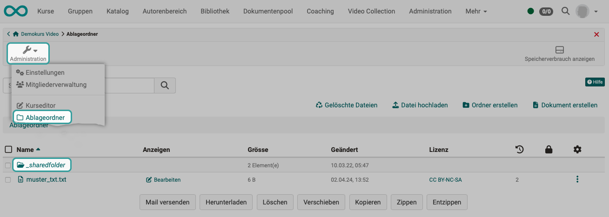

# Resource folder

Files (content, information, graphics, etc.) can be used in several courses with the help of the resource folder. The files are referenced from the resource folder and therefore do not need to be created multiple times. Changes to the files in the resource folder then apply to all linked courses.

## Storage folder - resource folder

The media files used in a course (images, videos, etc.) are largely stored in the [Storage folder](../learningresources/Storage_folder.md) of the course. (However, they can also be linked, e.g. YouTube videos).

The storage folder can be accessed via **Administration > Storage folder**.

{ class="shadow lightbox" }

If the media files are to be used several times (in different courses), a shared **resource folder** can also be created. This is a cross-course storage folder, so to speak.

The resource folder appears within the storage folder as a subfolder **_sharedfolder**.

Please note that only **one** resource folder can be added per course.

{ class="shadow lightbox" }

## Integration

If a cross-course resource folder is to be used in a course in addition to the course-specific [Storage folder](../learningresources/Storage_folder.md), it must be [integrated](../learningresources/Course_Settings.md#including-resource-folder): 
**Administration > Settings > Options**

It can also be integrated read-only.

{ class="shadow lightbox" }

## Links

Integrate resource folder: 
[User manual > Learning resources > Course > Settings](../learningresources/Course_Settings.md#including-resource-folder)

Step by step guide on how to integrate a resource folder: 
[How-to > Working processes > How to use the same files in several courses](../../manual_how-to/multiple_use/multiple_use.md)

Storage folder: 
[User manual > learning resources > Course > Administration > Storage folder](../learningresources/Storage_folder.md)

!!! note "Hint"

    The resource folder can also be accessed via WebDAV.

