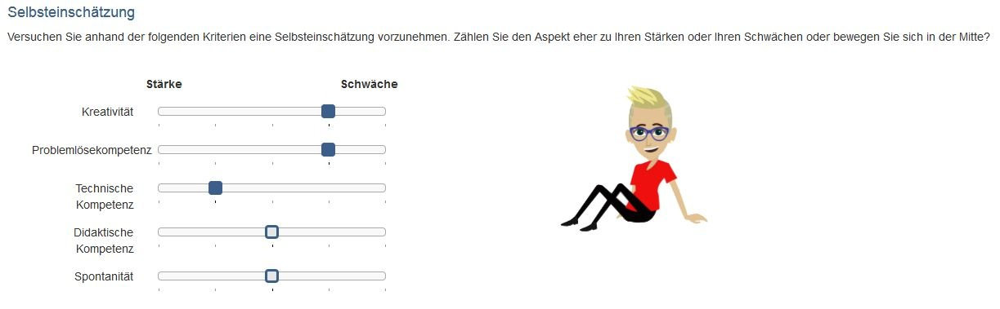
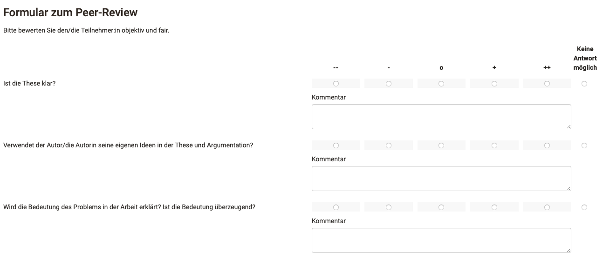
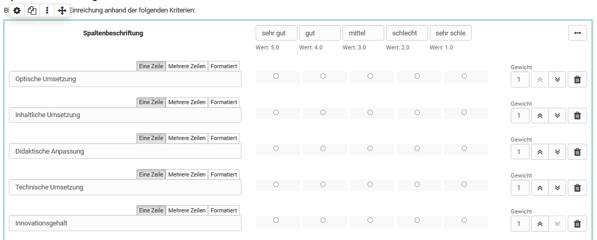

# Rubrik

Ein Rubrik ist in OpenOlat ein Element der Lernressource "Formular". Rubriks bieten sich an, wenn Sie mehrere Fragen für die gleiche Bewertungsskala verwenden wollen. Der Anwendungsbereich von Rubrik Bewertungen ist gross. Generell können Rubrik Elemente in allen Formularen und für sämtliche Kursbausteine und Lernressourcen, die Formulare nutzen, verwendet werden. Konkret sind das:

* [Kursbaustein Umfrage](Forms_in_Questionnaires.de.md)
* [Kursbaustein Formular](Forms_in_Forms_Element.de.md)
* [Kursbaustein Bewertung](Forms_in_Rubric_Scoring.de.md)
* [Kursbaustein Aufgabe mit Peer-Review](Course_Element_Task.de.md#revisions)
* [Portfolio 2.0 Vorlage](Forms_in_the_ePortfolio_template.de.md)

## Einsatzbeispiele für Rubriks

In OpenOlat können Rubriks z.B. eingesetzt werden um

* den Zustimmungsgrad zu einer Fragestellung abzufragen

  { class="shadow lightbox" }

 

* Ausprägungen zwischen zwei extremen Skalen abzufragen

  { class="shadow lightbox" }

 

* Bewertungsraster für Lernenden-Aktionen zu erstellen

  { class="shadow lightbox" }

 

* eine Selbsteinschätzung z.B. Stärken und Schwächen vornehmen zu lassen

  { class="shadow lightbox" }

 

* Kriterien bezogene Punkte zu vergeben

  { class="shadow lightbox" }

 

* in einem Peer-Review die anderen Teilnehmer:innen zu bewerten und/oder eine Bewertung durch Betreuer:innen vorzunehmen

  { class="shadow lightbox" }

 

Rubriks können über "Inhalt hinzufügen" einem OpenOlat Formular hinzugefügt und anschliessend konfiguriert werden.

## Rubrik Konfiguration im Formular Editor

{ class="shadow lightbox" }

Ein Rubrik besteht immer aus Zeilen und Spalten die sinnvoll beschriftet und definiert werden müssen. 

Geben Sie im Bereich "Spaltenbeschriftung" für jede Spalte eine sinnvolle _Bewertungsskala_ ein z.B. sehr gut, gut mittel, schlecht, sehr schlecht. Jede Spalte ist immer mit einem bestimmten Wert verbunden, der in den erweiterten Einstellungen des Rubrik Inspektors konkreter spezifiziert werden kann.
  
Geben Sie im Bereich der Zeilen einzelne (Bewertungs-)Kriterien, Statements oder Fragestellungen ein. Weitere Zeilen werden über "Frage hinzufügen" ergänzt. Sie können die kurzen Statements auch formatieren. Einzelne Zeilen können mit Hilfe der oben/unten Doppelpfeile verschoben werden. Zusätzlich können Sie jede Zeile mit einer Gewichtung  versehen und so einzelne Kriterien besondere Bedeutung zuweisen, was sich auch bei der Punktevergabe widerspiegelt, z.B. durch doppelte oder dreifache Punkte. 
Ferner ist es möglich den Wert auf 0 zu setzen um einzelne Fragen aus den Reports auszuschliessen. 
 
Ein bearbeitetes Rubrik kann eingebunden in einen Kurs automatisch eine entsprechende Punktzahl erhalten, was besonders bei der Verwendung im Kursbaustein "[Bewertung](../learningresources/Course_Element_Assessment.de.md)" relevant ist. 
 
Über den Quer-Doppelpfeil kann ein Rubrik mit zwei Enden erstellt werden. 

{ class="shadow lightbox" }

!!! info "Hinweis"

    Wird ein Rubrik in einem Kursbaustein Bewertung eingebunden kann die Gewichtung nicht mehr geändert werden.

### Rubrik Inspektor

{ class="shadow lightbox" }

Im Tab **"Generell"** wird der Rubrik-Typ festgelegt. Es werden drei verschiedene Typen bzw. Darstellungsvarianten von Rubriks unterschieden. Die Anzahl der Schritte definiert die Anzahl der Rubrik-Spalten. 2-10 Spalten sind möglich. 

Wird "Beschreibung der Kriterien" aktiviert :octicons-tag-24: Release 18.1  kann jede Zelle der Rubrik-Tabelle mit kurzen Beschreibungstexten versehen werden, so dass die Kriterien basierte Bewertung noch deutlicher wird. 

{ class="shadow lightbox" }

Ferner kann die Option "keine Antwort möglich" aktiviert und definiert werden ob die Bearbeitung des Rubriks freiwillig oder obligatorisch ist. 

Wenn Sie den Tab **"Erweitert"** aktivieren stehen Ihnen folgende zusätzliche Optionen zur Verfügung:

{ class="shadow lightbox" }

Sie können dem Rubrik einen Namen geben, was Ihnen später die Zuordnung bei der Auswertung erleichtert. Zusätzlich kann der Name bei Bedarf auch direkt im Fragebogen angezeigt werden.

Unter Skalentyp können Sie die Art der verwendeten Likert –Skala näher bestimmen und somit auch den Wertebereich definieren: Legen Sie fest an welchem Ende der Skala sich die positive Bewertung befindet und definieren Sie bei Bedarf die Bereiche für ungenügend, neutral und gut. Diese Information wird in der Auswertung berücksichtigt.

!!! info "Info"

    Der Rubrik-Inspektor kann frei im Formularbereich positioniert und verschoben werden.

## Weitere Informationen

[Formular als Rubrik Bewertung](Forms_in_Rubric_Scoring.de.md)

