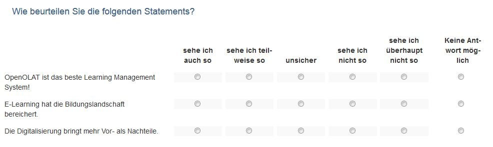
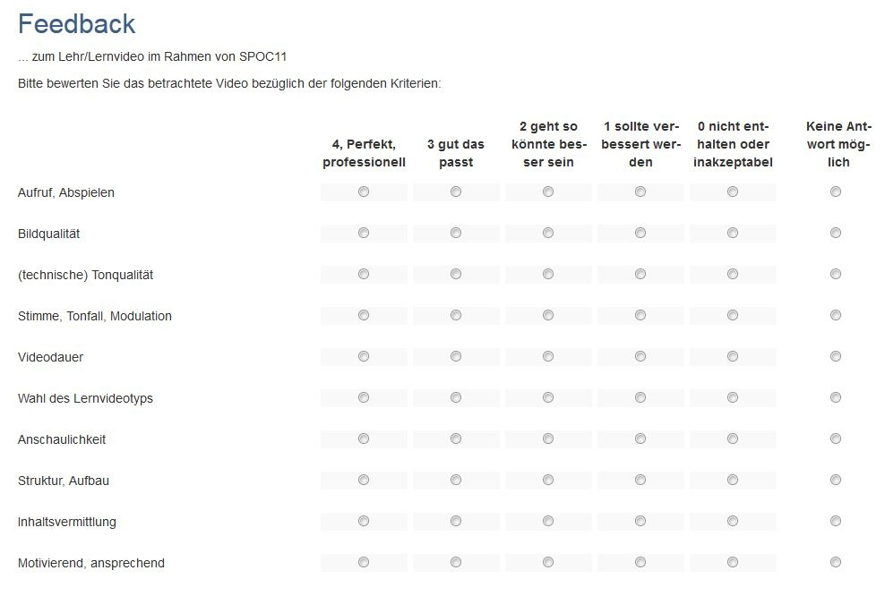
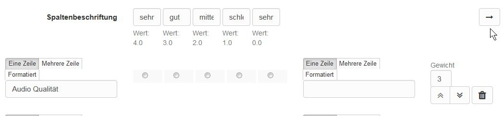

# Rubrik

Ein Rubrik ist in OpenOlat ein Element der Lernressource Formular. Rubriks bieten sich an, wenn Sie mehrere Fragen für die gleiche Bewertungsskala verwenden wollen. Der Anwendungsbereich von Rubrik Bewertungen ist gross. Generell können Rubrik Elemente in allen Formularen und für sämtliche Kursbausteine und Lernressourcen, die Formulare nutzen, verwendet werden. Konkret sind das:

* [Kursbaustein Umfrage](Forms_in_Questionnaires.de.md)
* [Kursbaustein Formular](Forms_in_Forms_Element.de.md)
* [Kursbaustein Bewertung](Forms_in_Rubric_Scoring.de.md)
* [Portfolio 2.0 Vorlage](Forms_in_the_ePortfolio_template.de.md)

## Einsatzbeispiele für Rubriks

In OpenOlat können Rubriks z.B. eingesetzt werden um

* den Zustimmungsgrad zu einer Fragestellung abzufragen

  { class="shadow lightbox" }

* Ausprägungen zwischen zwei extremen Skalen abzufragen

  { class="shadow lightbox" }

* Bewertungsraster für Lernenden-Aktionen zu erstellen

  { class="shadow lightbox" }

* eine Selbsteinschätzung z.B. Stärken und Schwächen vornehmen zu lassen

  { class="shadow lightbox" }

* Kriterien bezogene Punkte zu vergeben

  { class="shadow lightbox" }

Rubriks können über „Inhalt hinzufügen“ einem OpenOlat Formular hinzugefügt und anschließend konfiguriert werden.

## Rubrik Konfiguration im Formular Editor

{ class="shadow lightbox" }

Es werden drei verschiedene Typen bzw. Darstellungsvarianten von Rubriks unterschieden:

{ class="shadow lightbox" }

Die Anzahl der Schritte definiert die Anzahl der Rubrik-Spalten. Geben Sie im Bereich „Spaltenbeschriftung“ für jede Spalte eine sinnvolle Bewertungsskala ein z.B. sehr gut, gut mittel, schlecht, sehr schlecht. Jede Spalte ist immer mit einem bestimmten Wert verbunden, der in den erweiterten Einstellungen konkreter spezifiziert werden kann.

Geben Sie im Bereich der Zeilen einzelne Kriterien, Statements oder Fragestellungen, die zu Ihrer Skala passen. Weitere Zeilen werden über „Frage hinzufügen“ ergänzt. Sie können auch durch Klick auf den Pfeil, rechts einen Skalenbereich ergänzen.  

{ class="shadow lightbox" }

Einzelne Zeilen können mit Hilfe der Doppelpfeile rechts verschoben werden. Zusätzlich können Sie jede Zeile mit einer Gewichtung des jeweiligen Statements versehen und so einzelne Kriterien besondere Bedeutung zuweisen, was sich auch bei der Punktevergabe widerspiegelt, z.B. durch doppelte oder dreifache Punkte. Ferner ist es möglich den Wert auf 0 zu setzen um einzelne Fragen aus den Reports auszuschliessen.

Ein bearbeitetes Rubrik kann somit auch automatisch eine entsprechende Punktzahl erhalten, was besonders bei der Verwendung im Kursbaustein „[Bewertung](../learningresources/Assessment.de.md)“ relevant ist.

!!! info "Hinweis"

    Wird ein Rubrik in einem Kursbaustein Bewertung eingebunden kann die Gewichtung nicht mehr geändert werden.

## Erweiterte Konfiguration

Mit Klick auf das Zahnrad erscheint das Konfigurationsmenü für das Rubrik und Sie können über die Tabs "Generell" und "Erweitert" das Rubrik differenzierter konfigurieren. 

Wenn Sie den Tab „Erweitert" aktivieren stehen Ihnen folgende zusätzliche Optionen zur Verfügung:

{ class="shadow lightbox" }

Sie können dem Rubrik einen Namen geben, was Ihnen später die Zuordnung bei der Auswertung erleichtert. Zusätzlich kann der Name bei Bedarf auch direkt im Fragebogen angezeigt werden ("In Durchführung"). 
Unter Skalentyp können Sie die Art der verwendeten Likert –Skala näher bestimmen und somit auch den Wertebereich definieren: Legen Sie fest an welchem Ende der Skala sich die positive Bewertung befindet und definieren Sie bei Bedarf die Bereiche für ungenügend, neutral und gut. Diese Information wird in der Auswertung berücksichtigt.

Mit dem Button „Speichern“ schliessen Sie den Rubrik-Editorbereich. 