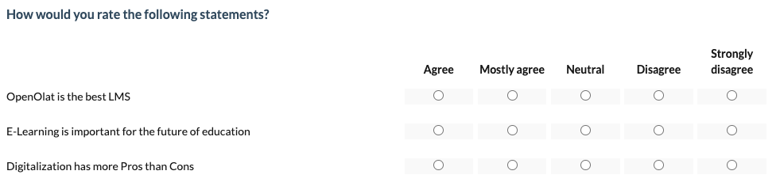
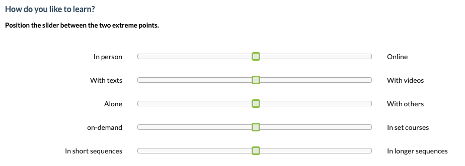
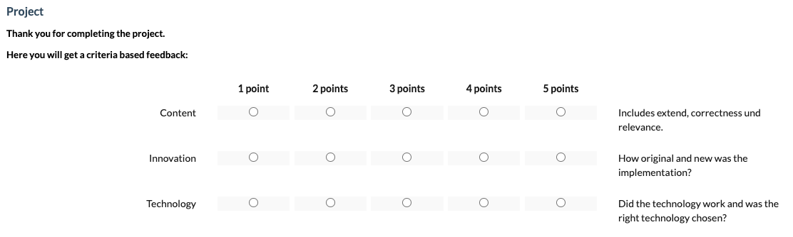
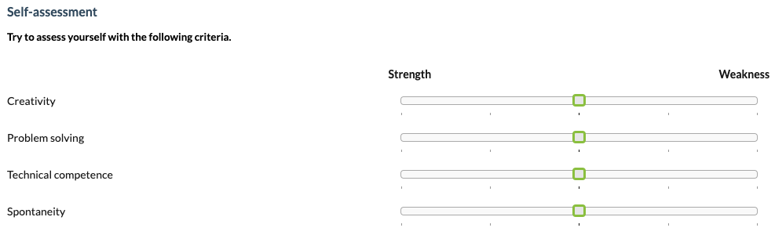
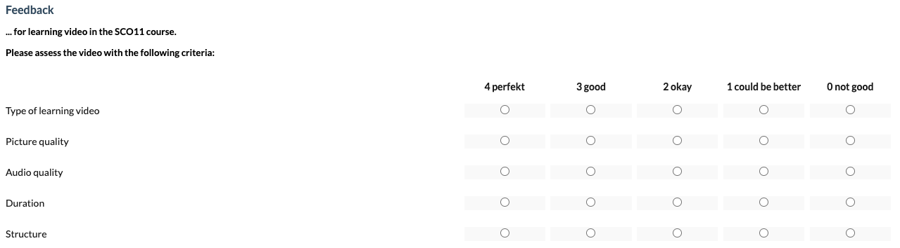
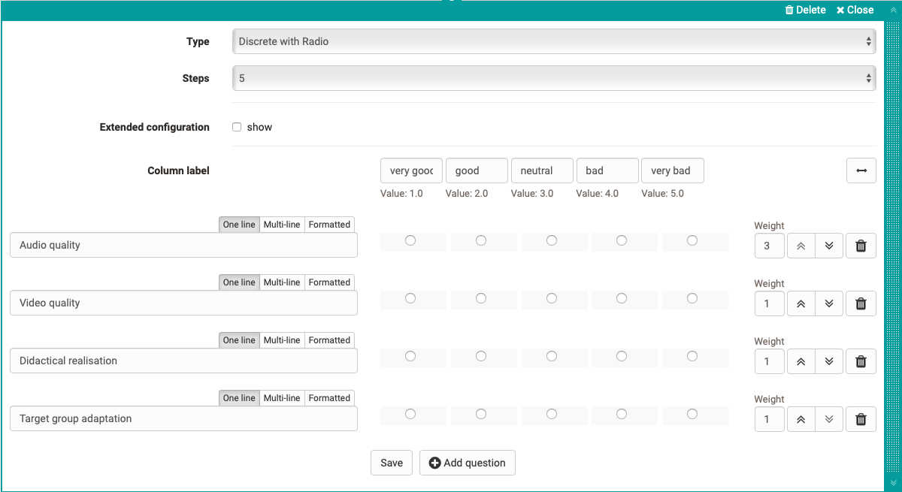
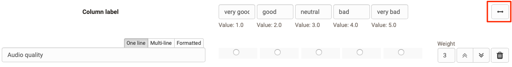
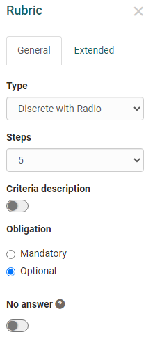
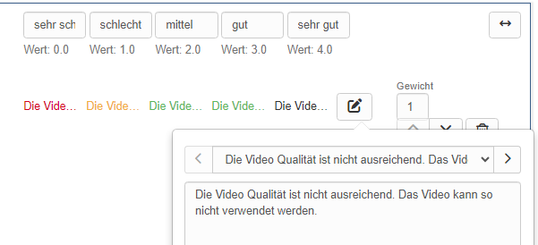
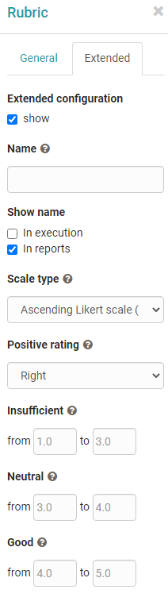

# Rubric

A rubric in OpenOlat is an element of the learning resource "Form". Rubrics are useful when you want to use multiple questions for the same rating scale. The scope of rubric assessments is wide. In general, rubric elements can be used in all forms and for all course elements and learning resources that use forms. 

* [Course element Survey](Forms_in_Questionnaires.md)
* [Course element Form](Forms_in_Forms_Element.md)
* [Course element Assessment](Forms_in_Rubric_Scoring.md)
* [Portfolio 2.0 template](Forms_in_the_ePortfolio_template.md)

## Examples of use for Rubrics

The scope of rubrics is wide. In OpenOlat, rubrics can be used, for example,

* to query the degree of agreement on a question

  { class="shadow lightbox" }

* to query characteristics between two extreme scales

  { class="shadow lightbox" }
  
* to create a valuation grid for learner actions.

  { class="shadow lightbox" }

  * to have a self-assessment carried out, e.g. of strengths and weaknesses

  { class="shadow lightbox" }

  * to award criteria related points

  { class="shadow lightbox" }
  
Rubrics can be added to an OpenOlat form via "Add content" and then configured.

## Rubric configuration in form editor

{ class="shadow lightbox" }

A rubric always consists of rows and columns that must be labeled and defined in a meaningful way.

In the "Column label" area, enter a meaningful rating scale, e.g. very good, good, medium, bad, very bad.  Each column is always associated with a certain value, which can be specified more concretely in the advanced settings of the rubric inspector.

Enter individual criteria, statements or questions in the row area that match your scale. Additional lines are added via "Add question". 
You can also format the short statements. Individual lines can be moved using the up/down double arrows. In addition, you can assign a weighting to each line and thus assign special importance to individual criteria, which is also reflected in the points awarded, e.g. by double or triple points. 
It is also possible to set the value to 0 to exclude individual questions from the reports.

An edited rubric can therefore automatically receive a corresponding number of points, which is particularly relevant when used in the course element "[Assessment](../learningresources/Course_Element_Assessment.de.md)".

The cross double arrow can be used to create a section with two ends.

{ class="shadow lightbox" }

!!! info "Note"

    If a rubric is included in a course module evaluation, the weighting can no longer be changed.

### Rubric inspector

{ class="shadow lightbox" }

The **"General"** tab is used to define the rubric type. There are three different types or display variants of rubrics. The number of steps defines the number of rubric columns. 2-10 columns are possible.

If "criteria description" is activated :octicons-tag-24: Release 18.1, each cell of the rubric table can be provided with short descriptive texts so that the criteria-based evaluation becomes even clearer.

{ class="shadow lightbox" }

You can also activate the option "No answer" and define whether editing the section is optional or mandatory. 

If you activate the **"Extended"** tab, the following options are available to you:

{ class="shadow lightbox" }

You can give the rubric a name, which makes it easier for you to assign it later during evaluation. If required, you can also display the name directly in the questionnaire. 

Under Scale type, you can specify the type of Likert scale used and thus also define the value range: Determine at which end of the scale the positive rating is and define if necessary the ranges for insufficient, neutral and good. This information is taken into account in the evaluation.

!!! info "Info"

    The rubric inspector can be freely positioned and moved in the form area.