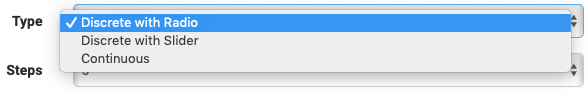

# Rubric

A rubric in OpenOlat is an element of the learning resource "Form". Rubrics are useful when you want to use multiple questions for the same rating scale. The scope of rubric assessments is wide. In general, rubric elements can be used in all forms and for all course elements and learning resources that use forms. 

* [course element survey](Forms_in_Questionnaires.md)
* [course element form](Forms_in_Forms_Element.md)
* [course element assessment"](Forms_in_Rubric_Scoring.md)
* [Portfolio 2.0 template](Forms_in_the_ePortfolio_template.md)

## Examples of use for Rubrics

The scope of rubrics is wide. In OpenOlat, rubrics can be used, for example,

* to query the degree of agreement on a question

  { class="shadow lightbox" }

* to query characteristics between two extreme scales

  { class="shadow lightbox" }
  
* to create a valuation grid for learner actions.

  { class="shadow lightbox" }

  * to have a self-assessment carried out, e.g. of strengths and weaknesses

  { class="shadow lightbox" }

  * to award criteria related points

  { class="shadow lightbox" }
  
Rubrics can be added to an OpenOlat form via "Add content" and then configured.

## Rubric configuration in form editor

{ class="shadow lightbox" }

There are three different types and display variants of rubrics:

{ class="shadow lightbox" }

The number of steps defines the number of rubric columns. In the "Column label" area, enter a meaningful rating scale, e.g. very good, good, medium, bad, very bad.  Each column is always associated with a certain value, which can be specified more concretely in the advanced settings.

Enter individual criteria, statements or questions in the row area that match your scale. Additional lines are added via "Add question". You can also add a scale range by clicking on the arrow on the upper right.

{ class="shadow lightbox" }

Individual lines can be moved up or down using the double arrows on the right side. In addition, you can give each line a weighting of the respective statement and thus assign special meaning to individual criteria, which is also reflected in the scoring, e.g. by double or triple points. It is also possible to set the value to 0 to exclude individual questions from the reports.

An edited rubric can therefore automatically receive a corresponding number of points, which is particularly relevant when used in the course element "[Assessment](../learningresources/Knowledge_Transfer.md)".

!!! info "Note"

    If a rubric is included in a course module evaluation, the weighting can no longer be changed.

## Extended Configuration

By clicking on the cogwheel, the configuration menu for the rubric appears and you can configure the rubric in a more differentiated way using the "General" and "Advanced" tabs. 

If you activate the tab "Extended", the following additional options are available:

{ class="shadow lightbox" }

You can give the rubric a name, which makes it easier for you to assign it later during evaluation. If required, you can also display the name directly in the questionnaire. Under Scale type, you can specify the type of Likert scale used and thus also define the value range: Determine at which end of the scale the positive rating is and define if necessary the ranges for insufficient, neutral and good. This information is taken into account in the evaluation.

Click the "Save" button to close the rubric editor area. 
