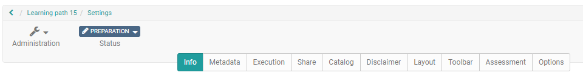
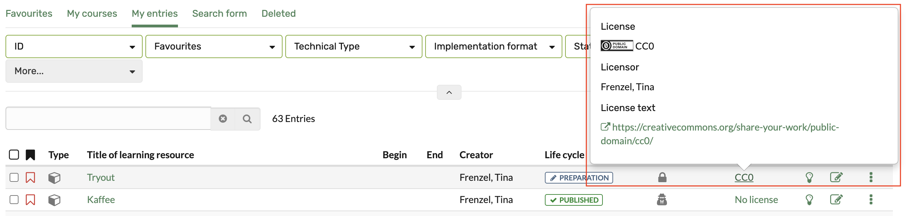

# Set up info page

Each learning resource has an [information page](../learningresources/Info_page.md). This can be
filled by the owner of the learning resource and is available to interested
parties after publication of the learning resource, independent of a booking,
before entering the learning resource. This is useful, for example, if you
want to inform the target group in advance.

The info page is set up via the "Settings" of the "Administration" menu. Especially the tabs "Info","Metadata" and "Execution" are relevant. The more detailed you describe the
learning resource, the easier it can be found and the better informed
interested parties and later participants are.

The screenshot shows the "Settings" of a course. Depending on the learning
resource only a part of the tabs is available.

## Info

**Title of the learning resource**:  A requiered field. This title (maximum
100 characters) can also be used to find the learning resource in the search
mask. Enter a title for the learning resource that is as short and precise as
possible.

 **Identifier**: An external identifier for the resource, for example, the
name from the course catalog or a printed course catalog.

**Teaser**: Text that appears below the title on the course info page and can also be displayed directly in the "Courses" menu.

 **Description**:  Here you can provide more information about the learning
resource and mention the things that are important.

Indicate the  **learning objectives**  and  **requirements**  of your course
so that those interested can learn more about them.

 **Certification**: Here you can explain whether or which certificate the
participants receive after completing the course or learning resource and
which requirements are linked to it.

A  **cover image**  (jpg format) or a small video as a **teaser movie** in the mp4
format complete the description. The image is displayed in the catalog and
the info page. Pay attention to the displayed technical specifications and the
upload limits.

You should definitely set a cover image or teaser movie. This makes the
description much more attractive. Make sure that you do not display any text
or just short keywords and that you use a visualization that matches the
course or learning resource.

## Metadata {: #metadata}

In the "Metadata" tab you can make further settings for the info page.

 **Authors**:  Here you can enter the responsible contact persons or
lecturers. They do not have to match the creator of the learning resource. The
field is a plain text field, the content is only displayed on the course
overview page.  

 **Subjects**: If defined, suitable subject areas can be selected here. The subject areas are also used for classification in the catalog. Look further here [Catalog 2.0](../area_modules/catalog2.0.md).

 **Implementation format**: Courses can be assigned to one of the selected
format here. However, the assignment has no effect on the actual design of
the course. Also, the terms can be used differently by different authors. 

 **Main language**: Enter the language in which the learning resource was
created or the language in which the course, test, etc. will be conducted.
There is no selection of courses based on the user language and this field.

The **time required** for the learning resource can also be entered here.

 **License** : Select in the drop down menu under which license the learning resource should be. The
default setting is "All rights reserved", further settings of the Creative
Commons can also be used here. The administrator defines which licenses can be
set in the general OLAT settings.

Typical license are

  * CC BY-NC-ND
  * CC BY-NC-SA
  * CC-BY-NC
  * CC BY-SA
  * CC BY
  * CC0

In the overview of the authoring area, the assigned licenses are displayed in the "License" column. Click on the license to get detailed information about it.

What exactly hides behind which license you can read [here](https://creativecommons.org/licenses/). In addition to the license, the  **licensor**  can also be registered.

Important: Think carefully about which license you want to use for a course or
other learning resource. If you want to create more OER (open educational
resources), the Creative Commons licenses are a suitable approach. But be sure
to respect the copyright for all materials used so that your information is
correct.

## Execution  {: #execution}

In contrast to other learning resources, courses also have the tab "Execution"
in the "Settings" menu.

 **Location**: The place where a course or learning resource is held. This
point is particularly useful for blended learning offers. If you only use the
resource online, the field can remain empty. Alternatively, you can enter
"online" or "Internet" here.

 **Implementation period**: For "Course" type learning resources, an
implementation period can be defined. The following options are possible:

  *  _None_:  Choose this option if the course does not start and end on a specific date or if you do not want to include the date explicitly in the information.
  *  _With begin and end date:_  The course owner can enter the start and end date of the course here. The end date includes the end day (23:59). The date then appears as information in the course overview. However, the date entered is independent of the course status and the course access rights (see chapter ["Access configuration"](../learningresources/Access_configuration.md)). It has no effect on the visibility and the access for the course members.
  *  _Semester:_  If semester data has been configured at system level by the OpenOlat Administrator, one of the displayed semester options can be selected here. The semester then appears as information in the course overview. However, the semester is independent of the course status and the course access rights (see chapter ["Access configuration"](../learningresources/Access_configuration.md)). It therefore has no effect on the visibility and access for course members.

The configured execution period is displayed in the information of the course info.

Furthermore, there are other settings that are not directly displayed in the
course info.

The ID of the learning resource, the creator, and the type of learning
resource are automatically generated and displayed. You can also use the ID to
search for the learning resource using the search template. You can also
search by the type displayed.

