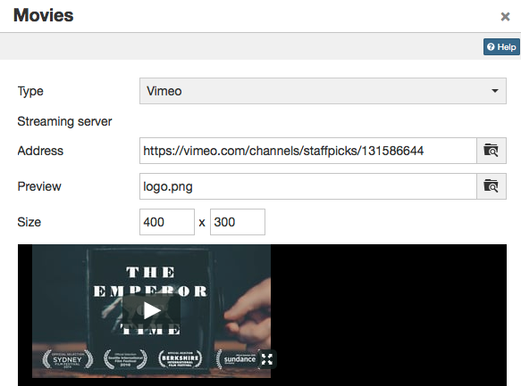
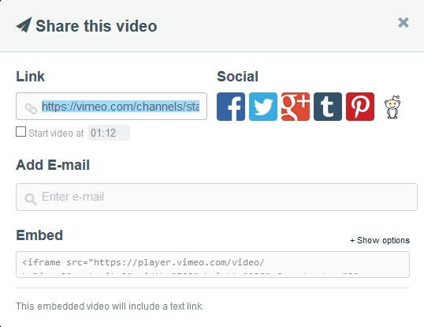

# Single Page: Add / edit video

In the course element "Single page" you will find an editor which you can use
to integrate videos into the single page. In the tab "Page content" you can
open the editor and get to the button "Add / edit video".

  

You should always use the plugin "Add/edit video" if you need to embed a video
into a "[Single Page](../learningresources/Knowledge_Transfer.md)" course
element. It accesses OpenOlats integrated media player, which has its
advantages.  
1. The player automatically detects the format, as long video and audio
tracks are encoded correctly.  
2. The player detects whether the user accesses the video with a HTML5
enabled and codec compatible mobile browser. If so, videos will receive a
HTML5 tag and can be viewed without difficulty on iPad or similar devices.

!! tip "Tip"

    You can also add a startup image (preview) to your media file.

  

This chapter provides you with the key information for using the "Add/edit
video" plugin in TinyMCE (Supported are: FLV, MP4 (h264 coded), and AAC).

## Recommended format

The **mp4** container using the H.264 video codec and the **mp3** audio codec
is widely established and accepted. Current releases of Win IE, Firefox,
Chrome and Safari are capable of playing videos encoded in such a way. The
video learning resource requires the mp4 format.  

  

These are the options available to you:  

  

| Option | Description  
---|---  
Video | Embed a video with specific encoding.  
Sound | Embed a sound file without video.  
YouTube / Vimeo / Nanoo.tv | Embed a youtube / vimeo / nanoo.tv video.  
http | Stream a flash file from a specific web server type.  
rtmp | Stream a flash file from a specific streaming server.  
  
### Video (.FLV, .F4V, .MP4, .M4V (h264 coded), .AAC and .M4A)

This setting is best suited for integrating videos in OpenOlat. Use the
following container formats for uploading videos:

Format container|Container description|Description    
---|---|---  
  .FLV|Flash Container|Flash videos containing video and audio tracks, defined by Adobe    
  .F4V||No container, but a pure video format without sound, defined by Adobe    
  .MP4|MPEG-4|MP4 video and sound format, defined by MPEG (Moving Picture Experts Group), various codecs  
  .M4V|MPEG-4|MP4 video format containing H.264 video codec as well as either MP3 or AAC audio codec; iTunes format  
  
You can either add the link to the video in the address field or upload the
video.

!!! tip "Tip"

    To ensure optimum compatibility, best use a MPEG-4 container with a H.264 encoded video track and either an AAC or MP3 encoded sound track. 
    
    This provides you with either the .mp4 or the .m4v file extension - but keep in mind that not all devices can play a .m4v file. 
    
    We advise against using flash movies, as many portable devices such as e.g. the iPad generally do not support flash movies.

#### Sound (.MP3)

The player only offers limited functions when embedding mere sound files.
Available functions are start, stop and the progress bar, but other functions
such as full screen are missing. 

You can either enter the link to a mp3 file
in the address field, or upload the audio file. 

!!! check ""

    Established browsers **all** fully support playback of mp3 audio files.

### YouTube  

YouTube movies are linked directly, thus bypassing the upload selection field.
Videos are **directly embedded** this way.  

  

Use the direct link to the video, available under "**Share**".

  

### Vimeo

Vimeo movies are also linked directly. Enter the link to the desired movie in
the "Address" field.  

The direct link to the vimeo video can be found when following the "**Share**"
link in the homepage.

### Nanoo.tv

Videos from the [Nanoo.tv](https://portal.nanoo.tv/) platform can be linked
directly. A Nanoo.tv account is required to use and display the videos.

The URL can be used to control whether the video starts automatically or not.
Therefore the URL behind /link/ has to be adjusted accordingly.

  * start automatically with "n": https://www.nanoo.tv/link/ **n** /sdxpLoaC
  * start manually with "v": https://www.nanoo.tv/link/ **v** /sdxpLoaC

The settings in the tab "Advanced" do not work here.

### http (pseudo) streaming server (only .FLV)

This function allows you to integrate **flash movies** with the **.flv** format. Once a
movie is correctly exported at its origin, an index is added. Utilizing this
index, users can jump to any spot at will without completely loading the
movie. This is not a proper streaming though, as it would require an
appropriate streaming software installed on the server.

Enter the server address in the field "Streaming server". "Address" contains
the address of the actual movie.  

!!! warning "Attention"

    We strongly **advise against** using this method, as content can not be viewed on iPads.  

### rtmp streaming server

This function enables you to use a flash streaming server. It requires a
particular protocol, the so-called RMTP - Real Time Messaging Protocol.
Various products are available to be employed as streaming servers, e.g. from
the Akamai network. This protocol, developed by Adobe, permits the
transmission of the video from the server to the flash player. It's common
though to encounter problems with port settings and firewalls.  

!!! warning "Attention"

    We **do not recommend** this option, as videos embedded in such a way cannot be viewed on the iPad.  

    Since Flash is no longer supported by most browsers or only to a very limited extent, the use of Flash-based videos should generally be avoided.

  

### HTML5 Video

OpenOlat also supports HTML5 videos embedded into a html page with external
tools. This requires the author though to add different alternative video
formats to the html tags (such as m4v and ogg) and file those in variable
resolutions in OpenOlat, if necessary.  

In this case, OpenOlat supports pseudo streaming through progressive download
respectively range requests.
