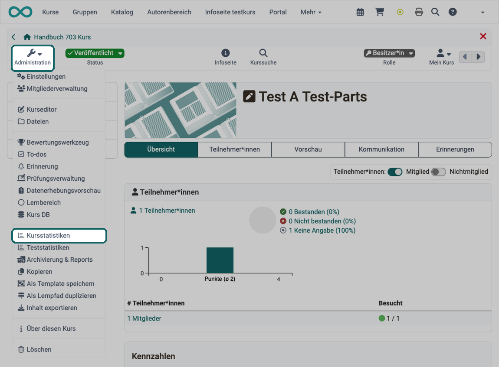

# Kursstatistiken {: #course_statistics}

{ class="shadow lightbox" title="Menü Administration eines Kurses · 2026.10.07" }

Diese Kursfunktion zeigt Ihnen Statistiken über den Zugriff auf Ihren OpenOlat-Kurs an. Sie erhalten jeweils sowohl eine tabellarische wie auch eine grafische Darstellung der Daten. Die Daten der Tabelle können Sie als Excel-Datei (z.B. für die Weiterverarbeitung) auf Ihren Rechner herunterladen.

Sie öffnen die Kursstatistiken in der Kurs-Administration unter: `Kurs > Administration > Kursstatistiken`

Zugang zu den Kursstatistiken haben die Besitzer:innen des Kurses. Betreuer:innen und weitere Mitglieder sehen den Menüpunkt nur, wenn ihnen das Recht "Statistiken" erteilt wurde, siehe [Vergabe zusätzlicher Rechte](Members_management.de.md#additional_rights).

Relevant für das Total der Kurszugriffe sind die Klicks eines/einer Benutzer:in auf einen Kursbaustein, nicht aber die Klicks auf den Inhalt eines Kursbausteins. Wenn ein/eine Benutzer:in beispielsweise dreimal das Wiki in der Kursnavigation wählt, wird dies als drei Klicks gezählt, aber es wird kein Klick gezählt, wenn er/sie im Wiki selbst auf einen Link klickt.

Statistiken können pro Stunde, pro Tag, pro Wochentag und pro Woche erstellt werden. Weiter können Sie bei Statistiken pro Tag und pro Woche die Zeitspanne wählen, während der die Kurszugriffe in der Statistik angezeigt werden. Wenn Sie einen Kursbaustein in der Tabelle anwählen, wird jeweils die Grafik zu diesem Kursbaustein angezeigt. Wählen Sie in der Zeile "Total" die Anzahl Klicks an, zeigt die Grafik die Zugriffe verteilt auf die Kursbausteine.

[Zum Seitenanfang ^](#course_statistics)

---

## Weiterführende Informationen {: #further_information}

**Auf dieser Seite erwähnt** 
[Mitgliederverwaltung >](Members_management.de.md)

**Weiterführend** 
[Teststatistiken >](Statistics_Test.de.md) 
[Fragebogen Statistiken >](Statistics_Survey.de.md) 
[Kursadministration - Archivierung & Reports >](Course_Archiving.de.md)

[Zum Seitenanfang ^](#course_statistics)

