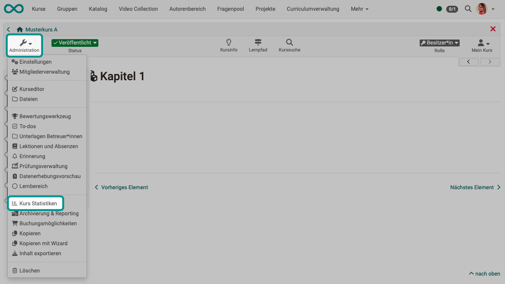

# Course statistics {: #course_statistics}

{ class="shadow lightbox" }

This course function provides you with statistics regarding access to your OpenOlat course. All course owners have access to those statistics. You will receive data in the form of tables as well as in the form of charts. Table data can be downloaded as Excel files (e.g. for further processing) to your computer.

Relevant for your total of course accesses are user clicks on a single course element; however, clicks on this element's content will not be counted. If a user selects the Wiki from course navigation and clicks it three times, three clicks will be counted; no click will be counted though when clicking on a link within that Wiki.

Statistics can be created per hour, per day, per weekday or per week. Furthermore you can choose a certain period of time per day and per week during which any course access should be displayed in your statistics. When selecting a course element in your table its corresponding chart will be displayed. If you select the number of clicks in the row "Total" your chart will show all accesses sorted by course element.

[To the top of the page ^](#course_statistics)

