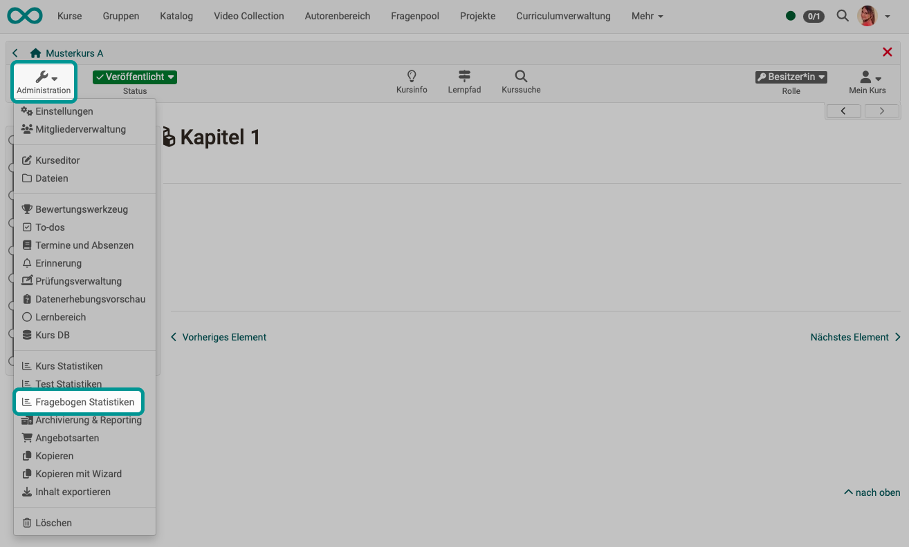

# Fragebogen Statistiken {: #survey_statistics}

{ class="shadow lightbox" }

Die Fragebogen Statistiken erlauben Ihnen die generelle kursbezogene, anonymisierte statistische Auswertung Ihrer Umfragen. Für jede Umfrage gibt es eine Übersicht, Tabellen, Diagramme, sowie Zugriff auf die einzelnen Fragebogen-Formulare. Ferner ist ein Export der Daten als PDF oder Excel Tabelle sowie ein Ausdruck möglich.

In der "Übersicht" geht es um Kennzahlen wie die Anzahl der ausgefüllten Fragebogen-Formulare, Abgabezeitraum und Bearbeitungsdauer. 

Im Tab "Tabellen" liegen Auswertungen zu einzelnen Fragen vor. 

Im Tab „Diagramme“ werden die Ergebnisse in Form von Balkendiagrammen visualisiert und die zugehörigen statistischen Daten wie Median, Varianz und Standardabweichung angezeigt. 

Im Tab „Einzelne Formulare" haben Sie Zugriff auf jedes einzelne Fragebogen-Formular. Alle Zugriffe sind anonymisiert.

Zugang zu den Fragebogen Statistiken haben neben den Kursbesitzer:innen auch alle Betreuer:innen des Kurses.

[Zum Seitenanfang ^](#survey_statistics)

