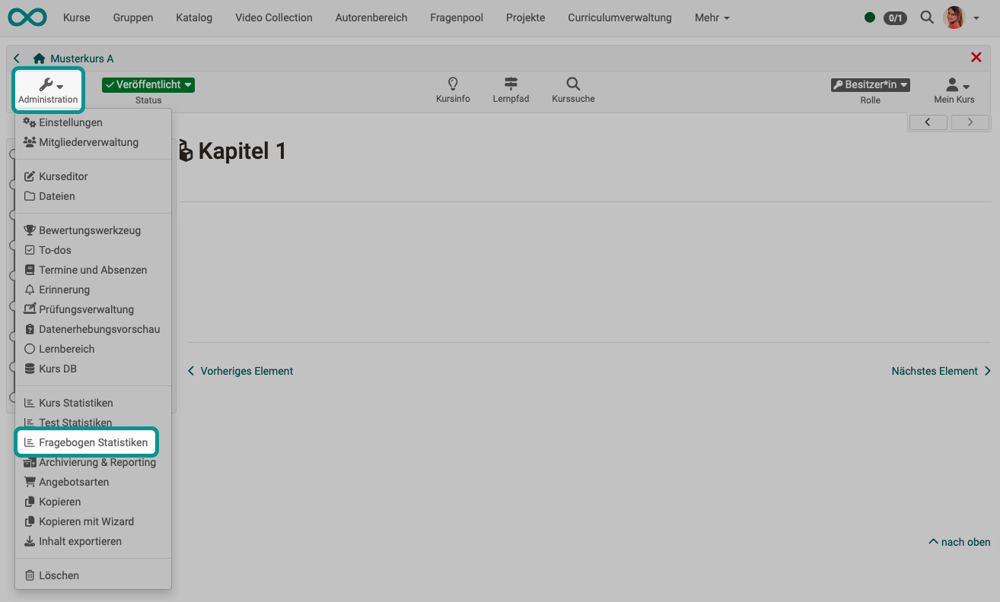

# Survey statistics {: #survey_statistics}

{ class="shadow lightbox" }

The survey statistics allow you to perform a general course-related, anonymized statistical evaluation of your surveys. For each survey there is an overview, tables, diagrams and access to the individual questionnaire forms. It is also possible to export the data as a PDF or Excel table and to print it out.

The "Overview" deals with key figures such as the number of completed questionnaire forms, submission period and processing time.

The tab "Tables" contains assessments for individual questions. 

In the "Diagrams" tab, the results are visualized in the form of bar charts and the associated statistical data such as median, variance and standard deviation are displayed. 

In the tab "Individual forms" you have access to each individual questionnaire. All accesses are anonymous.

Besides course owners all coaches have access to survey statistics.

[To the top of the page ^](#survey_statistics)

