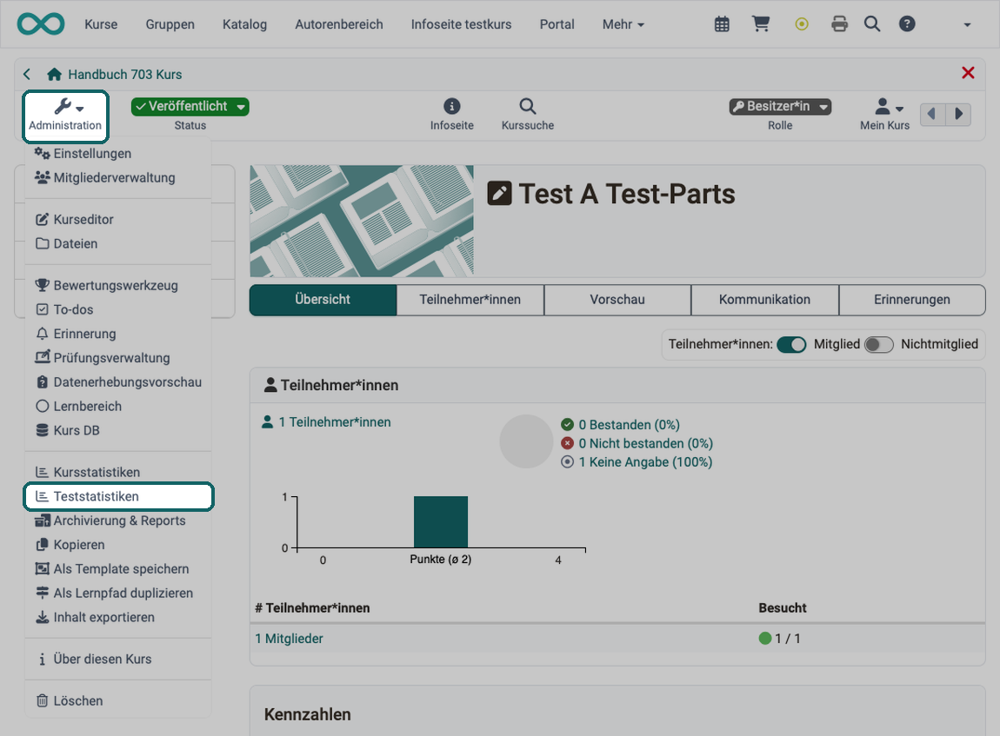

# Teststatistiken {: #test_statistics}

Die Teststatistiken erlauben eine kursbezogene, anonymisierte statistische Auswertung der OpenOlat-Tests eines Kurses. Angezeigt werden alle im Kurs enthaltenen Tests.

Sie öffnen die Teststatistiken in der Kurs-Administration unter: `Kurs > Administration > Teststatistiken`

Die Auswertung eines einzelnen Tests öffnen Sie auch mit dem Button "Teststatistiken" im Tab "Teilnehmer:innen" des Kursbausteins "Test", siehe [Tests exportieren](Test_export.de.md#export_results). Bei einer Test-Lernressource mit dem Verwendungszweck "Eigenständig" heisst der Menüpunkt in ihrer Administration "Test Statistik", siehe [Test Einstellungen - Administration](Test_settings.de.md).

{ class="shadow lightbox" title="Menü Administration eines Kurses · 2026.10.07" }

Es werden sowohl die Kennzahlen für einen Test als auch weitere Analysen zur Bearbeitungsdauer, durchschnittlichen Punkten pro Frage und der prozentuale Anteil der richtigen Antworten pro Frage angezeigt. Des Weiteren werden für jede Frage Kennzahlen wie die Anzahl der Teilnehmenden, die die Frage ausgefüllt haben, die durchschnittliche Punktzahl und Bearbeitungsdauer usw. angezeigt und visualisiert. Durch Kennwerte zur Testevaluation und Itemanalyse können Sie so einen Test im Hinblick auf z.B. Schwierigkeit und Eignung evaluieren.

Ein Download der Rohdaten sowie eine Druckversion stehen hier ebenfalls zur Verfügung.

Zugang zu den Teststatistiken haben neben den Kursbesitzer:innen auch alle Betreuer:innen des Kurses. Weitere Mitglieder sehen den Menüpunkt, wenn ihnen das Recht "Statistiken" erteilt wurde, siehe [Vergabe zusätzlicher Rechte](Members_management.de.md#additional_rights).

## Kennzahlen zu Punkteanpassungen [:octicons-tag-16:{ title="ab Release 21.1 (OO-9599)" }](https://track.frentix.com/issue/OO-9599) {: #adjustment_figures}

Ob eine Frage als Frage taugt, zeigt sich auch daran, wie oft ihre Punkte nachträglich korrigiert werden mussten. Bei einer automatisch korrigierten Frage enthalten die Kennzahlen der Frage deshalb zusätzlich zwei Werte, sobald mindestens eine Antwort angepasst wurde. Sie finden die Kennzahlen einer Frage, wenn Sie in den Teststatistiken links die Sektion aufklappen und die Frage wählen.

* **Anzahl der Anpassungen**: bei wie vielen Antworten der automatisch errechnete Punktwert nachträglich angepasst wurde.
* **Durchschnittliche Anpassung**: um wie viele Punkte im Mittel angepasst wurde, mit Vorzeichen, zum Beispiel "+0.8".

Eine hohe Zahl von Anpassungen deutet darauf hin, dass die Frage oder ihre Lösung überarbeitet werden sollte. Ohne Anpassung fehlen die beiden Werte, ebenso bei Fragen, die von Hand korrigiert werden, weil es dort keine Anpassung gibt. Wie Sie Punkte anpassen, steht auf der Seite [Tests bewerten](Assessing_tests.de.md#adjust_score).

[Zum Seitenanfang ^](#test_statistics)

---

## Weiterführende Informationen {: #further_information}

**Auf dieser Seite erwähnt** 
[Tests exportieren >](Test_export.de.md) 
[Test Einstellungen - Administration >](Test_settings.de.md) 
[Mitgliederverwaltung >](Members_management.de.md) 
[Tests bewerten >](Assessing_tests.de.md)

**Weiterführend** 
[Bewertungswerkzeug - Übersicht >](Assessment_tool_overview.de.md) 
[Kursstatistiken >](Statistics_Course.de.md) 
[Fragebogen Statistiken >](Statistics_Survey.de.md)

[Zum Seitenanfang ^](#test_statistics)
