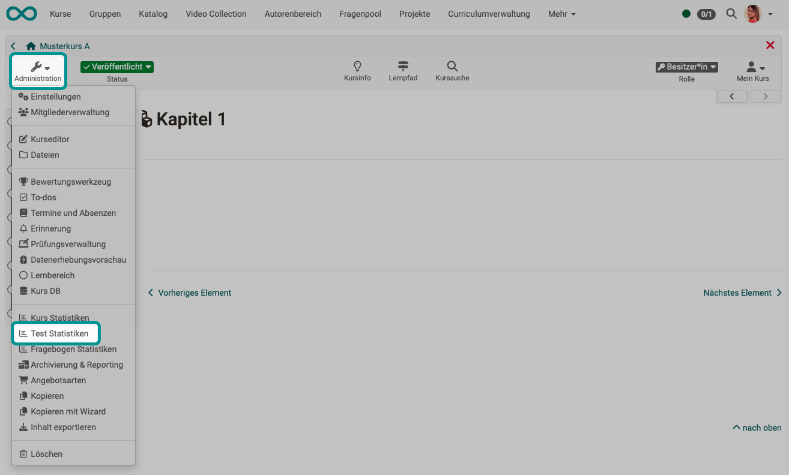

# Test statistics {: #test_statistics}

The test statistics allow you to perform general course-related, anonymous statistical evaluations of your tests. All tests included in the course are displayed.

{ class="shadow lightbox" }

The key figures for a test as well as further analyses of the time taken to complete a test, average points per question and the percentage of correct answers per question are displayed. In addition, key figures such as the number of participants who completed the question, average score, time taken to complete the question, etc. are displayed and visualized for each question. You can evaluate a test with regard to e.g. difficulty and suitability by means of characteristic values for test evaluation and item analysis.

A download of the raw data and a print version are also available here.

Access to the test statistics is not only available to the course owners but also to all coaches of the course.

[To the top of the page ^](#test_statistics)

