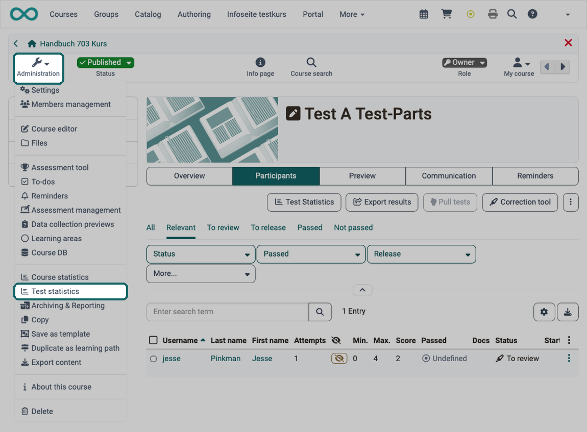

# Test statistics {: #test_statistics}

The test statistics allow you to perform a course-related, anonymous statistical assessment of the OpenOlat tests of a course. All tests included in the course are displayed.

You open the test statistics in the course administration under: `Course > Administration > Test statistics`

You can also open the evaluation of a single test with the "Test Statistics" button in the "Participants" tab of the "Test" course element, see [Export tests](Test_export.md#export_results). For a test learning resource with the usage "Standalone", the menu item in its administration is called "Test statistics", see [Test settings - Administration](Test_settings.md).

{ class="shadow lightbox" title="Administration menu of a course · 2026.10.07" }

Both the key figures for a test and further analyses of the completion time, average points per question and the percentage of correct answers per question are displayed. Furthermore, key figures such as the number of participants who have completed the question, the average number of points and processing time etc. are displayed and visualized for each question. Using key values for test assessment and item analysis, you can assess a test in terms of difficulty and suitability, for example.

A download of the raw data and a print version are also available here.

Access to the test statistics is not only available to the course owners but also to all coaches of the course. Other members see the menu item if they have been granted the right "Statistics", see [Assignment of additional rights](Members_management.md#additional_rights).

## Key figures on score adjustments [:octicons-tag-16:{ title="from Release 21.1 (OO-9599)" }](https://track.frentix.com/issue/OO-9599) {: #adjustment_figures}

Whether a question works as a question also shows in how often its points had to be corrected afterwards. For an automatically corrected question, the key figures of the question therefore contain two additional values as soon as at least one answer has been adjusted. You find the key figures of a question by expanding the section on the left in the test statistics and selecting the question.

* **Number of adjustments**: for how many answers the automatically calculated score was adjusted afterwards.
* **Average adjustment**: by how many points the score was adjusted on average, with sign, for example "+0.8".

A high number of adjustments indicates that the question or its solution should be revised. Without an adjustment, the two values are missing, as they are for questions that are corrected by hand, because there is no adjustment there. How to adjust the score is described on the page [Assessing tests](Assessing_tests.md#adjust_score).

[To the top of the page ^](#test_statistics)

---

## Further information {: #further_information}

**Mentioned on this page** 
[Export tests >](Test_export.md) 
[Test settings - Administration >](Test_settings.md) 
[Members management >](Members_management.md) 
[Assessing tests >](Assessing_tests.md)

**Further reading** 
[Assessment tool - overview >](Assessment_tool_overview.md) 
[Course statistics >](Statistics_Course.md) 
[Survey statistics >](Statistics_Survey.md)

[To the top of the page ^](#test_statistics)
