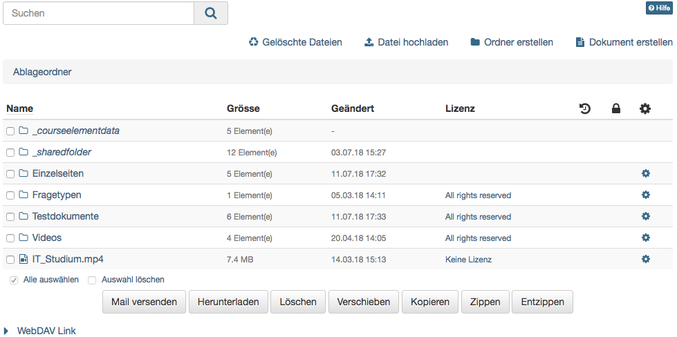
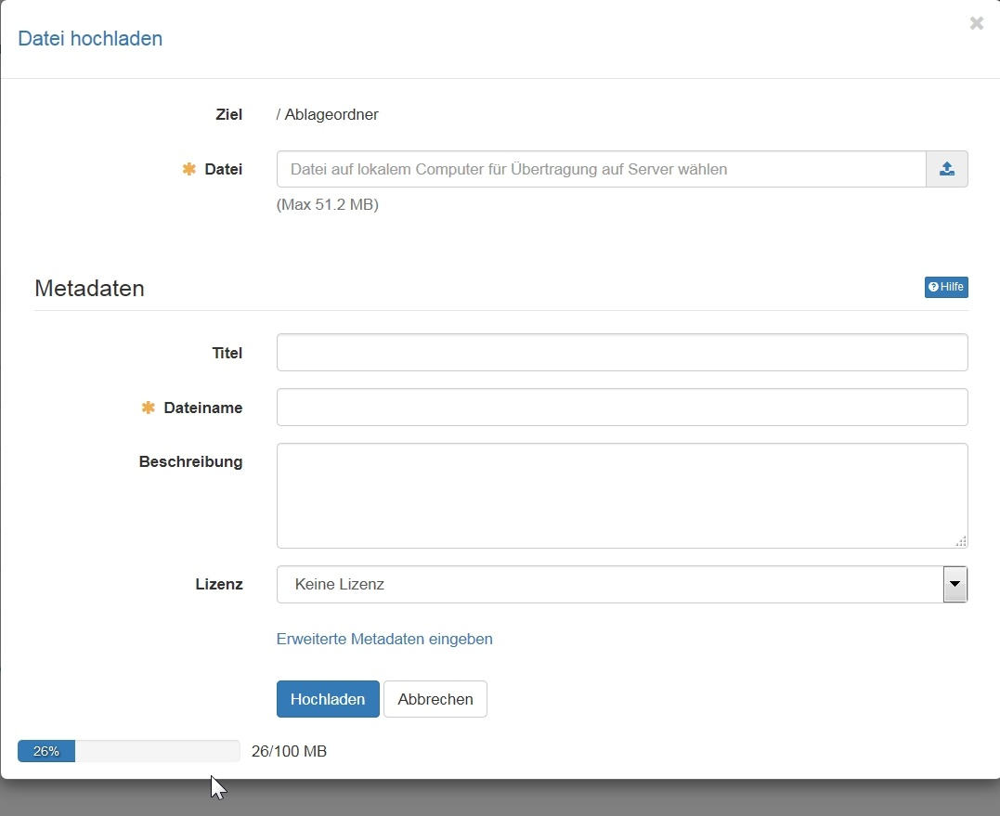

# Ablageordner {: #storage_folder}

Der "Ablageordner" eines Kurses dient den Kursbesitzer:innen als Ablage der im Kurs verwendeten Dateien. Hierzu zählen z.B. alle verwendeten HTML-Seiten, Grafiken und Dateien, die über den Kursbaustein "Ordner" zur Verfügung gestellt werden. Die Dateien liegen sozusagen griffbereit im Hintergrund und können jederzeit über die entsprechenden Kursbausteine bereitgestellt werden. Sie öffnen den Ablageordner über `Kurs > Administration > Dateien > Ablageordner`. Diesen Weg sehen Kursbesitzer:innen, Administrator:innen, Lernressourcenverwalter:innen und Personen mit dem Kursrecht "Kurseditor".

Teilnehmende haben keinen direkten, sondern nur einen indirekten Zugriff auf Dateien des Ablageordners. Um auf die Dateien zugreifen zu können, müssen diese über entsprechende [Kursbausteine](Course_Elements.de.md) verlinkt sein. Ein Ablageordner ist immer kursspezifisch.

{ class="shadow lightbox" }

Im Ablageordner können Dateien hochgeladen, gelöscht, verschoben, gesucht, gezippt, ausgepackt oder erstellt werden. Standardmässig können in OpenOlat HTML Dokumente erstellt werden. Sind in der System-Administration ergänzende Dokumenteneditoren aktiviert, können auch noch weitere Dateiformate erstellt werden: `Administration > Externe Werkzeuge > Dokumenteneditoren`. Beispielsweise können bei Verwendung von OnlyOffice auch Word, Excel oder PowerPoint Dateien erstellt werden.

Werden Dateien hochgeladen, muss die Grössenbegrenzung sowohl für die einzelne Datei als auch das Speicherlimit des gesamten Ablageordners berücksichtigt werden. Dieses Limit gilt auch wenn die Dateien per [WebDAV](../basic_concepts/Using_WebDAV.de.md) in den Ablageordner hochgeladen werden.

{ class="shadow lightbox" }

Ferner kann der Ablageordner sinnvollerweise mit weiteren Unterordnern versehen werden und so eine systematische Strukturierung von kursbezogenen Dateien umgesetzt werden.

Wie viel Speicher die Dateien des Kurses belegen, zeigt die Aktion "Speicherverbrauch anzeigen" oben rechts unter `Kurs > Administration > Dateien`. Dort sehen Sie den Speicherverbrauch je Ressource des Kurses und können die Quota anpassen, siehe [Mit welchen Massnahmen kann ich den Speicherverbrauch reduzieren?](../../manual_how-to/reduce_storage_consumption/reduce_storage_consumption.de.md) [:octicons-tag-16:{ title="ab Release 18.0 (OO-6938)" }](https://track.frentix.com/issue/OO-6938)

## Automatisch angelegte Ordner [:octicons-tag-16:{ title="ab Release 19.0 (OO-7700)" }](https://track.frentix.com/issue/OO-7700)

Welche Ordner OpenOlat für einen Kurs zusätzlich anlegt, sehen Sie unter `Kurs > Administration > Dateien`. Dort stehen sie je nach Kurskonfiguration neben dem Ablageordner:

* **_courseelementdata**: Wird angelegt, sobald der Kurs mindestens einen Kursbaustein "Ordner" enthält. In diesem Ordner befinden sich alle Kursbausteine "[Ordner](../learningresources/Course_Element_Folder.de.md)" und "[Teilnehmer:innen Ordner](../learningresources/Course_Element_Participant_Folder.de.md)" eines Kurses. Die entsprechenden Ordner mit den jeweiligen Dateien erscheinen hier automatisch, nachdem sie im Kurseditor angelegt wurden, und können hier auch editiert werden.
* **_sharedfolder**: Wird angelegt, wenn der Kurs mit einem [Ressourcenordner](../learningresources/Resource_Folder.de.md) verknüpft wird. Der zugewiesene Ressourcenordner kann hier eingesehen, standardmässig jedoch nicht editiert werden. Soll eine Bearbeitung hier möglich sein, deaktivieren Sie beim gewählten Ressourcenordner die Option "Schreibgeschützt": `Kurs > Administration > Einstellungen > Optionen`.
* **_documents**: Wird angelegt, wenn im Kurs das Werkzeug "[Dokumente](../learningresources/Toolbar.de.md#documents)" aktiviert ist. Hier liegen die Dateien, die über das Werkzeug "Dokumente" zentral zum Download bereitstehen.
* **_coachdocuments**: Wird angelegt, wenn im Kurs der Ordner "Unterlagen Betreuer:innen" aktiviert ist. Hier liegen die Dateien, die nur Betreuer:innen und Kursbesitzer:innen sehen. [:octicons-tag-16:{ title="ab Release 16.0 (OO-5566)" }](https://track.frentix.com/issue/OO-5566)

## Verbindung von Ablageordner und dem Kursbaustein "HTML-Seite"

Einzelne webspezifische Seiten (z.B. HTML, PDF), die im Ablageordner abgelegt werden, können über den Kursbaustein "[HTML-Seite](Course_Element_HTML_Page.de.md)" im Kurs sichtbar gemacht werden. Zudem kann im Kursbaustein "HTML-Seite" die Checkbox "Link in gesamten Ablageordner erlauben" ausgewählt werden. Dadurch wird es möglich, Dateien, welche sich im Ablageordner befinden, direkt in dieser HTML-Datei zu verlinken. Das ist hilfreich für die Anzeige von verknüpften Grafiken einer HTML-Seite sowie sonstigen verknüpften Dateien.

Sobald diese Checkbox aktiviert ist, ist der Pfad für andere Dateien im Ablageordner ersichtlich. Es ist dadurch möglich, auch Dateien aufzurufen, welche sich zwar im Ablageordner befinden, jedoch nicht im Kurs selbst publiziert sind.

## Weiterführende Informationen {: #further_information}

**Auf dieser Seite erwähnt** 
[Kursbausteine >](Course_Elements.de.md) 
[Einsatz von WebDAV >](../basic_concepts/Using_WebDAV.de.md) 
[Mit welchen Massnahmen kann ich den Speicherverbrauch reduzieren? >](../../manual_how-to/reduce_storage_consumption/reduce_storage_consumption.de.md) 
[Kursbaustein "Ordner" >](Course_Element_Folder.de.md) 
[Kursbaustein "Teilnehmer:innen Ordner" >](Course_Element_Participant_Folder.de.md) 
[Ressourcenordner >](Resource_Folder.de.md) 
[Toolbar: Übersicht >](Toolbar.de.md) 
[Kursbaustein "HTML-Seite" >](Course_Element_HTML_Page.de.md)

**Weiterführend** 
[Ordnerkonzept >](../basic_concepts/Folder_Concept.de.md) 
[Persönliche Werkzeuge: File Hub >](../personal_menu/File_Hub.de.md)

[Zum Seitenanfang ^](#storage_folder)
