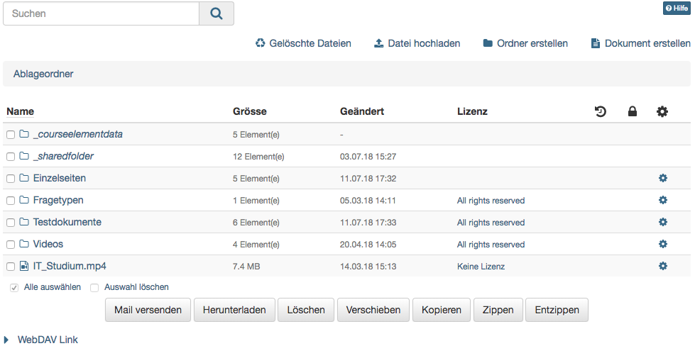
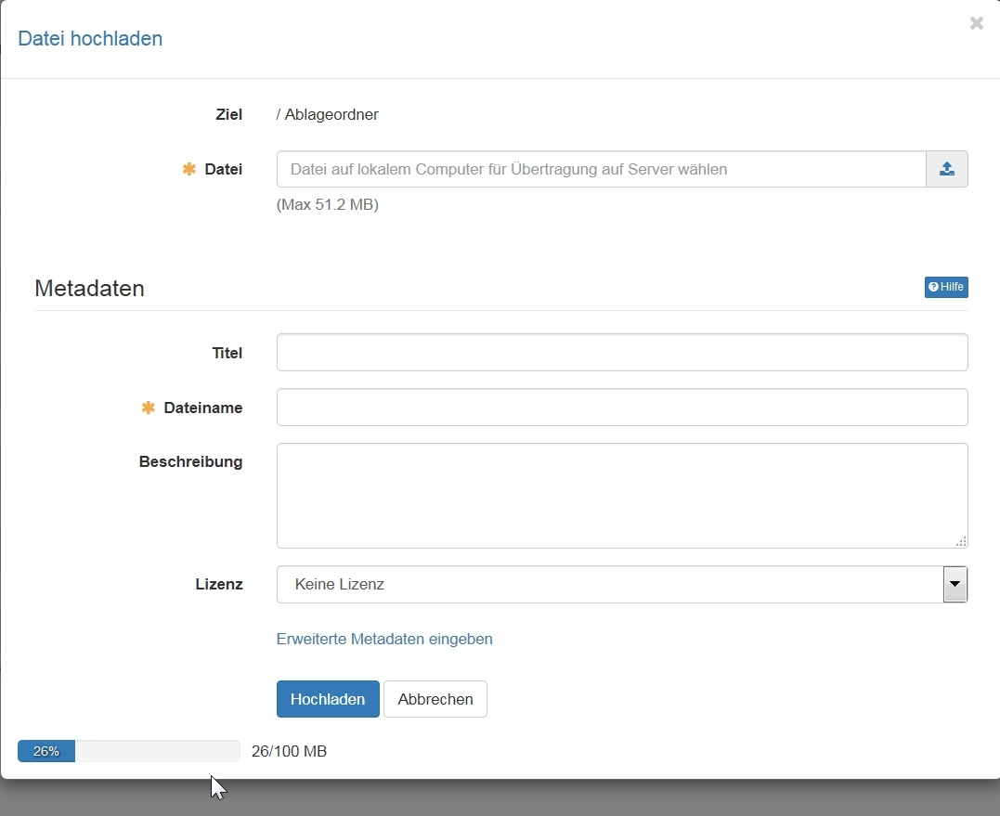

# Ablageordner

Der "Ablageordner" eines Kurses dient dem Kursersteller als Ablage der im Kurs verwendeten Dateien. Hierzu zählen z.B. alle verwendeten HTML-Seiten, Grafiken und Dateien, die über den Kursbaustein "Ordner" zur Verfügung gestellt werden. Die Dateien liegen sozusagen griffbereit im Hintergrund und können jederzeit über die entsprechenden Kursbausteine bereitgestellt werden.

Kursteilnehmende haben keinen direkten, sondern nur einen indirekten Zugriff auf Dateien des Ablageordners. Um auf die Dateien zugreifen zu können, müssen diese über entsprechende [Kursbausteine](Course_Elements.de.md) verlinkt sein. Ein Ablageordner ist immer kursspezifisch.

{ class="shadow lightbox" }

Im Ablageordner können Dateien hochgeladen, gelöscht, verschoben, gesucht, gezippt, ausgepackt oder erstellt werden. Standardmässig können in OpenOlat HTML Dokumente erstellt werden. Sind in der Administration ergänzende Dokumenteneditoren aktiviert, können auch noch weitere Dateiformate erstellt werden. Beispielsweise können bei Verwendung von Only Office auch Word, Excel oder PowerPoint Dateien erstellt werden.

Werden Dateien hochgeladen muss die Grössen Begrenzung sowohl für die einzelne Datei als auch das Speicherlimit des gesamten Ablageordners berücksichtigt werden. Dieses Limit gilt auch wenn die Dateien per [WebDAV](../basic_concepts/Using_WebDAV.de.md) in den Ablageordner hochgeladen werden.

{ class="shadow lightbox" }

Ferner kann der Ablageordner sinnvollerweise mit weiteren Unterordnern versehen werden und so eine systematische Strukturierung von kursbezogenen Dateien umgesetzt werden.

Zusätzlich legt OpenOlat, wenn der Kurs mindestens einen [Kursbaustein "Ordner"](../learningresources/Knowledge_Transfer.de.md#Wissensvermittlung-_ordner) enthält oder der Kurs mit einem Ressourcenordner verknüpft wird, automatisch die Ordner "**_courseelementdata**" bzw. "**_sharedfolder**" an.

Im Unterordner "**_courseelementdata**" befinden sich alle Kursbausteine "[Ordner](../learningresources/Course_Element_Folder.de.md)" und "[Teilnehmer Ordner](../learningresources/Course_Elements.de.md)" eines Kurses. Die entsprechenden Ordner mit den jeweiligen Dateien erscheinen hier nachdem sie im Kurseditor angelegt wurden automatisch und können im Ablageordner auch editiert werden.

Ein dem Kurs zugewiesener [Ressourcenordner](../learningresources/index.de.md) kann im Ablageordner über den Unterordner "**_sharedfolder**" eingesehen, jedoch per default nicht editiert werden. Soll eine Bearbeitung über den Ablageordner möglich sein, muss in den Kurs Optionen bei der Wahl des Ressourcenordners die Option "schreibgeschützt" deaktiviert werden.

### Verbindung von Ablageordner und dem Kursbaustein "Einzelne Seite"

Einzelne webspezifische Seiten (z.B. HTML, PDF) die im Ablageordner abgelegt werden, können über den Kursbaustein "Einzelne Seite" im Kurs sichtbar gemacht werden. Zudem kann im Kursbaustein "Einzelne Seite" die Checkbox "Link in gesamten Ablageordner erlauben" ausgewählt werden. Dadurch wird es möglich, Dateien, welche sich im Ablageordner befinden, direkt in dieser HTML-Datei zu verlinken. Das ist hilfreich für die Anzeige von verknüpften Grafiken einer HTML-Seite sowie sonstigen verknüpften Dateien.

Sobald diese Checkbox aktiviert ist, ist der Pfad für andere Dateien im Ablageordner ersichtlich. Es ist dadurch möglich, auch Dateien aufzurufen, welche sich zwar im Ablageordner befinden, jedoch nicht im Kurs selbst publiziert sind.
