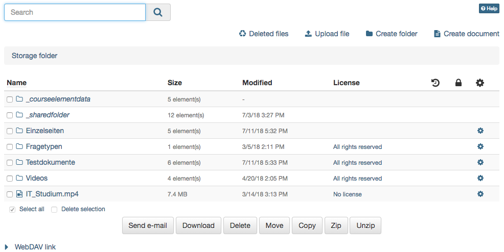
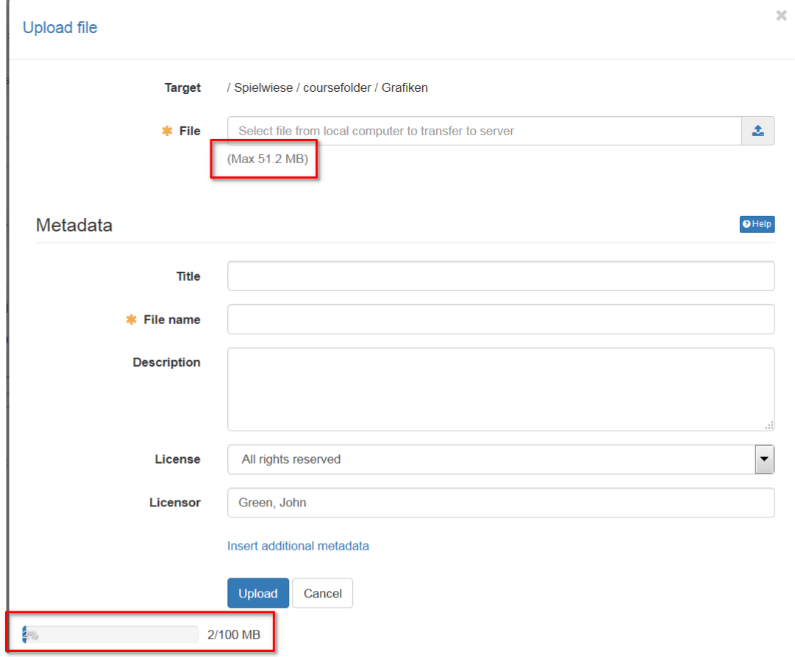

# Storage folder

The editor tool "Storage folder" in a course serves the storage of files used in the course, e.g. all used HTML pages or documents from folders. A storage folder is course specific. It the central place for the storage of course related files. 

However, the content of the storage folder cannot be viewed directly by learners, but can be accessed indirectly, e.g. via the course elements "single page" or "folder". A storage folder is always course-specific.  

{ class="shadow lightbox" }

In the storage folder files can be uploaded, deleted, moved, searched for, zipped, un-zipped or created. By default, HTML documents can be created in OpenOlat. If additional document editors are activated in the administration, further file formats can be created. For example, if Only Office is used, Word, Excel or PowerPoint files can also be created.

When uploading a file the file size limit as well as the folder space limit has to be taken into consideration. Also those limits apply when uploading files via [WebDAV](../basic_concepts/Using_WebDAV.md) to the storage folder.

{ class="shadow lightbox" }

In the storage folder subfolders can be used to create a systematical structure of course related files. In addition OpenOlat automatically creates the folders „ **_courseelementdata** “ and „ **_sharedfolder** ", respectively, when a course contains at least one course element "Folder" or a course is linked with a resource folder.

In the subfolder **"_courseelementdata"** you can find all course elements "folder" of this course. The corresponding folders appear here automatically after they have been created in the course editor and can be edited here as well.

Via the subfolder „ **_sharedfolder** “ you can view the linked resource folder of the course, but you can not edit it by default. Editing can be enabled in the course options by deactivating the option "read only" for the selected resource folder.

### Link course element "Single page" to storage folder

Single web specific pages (e.g. html, pdf) which are stored in the storage folder can be made visible in the course with the course element "Single page".

Additionally the checkbox "Allow links in the entire storage folder" can be selected. Thus it becomes possible to link html-files, which can be found in the storage folder, directly. This is helpful to show linked charts of a html-page or other linked files.

As soon as the checkbox is activated, the path for other files of the storage folder is visible. Thus it becomes possible, to call up files, which are determined in the storage folder but aren't published in the course itself.
