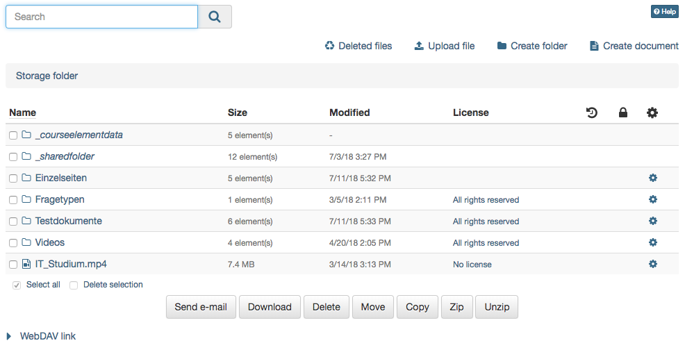
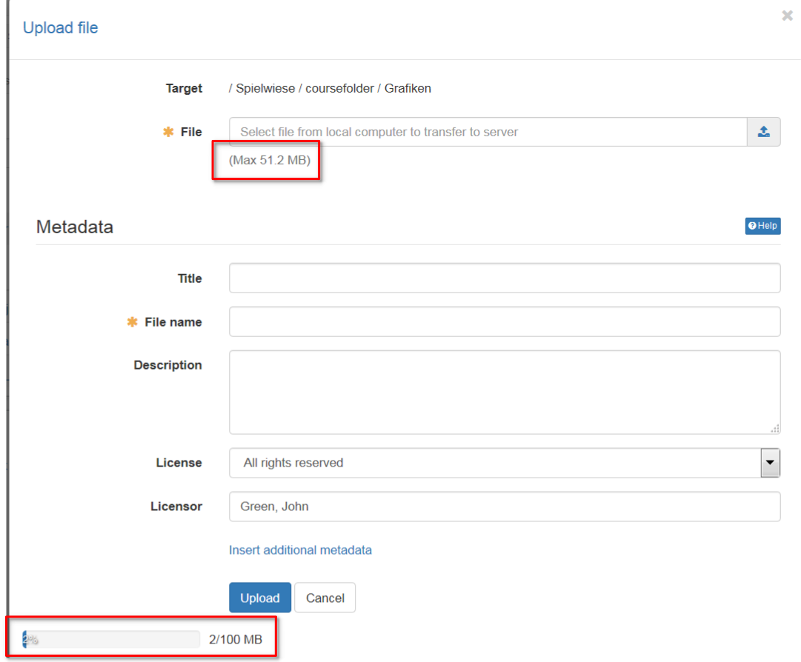

# Storage folder {: #storage_folder}

The "Storage folder" of a course serves the course owners as a repository for the files used in the course. This includes e.g. all HTML pages, graphics and files used that are made available via the course element "Folder". The files are, so to speak, ready to hand in the background and can be made available at any time via the corresponding course elements. You open the storage folder via `Course > Administration > Files > Storage folder`. This path is visible to course owners, administrators, learning resource managers and persons with the course right "Course editor".

Course participants have no direct but only indirect access to files of the storage folder. In order to access the files, they must be linked via corresponding [Course Elements](Course_Elements.md). A storage folder is always course specific.

{ class="shadow lightbox" }

In the storage folder files can be uploaded, deleted, moved, searched for, zipped, un-zipped or created. By default, HTML documents can be created in OpenOlat. If additional document editors are activated in the system administration, further file formats can be created: `Administration > External tools > Document editors`. For example, if OnlyOffice is used, Word, Excel or PowerPoint files can also be created.

When uploading a file, the file size limit as well as the folder space limit has to be taken into consideration. Also those limits apply when uploading files via [WebDAV](../basic_concepts/Using_WebDAV.md) to the storage folder.

{ class="shadow lightbox" }

Furthermore, the storage folder can be usefully provided with further subfolders and thus a systematic structuring of course-related files can be implemented.

How much space the files of the course use is shown by the action "Show memory usage" at the top right under `Course > Administration > Files`. There you see the memory usage per resource of the course and can adjust the quota, see [What measures can I take to reduce storage space consumption?](../../manual_how-to/reduce_storage_consumption/reduce_storage_consumption.md) [:octicons-tag-16:{ title="from Release 18.0 (OO-6938)" }](https://track.frentix.com/issue/OO-6938)

## Automatically generated folders [:octicons-tag-16:{ title="from Release 19.0 (OO-7700)" }](https://track.frentix.com/issue/OO-7700)

The additional folders OpenOlat creates for a course are shown under `Course > Administration > Files`. Depending on the course configuration, they appear next to the storage folder:

* **_courseelementdata**: Generated as soon as the course contains at least one course element "Folder". This folder contains all course elements "[folder](../learningresources/Course_Element_Folder.md)" and "[Participant folder](../learningresources/Course_Element_Participant_Folder.md)" of a course. The corresponding folders appear here automatically after they have been created in the course editor and can be edited here as well.
* **_sharedfolder**: Generated when the course is connected to a [resource folder](../learningresources/Resource_Folder.md). The linked resource folder can be viewed here, but cannot be edited by default. To enable editing here, deactivate the option "Read only" for the selected resource folder: `Course > Administration > Settings > Options`.
* **_documents**: Generated when the course tool "[Documents](../learningresources/Toolbar.md#documents)" is enabled. It contains the files that are provided for central download via the "Documents" tool.
* **_coachdocuments**: Generated when the folder "Coach files" is enabled in the course. It contains the files that only coaches and course owners see. [:octicons-tag-16:{ title="from Release 16.0 (OO-5566)" }](https://track.frentix.com/issue/OO-5566)

## Link course element "HTML page" to storage folder

Single web specific pages (e.g. html, pdf), which are stored in the storage folder, can be made visible in the course with the course element "[HTML page](Course_Element_HTML_Page.md)". Additionally, the checkbox "Allow links in the entire storage folder" can be selected. Thus it becomes possible to link html-files, which can be found in the storage folder, directly. This is helpful to show linked charts of a html-page or other linked files.

As soon as the checkbox is activated, the path for other files of the storage folder is visible. Thus it becomes possible, to call up files, which are determined in the storage folder but aren't published in the course itself.

## Further information {: #further_information}

**Mentioned on this page** 
[Types of Course Elements >](Course_Elements.md) 
[Using WebDAV >](../basic_concepts/Using_WebDAV.md) 
[What measures can I take to reduce storage space consumption? >](../../manual_how-to/reduce_storage_consumption/reduce_storage_consumption.md) 
[Course Element "Folder" >](Course_Element_Folder.md) 
[Course Element "Participant folder" >](Course_Element_Participant_Folder.md) 
[Resource folder >](Resource_Folder.md) 
[Toolbar: Overview >](Toolbar.md) 
[Course Element "HTML page" >](Course_Element_HTML_Page.md)

**Further reading** 
[Folder concept >](../basic_concepts/Folder_Concept.md) 
[Personal tools: File Hub >](../personal_menu/File_Hub.md)

[To the top of the page ^](#storage_folder)
