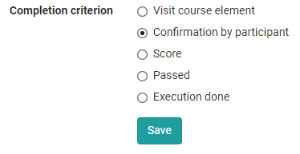
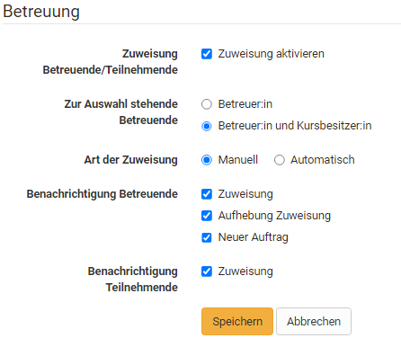
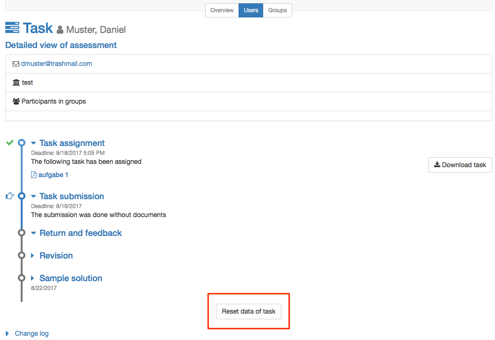

# Task - Further Configurations

Go to your course, open the course editor and add a course element Task or go
to an already inserted task element.

The tabs "Title and description" and "Layout" are available for all course elements. Here you can enter information about the course element and configure its display. In the following, the other central tabs for the course element Task will be explained.

##  Tab: "Learning path"

Here you define whether the execution of the task is obligatory or voluntary.
Obligatory tasks are taken into account in the progress display, voluntary
ones are not. 

Furthermore, you can define a time period in which the task can be processed. Outside this period, the task will be displayed in the left
navigation, but it will not be accessible.

The release date can be used if the course element is to be opened and started only on a certain date.

The time entered under "To be edited by" refers to the deadline for picking up or starting the course element Task, not to the deadline for file upload (see Workflow).

In the case of the processing time, the estimated time a user needs to process the course element can be entered. An entry is especially relevant if the progress in the course refers to the processing time of the course elements (see Administration -> [Settings](../course_create/Course_Settings_DE.md) -> Tab "Execution"). 

The Learning Path tab also defines which criterion must be met for the task to
be considered "completed". The following options are available:

{ class="shadow" }

- **Visit course element:**  User has clicked on the course element.
- **Confirmation by participant:** User has clicked on the "I`ve read the content " button
- **Score**: The user has achieved at least the specified score while
completing the task.
- **Passed**: The user has fulfilled the "passed" requirements configured in
the " Grading" tab or the task has been manually set to passed by the coach.
- **Execution done**:  All steps of the task flow were run through.

!!! info "Traditional courses"
     Traditional courses do not have the "Learning Path" tab and instead have the
     "Visibility" and "Access" tabs, including expert mode.

## Tab: "Workflow"

This is the central tab for configuring the course element Task. Here you can
define which individual elements of the task are required in general. Should a
concrete task be stored in the course element or will the user find the task
somewhere else? Should the user hand in a document? Should there be feedback
from the teacher? Should the user be able to revise a submission if necessary?
Should a sample solution be provided? Should a score or passing be possible?
Sollen bestimmte Lernende von bestimmten Betreuenden bewertet werden?

Simply activate the points you need and configure the relevant tabs in the
next step.

The assignment, submission and sample solution steps can be configured with a
deadline, with the assignment and submission open until that specific date, whereas the sample solution won't be available before the respective date.
Starting from the date entered, the sample solution can be provided for all
participants or only those who have worked on the task.

Instead of using a fixed calendar date, relative dates are available too,
resulting in deadlines dependent on participant activities, such as a first
course launch. All defined dates can be adapted individually, e.g. if a
participant needs more time according to special circumstances. This is
possible for all workflow steps. If the submission deadline is extended, the
task will be opened again automatically.

Further relative date options are the course starting date (only available
with a configured [execution period](../learningresources/Course_Settings.md#Execution), enrolment respectively booking date or the date of the task assignment.

If sample solutions are activated, you can also define here whether
supervisors are allowed to add and edit documents.

Im Bereich "Betreuung" des Tabs Workflow kann eine teilnehmerabhängige Betreuung aktiviert und konfiguriert werden. 

Die differenzierte Zuordnung der Personen erfolgt allerdings bei geschlossenem Kurseditor. 

**Spezifisches group task:**
In the group task, you additionally define in the "Task type" section for
which groups or learning areas the task module is accessible.

Changing the workflow later will influence all individual participants and
groups even if they already have started the assignment.

!!! warning
 
    Changing the workflow, for example deleting the assignment step, will delete
    the corresponding elements from the workflow for all members or groups.
    Information about the chosen task will not be visible anymore. If you
    reactivate the element of the workflow the information will be accessable
    again.

    However, if you add the assignment step later and a member or group is already
    further into the task, then they don't have to choose an assignment anymore.

## Tab: "Assignment"

In the "Assignment" tab you can

a) upload tasks created outside of OpenOlat (upload assignment)

b) Create files directly in OpenOlat with the OpenOlat HTML editor or possibly other available editors (create assignment) or

c) record tasks as a video directly with your webcam (Create video assignment).

You can also provide your users with several files for one task. For this, however, they must be uploaded as a ZIP package. 

If a task is created with the internal
OpenOlat editor, multiple files such as images or PDF files can be provided by
first uploading them in the WYSIWYG editor and then linking them in the
corresponding html page. Such a task will then be downloaded in .zip file
format as well. If the HTML editor is used, the stored title is automatically
used as the file name. However, this can be changed at any time.

In the section "Type of assignment" you determine whether a course participant
is offered all available tasks for selection or whether a task is
automatically assigned to him/her by random selection.

!!! info "Multiple files"
    If multiple files are stored in the Task tab, they will be
    considered as multiple different tasks. It is _not_ a task with several
    complementary files.

Select in the field "Type of drawing" if several course participants can solve the same task or if each
task or if each student should solve a different task. If the task is selected manually, you can further specify in the "Preview" field whether the course participants are allowed to view the task before selecting it.  
In case course participants must all work on different tasks, you have to offer at least the same number of tasks as there are course participants.

!!! info 

    Wenn der Kursbaustein nur eine Aufgabe beinhaltet ist eine manuelle Wahl wenig sinnvoll. Nutzen Sie in diesem Fall am besten die automatische Zuweisung.

In the field "Message for user" you can provide general information for all
course participants regarding your tasks.

!!! info "Additional document editors"
    If additional document editors are activated in the administration, additional
    file formats can also be created. For example, if Only Office is used, Word,
    Excel or PowerPoint files can also be created. The same applies to the
    creation of other (feedback) files.

In the setting manual choice, if a course participant choses by incident a
wrong or not-wanted assignment, it can be reset in the assessment tool by the
course owner.

{ class="shadow" }

The assignment is not reset automatically. The participant gets the
opportunity to undo all pervious steps.

{ class="shadow" }

!!! warning "group task"
    In group tasks only one task can be chosen by the group. As soon as one member
    picks a task, this choice counts for all group members.  

## Tab: "Submission"

Determine how participants are allowed to hand in documents and how many in
the segment "Submission configuration". 

Submitting with the embedded text
editor allows the creation of HTML documents directly in the course element. If only the option "Submit files created with external editor" is enabled, course participants will have to have their documents ready for upload in an established file format. Enter a number in the field "Max. number of documents" in order to restrict the number of documents uploaded.

It is now also possible to accept video recordings via webcam as a delivery. In the "Submission" tab, you can determine the maximum length of the recording as well as the video quality level. This allows learners to submit a video statement directly instead of a written document. 

Aktivieren Sie **"Aufgabe ist Vorlage für die Abgabe"**, wenn die Lernenden die hinterlegte Aufgabendatei als Basis für ihre Bearbeitung nutzen sollen, beispielsweise wenn die Aufgabenstellung eine auszufüllende vorstrukturierte Tabelle beinhaltet. 

!!! Info "Info"

    Damit die Nutzung der Vorlage funktioniert muss auch die Bearbeitung in entsprechenden Editoren von den OpenOlat Administratoren freigeschaltet sein.  

In the "Submission confirmation" segment you will find the standard phrase to confirm that course participants have submitted their solutions successfully.
This text can be adapted if necessary. The option "Send text additionally as
e-mail" means that your text will be sent by e-mail as well. In group tasks
all members get an e-mail confirmation.

## Tab: "Revisions and feedback"

Here you can define the minimum and maximum number of return documents.

## Tab: "Grading"

Here you define how each course participant shall be assessed. 
Should there be points? Should there be a pass/fail for the course element? Should the point evaluation be linked to a rating scale? Should it be possible to provide further individual comments or documents? Decide in each case what is suitable for your scenario. 

By default a tutor can assess tasks by means of "Passed/failed." Das Bestehen kann entweder manuell durch den Betreuer definiert werden oder, sofern auch Punkte für die Aufgabe vergeben werden, sich auf eine bestimmte Punktzahl beziehen. 

If points are awarded, the minimum and maximum number of points must be specified. In addition, you can then also select the "Evaluation with rating/grades" option. In this way, certain rating scales such as levels, grades, (competence) levels or labels can be assigned to the respective points. The available rating scales are defined by the OpenOlat administrator and can be selected via the button "Edit rating scale" and the points can be adjusted in detail. Furthermore, it has to be defined if the assignment to the calculated rating is done manually by the supervisor or if it should be displayed automatically when the points are changed. 

In the tab Evaluation you can also define whether the result of the concrete task element is included in the evaluation of the entire course or should be excluded. 

Optionally, you can activate the option for individual comments or individual assessment documents, so that tutors have even more flexible feedback options. 

In addition you can provide further
information in the fields "Notice for all users" and "Notice for tutors," e.g.
some general comment on how to assess course participants.

## Tab: "Sample Solutions"

In order to provide all course participants with a sample solution regarding
your tasks just either upload appropriate documents or directly create them
via the embedded text editor. The sample solution is visible after the coach
accepted solution documents for submission.

!!! tip 
    If you wish to provide assistance in solving the task, you can add additional
    documents to the task by packing all documents and upload as .zip file in the
    assignment tab.

## Tab: "HighScore"

If the assignment of scores has also been activated for the task, the
Highscore tab can also be configured in more detail. You can specify the start
date and define which elements are displayed and whether the display should be
anonymous.

For more information on this tab, which is available in several course elements, see [here].(../learningresources/Assessment.md#highscore--highscore).

## Tab "Reminders"
If required, create reminders for participants to work on the course element. 

For more information on this tab, which is available in several course elements, see [here](../learningresources/Course_Reminders.md).    

  

  

