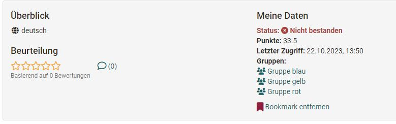
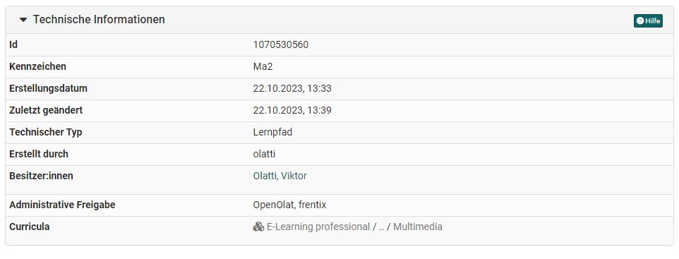
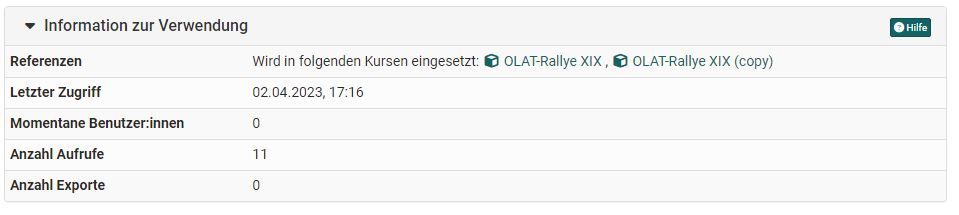

# Automatische Informationen zur Lernressource {: #technical_information}

Auf der Infoseite finden Sie neben den selbst eingegebenen Informationen zur
Lernressource auch automatisch generierte Informationen.

Je nach Lernressource können diese Informationen variieren. Bereits in einen
Kurs eingebundene Lernressourcen zeigen auch Informationen zur Verwendung, die
die Liste der verknüpften Kurse enthält. Alle diese Einträge können nicht
geändert werden.

## Meine Daten zum Kurs

Anzeige des persönlichen Standes bezüglich der Lernressource bzw. des Kurses. Dürfen Teilnehmende den Kurs verlassen, steht hier auch die Aktion "Kurs verlassen" zur Verfügung. [:octicons-tag-16:{ title="ab Release 20.3 (OO-9272)" }](https://track.frentix.com/issue/OO-9272)

{ class="shadow lightbox" }

## Technische Informationen

!!! info "Wichtig"

    Diese Informationen sind nur für die Besitzer:innen der Lernressource und für administrative Rollen sichtbar. Teilnehmende und Betreuer:innen sehen sie nicht.

{ class="shadow lightbox" }

**ID**: Automatisch generierte Identifikationsnummer der Lernressource.
Mit dieser ID können Sie die Lernressource über die Suchmaske suchen.

**Kennzeichen**: Die externe Kennung, die Sie selbst unter `Kurs > Administration > Einstellungen > Tab "Info"` vergeben.

Dokumentiert werden auch das Erstellungsdatum und die letzte vorgenommene Änderung an der Lernressource.

**Technischer Typ**: Bei Kursen der Kurstyp, zum Beispiel Lernpfad oder herkömmlicher Kurs.

**Erstellt durch**: Automatisch eingefügter Name der Person, die die Lernressource angelegt hat. Dieser Eintrag kann nicht geändert werden.
Im Autorenbereich können Sie über die Suchmaske auch nach dieser Person suchen.

**Besitzer:innen**: Angezeigt werden alle Personen, die als Besitzer:innen der Lernressource eingetragen sind.

**Administrative Freigabe**: Anzeige der im Tab "Freigabe" gewählten Konfiguration. Weitere Informationen dazu finden Sie unter [Zugangskonfiguration / Freigabe](../learningresources/Access_configuration.de.md).

## Information zur Verwendung

!!! info "Wichtig"

    Diese Information wird bei Kursen nicht angezeigt und gilt nur für sonstige Lernressourcen.

{ class="shadow lightbox" }

**Referenzen**: Hier sehen Sie, welche Kurse diese Lernressource verwenden.
Solange die Lernressource in einem Kurs verwendet wird, kann sie nicht
gelöscht werden.

Der **letzte Zugriff** gibt an, wann die Lernressource das letzte Mal
gestartet wurde.

**Momentane Benutzer:innen**: Gibt an, wie viele Benutzer:innen diese Lernressource zurzeit in OpenOlat gestartet haben.

**Anzahl Aufrufe**: Zählt automatisch, wie viele Male die Lernressource
insgesamt gestartet wurde. Wenn die Lernressource nicht in OpenOlat gestartet
werden kann, erscheint der Eintrag "Ausführung nicht unterstützt".

**Anzahl Exporte**: Zählt automatisch, wie viele Male die Lernressource
insgesamt heruntergeladen wurde.

## Weiterführende Informationen {: #further_information}

[Zugangskonfiguration / Freigabe >](../learningresources/Access_configuration.de.md)

[Zum Seitenanfang ^](#technical_information)
