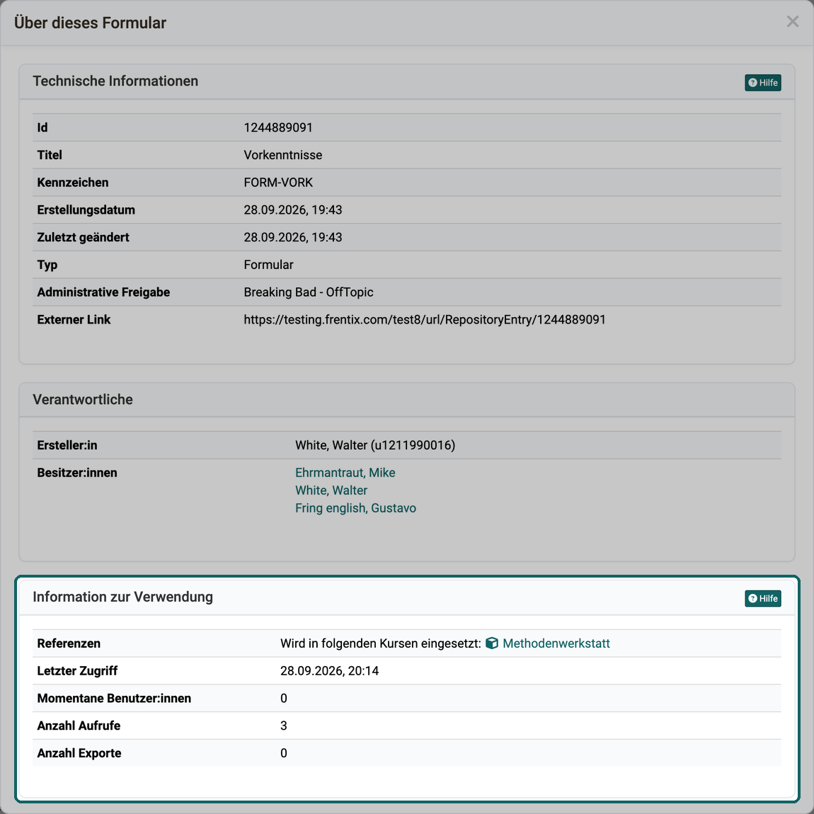

# Über diesen Kurs: Technische Informationen und Verwendung {: #technical_information}

Wer einen Kurs oder eine andere Lernressource verwaltet, schlägt hier nach, welche ID sie hat, wem sie gehört und in welchen Kursen sie eingebunden ist. OpenOlat erzeugt diese Angaben selbst, Sie können sie nicht ändern. Sie stehen im Fenster "Über diesen Kurs", nicht auf der Infoseite.

{ class="shadow lightbox" title="Fenster Über diesen Kurs · 2026.10.05" }

## Fenster öffnen [:octicons-tag-16:{ title="ab Release 21.1 (OO-9760)" }](https://track.frentix.com/issue/OO-9760){:target="_blank"} {: #open}

Wer die ID oder die Besitzer:innen eines Kurses sucht, öffnet das Fenster auf einem von zwei Wegen:

- `Kurs > Administration > Über diesen Kurs`
- `Kurs > Administration > Einstellungen > Tab "Metadaten"`, Button neben dem Feld "Typ"

Bei anderen Lernressourcen heisst der Menüpunkt nach deren Typ, zum Beispiel "Über diesen Test" oder "Über dieses Wiki". Hat ein Typ keine eigene Bezeichnung, heisst er "Über diese Lernressource".

Den Menüpunkt sehen Besitzer:innen der Lernressource, Lernressourcenverwalter:innen und Administrator:innen. Teilnehmende und Betreuer:innen sehen ihn nicht.

Klicken Sie im Fenster auf den Namen einer Besitzer:in, einen Kurs oder ein Produkt, schliesst sich das Fenster und OpenOlat öffnet das Ziel.

## Technische Informationen {: #technical}

Mit diesen Angaben finden Sie die Lernressource wieder und ordnen sie ein, etwa über die Id in der Suche oder über das Produkt im Course Planner.

**Id**: Automatisch vergebene Nummer der Lernressource. Mit dieser ID finden Sie die Lernressource über die Suche.

**OpenOlat-Ressourcen-ID** und **OpenOlat-Soft-ID**: Weitere interne Kennungen der Lernressource. Diese Zeilen sehen nur Lernressourcenverwalter:innen und Administrator:innen.

**Extern ID**: Kennung der Lernressource in einem externen System. Die Zeile erscheint nur, wenn ein Wert gesetzt ist.

**Titel**: Titel der Lernressource.

**Kennzeichen**: Die Kennung, die Sie selbst unter `Kurs > Administration > Einstellungen > Tab "Metadaten"` vergeben. Die Zeile erscheint nur, wenn ein Kennzeichen gesetzt ist.

**Erstellungsdatum** und **Zuletzt geändert**: Datum und Uhrzeit, an denen die Lernressource angelegt und zuletzt geändert wurde.

**Typ**: Art der Lernressource, zum Beispiel Kurs, Test oder Formular.

**Technischer Typ**: Bei Kursen der Kurstyp, zum Beispiel Lernpfad oder herkömmlicher Kurs.

**Administrative Freigabe**: Die Organisationen, für welche die Lernressource freigegeben ist. Weitere Informationen dazu finden Sie unter [Zugangskonfiguration / Freigabe](../learningresources/Access_configuration.de.md).

**Externer Link**: Der Link für den direkten Zugang zur Lernressource. Ist der Gastzugang erlaubt, steht darunter der **Externe Link - Gast**.

**Produkte**: Die Produkte und Durchführungen im Course Planner, in denen der Kurs eingebunden ist. Ein Klick darauf öffnet das Produkt oder die Durchführung im Course Planner. Die Links und das Suchsymbol daneben sind nur für Administrator:innen und Kursplaner:innen aktiv.

## Verantwortliche {: #responsible_persons}

Der Bereich zeigt, wer die Lernressource angelegt hat und wer sie heute verantwortet.

**Ersteller:in**: Die Person, die die Lernressource angelegt hat, mit Benutzernamen. Im Autorenbereich können Sie über die Suche nach dieser Person suchen.

**Besitzer:innen**: Alle Personen, die als Besitzer:innen der Lernressource eingetragen sind. Ein Klick auf einen Namen öffnet die Visitenkarte der Person.

## Information zur Verwendung {: #usage}

Ist die Lernressource in mindestens einen Kurs eingebunden, zeigt das Fenster zusätzlich den Bereich "Information zur Verwendung". Das gilt zum Beispiel für einen Test, ein Formular oder ein Wiki. Bei Kursen erscheint der Bereich deshalb in der Regel nicht.

{ class="shadow lightbox" title="Fenster Über dieses Formular · 2026.10.05" }

**Referenzen**: Die Kurse, die diese Lernressource verwenden. Ein Klick auf einen Kurs öffnet ihn. Solange die Lernressource in einem Kurs verwendet wird, kann sie nicht gelöscht werden.

**Letzter Zugriff**: Wann die Lernressource das letzte Mal gestartet wurde.

**Momentane Benutzer:innen**: Wie viele Benutzer:innen die Lernressource zurzeit in OpenOlat geöffnet haben.

**Anzahl Aufrufe**: Wie oft die Lernressource insgesamt gestartet wurde.

**Anzahl Exporte**: Wie oft die Lernressource insgesamt heruntergeladen wurde.

## Extern verwaltete Module [:octicons-tag-16:{ title="ab Release 9.0 (OO-623)" }](https://track.frentix.com/issue/OO-623){:target="_blank"} {: #managed}

Wird die Lernressource von einem externen System verwaltet, zeigt das Fenster zusätzlich den Bereich "Extern verwaltete Module". Er listet die Einstellungen und Module, die Sie in OpenOlat nicht ändern können.

---

## Weiterführende Informationen {: #further_information}

[Zugangskonfiguration / Freigabe >](../learningresources/Access_configuration.de.md) 
[Toolbar: Infoseite >](../learningresources/Info_page.de.md) 
[Kurs-Administration: Übersicht >](../learningresources/Administration.de.md)

[Zum Seitenanfang ^](#technical_information)
