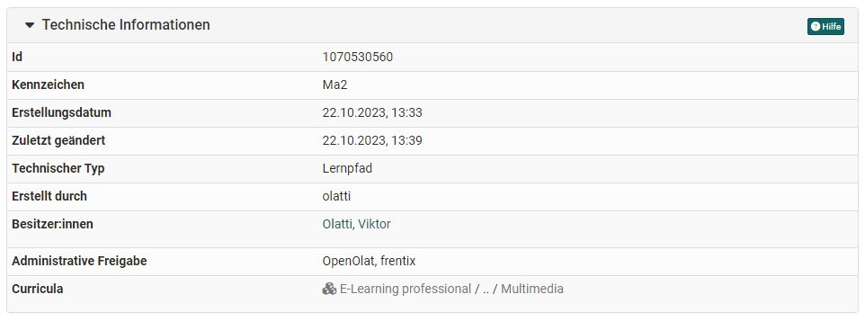

# Automatische Informationen zur Lernressource

Auf der Infoseite finden Sie neben den selbst eingegebenen Informationen zur
Lernressource auch automatisch generierte Informationen.

Je nach Lernressource können diese Informationen variieren. Bereits in einen
Kurs eingebundene Lernressourcen zeigen auch Informationen zur Verwendung, die
die Liste der verknüpften Kurse enthält. Alle diese Einträge können nicht
geändert werden.

## Meine Daten zum Kurs
Anzeige des persönlichen Standes bezüglich der Lernressource bzw. des Kurses. 

## Technische Informationen
!!! info

    Diese Informationen sind nur für die Besitzer der Lernressource sichtbar. Teilnehmende und Betreuer sehen sie nicht.  

 **ID**: Automatisch generierte Identifikationsnummern der Lernressource.
Mit dieser ID können Sie die Lernressource über die Suchmaske suchen.

Dokumentiert werden auch das Erstellungsdatum und die letzte vorgenommene Änderung an der Lernressource. 

 **Erstellt durch**: Automatisch eingefügter Name der Person die die Lernressource angelegt hat. Dieser Eintrag kann nicht geändert werden. 
Nach Erstellern kann auch mittels des Suchmasken-Feld im Autorenbereich gesucht werden. 

**Besitzer**: Angezeigt werden alle Personen, die als Besitzer der Lernressource eingetragen sind. 

**Administrative Freigabe**: Anzeige der in den Einstellungen im Tab "Freigabe" gewählten Konfiguration. Weitere Infos dazu finden Sie [hier](../learningresources/Access_configuration.de.md). 

##  Information zur Verwendung

!!! info

    Diese Information wird bei Kursen nicht angezeigt und gilt nur für sonstige Lernressourcen.

 **Referenzen**: Hier sehen Sie, welche Kurse diese Lernressource verwenden.
Solange die Lernressource in einem Kurs verwendet wird, kann sie nicht
gelöscht werden.

Der **letzte Zugriff** gibt an, wann die Lernressource das letzte Mal
gestartet wurde.

 **Momentane Benutzer**: Gibt an, wie viele Benutzer diese Lernressource zurzeit in OpenOlat gestartet haben.

 **Anzahl Aufrufe**: Zählt automatisch, wie viel Male die Lernressource
insgesamt gestartet wurde. Wenn die Lernressource nicht in OpenOlat gestartet
werden kann, erscheint der Eintrag _Ausführung nicht unterstützt_.

 **Anzahl Exporte**: Zählt automatisch, wie viel Male die Lernressource
insgesamt heruntergeladen wurde.  
  
