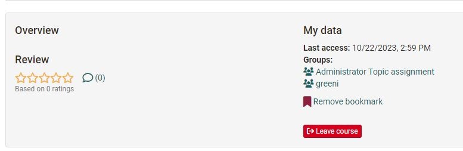
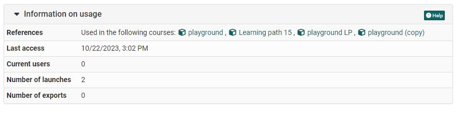

# Automatic information on the learning resource {: #technical_information}

On the info page you find, in addition to the information about the learning
resource that you have entered yourself, automatically generated information.

Depending on the learning resource, this information can vary. Learning
resources that are already embedded in a course also show information on
usage, which contains the list of linked courses. None of these entries can be
changed.

## My data on the course

Display of your personal status regarding the learning resource or the course. If participants are allowed to leave the course, the action "Leave course" is also available here. [:octicons-tag-16:{ title="from Release 20.3 (OO-9272)" }](https://track.frentix.com/issue/OO-9272)

{ class="shadow lightbox" }

## Technical information

!!! info "Important"

    This information is only visible to the owners of the learning resource and to administrative roles. Participants and coaches do not see it.

{ class="shadow lightbox" }

**ID**: Automatically generated identification number of the learning resource.
You can use this ID to search for the learning resource via the search mask.

**Reference**: The external reference that you assign yourself under `Course > Administration > Settings > Tab "Info"`.

The creation date and the last modification of the learning resource are also documented.

**Technical Type**: For courses, the course type, for example learning path or conventional course.

**Creator**: Automatically inserted name of the person who created the learning resource. This entry cannot be changed.
In Authoring, you can also search for this person via the search mask.

**Owners**: All persons who are entered as owners of the learning resource are displayed.

**Administrative access**: Display of the configuration selected in the tab "Share". You find further information under [Access configuration](../learningresources/Access_configuration.md).

## Information on usage

!!! info "Important"

    This information is not displayed for courses and only applies to other learning resources.

{ class="shadow lightbox" }

**References**: Here you see which courses use this learning resource.
As long as the learning resource is used in a course, it cannot be
deleted.

The **last access** indicates when the learning resource was last
launched.

**Current users**: Indicates how many users have currently launched this learning resource in OpenOlat.

**Number of launches**: Automatically counts how many times the learning
resource has been launched in total. If the learning resource cannot be
launched in OpenOlat, the entry "Launch not supported" appears.

**Number of exports**: Automatically counts how many times the learning
resource has been downloaded in total.

## Further information {: #further_information}

[Access configuration >](../learningresources/Access_configuration.md)

[To the top of the page ^](#technical_information)
