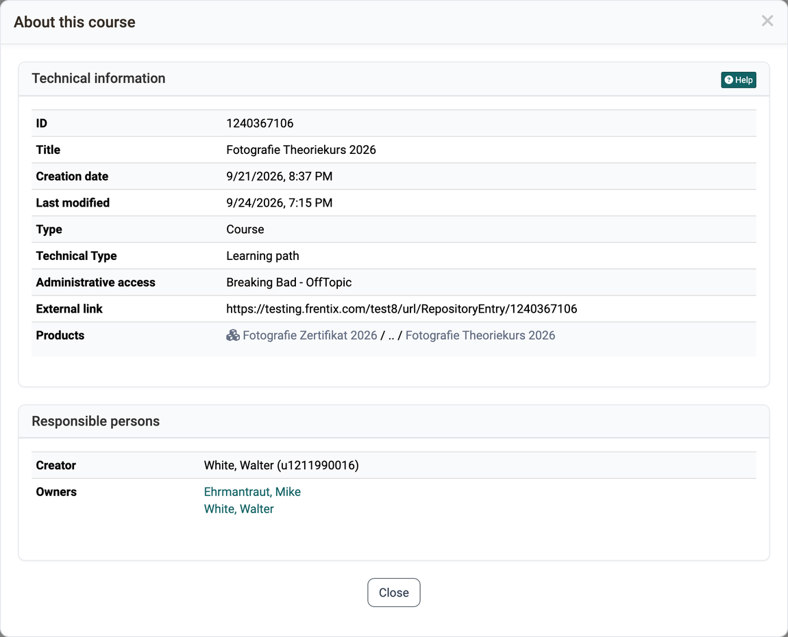
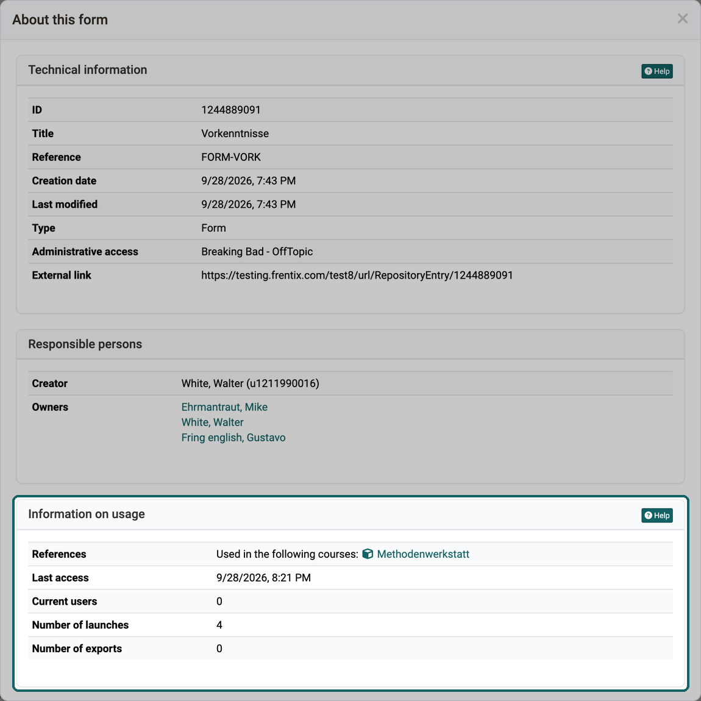

# About this course: Technical information and usage {: #technical_information}

Anyone managing a course or another learning resource looks up here which ID it has, who owns it and in which courses it is embedded. OpenOlat generates these details itself, you cannot change them. They are shown in the window "About this course", not on the info page.

{ class="shadow lightbox" title="Window About this course · 2026.10.05" }

## Open the window [:octicons-tag-16:{ title="from Release 21.1 (OO-9760)" }](https://track.frentix.com/issue/OO-9760){:target="_blank"} {: #open}

Anyone looking for the ID or the owners of a course opens the window in one of two ways:

- `Course > Administration > About this course`
- `Course > Administration > Settings > Tab "Metadata"`, button next to the field "Type"

For other learning resources, the menu item is named after their type, for example "About this test" or "About this wiki". If a type has no name of its own, the item is called "About this learning resource".

The menu item is visible to the owners of the learning resource, learning resource managers and administrators. Participants and coaches do not see it.

If you click on the name of an owner, a course or a product in the window, the window closes and OpenOlat opens the target.

## Technical information {: #technical}

With these details you find the learning resource again and classify it, for example via the ID in the search or via the product in the Course Planner.

**ID**: Automatically assigned number of the learning resource. You can use this ID to find the learning resource via the search.

**OpenOlat resource ID** and **OpenOlat soft ID**: Further internal identifiers of the learning resource. Only learning resource managers and administrators see these rows.

**External ID**: Identifier of the learning resource in an external system. The row only appears if a value is set.

**Title**: Title of the learning resource.

**Reference**: The identifier that you assign yourself under `Course > Administration > Settings > Tab "Metadata"`. The row only appears if a reference is set.

**Creation date** and **Last modified**: Date and time when the learning resource was created and last modified.

**Type**: Kind of learning resource, for example course, test or form.

**Technical Type**: For courses, the course type, for example learning path or conventional course.

**Administrative access**: The organisations for which the learning resource is released. You find further information under [Access configuration](../learningresources/Access_configuration.md).

**External link**: The link for direct access to the learning resource. If guest access is allowed, the **External link - Guest** is shown below it.

**Products**: The products and implementations in the Course Planner in which the course is embedded. A click opens the product or the implementation in the Course Planner. The links and the search icon next to them are only active for administrators and course planners.

## Responsible persons {: #responsible_persons}

The section shows who created the learning resource and who is responsible for it today.

**Creator**: The person who created the learning resource, with user name. In Authoring, you can search for this person via the search.

**Owners**: All persons who are entered as owners of the learning resource. A click on a name opens the visiting card of the person.

## Information on usage {: #usage}

If the learning resource is embedded in at least one course, the window additionally shows the section "Information on usage". This applies, for example, to a test, a form or a wiki. For courses, the section therefore does not usually appear.

{ class="shadow lightbox" title="Window About this form · 2026.10.05" }

**References**: The courses that use this learning resource. A click on a course opens it. As long as the learning resource is used in a course, it cannot be deleted.

**Last access**: When the learning resource was last started.

**Current users**: How many users have currently opened the learning resource in OpenOlat.

**Number of launches**: How often the learning resource has been started in total.

**Number of exports**: How often the learning resource has been downloaded in total.

## Externally managed modules [:octicons-tag-16:{ title="from Release 9.0 (OO-623)" }](https://track.frentix.com/issue/OO-623){:target="_blank"} {: #managed}

If the learning resource is managed by an external system, the window additionally shows the section "Externally managed modules". It lists the settings and modules that you cannot change in OpenOlat.

---

## Further information {: #further_information}

[Access configuration >](../learningresources/Access_configuration.md) 
[Toolbar: Info page >](../learningresources/Info_page.md) 
[Course Administration: Overview >](../learningresources/Administration.md)

[To the top of the page ^](#technical_information)
