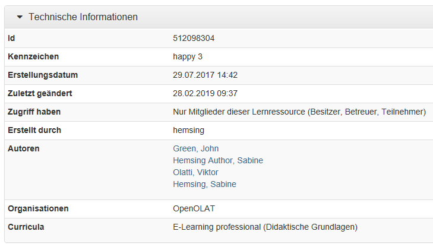

#  Technical Information on Resources and Usage

On the info page you will find information about the learning resource that you have entered yourself as well as automatically generated information.

Depending on the learning resource, this information may vary. Learning resources that have been linked into a course also show usage information, which contains the list of linked courses. These entries cannot be altered.

Here an overview of the information:

## Technical Information

 **ID**: Automatically generated identification number of learning
resource. You can search for the learning resource using the this ID.

Below you will find **date and time** when the learning resource was created, as well as the dates of the **last modification**. The
**access permissions** can be set in the resource settings via the access configuration.

 **Created by / Author**: Automatically inserted name of the user who created
this learning resource (cannot be altered). The creator can be looked up in
the search field in the authoring area as well as other owners of this
learning resource.

##  Information on usage

 **License information**: Display of the license assigned to the learning
resource and - if specified - licensor and license text.

 **References**: Here you can see which courses use this learning resource. As
long as this learning resource is used within a course it cannot be deleted.

 **Last access** shows the the time and date the resource was started last.

 **Current users**: Indicates how many users have started this learning
resource in OpenOlat at that moment.

 **Number of launches**: Automatically counts how often that learning resource
has been launched in total. If this resource cannot be launched in OpenOlat
the entry _Launch not supported_ will appear.

 **Number of exports**: Automatically counts how often this learning resource
has been downloaded in total.

