# Tests exportieren {: #test_export}

Beim Exportieren von Tests ist zu unterscheiden zwischen

- Test-**Kurs** (Prüfungskurs) exportieren
- Test-**Lernressource** exportieren
- einzelne **Fragen** exportieren
- Test-**Ergebnisse** exportieren

## Kurs exportieren {: #export_course}

Ein gesamter Kurs, z.B. ein Prüfungskurs, kann als zip-Datei exportiert werden unter **Administration > Inhalt exportieren**

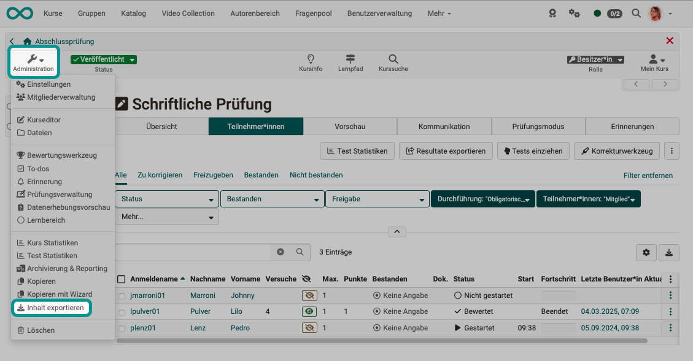{ class="shadow lightbox"}

[Zum Seitenanfang ^](#test_export)

---

## Test-Lernressource exportieren {: #export_learning_resource}

Test-Lernressoucen enthalten ganze Fragenbündel und können als Fragenpäckchen inklusive Konfiguration (Gesamtpunktzahl usw.) in Test-Kursbausteine eingebunden werden.
Auch eine Test-Lernressource kann exportiert werden unter **Administration > Inhalt exportieren**

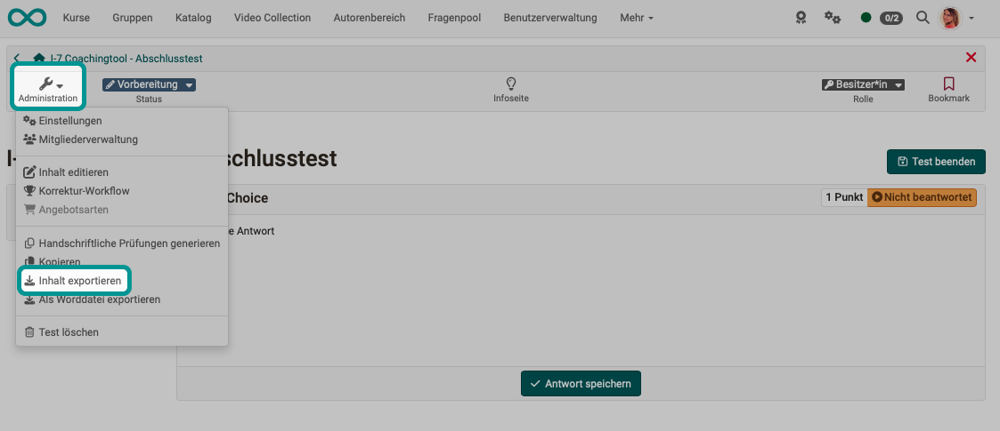{ class="shadow lightbox"}

!!! tip "Tipp"

    Achten Sie darauf, ob Sie sich in der Administration eines (Test-)Kurses oder einer (Test-)Lernressource befinden. Sie erkennen es sehr einfach daran, ob unter Administration die Option zum Bearbeiten lautet  
            **Kurseditor** 
            oder 
            **Inhalt editieren** 

[Zum Seitenanfang ^](#test_export)

---

### Als Worddatei exportieren {: #word}

Test-Lernressourcen können als Word-Dokument exportiert werden. Oft werden solche Dateien für Review-Zwecke vor Durchführung eines Tests erstellt, damit man darin auf einfache Art Ergänzungen und Korrekturen notieren kann.

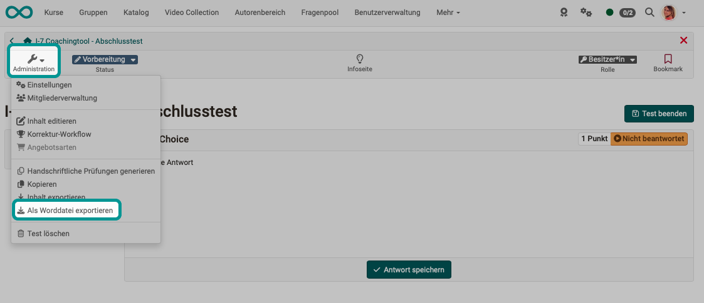{ class="shadow lightbox"}

[Zum Seitenanfang ^](#test_export)

---

### Handschriftliche Prüfungen generieren

Die Word-Dokumente, die mit dieser Option unter der Administration einer Test-Lernressource erstellt werden, unterscheiden sich von einem einfachen Word-Export.

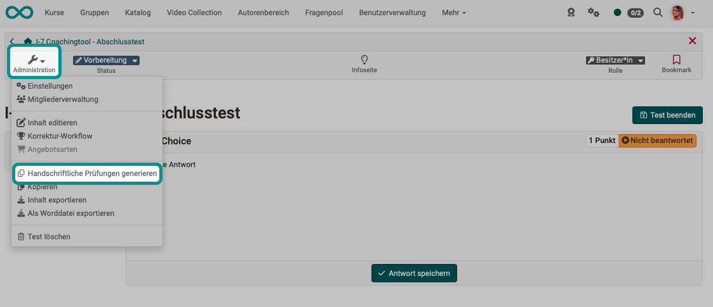{ class="shadow lightbox"}

Jedes Dokument erhält ein Deckblatt, sowie eine Seriennummer, so dass nach dem handschriftlichen Ausfüllen des Tests durch die Teilnehmenden eine klare Zuordnung möglich ist.

Sie müssen deshalb zwingend eine Anzahl für die zu erzeugenden Word-Dateien angeben.

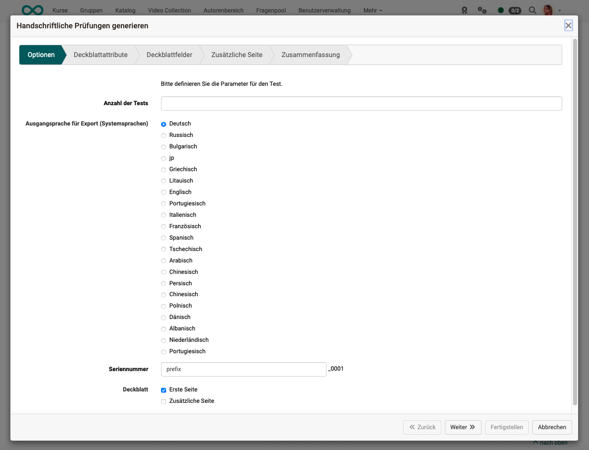{ class="shadow lightbox"}

Für das Deckblatt können verschiedene Attribute ausgewählt werden.

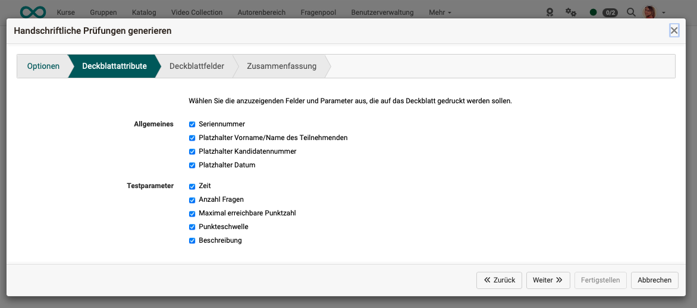{ class="shadow lightbox"}

Auch ein Beschreibungstext kann angegeben werden.

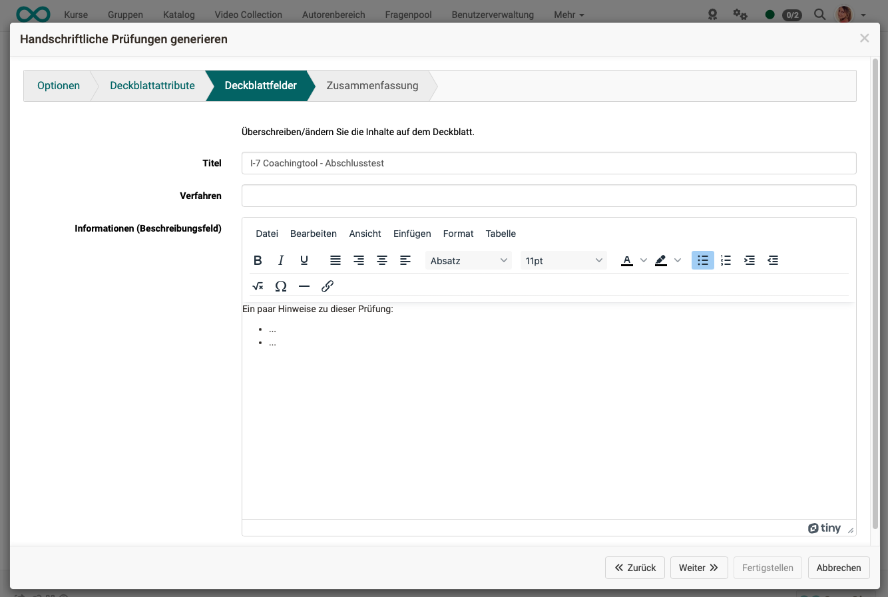{ class="shadow lightbox"}

**Deckblatt Beispiel:**

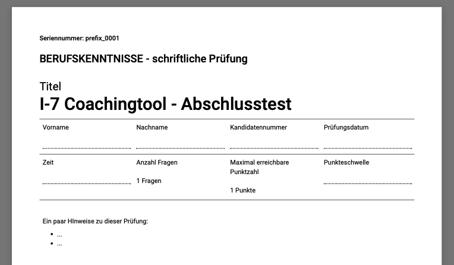{ class="shadow lightbox"}

[Zum Seitenanfang ^](#test_export)

---

## Einzelne Fragen exportieren

In OpenOlat erstellte Fragen entsprechen dem QTI-Standard. Sie können dadurch auch in andere LMS übertragen werden, die Fragen im QTI-Standard verwenden. Umgekehrt kann OpenOlat auch Fragen im QTI-Format importieren. 

### Zum Pool exportieren

Befinden Sie sich im Editor einer Test-Lernressource, wählen Sie die gewünschte Frage aus und klicken auf das Icon mit den 3 Punkten rechts oben um die Frage in den Pool zu exportieren.

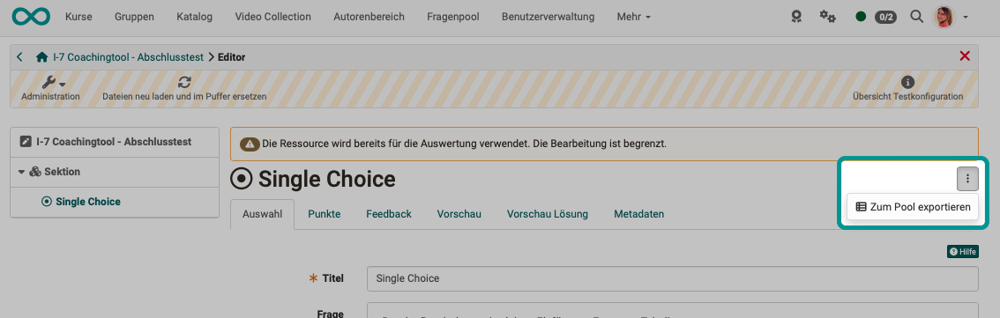{ class="shadow lightbox"}

!!! tip "Hinweis"

    Auf diese Art können Sie auch eine ganze Sektion mit mehreren Fragen in den Fragenpool exportieren. Wählen Sie einfach links die Sektion aus und klicken Sie dann auf die 3 Punkte.

[Zum Seitenanfang ^](#test_export)

---

### Einzelne Frage aus dem Pool exportieren

Haben Sie eine einzelne Frage im Frageneditor geöffnet, finden Sie unter dem Icon "Freigabe" eine Möglichkeit zum Export dieser Einzelfrage in eine zip-Datei. Da die Fragen in OpenOlat dem QTI-Standard entsprechen, kann die zip-Datei in einem anderen OpenOlat oder einem anderen LMS, das ebenfalls den QTI-Standard benutzt, wieder importiert werden.  

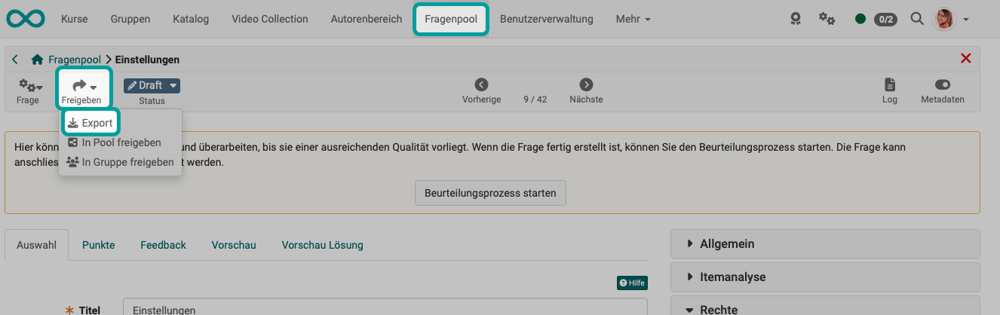{ class="shadow lightbox"}

[Zum Seitenanfang ^](#test_export)

---

### Mehrere ausgewählte Einzelfragen aus dem Pool exportieren

Haben Sie mehrere Fragen im Fragenpool ausgewählt, können diese Fragen gemeinsam sowohl in einer Word-Datei als auch in einer zip-Datei für den Transfer in ein anderes LMS exportiert werden.

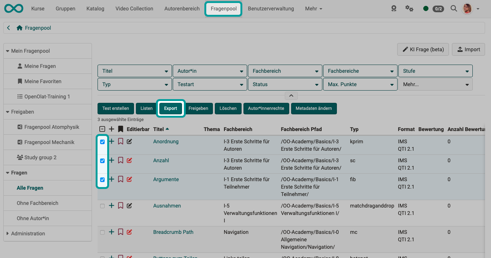{ class="shadow lightbox"}

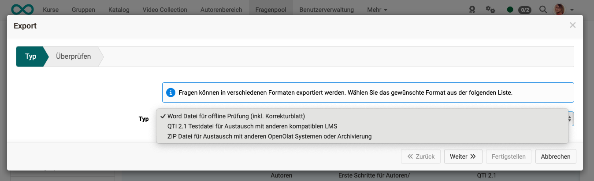{ class="shadow lightbox"}

[Zum Seitenanfang ^](#test_export)

---

## Testergebnisse exportieren {: #export_results}

### Teststatistiken

Eine Möglichkeit zur Auswertung der Testergebnisse, ist die in Statistiken aufbereitete Form. Verwenden Sie dazu den **Button "Test Statistiken"** innerhalb des Tab "Teilnehmer:innen". Der Button steht Betreuer:innen und Besitzer:innen zur Verfügung, wenn sie einen Kursbaustein "Test" im Run-Mode anwählen.

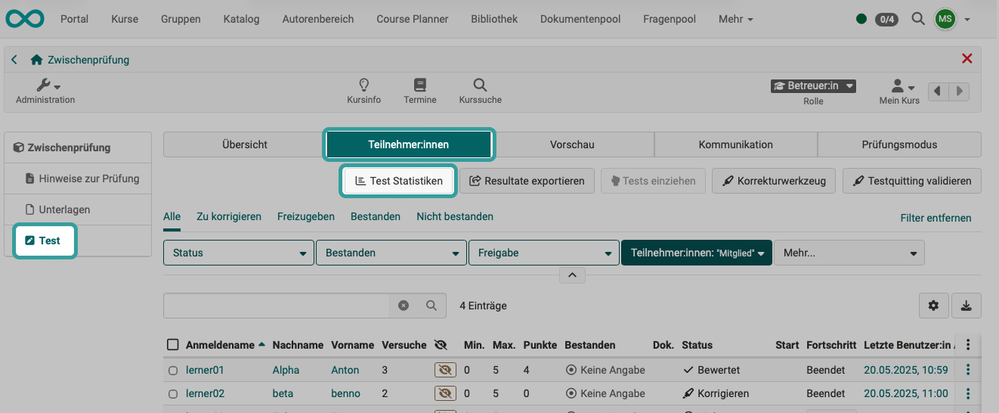{ class="shadow lightbox"}

* Sie können die verschiedenen Statistiken zu den Testergebnissen ausdrucken (evtl. auch in eine pdf-Datei "drucken") oder die Rohdaten als Excel-Datei herunterladen.
* Wenn Sie die Sektionen eines Tests aufklappen, können Sie detaillierte Statistiken zu jeder einzelnen Frage abrufen. 

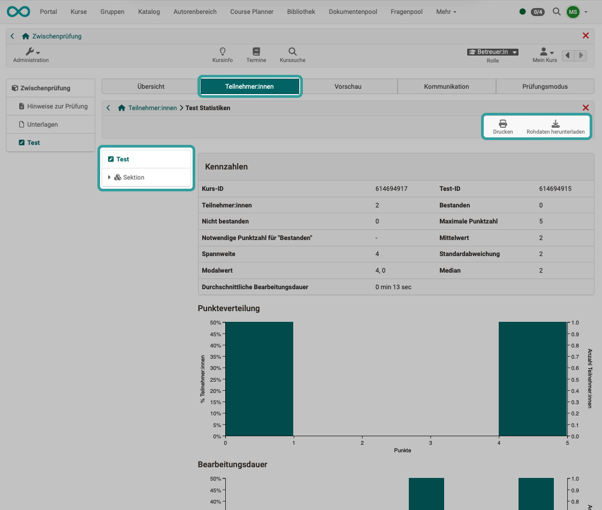{ class="shadow lightbox"}

### Testresultate der Teilnehmenden

Mit dem **Button "Resultate exportieren"** wird eine zip-Datei erstellt, die sämtliche Testresultate aller Teilnehmenden im ausgewählten Kursbaustein enthält.

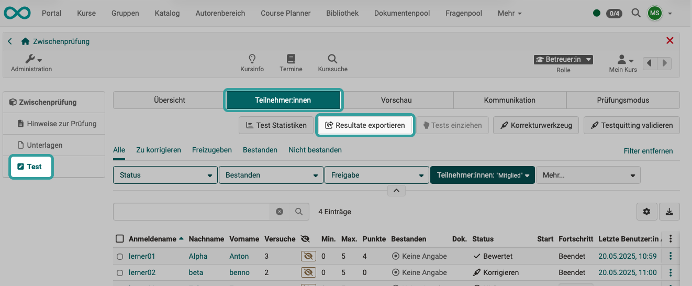{ class="shadow lightbox"}

Haben Sie sich für das Erstellen der zip-Datei entschieden, können Sie einen Namen für die zip-Datei angeben und eine der angebotenen Varianten für ihren Inhalt wählen.
Es können 2 Varianten der zip-Datei erstellt werden:

* Der **Standardexport** enthält detaillierte Testresultate für jede:n Teilnehmer:in in Form eines HTML-Dokuments und einer Excel-Datei mit den Rohdaten.
* Die Option **"Erweitert - mit pdf"** erzeugt die gleiche zip-Datei, es werden jedoch zusätzlich noch pdf-Dateien mit den Ergebnissen ergänzt. 

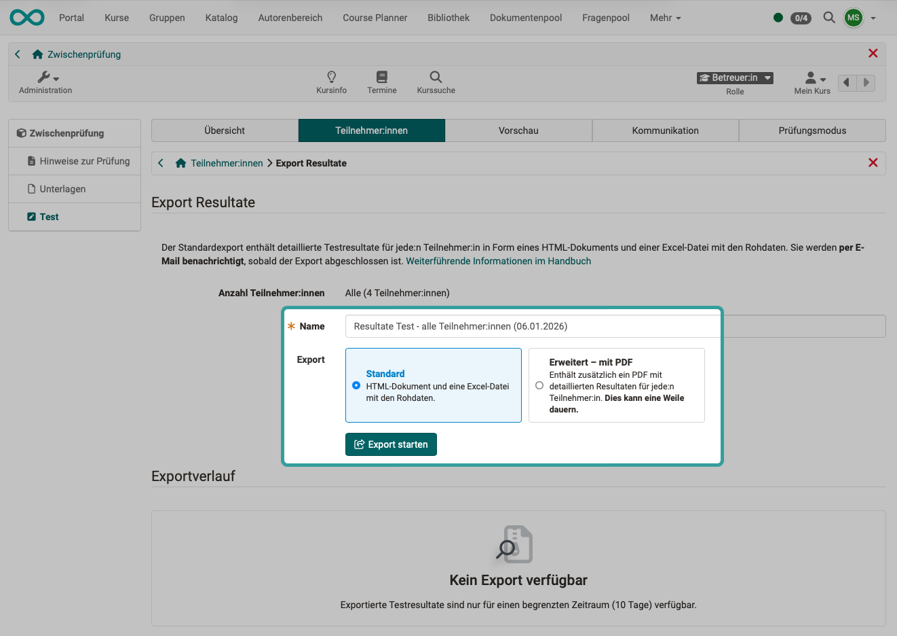{ class="shadow lightbox"}

Klicken Sie auf den **Button "Export starten"** um die zip-Datei mit den Testresultaten zu erzeugen. 

Erstellte zip-Dateien werden im unteren Bereich unter **"Exportverlauf"** aufgelistet.

Öffnen bzw. entpacken Sie dann die erstellte zip-Datei um auf die benötigten Dateien zuzugreifen.

!!! hint "Hinweis"

    Auch in der Kursadministration gibt es eine Option zum Exportieren bzw. Archivieren von Testergebnissen. Mehr dazu unter [Testergebnisse archivieren](../learningresources/Course_Element_Test.de.md#archive).

[Zum Seitenanfang ^](#test_export)

---

## Weitere Informationen

[Wie gehe ich vor, wenn ich einen Test erstelle? >](../../manual_how-to/test_creation_procedure/test_creation_procedure.de.md) 
[Allgemeines zu Tests >](../learningresources/General_Information_on_Tests.de.md) 
[Der Testeditor >](Test_editor_QTI_2.1.de.md) 
[Fragetypen >](../learningresources/Test_question_types.de.md) 
[Test-Fragen konfigurieren >](Configure_test_questions.de.md) 
[Test-Lernressourcen konfigurieren](Configure_tests.de.md) 
[Test-Lernressourcen Einstellungen >](Test_settings.de.md) 
[Testergebnisse archivieren >](../learningresources/Course_Element_Test.de.md#archive)

[Zum Seitenanfang ^](#test_export)

