# Tests exportieren {: #test_export}

Beim Exportieren von Tests ist zu unterscheiden zwischen

- Test-**Kurs** (Prüfungskurs) exportieren
- Test-**Lernressource** exportieren
- einzelne **Fragen** exportieren
- Test-**Ergebnisse** exportieren

## Kurs exportieren {: #export_course}

Ein gesamter Kurs, z.B. ein Prüfungskurs, kann als zip-Datei exportiert werden in der Kurs-Administration unter: `Kurs > Administration > Inhalt exportieren`

Besitzer:innen des Kurses finden den Menüpunkt immer. Andere Autor:innen sehen ihn nur, wenn die Besitzer:innen das Exportieren im Tab "Freigabe" erlaubt haben, siehe [Zugangskonfiguration / Freigabe](Access_configuration.de.md).

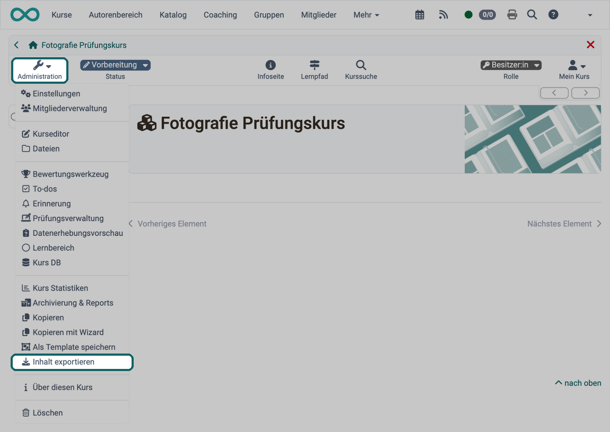{ class="shadow lightbox" title="Menü Administration eines Kurses · 2026.10.01" }

[Zum Seitenanfang ^](#test_export)

---

## Test-Lernressource exportieren {: #export_learning_resource}

Test-Lernressourcen enthalten ganze Fragenbündel und können als Fragenpäckchen inklusive Konfiguration (Gesamtpunktzahl usw.) in Test-Kursbausteine eingebunden werden.

Auch eine Test-Lernressource kann exportiert werden in der Administration der Lernressource unter: `Test > Administration > Inhalt exportieren`

Auch hier finden Besitzer:innen den Menüpunkt immer, andere Autor:innen nur, wenn das Exportieren im Tab "Freigabe" erlaubt ist.

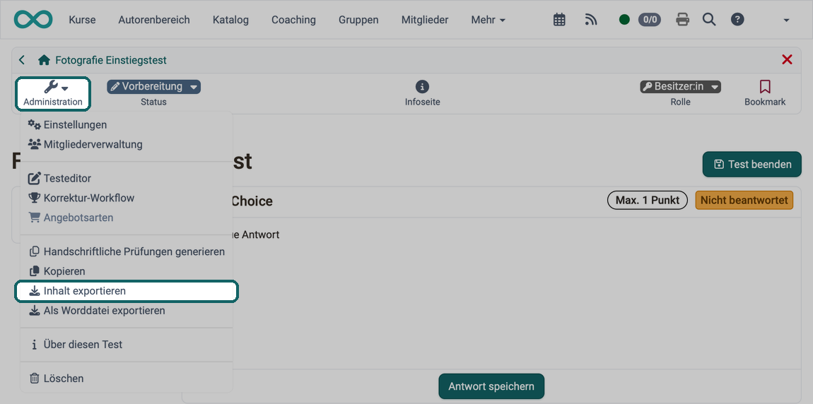{ class="shadow lightbox" title="Menü Administration einer Test-Lernressource · 2026.10.01" }

!!! tip "Tipp"

    Achten Sie darauf, ob Sie sich in der Administration eines Kurses oder einer Test-Lernressource befinden. Im Kurs heisst der Eintrag zum Editor **Kurseditor**, in der Test-Lernressource **Testeditor**.

[Zum Seitenanfang ^](#test_export)

---

### Als Worddatei exportieren {: #word}

Test-Lernressourcen können als Word-Dokument exportiert werden. Oft werden solche Dateien für Review-Zwecke vor Durchführung eines Tests erstellt, damit man darin auf einfache Art Ergänzungen und Korrekturen notieren kann. Der Menüpunkt steht Besitzer:innen der Test-Lernressource zur Verfügung. OpenOlat lädt eine zip-Datei mit zwei Word-Dokumenten herunter: den Test und eine zweite Fassung mit den Lösungen.

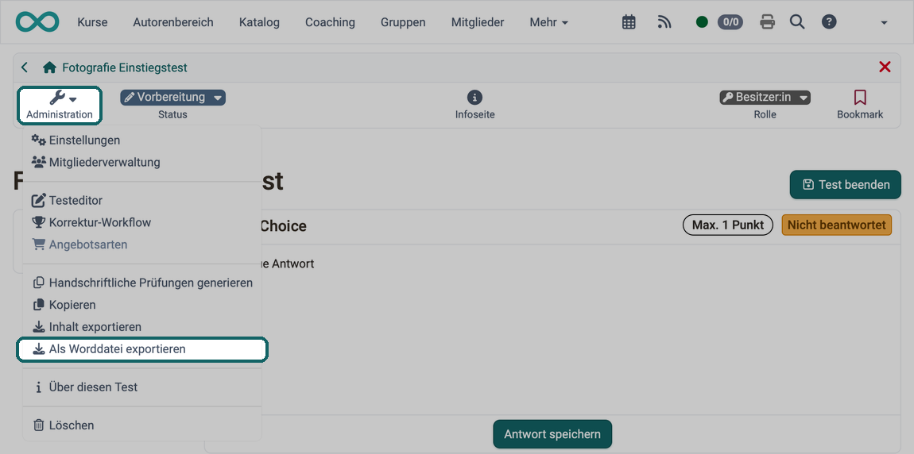{ class="shadow lightbox" title="Menü Administration einer Test-Lernressource · 2026.10.01" }

[Zum Seitenanfang ^](#test_export)

---

### Handschriftliche Prüfungen generieren [:octicons-tag-16:{ title="ab Release 16.1 (OO-5648)" }](https://track.frentix.com/issue/OO-5648)

Wer einen Test auf Papier durchführt, erhält über `Test > Administration > Handschriftliche Prüfungen generieren` druckfertige Prüfungsbogen: eine zip-Datei mit einer PDF-Datei je Prüfung und dem passenden Lösungsblatt. Der Menüpunkt steht Besitzer:innen der Test-Lernressource zur Verfügung, wenn in der System-Administration der [PDF-Dienst](../../manual_admin/administration/External_Tools_-_Administration.de.md#pdf_generator) eingeschaltet ist.

{ class="shadow lightbox" title="Menü Administration einer Test-Lernressource · 2026.10.01" }

Jede Prüfung erhält eine eigene Seriennummer und auf Wunsch ein Deckblatt. So lässt sich jeder handschriftlich ausgefüllte Bogen nach der Prüfung eindeutig zuordnen.

Im Schritt "Optionen" sind "Anzahl der Tests" und "Seriennummer" Pflichtangaben. OpenOlat erzeugt so viele Prüfungen, wie Sie angeben, und hängt an die Seriennummer eine fortlaufende Nummer an, aus "prefix" wird "prefix_0001". Die Sprache der Prüfungsbogen wählen Sie unter "Ausgangsprache für Export (Systemsprachen)". Unter "Deckblatt" bestimmen Sie, ob jede Prüfung mit "Erste Seite" ein Deckblatt und mit "Zusätzliche Seite" eine weitere Seite erhält.

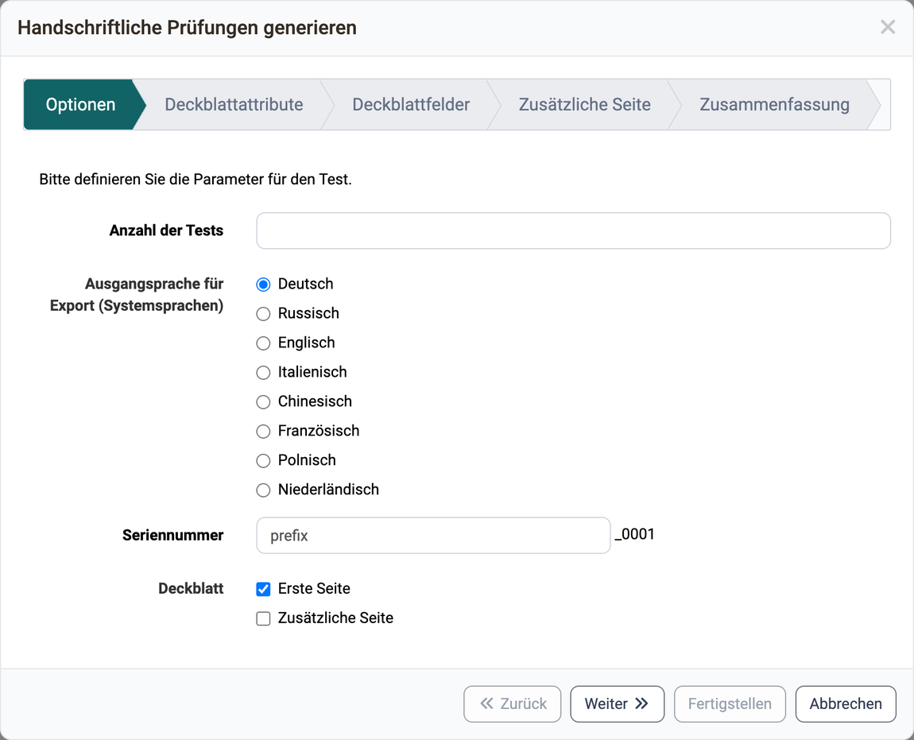{ class="shadow lightbox" title="Schritt Optionen im Dialog Handschriftliche Prüfungen generieren · 2026.10.01" }

Im Schritt "Deckblattattribute" wählen Sie aus, welche Angaben und Platzhalter das Deckblatt trägt.

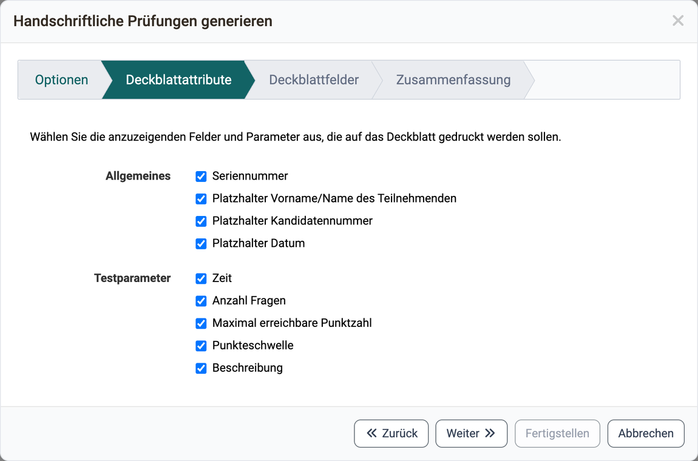{ class="shadow lightbox" title="Schritt Deckblattattribute im Dialog Handschriftliche Prüfungen generieren · 2026.10.01" }

Im Schritt "Deckblattfelder" passen Sie "Titel" und "Verfahren" an und schreiben unter "Informationen (Beschreibungsfeld)" einen Hinweistext für die Teilnehmenden.

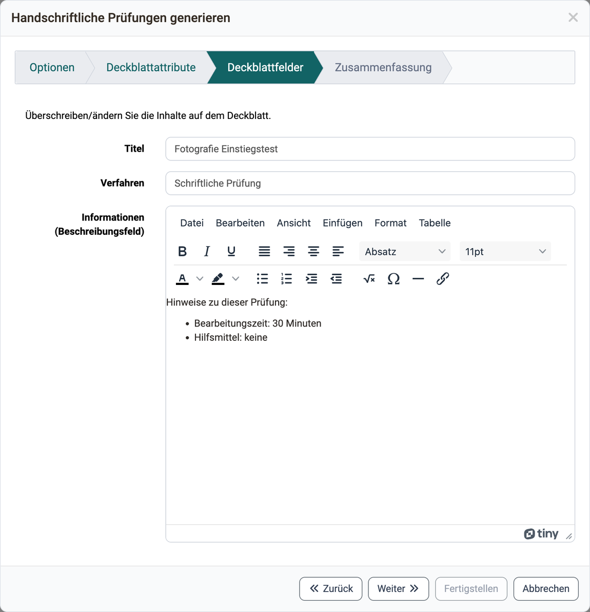{ class="shadow lightbox" title="Schritt Deckblattfelder im Dialog Handschriftliche Prüfungen generieren · 2026.10.01" }

Die Schritte "Deckblattattribute" und "Deckblattfelder" erscheinen nur mit "Erste Seite", der Schritt "Zusätzliche Seite" nur mit "Zusätzliche Seite".

Im Schritt "Zusammenfassung" stehen die Anzahl der Tests und Lösungsblätter und das Dateiformat. Mit "Vorschau" und "Vorschau mit Lösungen" öffnen Sie eine Probe als PDF-Datei. Nach "Fertigstellen" beginnt der Download der zip-Datei, er kann je nach Anzahl einige Minuten bis Stunden dauern. Die zip-Datei enthält im Ordner "tests" je Prüfung eine PDF-Datei mit der Seriennummer als Namen und im Ordner "solutions" das passende Lösungsblatt.

**Deckblatt Beispiel:**

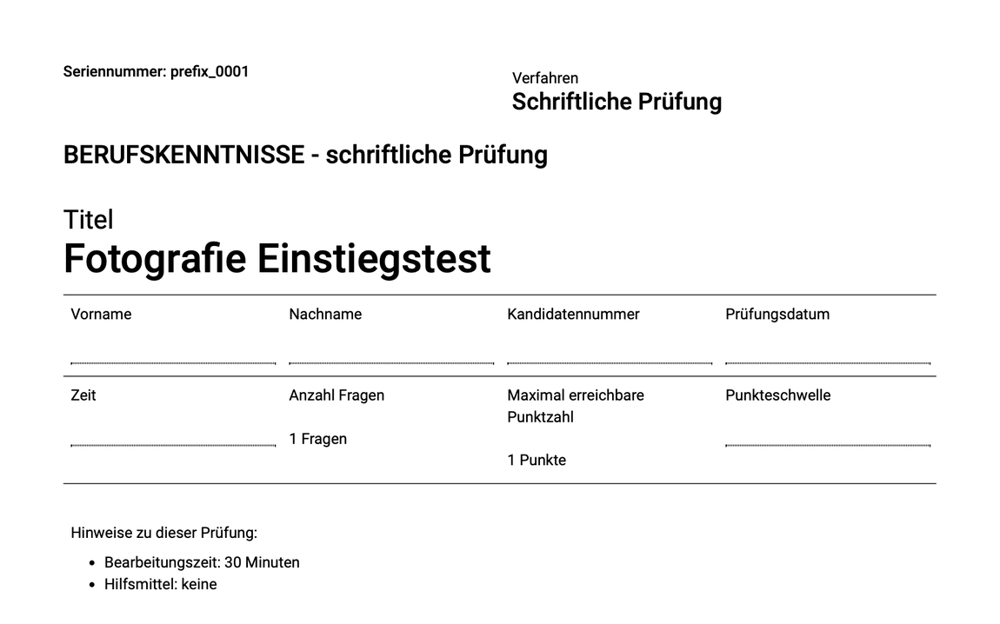{ class="shadow lightbox" title="Erzeugtes Deckblatt einer handschriftlichen Prüfung · 2026.10.01" }

[Zum Seitenanfang ^](#test_export)

---

## Einzelne Fragen exportieren

In OpenOlat erstellte Fragen entsprechen dem QTI-Standard. Sie können dadurch auch in andere LMS übertragen werden, die Fragen im QTI-Standard verwenden. Umgekehrt kann OpenOlat auch Fragen im QTI-Format importieren. 

### Zum Pool exportieren

Befinden Sie sich im Testeditor einer Test-Lernressource, wählen Sie die gewünschte Frage aus und klicken auf das Icon mit den 3 Punkten rechts oben. Mit "Zum Pool exportieren" übernehmen Sie die Frage in den Fragenpool.

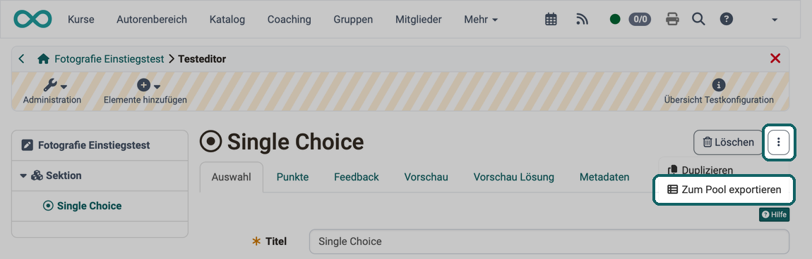{ class="shadow lightbox" title="Frage im Testeditor · 2026.10.01" }

!!! tip "Tipp"

    Auf diese Art können Sie auch eine ganze Sektion mit mehreren Fragen in den Fragenpool exportieren. Wählen Sie einfach links die Sektion aus und klicken Sie dann auf die 3 Punkte.

[Zum Seitenanfang ^](#test_export)

---

### Einzelne Frage aus dem Pool exportieren

Haben Sie eine einzelne Frage im Fragenpool geöffnet, finden Sie unter dem Icon "Freigeben" den Eintrag "Export". Damit exportieren Sie diese Einzelfrage in eine zip-Datei. Da die Fragen in OpenOlat dem QTI-Standard entsprechen, kann die zip-Datei in einem anderen OpenOlat oder einem anderen LMS, das ebenfalls den QTI-Standard benutzt, wieder importiert werden.

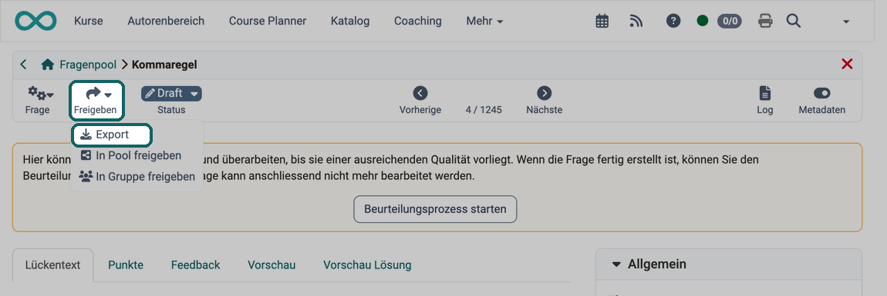{ class="shadow lightbox" title="Frage im Fragenpool · 2026.10.01" }

[Zum Seitenanfang ^](#test_export)

---

### Mehrere ausgewählte Einzelfragen aus dem Pool exportieren

Haben Sie mehrere Fragen im Fragenpool ausgewählt, können diese Fragen gemeinsam in einer Word-Datei für die offline Prüfung, in einer QTI-2.1-Testdatei für den Austausch mit anderen kompatiblen LMS oder in einer zip-Datei für den Austausch mit anderen OpenOlat-Systemen oder zur Archivierung exportiert werden.

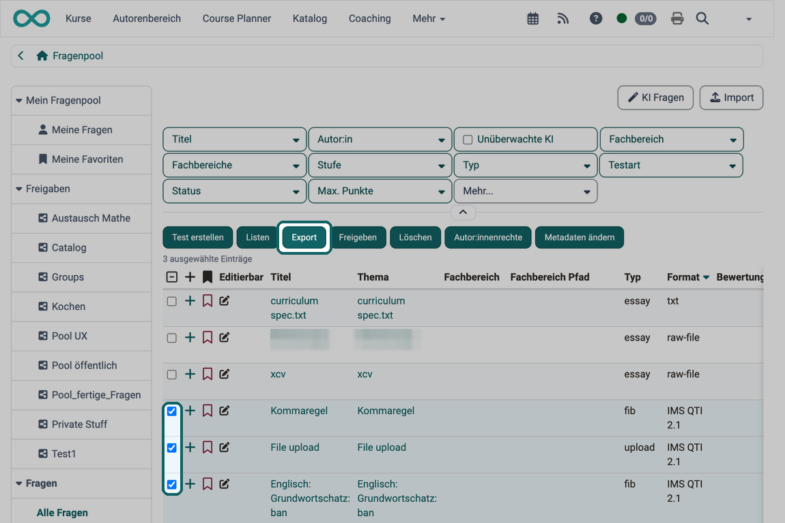{ class="shadow lightbox" title="Liste Alle Fragen im Fragenpool · 2026.10.01" }

Im Dialog "Export" wählen Sie im Schritt "Typ" das Format. Word und QTI 2.1 stehen nur zur Wahl, wenn mindestens eine der ausgewählten Fragen im Format QTI 2.1 vorliegt; sonst bietet die Liste nur die ZIP-Datei an. Welche Fragen sich im gewählten Format exportieren lassen, zeigt der Schritt "Überprüfen" in der Spalte "Export möglich".

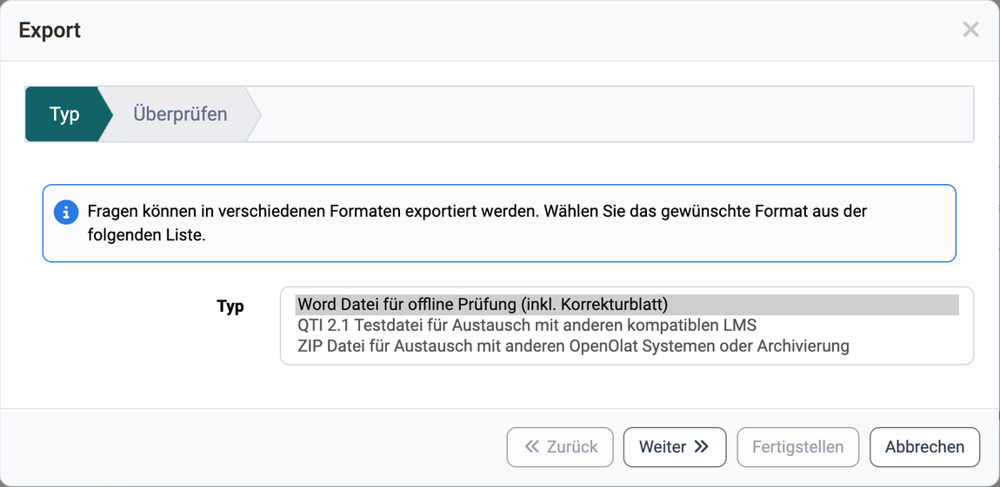{ class="shadow lightbox" title="Schritt Typ im Dialog Export · 2026.10.01" }

[Zum Seitenanfang ^](#test_export)

---

## Testergebnisse exportieren {: #export_results}

### Teststatistiken

Wer wissen will, wie ein Test ausgefallen ist, sieht in den Teststatistiken die Kennzahlen des ganzen Tests und jeder einzelnen Frage. Verwenden Sie dazu den **Button "Teststatistiken"** im Tab "Teilnehmer:innen" des Kursbausteins "Test". Der Button steht Betreuer:innen und Besitzer:innen zur Verfügung. Die Auswertung aller Tests des Kurses finden Sie unter `Kurs > Administration > Teststatistiken`, siehe [Teststatistiken](Statistics_Test.de.md).

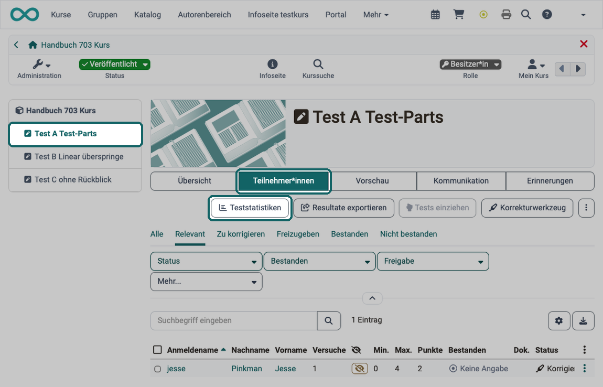{ class="shadow lightbox" title="Tab Teilnehmer:innen des Kursbausteins Test · 2026.10.07" }

* Sie können die verschiedenen Statistiken zu den Testergebnissen ausdrucken (evtl. auch in eine PDF-Datei "drucken") oder die Rohdaten als Excel-Datei herunterladen.
* Wenn Sie die Sektionen eines Tests aufklappen, können Sie detaillierte Statistiken zu jeder einzelnen Frage abrufen. 

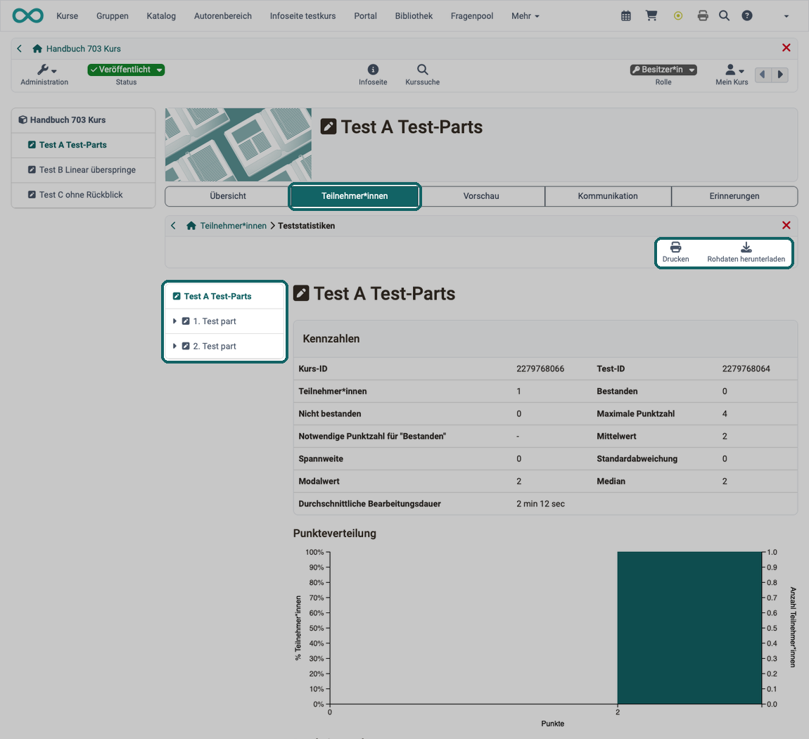{ class="shadow lightbox" title="Teststatistiken im Kursbaustein Test · 2026.10.07" }

### Testresultate der Teilnehmenden [:octicons-tag-16:{ title="ab Release 16.2 (OO-5974)" }](https://track.frentix.com/issue/OO-5974)

Wer die Resultate eines Tests auswerten, ausdrucken oder archivieren will, erhält mit dem **Button "Resultate exportieren"** eine zip-Datei mit sämtlichen Testresultaten aller Teilnehmenden im ausgewählten Kursbaustein. Der Button steht Betreuer:innen und Besitzer:innen im Tab "Teilnehmer:innen" des Kursbausteins "Test" zur Verfügung.

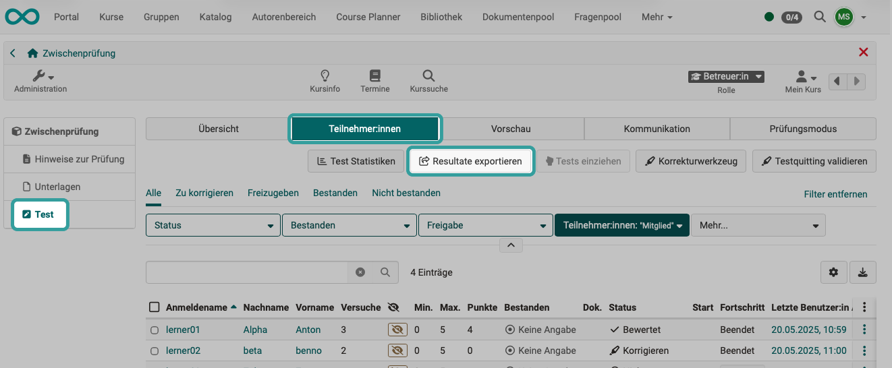{ class="shadow lightbox" title="Tab Teilnehmer:innen des Kursbausteins Test" }

Haben Sie sich für das Erstellen der zip-Datei entschieden, können Sie einen Namen für die zip-Datei angeben und eine der angebotenen Varianten für ihren Inhalt wählen.

Es können 2 Varianten der zip-Datei erstellt werden:

* Der **Standardexport** enthält detaillierte Testresultate für jede:n Teilnehmer:in in Form eines HTML-Dokuments und einer Excel-Datei mit den Rohdaten.
* Die Option **"Erweitert – mit PDF"** erzeugt die gleiche zip-Datei, es werden jedoch zusätzlich noch PDF-Dateien mit den detaillierten Ergebnissen für jede:n Teilnehmer:in ergänzt. 

OpenOlat schlägt einen Namen mit Variante und Datum vor, zum Beispiel "Resultate Test mit PDF - alle Teilnehmer:innen (01.10.2026)".

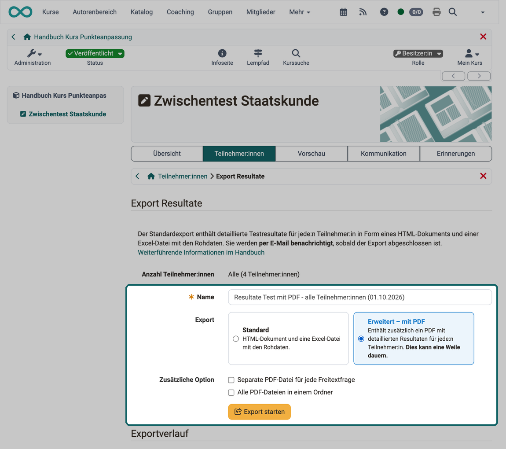{ class="shadow lightbox" title="Seite Export Resultate im Kursbaustein Test · 2026.10.01" }

Wurde die Option **"Erweitert – mit PDF"** gewählt, erscheint darunter der Abschnitt **"Zusätzliche Option"**:

* **"Separate PDF-Datei für jede Freitextfrage"** steht nur zur Wahl, wenn der Test Freitextfragen enthält. Ist sie aktiviert, wird die Antwort jeder Freitextfrage zusätzlich als eigene PDF-Datei in die zip-Datei gelegt. [:octicons-tag-16:{ title="ab Release 19.1.27 (OO-8964)" }](https://track.frentix.com/issue/OO-8964)
* **"Alle PDF-Dateien in einem Ordner"** steht bei jedem Test zur Wahl. Ist sie aktiviert, liegen die PDF-Dateien mit den detaillierten Resultaten aller Teilnehmenden zusammen in einem Ordner der zip-Datei. Wie die Dateien heissen und wo sie liegen, steht unter [PDF-Dateien in der zip-Datei](#pdf_files).

Klicken Sie auf den **Button "Export starten"** um die zip-Datei mit den Testresultaten zu erzeugen. OpenOlat benachrichtigt Sie per E-Mail, sobald der Export abgeschlossen ist.

Erstellte zip-Dateien werden im unteren Bereich unter **"Exportverlauf"** aufgelistet und stehen dort nur für einen begrenzten Zeitraum von 10 Tagen zur Verfügung.

Öffnen bzw. entpacken Sie dann die erstellte zip-Datei, um auf die benötigten Dateien zuzugreifen.

#### PDF-Dateien in der zip-Datei [:octicons-tag-16:{ title="ab Release 21.1 (OO-9600)" }](https://track.frentix.com/issue/OO-9600) {: #pdf_files}

Wer exportierte Resultate druckt, ablegt oder weitergibt, erkennt am Dateinamen, zu welcher Person und zu welchem Test eine PDF-Datei gehört. Der Name setzt sich aus diesen Teilen zusammen, jeweils durch einen Unterstrich getrennt:

1. Nachname der Teilnehmer:in. Ist kein Nachname erfasst, steht dort "anonym".
2. Vorname der Teilnehmer:in.
3. Titel des Kursbausteins, gekürzt auf 25 Zeichen.
4. Titel der Test-Lernressource, gekürzt auf 25 Zeichen.
5. Eine Nummer, die den Testversuch eindeutig kennzeichnet.

Leerzeichen werden zu Unterstrichen, Umlaute werden umschrieben (aus "ü" wird "ue"), andere Sonderzeichen fallen weg. Ein Beispiel: `Langenegger_Simone_Test_Demo_Test_Demo_Master_13730.pdf`.

Wo die PDF-Dateien in der zip-Datei liegen, bestimmt die Option "Alle PDF-Dateien in einem Ordner":

* **Ausgeschaltet:** Jede PDF-Datei liegt im Ordner der Teilnehmer:in, dort im Unterordner des jeweiligen Versuchs. Die Resultate einer Person bleiben so beisammen.
* **Eingeschaltet:** Alle PDF-Dateien mit den detaillierten Resultaten liegen zusammen im Ordner "resultspdfs". So lassen sich die Resultate aller Teilnehmenden ohne Suchen in den Unterordnern drucken oder weitergeben.

In beiden Fällen bleiben die Ordner der Teilnehmenden mit HTML-Dokument und Rohdaten bestehen, und die Verweise in den HTML-Dokumenten der zip-Datei führen zur jeweiligen PDF-Datei. Die PDF-Dateien aus der Option "Separate PDF-Datei für jede Freitextfrage" bleiben immer im Ordner der Teilnehmer:in.

Die Option "Alle PDF-Dateien in einem Ordner" gibt es nur beim Export über den Button "Resultate exportieren". Die Kursarchivierung legt die PDF-Dateien immer im Ordner der Teilnehmer:in ab, mit demselben Aufbau des Dateinamens.

#### Punktespalten in der Excel-Datei [:octicons-tag-16:{ title="ab Release 21.1 (OO-9599)" }](https://track.frentix.com/issue/OO-9599) {: #score_columns}

Wer die Resultate auswertet, sieht in der Excel-Datei mit den Rohdaten, welcher Teil der Punkte aus der Antwort stammt und welcher aus einer nachträglichen Korrektur. Je Testversuch enthält die Datei diese Spalten:

* **Punkte**: das Ergebnis des Testversuchs.
* **Punkte (Auto)**: die Summe der automatisch errechneten Punkte.
* **Punkte (Anpassungen plus)**: die Summe aller Anpassungen, die Punkte dazugeben.
* **Punkte (Anpassungen minus)**: die Summe aller Anpassungen, die Punkte abziehen, als negativer Wert, zum Beispiel "-0.5".
* **Punkte (Manuell)**: die Summe der Punkte, die bei Fragen von Hand vergeben wurden.

Je Frage steht in der Spalte "Pkt" die Punktzahl der Frage. Bei automatisch korrigierten Fragen folgt die Spalte "Anpassung" mit dem Betrag, um den die Punkte angepasst wurden. Wie eine Anpassung entsteht, steht auf der Seite [Tests bewerten](../learningresources/Assessing_tests.de.md#adjust_score). Dieselbe Excel-Datei erhalten Sie in den Teststatistiken über "Rohdaten herunterladen".

!!! note "Hinweis"

    Auch in der Kurs-Administration unter `Kurs > Administration > Archivierung & Reports` gibt es eine Option zum Exportieren bzw. Archivieren von Testergebnissen. Mehr dazu unter [Testergebnisse archivieren](../learningresources/Course_Element_Test.de.md#archive).

[Zum Seitenanfang ^](#test_export)

---

## Weiterführende Informationen {: #further_information}

**Auf dieser Seite erwähnt** 
[Zugangskonfiguration / Freigabe >](Access_configuration.de.md) 
[Externe Werkzeuge: Übersicht >](../../manual_admin/administration/External_Tools_-_Administration.de.md) 
[Teststatistiken >](Statistics_Test.de.md) 
[Tests bewerten >](../learningresources/Assessing_tests.de.md) 
[Kursbaustein "Test" >](../learningresources/Course_Element_Test.de.md)

**Weiterführend** 
[Wie gehe ich vor, wenn ich einen Test erstelle? >](../../manual_how-to/test_creation_procedure/test_creation_procedure.de.md) 
[Tests erstellen >](../learningresources/Test.de.md) 
[Testeditor >](Test_editor_QTI_2.1.de.md) 
[Test Fragetypen >](../learningresources/Test_question_types.de.md) 
[Test Fragen konfigurieren >](Configure_test_questions.de.md) 
[Test konfigurieren >](Configure_tests.de.md) 
[Test Einstellungen - Administration >](Test_settings.de.md)

[Zum Seitenanfang ^](#test_export)
