# Export tests {: #test_export}

When exporting tests, a distinction must be made between

- export test **course** (Exam course)
- export test **learning resource**
- export single **questions**

## Export course {: #export_course}

An entire course, e.g., an exam course, can be exported as a zip file under  **Administration > Export content**.

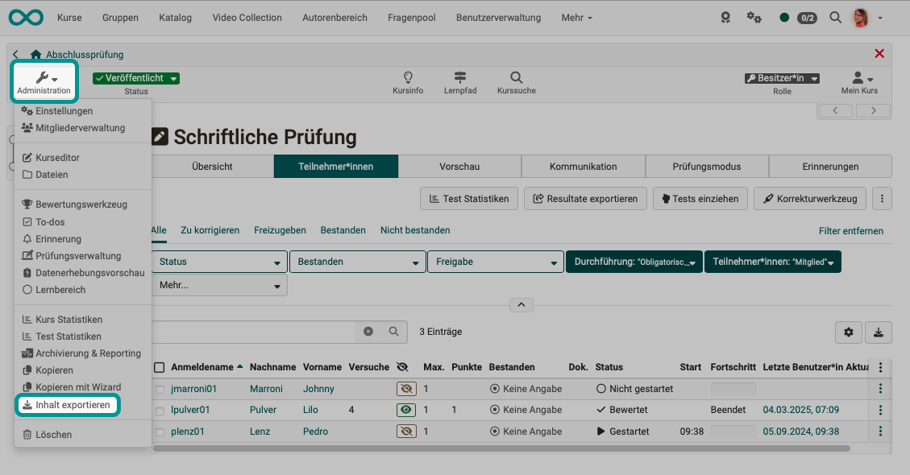{ class="shadow lightbox"}

[To the top of the page ^](#test_export)

---

## Export test learning resource {: #export_learning_resource}

Test learning resources contain entire sets of questions and can be integrated into test course modules as question packs, including configuration (total number of points, etc.).
A test learning resource can also be exported under **Administration > Export content**

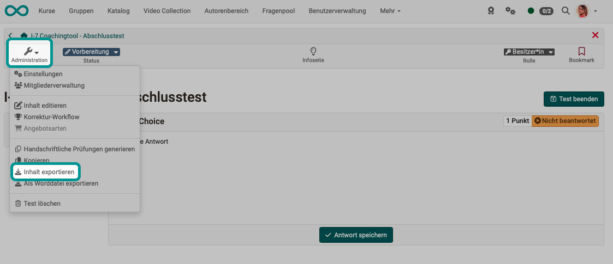{ class="shadow lightbox"}

!!! tip "Hint"

    Please note whether you are in the administration of a (test) course or a (test) learning resource. You can easily tell by checking whether the option under Administration is  
            **Course editor** 
            or 
            **Edit content**

[To the top of the page ^](#test_export)

---

### Export as word file {: #word}

Test learning resources can be exported as Word documents. Such files are often created for review purposes before a test is conducted, so that additions and corrections can be easily noted in them.

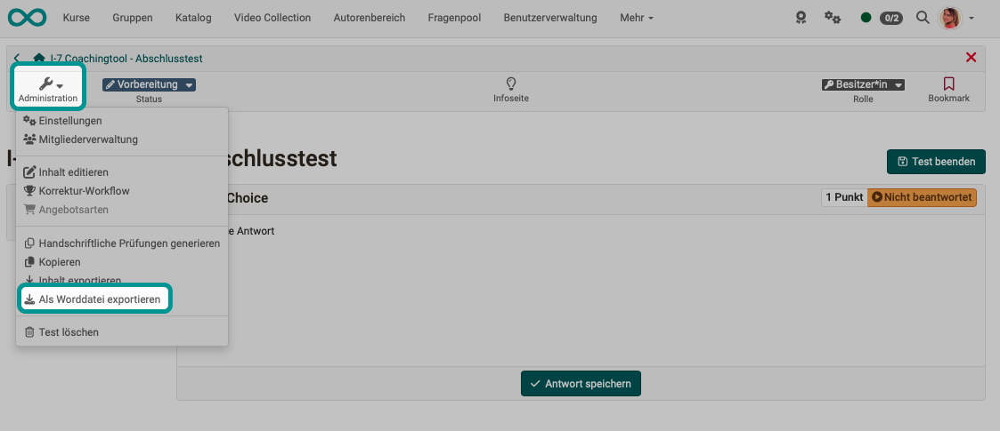{ class="shadow lightbox"}

[To the top of the page ^](#test_export)

---

### Generate hand-written exam

The Word documents created with this option under the administration of a test learning resource differ from a simple Word export.

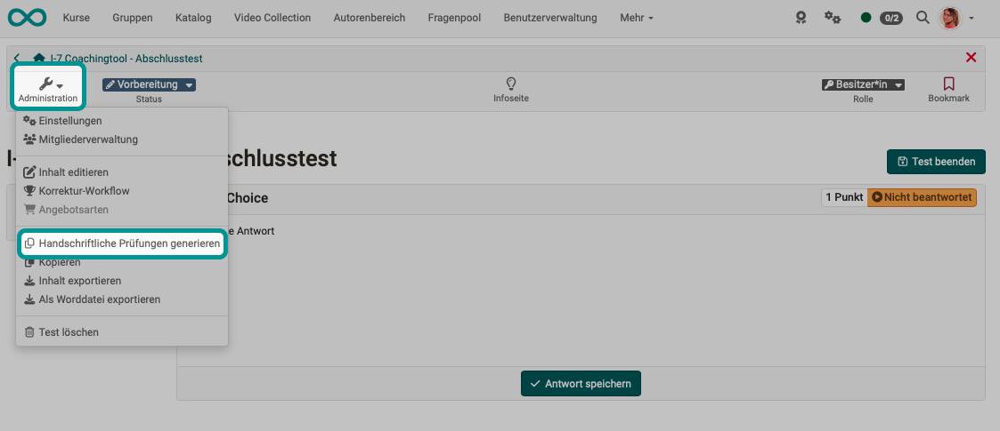{ class="shadow lightbox"}

Each document is given a cover sheet and a serial number so that it can be clearly assigned after the participants have completed the test by hand.

You must therefore specify a number for the Word files to be generated.

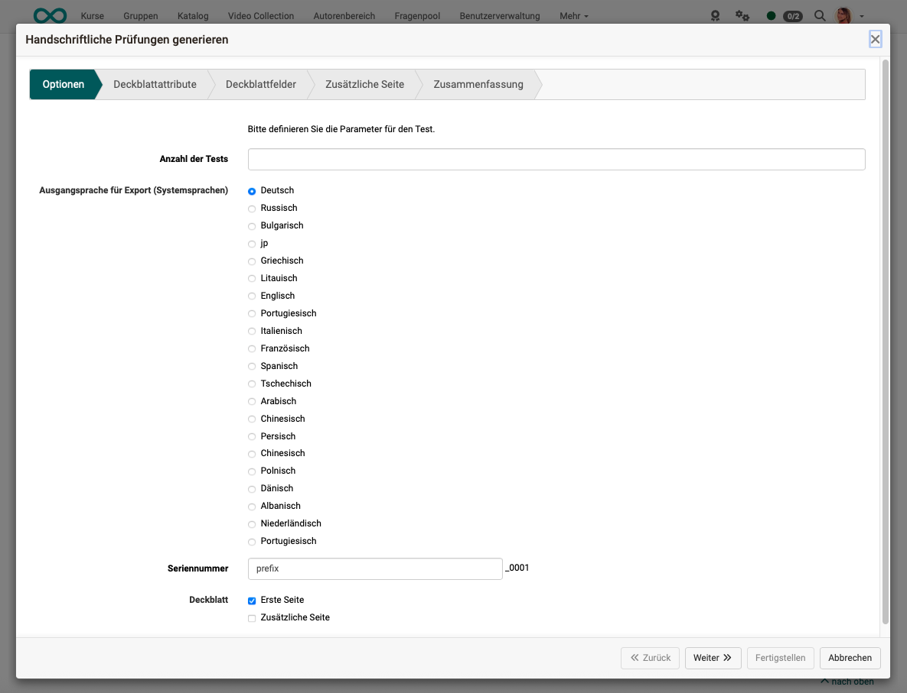{ class="shadow lightbox"}

Various attributes can be selected for the cover page.

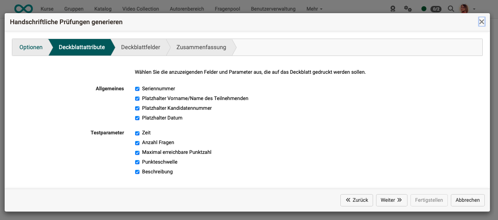{ class="shadow lightbox"}

A descriptive text can also be provided.

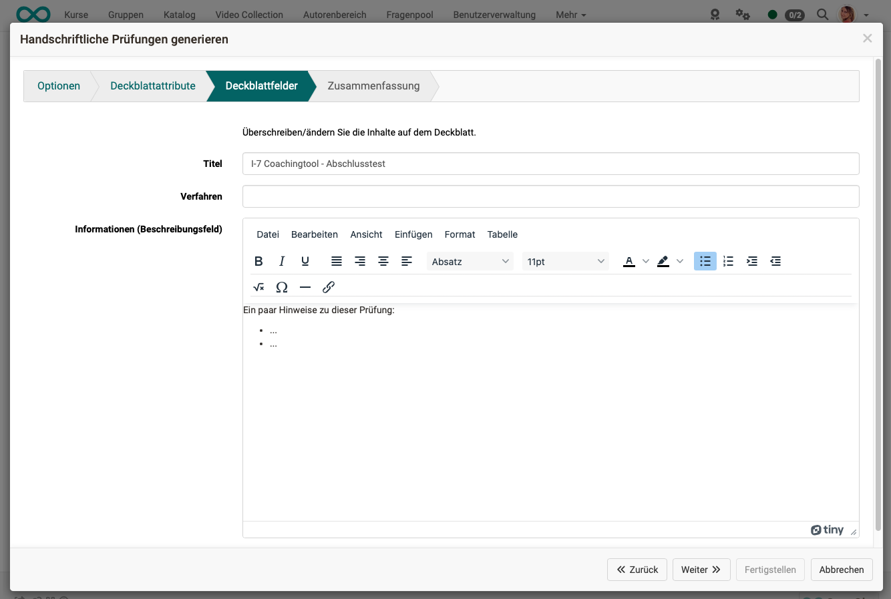{ class="shadow lightbox"}

**Cover page example:**

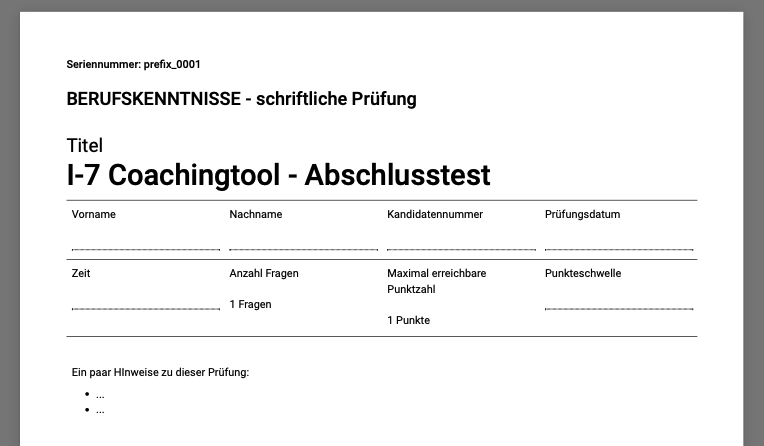{ class="shadow lightbox"}

[To the top of the page ^](#test_export)

---

## Export single questions

Questions created in OpenOlat comply with the QTI standard. This means they can also be transferred to other LMS' that use questions in the QTI standard. Conversely, OpenOlat can also import questions in QTI format. 

### Export to pool

If you are in the editor of a test learning resource, select the desired question and click on the icon with the 3 dots in the upper right corner to export the question to the pool.

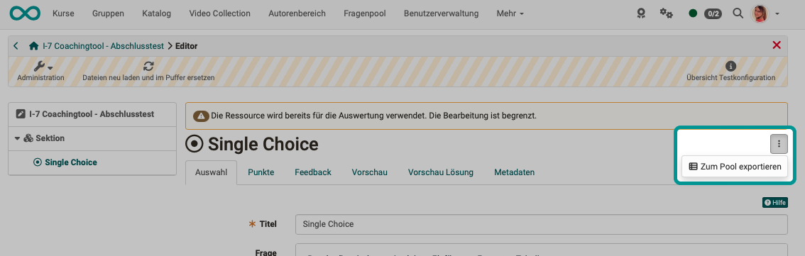{ class="shadow lightbox"}

!!! tip "Hint"

    This way, you can also export an entire section with multiple questions to the question pool. Simply select the section on the left and then click on the 3 dots.

[To the top of the page ^](#test_export)

---

### Export single questions from the pool

If you have opened a single question in the question editor, you will find an option to export this individual question to a zip file under the "Share" icon. Since the questions in OpenOlat comply with the QTI standard, the zip file can be reimported into another OpenOlat or another LMS that also uses the QTI standard.  

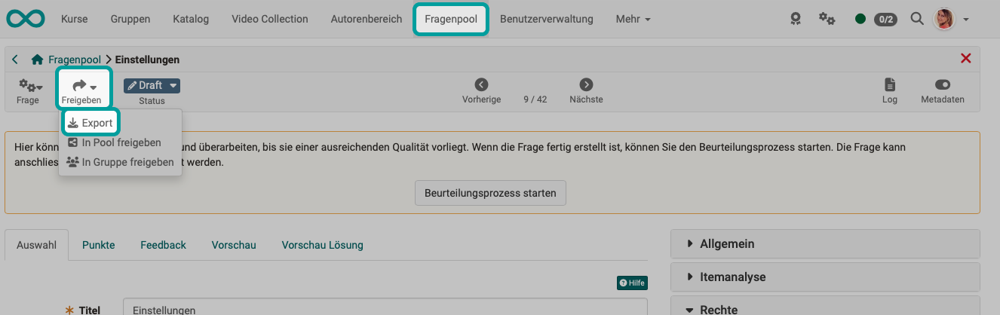{ class="shadow lightbox"}

[To the top of the page ^](#test_export)

---

### Export multiple selected single questions from the pool

If you have selected multiple questions from the question pool, these questions can be exported together in both a Word file and a zip file for transfer to another LMS.

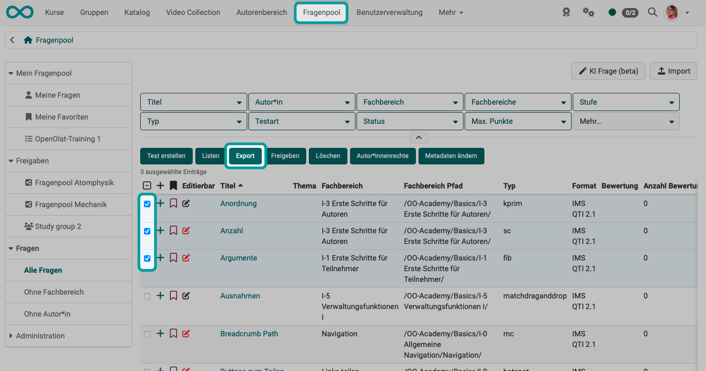{ class="shadow lightbox"}

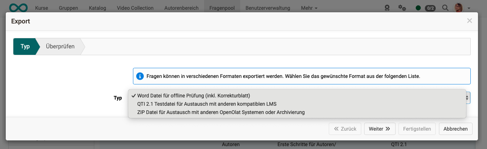{ class="shadow lightbox"}

[To the top of the page ^](#test_export)

---

## Further information

[How do I procede when creating a test? >](../../manual_how-to/test_creation_procedure/test_creation_procedure.md) 
[General information on tests >](../learningresources/General_Information_on_Tests.md) 
[The Test editor >](Test_editor_QTI_2.1.de.md) 
[Question types >](../learningresources/Test_question_types.md) 
[Configure test questions >](Configure_test_questions.de.md) 
[Configure test learning resources](Configure_tests.de.md) 
[Test learning resource settings >](Test_settings.de.md)

[To the top of the page ^](#test_export)

