# Export tests {: #test_export}

When exporting tests, a distinction must be made between

- export test **course** (Exam course)
- export test **learning resource**
- export single **questions**
- export test **results**

## Export course {: #export_course}

An entire course, e.g., an exam course, can be exported as a zip file in the course administration under `Administration > Export content`.

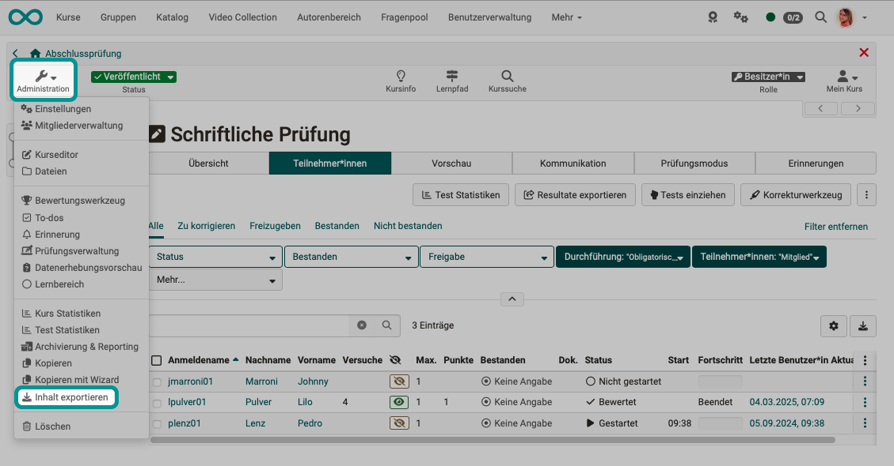{ class="shadow lightbox"}

[To the top of the page ^](#test_export)

---

## Export test learning resource {: #export_learning_resource}

Test learning resources contain entire sets of questions and can be integrated into test course modules as question packs, including configuration (total number of points, etc.).
A test learning resource can also be exported in the administration of the learning resource under `Administration > Export content`

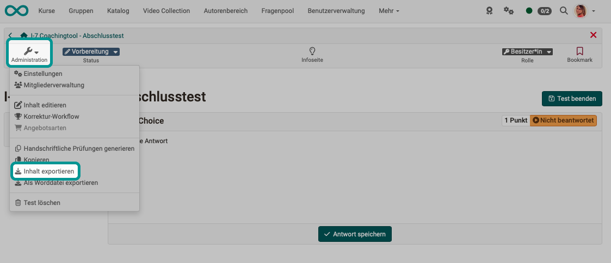{ class="shadow lightbox"}

!!! tip "Tip"

    Please note whether you are in the administration of a (test) course or a (test) learning resource. You can easily tell by checking whether the option under Administration is  
            **Course editor** 
            or 
            **Edit content**

[To the top of the page ^](#test_export)

---

### Export as word file {: #word}

Test learning resources can be exported as Word documents. Such files are often created for review purposes before a test is conducted, so that additions and corrections can be easily noted in them.

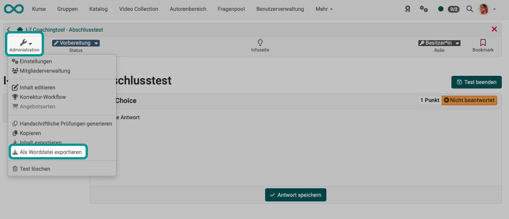{ class="shadow lightbox"}

[To the top of the page ^](#test_export)

---

### Generate hand-written exam

The Word documents created with this option under `Administration > Generate hand-written exam` of a test learning resource differ from a simple Word export.

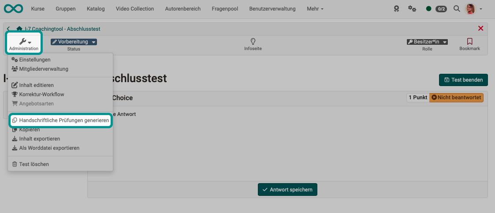{ class="shadow lightbox"}

Each document is given a cover sheet and a serial number so that it can be clearly assigned after the participants have completed the test by hand.

You must therefore specify a number for the Word files to be generated.

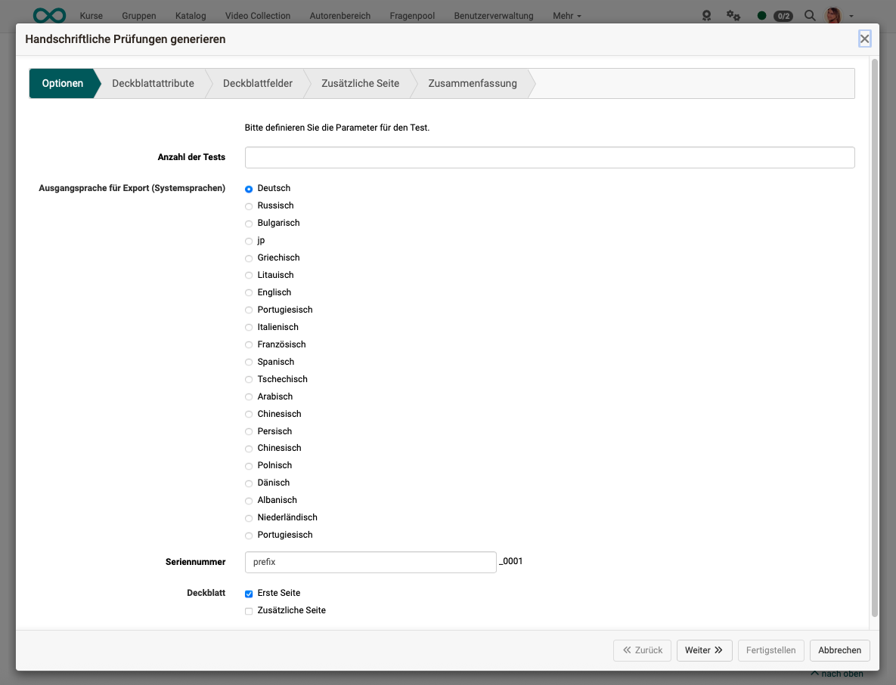{ class="shadow lightbox"}

Various attributes can be selected for the cover page.

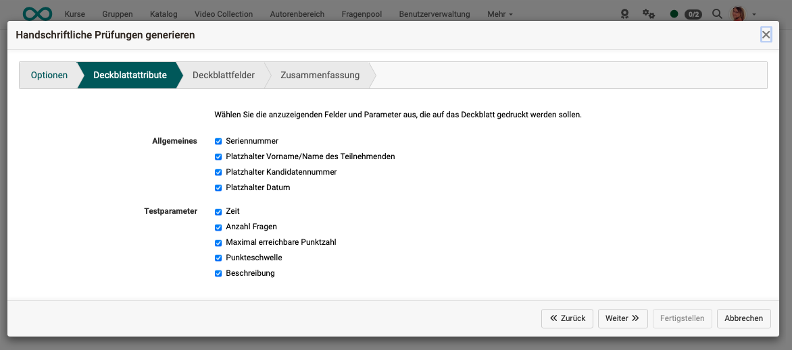{ class="shadow lightbox"}

A descriptive text can also be provided.

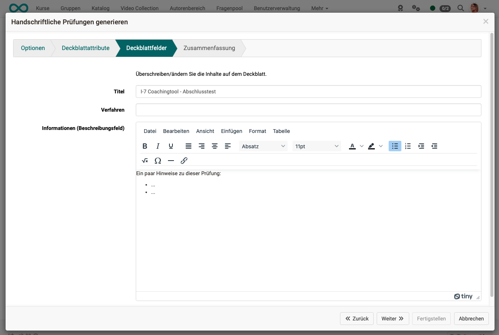{ class="shadow lightbox"}

**Cover page example:**

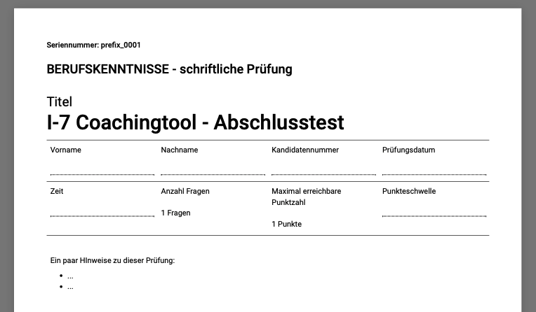{ class="shadow lightbox"}

[To the top of the page ^](#test_export)

---

## Export single questions

Questions created in OpenOlat comply with the QTI standard. This means they can also be transferred to other LMS' that use questions in the QTI standard. Conversely, OpenOlat can also import questions in QTI format. 

### Export to pool

If you are in the editor of a test learning resource, select the desired question and click on the icon with the 3 dots in the upper right corner to export the question to the pool.

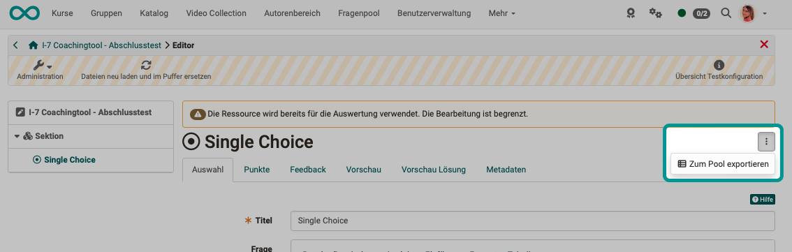{ class="shadow lightbox"}

!!! tip "Tip"

    This way, you can also export an entire section with multiple questions to the question pool. Simply select the section on the left and then click on the 3 dots.

[To the top of the page ^](#test_export)

---

### Export single questions from the pool

If you have opened a single question in the question editor, you will find an option to export this individual question to a zip file under the "Share" icon. Since the questions in OpenOlat comply with the QTI standard, the zip file can be reimported into another OpenOlat or another LMS that also uses the QTI standard.  

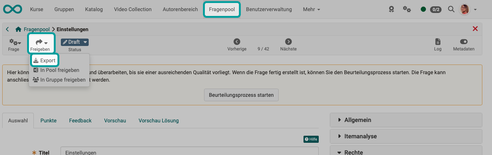{ class="shadow lightbox"}

[To the top of the page ^](#test_export)

---

### Export multiple selected single questions from the pool

If you have selected multiple questions from the question pool, these questions can be exported together in a Word file for offline review, in a QTI 2.1 test file for exchange with other compatible LMS, or in a zip file for exchange with other OpenOlat systems or for archiving.

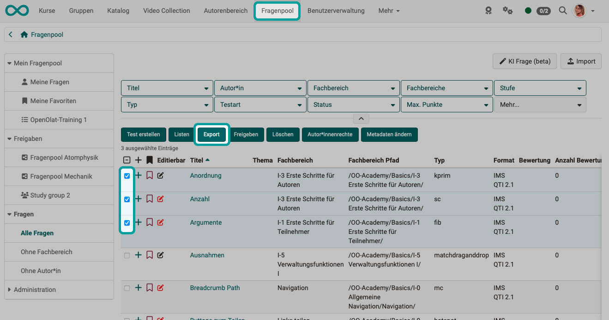{ class="shadow lightbox"}

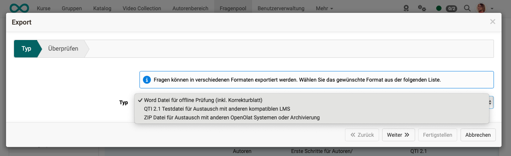{ class="shadow lightbox"}

[To the top of the page ^](#test_export)

---

## Export test results {: #export_results}

### Test statistics

One way to evaluate the test results is in statistical form. To do this, use the **"Test Statistics" button** in the "Participants" tab. The button is available to instructors and owners when they select a "Test" course element in run mode.

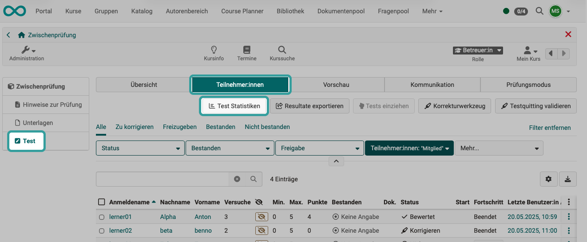{ class="shadow lightbox"}

* You can print out the various statistics on the test results (or "print" them to a PDF file) or download the raw data as an Excel file.
* When you expand the sections of a test, you can view detailed statistics for each individual question. 

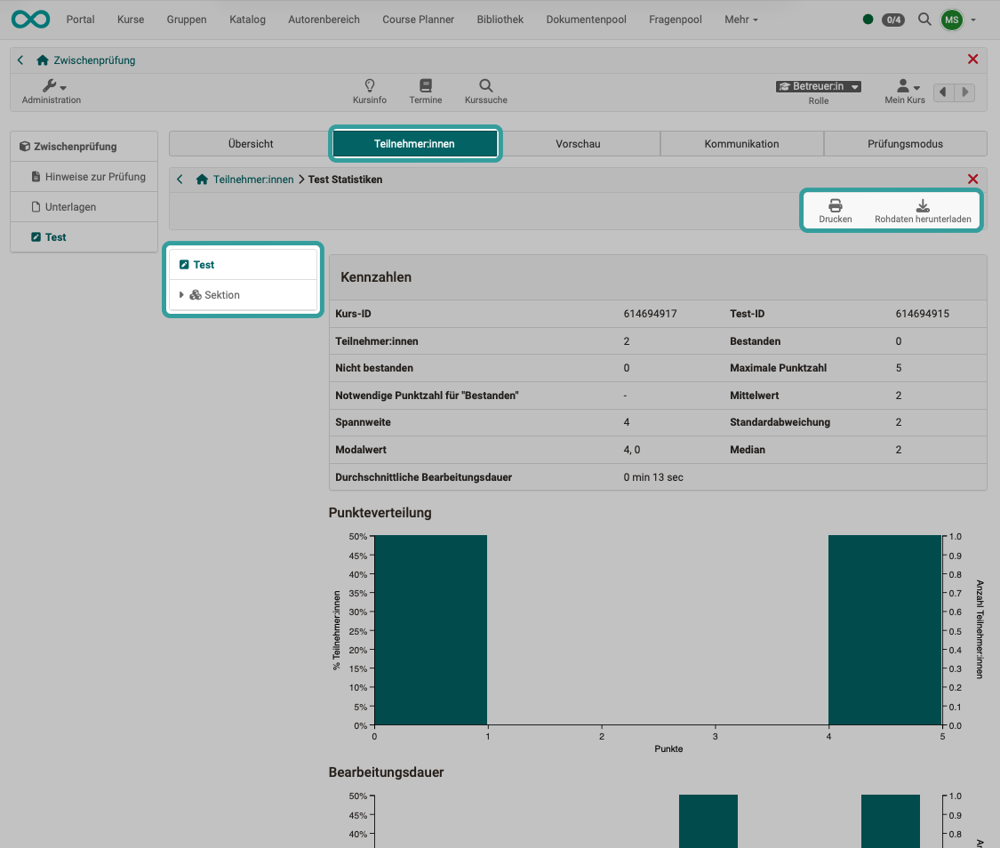{ class="shadow lightbox"}

### Test results of participants

The **"Export results" button** creates a zip file containing all test results for all participants in the selected course module.

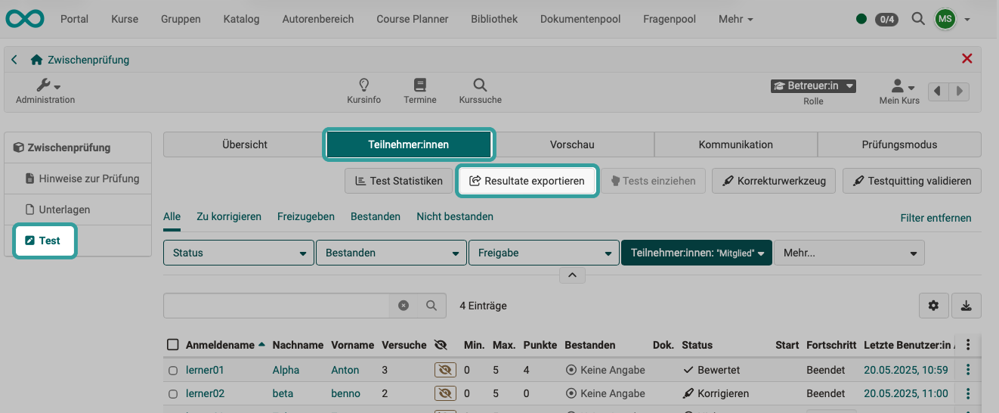{ class="shadow lightbox"}

If you have decided to create a zip file, you can specify a name for the zip file and choose one of the options offered for its contents.
Two variants of a zip file can be created:

* The **standard export** contains detailed test results for each participant in the form of an HTML document and an Excel file with the raw data.
* The **"Advanced – with PDF"** option creates the same zip file, but also adds PDF files with the detailed results for each participant. 

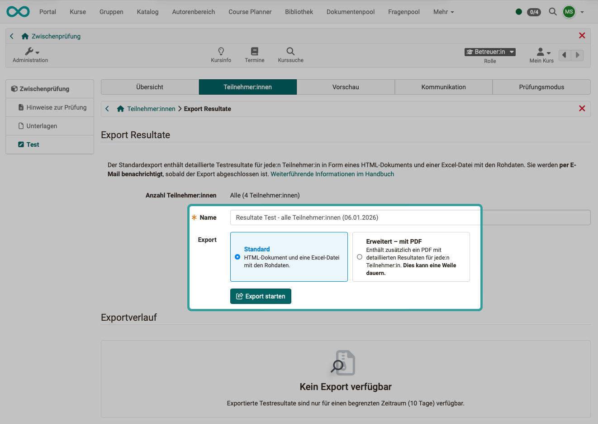{ class="shadow lightbox"}

If the test contains essay questions and the **"Advanced – with PDF"** option was selected, the **"Additional option"** with the choice **"Separate PDF file for each essay question"** appears below. If it is activated, the answer to each essay question is additionally placed in the zip file as a separate PDF file.

Click on the **"Start export" button** to generate the zip file containing the test results. 

Created zip files are listed in the lower section under **"Export history"** and are only available there for a limited period of 10 days.

Then open or unzip the created zip file to access the required files.

!!! note "Note"

    There is also an option in the course administration to export or archive test results. For more information, see [Archiving test results](../learningresources/Course_Element_Test.md#archive).

[To the top of the page ^](#test_export)

---

## Further information {: #further_information}

**Mentioned on this page** 
[Archive test results >](../learningresources/Course_Element_Test.md)

**Further** 
[How do I procede when creating a test? >](../../manual_how-to/test_creation_procedure/test_creation_procedure.md) 
[General information on tests >](../learningresources/Test.md) 
[The Test editor >](Test_editor_QTI_2.1.md) 
[Question types >](../learningresources/Test_question_types.md) 
[Configure test questions >](Configure_test_questions.md) 
[Configure test learning resources](Configure_tests.md) 
[Test learning resource settings >](Test_settings.md)

[To the top of the page ^](#test_export)

