# Export tests {: #test_export}

When exporting tests, a distinction must be made between

- export test **course** (Exam course)
- export test **learning resource**
- export single **questions**
- export test **results**

## Export course {: #export_course}

An entire course, e.g., an exam course, can be exported as a zip file in the course administration under: `Course > Administration > Export content`

Owners of the course always find the menu item. Other authors only see it if the owners have allowed exporting in the tab "Share", see [Access configuration](Access_configuration.md).

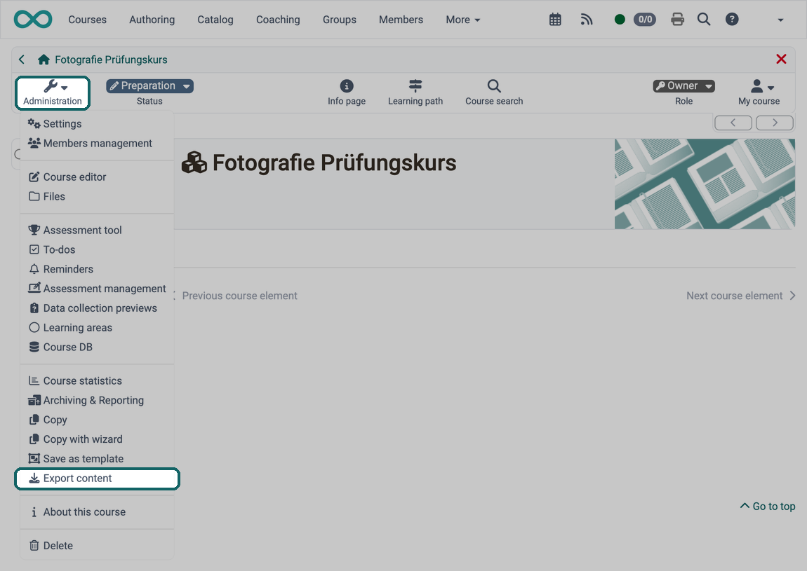{ class="shadow lightbox" title="Administration menu of a course · 2026.10.01" }

[To the top of the page ^](#test_export)

---

## Export test learning resource {: #export_learning_resource}

Test learning resources contain entire sets of questions and can be integrated into test course elements as question packs, including configuration (total number of points, etc.).
A test learning resource can also be exported in the administration of the learning resource under: `Test > Administration > Export content`

Here too, owners always find the menu item, other authors only if exporting is allowed in the tab "Share".

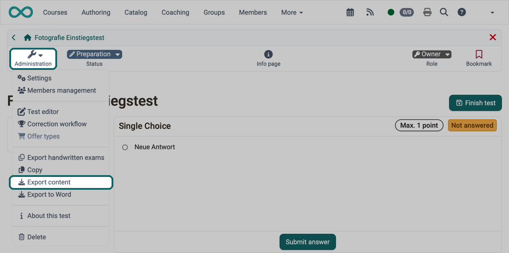{ class="shadow lightbox" title="Administration menu of a test learning resource · 2026.10.01" }

!!! tip "Tip"

    Please note whether you are in the administration of a course or of a test learning resource. In the course, the editor entry is called **Course editor**, in the test learning resource **Test editor**.

[To the top of the page ^](#test_export)

---

### Export to Word {: #word}

Test learning resources can be exported as Word documents. Such files are often created for review purposes before a test is conducted, so that additions and corrections can be easily noted in them. The menu item is available to owners of the test learning resource. OpenOlat downloads a zip file with two Word documents: the test and a second version with the solutions.

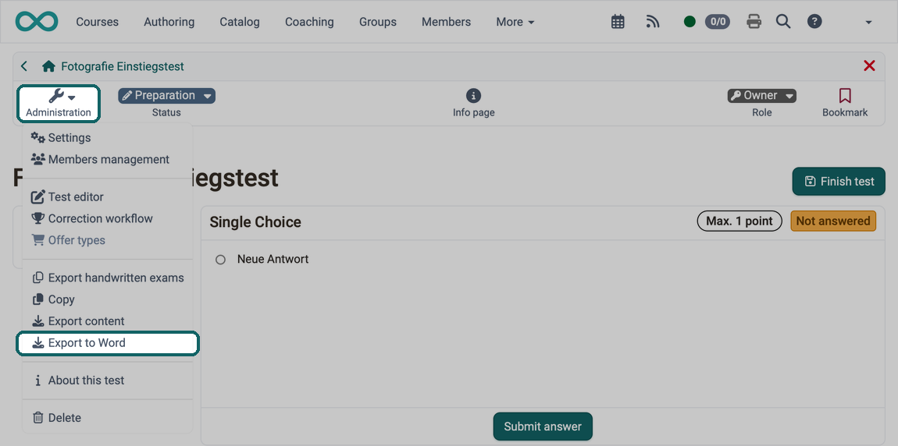{ class="shadow lightbox" title="Administration menu of a test learning resource · 2026.10.01" }

[To the top of the page ^](#test_export)

---

### Export handwritten exams [:octicons-tag-16:{ title="from Release 16.1 (OO-5648)" }](https://track.frentix.com/issue/OO-5648)

Whoever conducts a test on paper receives print-ready exam sheets via `Test > Administration > Export handwritten exams`: a zip file with one PDF file per exam and the matching solution sheet. The menu item is available to owners of the test learning resource if the [PDF Service](../../manual_admin/administration/External_Tools_-_Administration.md#pdf_generator) is enabled in the system administration.

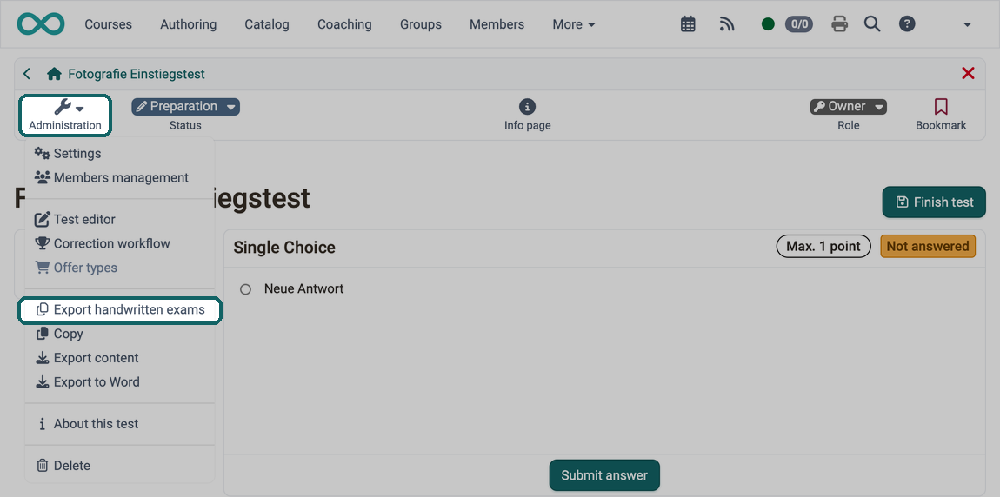{ class="shadow lightbox" title="Administration menu of a test learning resource · 2026.10.01" }

Each exam is given its own serial number and, if desired, a cover sheet. This way, every sheet completed by hand can be clearly assigned after the exam.

In the step "Options", "Number of tests" and "Prefix" are mandatory. OpenOlat generates as many exams as you specify and appends a sequential number to the prefix, "prefix" becomes "prefix_0001". You choose the language of the exam sheets under "Output language of export (system languages)". Under "Covers" you determine whether each exam receives a cover sheet with "First sheet" and a further page with "Additional sheet".

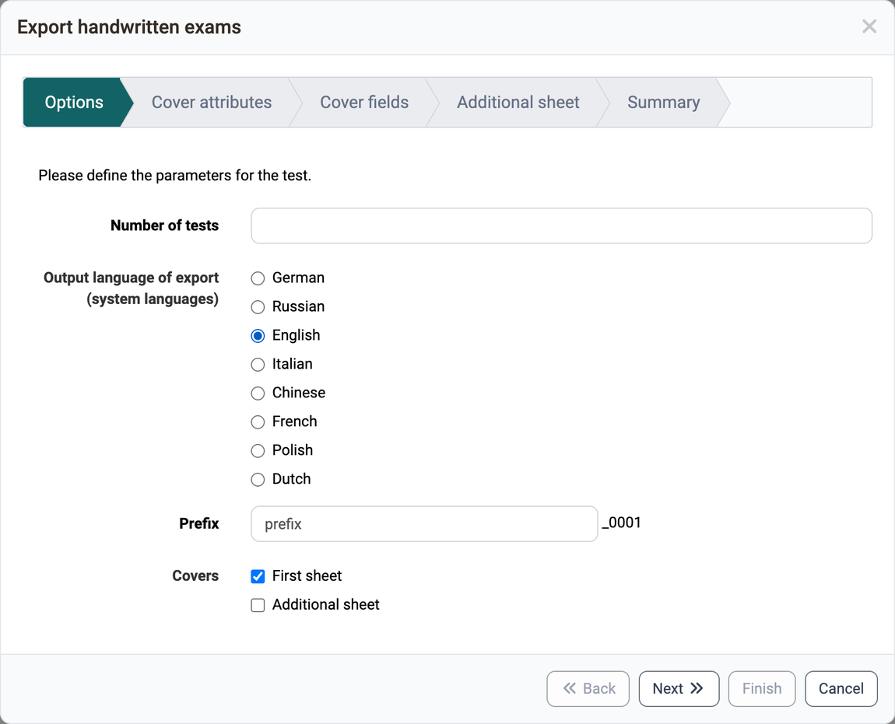{ class="shadow lightbox" title="Step Options in the dialog Export handwritten exams · 2026.10.01" }

In the step "Cover attributes" you select which details and placeholders the cover sheet carries.

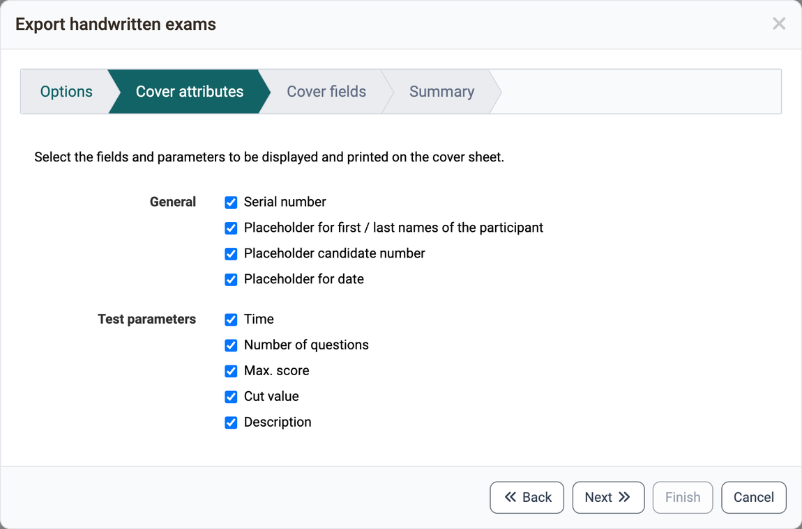{ class="shadow lightbox" title="Step Cover attributes in the dialog Export handwritten exams · 2026.10.01" }

In the step "Cover fields" you adjust "Title" and "Procedure" and write a note for the participants under "Information (description field)".

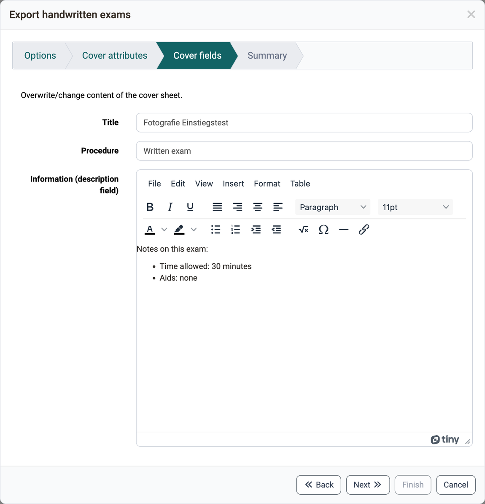{ class="shadow lightbox" title="Step Cover fields in the dialog Export handwritten exams · 2026.10.01" }

The steps "Cover attributes" and "Cover fields" only appear with "First sheet", the step "Additional sheet" only with "Additional sheet".

The step "Summary" shows the number of tests and solution sheets and the file format. With "Preview" and "Preview with solutions" you open a sample as a PDF file. After "Finish" the download of the zip file starts; depending on the number, it can take several minutes or hours. The zip file contains one PDF file per exam named after the serial number in the folder "tests" and the matching solution sheet in the folder "solutions".

**Cover sheet example:**

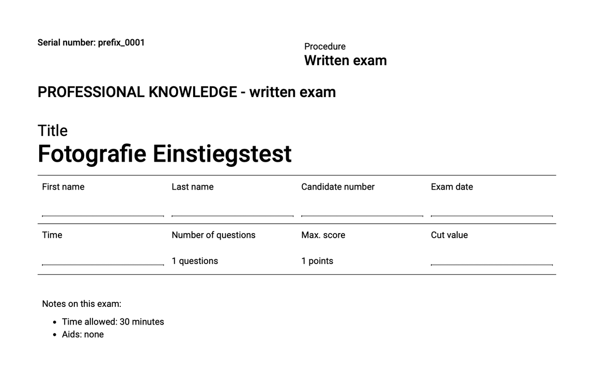{ class="shadow lightbox" title="Generated cover sheet of a handwritten exam · 2026.10.01" }

[To the top of the page ^](#test_export)

---

## Export single questions

Questions created in OpenOlat comply with the QTI standard. This means they can also be transferred to other LMS that use questions in the QTI standard. Conversely, OpenOlat can also import questions in QTI format. 

### Export to pool

If you are in the test editor of a test learning resource, select the desired question and click on the icon with the 3 dots in the upper right corner. With "Export to pool" you transfer the question to the question bank.

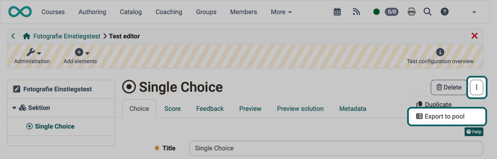{ class="shadow lightbox" title="Question in the test editor · 2026.10.01" }

!!! tip "Tip"

    This way, you can also export an entire section with multiple questions to the question bank. Simply select the section on the left and then click on the 3 dots.

[To the top of the page ^](#test_export)

---

### Export single questions from the pool

If you have opened a single question in the question bank, you will find the entry "Export" under the icon "Share". It exports this individual question to a zip file. Since the questions in OpenOlat comply with the QTI standard, the zip file can be reimported into another OpenOlat or another LMS that also uses the QTI standard.

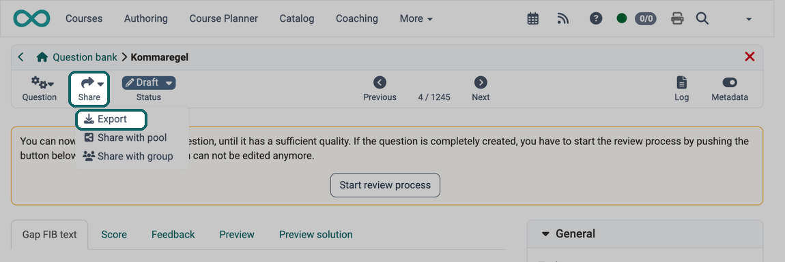{ class="shadow lightbox" title="Question in the question bank · 2026.10.01" }

[To the top of the page ^](#test_export)

---

### Export multiple selected single questions from the pool

If you have selected multiple questions in the question bank, these questions can be exported together in a Word file for offline exams, in a QTI 2.1 test file for exchange with other compatible LMS, or in a zip file for exchange with other OpenOlat systems or for archiving.

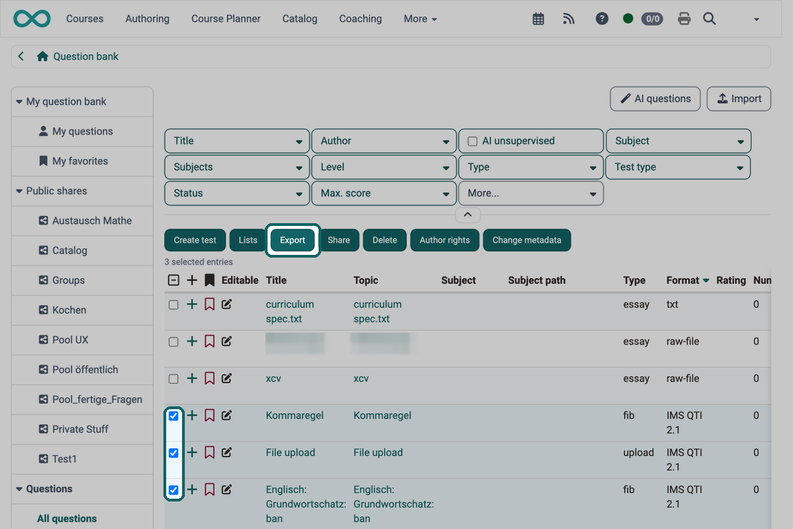{ class="shadow lightbox" title="List All questions in the question bank · 2026.10.01" }

In the dialog "Export" you choose the format in the step "Type". Word and QTI 2.1 can only be selected if at least one of the selected questions is in the format QTI 2.1; otherwise the list only offers the ZIP file. Which questions can be exported in the chosen format is shown in the step "Review" in the column "Can export".

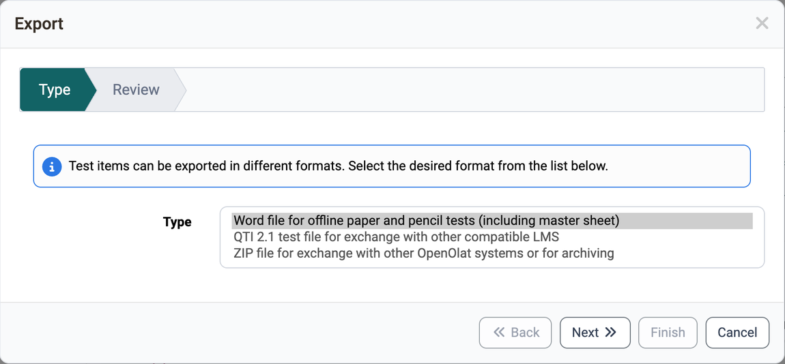{ class="shadow lightbox" title="Step Type in the dialog Export · 2026.10.01" }

[To the top of the page ^](#test_export)

---

## Export test results {: #export_results}

### Test Statistics

One way to evaluate the test results is in statistical form. To do this, use the **"Test Statistics" button** in the "Participants" tab. The button is available to coaches and owners when they select a "Test" course element in run mode.

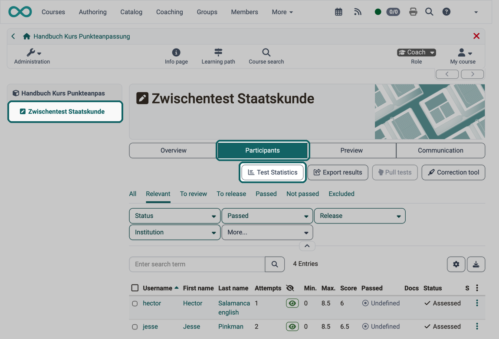{ class="shadow lightbox" title="Tab Participants of the Test course element · 2026.10.01" }

* You can print out the various statistics on the test results (or "print" them to a PDF file) or download the raw data as an Excel file.
* When you expand the sections of a test, you can view detailed statistics for each individual question. 

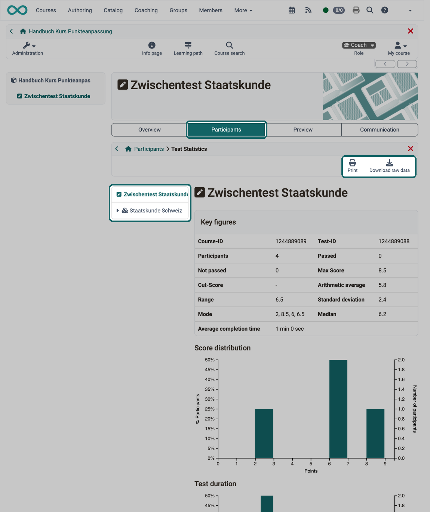{ class="shadow lightbox" title="Test Statistics in the Test course element · 2026.10.01" }

### Test results of participants [:octicons-tag-16:{ title="from Release 16.2 (OO-5974)" }](https://track.frentix.com/issue/OO-5974)

Whoever wants to evaluate, print or archive the results of a test receives a zip file with all test results of all participants in the selected course element via the **"Export results" button**. The button is available to coaches and owners in the tab "Participants" of the course element "Test".

{ class="shadow lightbox" title="Tab Participants of the Test course element · 2026.10.01" }

If you have decided to create a zip file, you can specify a name for the zip file and choose one of the options offered for its contents.
Two variants of a zip file can be created:

* The **standard export** contains detailed test results for each participant in the form of an HTML document and an Excel file with the raw data.
* The **"Advanced – with PDF"** option creates the same zip file, but also adds PDF files with the detailed results for each participant. 

OpenOlat suggests a name with variant and date, for example "Test results with PDF - all participants (10/1/2026)".

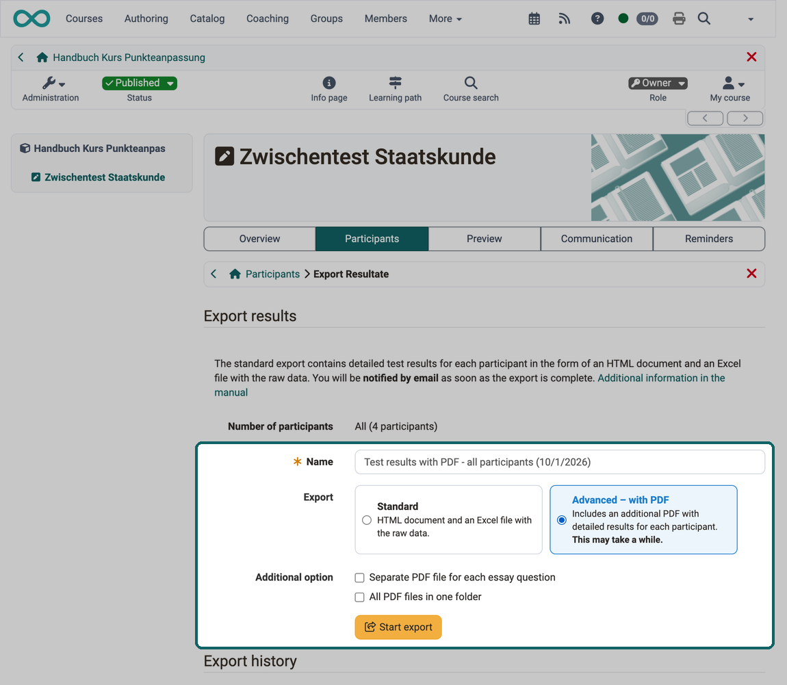{ class="shadow lightbox" title="Page Export results in the Test course element · 2026.10.01" }

If the option **"Advanced – with PDF"** was selected, the section **"Additional option"** appears below:

* **"Separate PDF file for each essay question"** can only be selected if the test contains essay questions. If it is activated, the answer to each essay question is additionally placed in the zip file as a separate PDF file. [:octicons-tag-16:{ title="from Release 19.1.27 (OO-8964)" }](https://track.frentix.com/issue/OO-8964)
* **"All PDF files in one folder"** can be selected for every test. If it is activated, the PDF files with the detailed results of all participants are placed together in one folder of the zip file. How the files are named and where they are located is described under [PDF files in the zip file](#pdf_files).

Click on the **"Start export" button** to generate the zip file containing the test results. OpenOlat notifies you by email as soon as the export is complete.

Created zip files are listed in the lower section under **"Export history"** and are only available there for a limited period of 10 days.

Then open or unzip the created zip file to access the required files.

#### PDF files in the zip file [:octicons-tag-16:{ title="from Release 21.1 (OO-9600)" }](https://track.frentix.com/issue/OO-9600) {: #pdf_files}

Whoever prints, files or passes on exported results can tell from the file name which person and which test a PDF file belongs to. The name is made up of these parts, each separated by an underscore:

1. Last name of the participant. If no last name is recorded, it reads "anonym".
2. First name of the participant.
3. Title of the course element, shortened to 25 characters.
4. Title of the test learning resource, shortened to 25 characters.
5. A number that uniquely identifies the test attempt.

Spaces become underscores, umlauts are transcribed ("ü" becomes "ue"), other special characters are dropped. An example: `Langenegger_Simone_Test_Demo_Test_Demo_Master_13730.pdf`.

Where the PDF files are located in the zip file is determined by the option "All PDF files in one folder":

* **Off:** Each PDF file is located in the folder of the participant, there in the subfolder of the respective attempt. The results of one person thus stay together.
* **On:** All PDF files with the detailed results are located together in the folder "resultspdfs". This way, the results of all participants can be printed or passed on without searching the subfolders.

In both cases, the folders of the participants with the HTML document and the raw data remain, and the links in the HTML documents of the zip file lead to the respective PDF file. The PDF files from the option "Separate PDF file for each essay question" always stay in the folder of the participant.

The option "All PDF files in one folder" is only available for the export via the "Export results" button. The course archiving always places the PDF files in the folder of the participant, with the same structure of the file name.

#### Score columns in the Excel file [:octicons-tag-16:{ title="from Release 21.1 (OO-9599)" }](https://track.frentix.com/issue/OO-9599) {: #score_columns}

Whoever evaluates the results sees in the Excel file with the raw data which part of the points comes from the answer and which from a later correction. For each test run, the file contains these columns:

* **Score**: the result of the test run.
* **Score (auto)**: the sum of the automatically calculated points.
* **Score (adjustments plus)**: the sum of all adjustments that add points.
* **Score (adjustments minus)**: the sum of all adjustments that deduct points, as a negative value, for example "-0.5".
* **Score (manual)**: the sum of the points awarded by hand for questions.

For each question, the column "Score" contains the score of the question. For automatically corrected questions, it is followed by the column "Adjustment" with the amount by which the points were adjusted. How an adjustment is made is described on the page [Assessing tests](../learningresources/Assessing_tests.md#adjust_score). You receive the same Excel file in the test statistics via "Download raw data".

!!! note "Note"

    There is also an option in the course administration under `Course > Administration > Archiving & Reporting` to export or archive test results. For more information, see [Archiving test results](../learningresources/Course_Element_Test.md#archive).

[To the top of the page ^](#test_export)

---

## Further information {: #further_information}

**Mentioned on this page** 
[Access configuration >](Access_configuration.md) 
[External Tools: Overview >](../../manual_admin/administration/External_Tools_-_Administration.md) 
[Assessing tests >](../learningresources/Assessing_tests.md) 
[Course Element "Test" >](../learningresources/Course_Element_Test.md)

**Further** 
[How do I proceed when I create a test? >](../../manual_how-to/test_creation_procedure/test_creation_procedure.md) 
[Creating Tests >](../learningresources/Test.md) 
[Test editor >](Test_editor_QTI_2.1.md) 
[Test question types >](../learningresources/Test_question_types.md) 
[Configure test questions >](Configure_test_questions.md) 
[Configure tests >](Configure_tests.md) 
[Test settings - Administration >](Test_settings.md)

[To the top of the page ^](#test_export)

