# Export tests {: #test_export}

When exporting tests, a distinction must be made between

- export test **course** (Exam course)
- export test **learning resource**
- export single **questions**
- export test **results**

## Export course {: #export_course}

An entire course, e.g., an exam course, can be exported as a zip file in the course administration under: `Course > Administration > Export content`

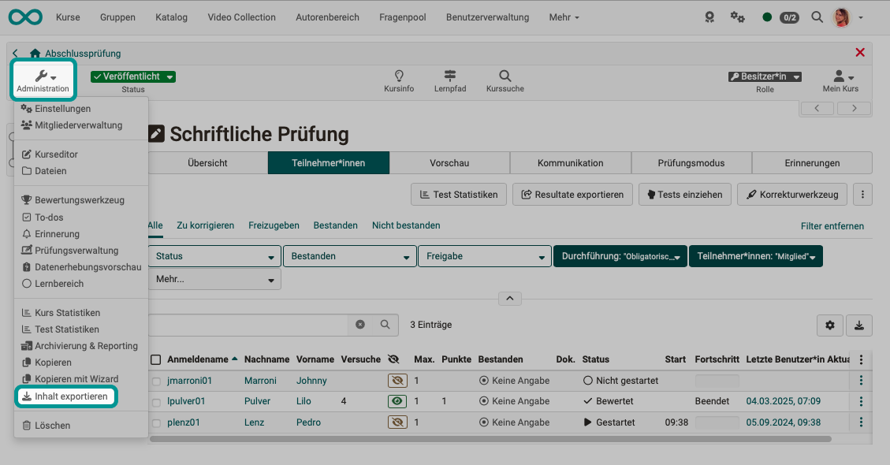{ class="shadow lightbox" title="Administration menu of a course" }

[To the top of the page ^](#test_export)

---

## Export test learning resource {: #export_learning_resource}

Test learning resources contain entire sets of questions and can be integrated into test course modules as question packs, including configuration (total number of points, etc.).
A test learning resource can also be exported in the administration of the learning resource under: `Test > Administration > Export content`

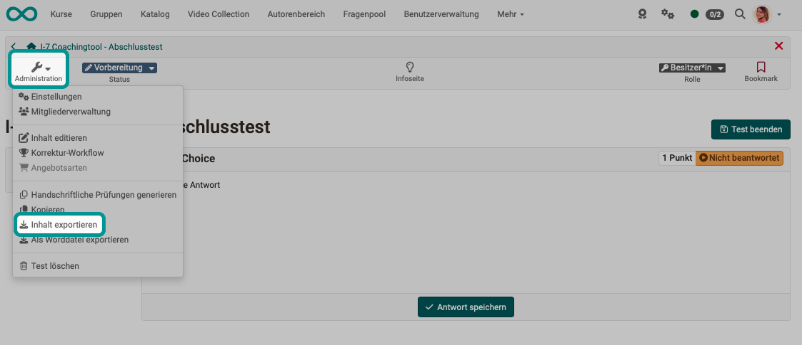{ class="shadow lightbox" title="Administration menu of a test learning resource" }

!!! tip "Tip"

    Please note whether you are in the administration of a course or of a test learning resource. In the course, the editor entry is called **Course editor**, in the test learning resource **Test editor**.

[To the top of the page ^](#test_export)

---

### Export as word file {: #word}

Test learning resources can be exported as Word documents. Such files are often created for review purposes before a test is conducted, so that additions and corrections can be easily noted in them.

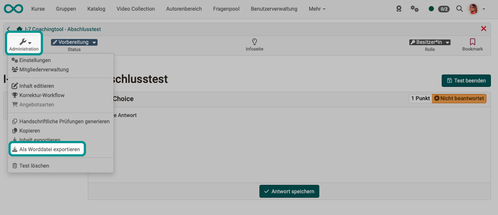{ class="shadow lightbox" title="Administration menu of a test learning resource" }

[To the top of the page ^](#test_export)

---

### Generate hand-written exam

The Word documents created with this option under `Test > Administration > Generate hand-written exam` of a test learning resource differ from a simple Word export.

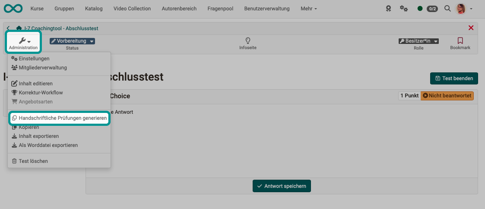{ class="shadow lightbox" title="Administration menu of a test learning resource" }

Each document is given a cover sheet and a serial number so that it can be clearly assigned after the participants have completed the test by hand.

You must therefore specify a number for the Word files to be generated.

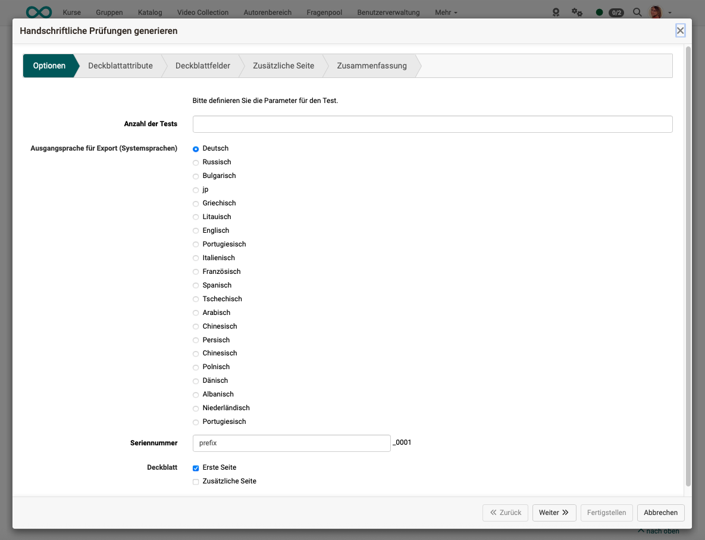{ class="shadow lightbox" title="Step Options in the dialog Generate hand-written exam" }

Various attributes can be selected for the cover page.

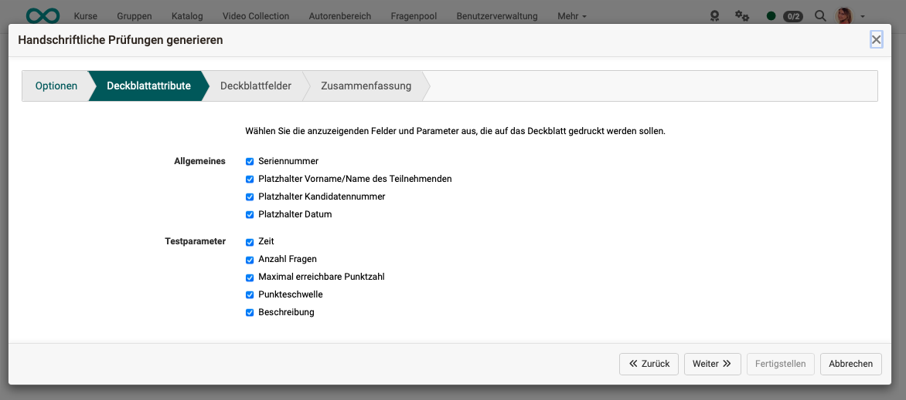{ class="shadow lightbox" title="Step Cover page attributes in the dialog Generate hand-written exam" }

A descriptive text can also be provided.

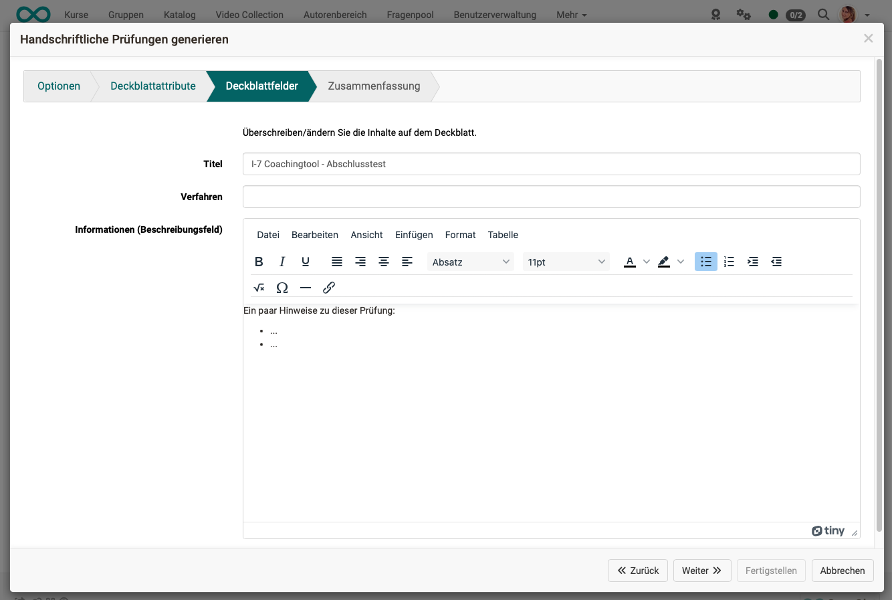{ class="shadow lightbox" title="Step Cover page fields in the dialog Generate hand-written exam" }

**Cover page example:**

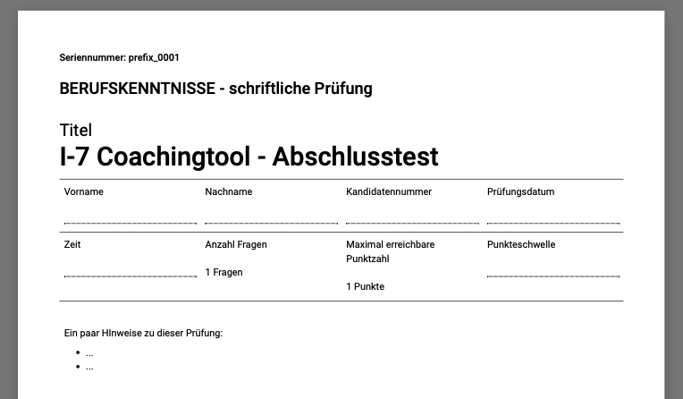{ class="shadow lightbox" title="Generated cover page of a hand-written exam" }

[To the top of the page ^](#test_export)

---

## Export single questions

Questions created in OpenOlat comply with the QTI standard. This means they can also be transferred to other LMS' that use questions in the QTI standard. Conversely, OpenOlat can also import questions in QTI format. 

### Export to pool

If you are in the editor of a test learning resource, select the desired question and click on the icon with the 3 dots in the upper right corner to export the question to the pool.

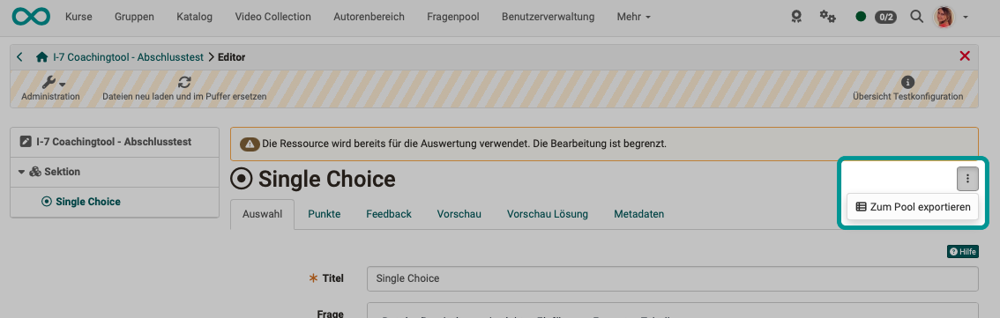{ class="shadow lightbox" title="Question in the test editor" }

!!! tip "Tip"

    This way, you can also export an entire section with multiple questions to the question pool. Simply select the section on the left and then click on the 3 dots.

[To the top of the page ^](#test_export)

---

### Export single questions from the pool

If you have opened a single question in the question editor, you will find an option to export this individual question to a zip file under the "Share" icon. Since the questions in OpenOlat comply with the QTI standard, the zip file can be reimported into another OpenOlat or another LMS that also uses the QTI standard.  

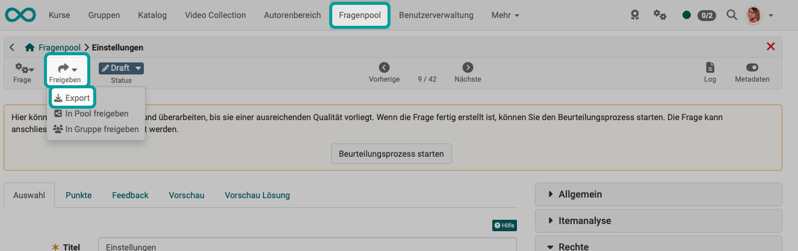{ class="shadow lightbox" title="Question in the question pool" }

[To the top of the page ^](#test_export)

---

### Export multiple selected single questions from the pool

If you have selected multiple questions from the question pool, these questions can be exported together in a Word file for offline review, in a QTI 2.1 test file for exchange with other compatible LMS, or in a zip file for exchange with other OpenOlat systems or for archiving.

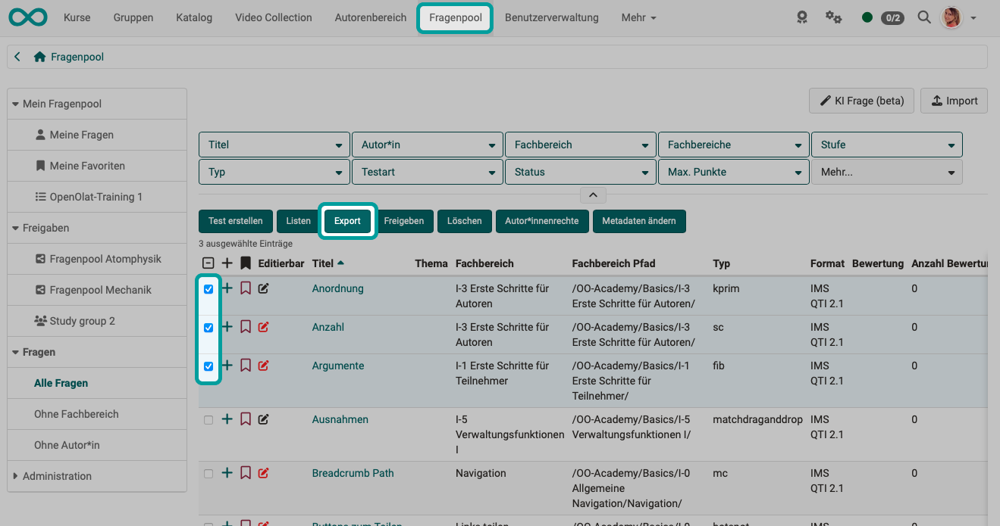{ class="shadow lightbox" title="List All questions in the question pool" }

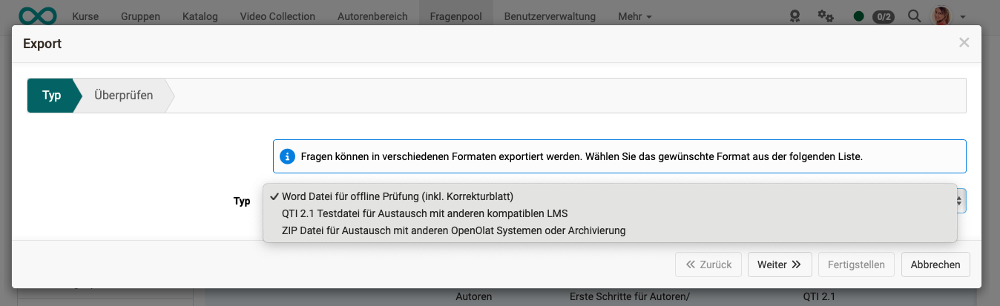{ class="shadow lightbox" title="Step Type in the dialog Export" }

[To the top of the page ^](#test_export)

---

## Export test results {: #export_results}

### Test statistics

One way to evaluate the test results is in statistical form. To do this, use the **"Test Statistics" button** in the "Participants" tab. The button is available to instructors and owners when they select a "Test" course element in run mode.

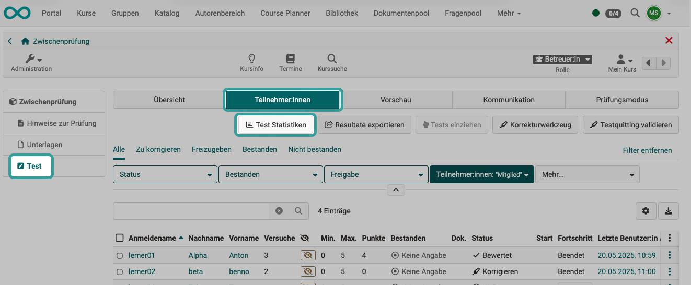{ class="shadow lightbox" title="Tab Participants of the Test course element" }

* You can print out the various statistics on the test results (or "print" them to a PDF file) or download the raw data as an Excel file.
* When you expand the sections of a test, you can view detailed statistics for each individual question. 

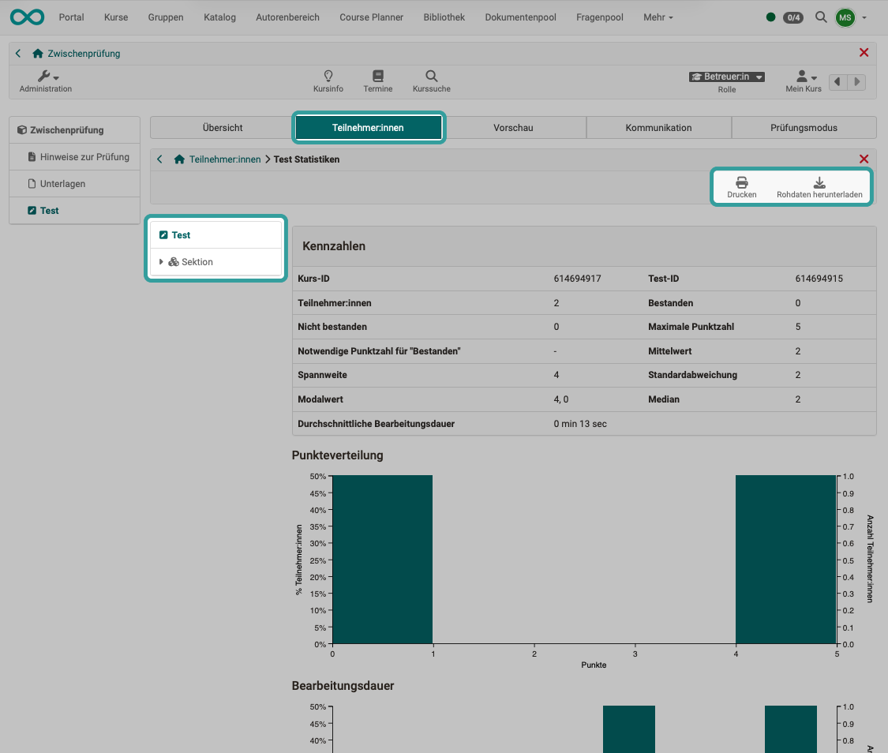{ class="shadow lightbox" title="Test statistics in the Test course element" }

### Test results of participants [:octicons-tag-16:{ title="from Release 16.2 (OO-5974)" }](https://track.frentix.com/issue/OO-5974)

The **"Export results" button** creates a zip file containing all test results for all participants in the selected course module.

{ class="shadow lightbox" title="Tab Participants of the Test course element" }

If you have decided to create a zip file, you can specify a name for the zip file and choose one of the options offered for its contents.
Two variants of a zip file can be created:

* The **standard export** contains detailed test results for each participant in the form of an HTML document and an Excel file with the raw data.
* The **"Advanced – with PDF"** option creates the same zip file, but also adds PDF files with the detailed results for each participant. 

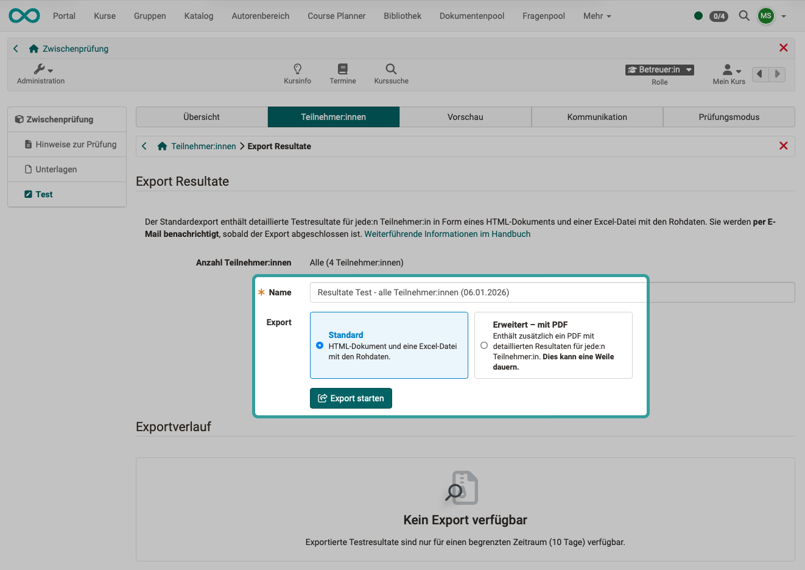{ class="shadow lightbox" title="Page Export results in the Test course element" }

If the test contains essay questions and the **"Advanced – with PDF"** option was selected, the **"Additional option"** with the choice **"Separate PDF file for each essay question"** appears below. If it is activated, the answer to each essay question is additionally placed in the zip file as a separate PDF file.

Click on the **"Start export" button** to generate the zip file containing the test results. 

Created zip files are listed in the lower section under **"Export history"** and are only available there for a limited period of 10 days.

Then open or unzip the created zip file to access the required files.

#### Score columns in the Excel file [:octicons-tag-16:{ title="from Release 21.1 (OO-9599)" }](https://track.frentix.com/issue/OO-9599) {: #score_columns}

Whoever evaluates the results sees in the Excel file with the raw data which part of the points comes from the answer and which from a later correction. For each test run, the file contains these columns:

* **Score**: the result of the test run.
* **Score (auto)**: the sum of the automatically calculated points.
* **Score (adjustments plus)**: the sum of all adjustments that add points.
* **Score (adjustments minus)**: the sum of all adjustments that deduct points, as a negative value, for example "-0.5".
* **Score (manual)**: the sum of the points awarded by hand for questions.

For each question, the column "Score" contains the score of the question. For automatically corrected questions, it is followed by the column "Adjustment" with the amount by which the points were adjusted. How an adjustment is made is described on the page [Assessing tests](../learningresources/Assessing_tests.md#adjust_score). You receive the same Excel file in the test statistics via "Download raw data".

!!! note "Note"

    There is also an option in the course administration to export or archive test results. For more information, see [Archiving test results](../learningresources/Course_Element_Test.md#archive).

[To the top of the page ^](#test_export)

---

## Further information {: #further_information}

**Mentioned on this page** 
[Assessing tests >](../learningresources/Assessing_tests.md) 
[Archive test results >](../learningresources/Course_Element_Test.md)

**Further** 
[How do I procede when creating a test? >](../../manual_how-to/test_creation_procedure/test_creation_procedure.md) 
[General information on tests >](../learningresources/Test.md) 
[The Test editor >](Test_editor_QTI_2.1.md) 
[Question types >](../learningresources/Test_question_types.md) 
[Configure test questions >](Configure_test_questions.md) 
[Configure test learning resources >](Configure_tests.md) 
[Test learning resource settings >](Test_settings.md)

[To the top of the page ^](#test_export)

