# Test Fragetypen {: #question_types}

Folgende Fragetypen können in OpenOlat Tests verwendet werden:

Die mit einem * versehenen Fragetypen müssen manuell ausgewertet werden.

## Single Choice {: #sc}

{class=size24 }

Eine Single-Choice-Frage besteht aus einer Frage und Antworten, von denen nur eine ausgewählt werden kann. Im Test ist nur eine Antwort richtig.

Zuerst werden ein kurzer Titel und die Frage eingegeben.

Anschliessend wird ausgewählt, ob die Reihenfolge der Antworten zufällig und die Ausrichtung der Antworten vertikal oder horizontal erscheinen soll und ob die Check-Boxen links oder rechts ausgerichtet sind.

Dann können Antworttexte eingefügt werden. Zusätzliche Antworten erstellen Sie mit der Schaltfläche { class=size16 }, entfernt werden die Antworten mit der Schaltfläche { class=size16 }.

Die richtige Antwort können Sie bestimmen, indem Sie in der Spalte _Korrekt_ die gewünschte Antwort markieren. Die Reihenfolge der Antworten können Sie mit den Pfeilen verändern.

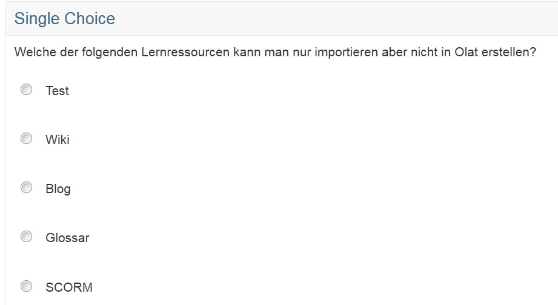{ class="shadow" }

---

## Multiple Choice {: #mc}

{ class=size24 }

Eine Multiple-Choice-Frage besteht aus einer Frage und mindestens zwei Antworten, wobei mehrere Antworten ausgewählt werden können. Im Test können mehrere Antworten richtig sein.

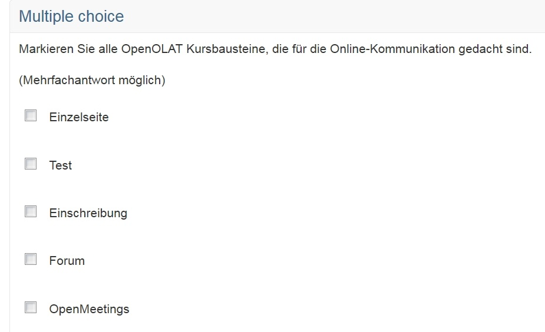
{ class=thumbnail-sm }

**Tab "Auswahl** 
Im Reiter "Auswahl" wird zuerst ein kurzer Titel und die Frage eingegeben.

Anschliessend wird ausgewählt, ob die Reihenfolge der Antworten zufällig und die Ausrichtung der Antworten vertikal oder horizontal erscheinen soll und ob die Check-Boxen links oder rechts ausgerichtet sind.

Dann können Antworttexte eingefügt werden. Zusätzliche Antworten erstellen Sie mit der Schaltfläche { class=size16 }, entfernt werden die Antworten mit der Schaltfläche { class=size16 }.

Die richtigen Antworten können Sie bestimmen, indem Sie in der Spalte _Korrekt_ die gewünschten Antworten markieren. Die Reihenfolge der Antworten können Sie mit den Pfeilen verändern.

**Tab "Punkte** 
Für MC-Fragen werden 3 Bewertungsmethoden  unterstützt:

* **Alle korrekten Antworten** 
Um die volle Punktzahl zu erhalten, müssen alle richtigen Antworten ausgewählt werden. Wenn eine oder mehrere richtige Antworten nicht ausgewählt werden oder eine oder mehrere falsche Antworten ausgewählt werden, wird die Endpunktzahl 0 sein.

* **Punkte pro Antwort** 
Positive und negative Punktevergabe sind für jede einzelne Antwortoption konfigurierbar.

* **Teilpunkte** 
Für jede richtig ausgewählte Antwort wird eine gewichtete Punktzahl addiert, während für jede falsch ausgewählte Antwort eine gewichtete Punktzahl abgezogen wird. Es wird die folgende Formel verwendet: 
Punktzahl = maximale Punktzahl * (Anzahl der richtig markierten Antworten / Anzahl der richtigen Antworten) - maximale Punktzahl * (Anzahl der falsch markierten Antworten / Anzahl der falschen Antworten)

 

**Tab "Feedback"** 
Ferner kann im Reiter "Feedback" neben der genauen Punktevergabe auch die Anzahl der Antwortmöglichkeiten des Users definiert werden.

---

## Kprim {: #kprim}

{ class=size24 }

Eine Kprim-Frage besteht immer aus einer Frage und genau vier Antworten. Für jede dieser vier Antworten muss die Testperson entscheiden, ob sie zutrifft oder nicht. Es können 0-4 Antworten richtig sein.

Zuerst werden ein kurzer Titel und die Frage eingegeben.

Anschliessend wird ausgewählt, ob die Reihenfolge der Antworten zufällig erscheinen soll und ob die Check-Boxen links oder rechts ausgerichtet sind.

Dann können Antworttexte eingefügt werden. Die Reihenfolge der Antworten können Sie mit den Pfeilen verändern. Es können keine neuen Antworten hinzugefügt und auch keine Antworten gelöscht werden. Für jede Frage muss ausgewählt werden, ob sie Richtig oder Falsch ist.

Das Punkteschema ist bei Kprim Fragen vorgegeben. Folgende Punktzahlen können erreicht werden:

Alle Antworten korrekt = 100% der Punktzahl 
3 korrekte Antworten = 50% der Punktzahl 
2, 1 oder 0 korrekte Antworten = 0% der Punktzahl

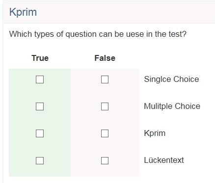{ class="thumbnail-xl" }

---

## Matrix [:octicons-tag-16:{ title="ab Release 11.2 (OO-2343)" }](https://track.frentix.com/issue/OO-2343) {: #matrix}

{ class=size24 }

Eine Matrix-Frage besteht aus mehreren Spalten und Zeilen, wobei die Antwort entweder als Single Choice oder als Multiple Choice pro Zeile ausgefüllt werden kann.

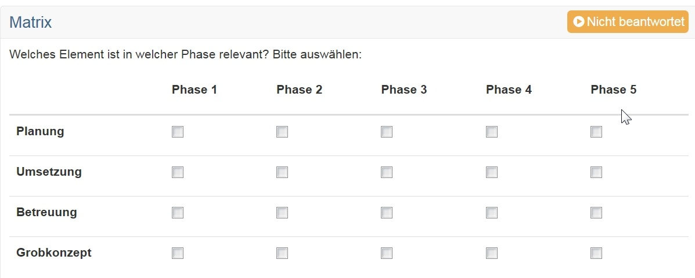{ class="shadow" }

**Tab "Matrix"** 
Wiederum werden zuerst der Titel und die Frage eingetragen.

Anschliessend wird ausgewählt, ob die Reihenfolge der Antworten zufällig
erscheinen soll und ob die Antworten als Single oder Multiple Choice möglich sind.

Dann können sowohl in den Kolonnen als auch in den Zeilen die gewünschten Werte eingetragen werden. Falls mehr Kolonnen oder Zeilen benötigt werden, können diese mit den entsprechenden Schaltflächen hinzugefügt werden. Zum Schluss müssen pro Zeile die korrekten Antworten ausgewählt werden. Bei Single Choice ist dies eine korrekte Antwort pro Zeile, bei Multiple Choice können dies mehrere korrekte Antworten pro Zeile sein.

**Tab "Punkte** 
Für MC-Fragen werden 3 Bewertungsmethoden  unterstützt:

* **Alle korrekten Antworten** 
Um die volle Punktzahl zu erhalten, müssen alle richtigen Antworten ausgewählt werden. Wenn eine oder mehrere richtige Antworten nicht ausgewählt werden oder eine oder mehrere falsche Antworten ausgewählt werden, wird die Endpunktzahl 0 sein.

* **Punkte pro Antwort** 
Positive und negative Punktevergabe sind für jede einzelne Antwortoption konfigurierbar.

* **Teilpunkte** 
Für jede richtig ausgewählte Antwort wird eine gewichtete Punktzahl addiert, während für jede falsch ausgewählte Antwort eine gewichtete Punktzahl abgezogen wird. Es wird die folgende Formel verwendet: 
Punktzahl = maximale Punktzahl * (Anzahl der richtig markierten Antworten / Anzahl der richtigen Antworten) - maximale Punktzahl * (Anzahl der falsch markierten Antworten / Anzahl der falschen Antworten)

---

## Drag&Drop [:octicons-tag-16:{ title="ab Release 11.5 (OO-2732)" }](https://track.frentix.com/issue/OO-2732) {: #drag_drop}

{ class=size24 }

Eine Drag&Drop-Frage verhält sich im Grunde gleich wie die Matrix Frage. Die Testteilnehmer müssen die Antworten jedoch nicht in Checkboxen ankreuzen, sondern können die Begriffe in die entsprechenden Kategorien verschieben.

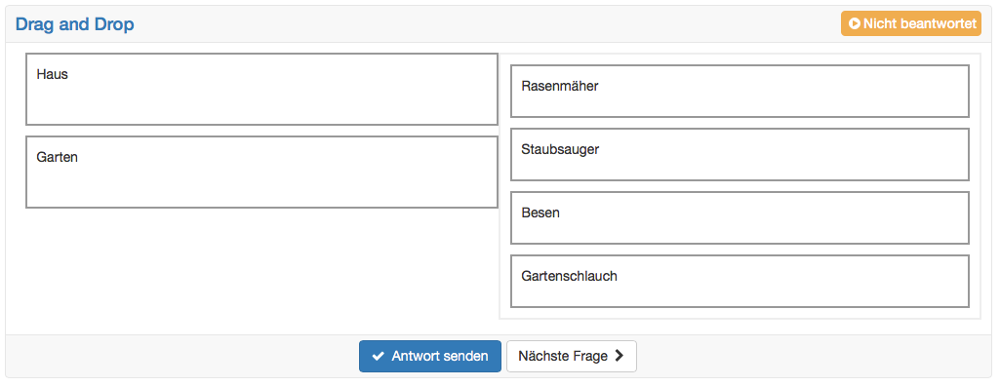{ class="shadow" }

**Tab "Drag and drop"** 
Zuerst werden der Titel und die Frage eingetragen.

Dann kann die Reihenfolge der Begriffe und Kategorien auf zufällig, ja oder nein gesetzt werden.

Wenn der Typ Single Choice gewählt wird, kann jeder Begriff nur einmal zugeordnet werden. Bei Multiple Choice kann jeder Begriff einmal in jede Kategorie zugeordnet werden, jedoch nicht zweimal in die selbe Kategorie.

Bei der Ausrichtung der Antworten wird definiert, wo sich die zuzuordnenden Begriffe in Bezug auf die Kategorien befinden.

Dann werden in den Spalten Kategorien definiert. Kategorien sind die fixen Elemente, in welche die Begriffe gezogen werden. In den Zeilen werden Begriffe hinzugefügt. Die Begriffe können anschliessend mit Drag&Drop in die Kategorien gezogen werden.

**Tab "Punkte** 
Für MC-Fragen werden 3 Bewertungsmethoden  unterstützt:

* **Alle korrekten Antworten** 
Um die volle Punktzahl zu erhalten, müssen alle richtigen Antworten ausgewählt werden. Wenn eine oder mehrere richtige Antworten nicht ausgewählt werden oder eine oder mehrere falsche Antworten ausgewählt werden, wird die Endpunktzahl 0 sein.

* **Punkte pro Antwort** 
Positive und negative Punktevergabe sind für jede einzelne Antwortoption konfigurierbar.

* **Teilpunkte** 
Für jede richtig ausgewählte Antwort wird eine gewichtete Punktzahl addiert, während für jede falsch ausgewählte Antwort eine gewichtete Punktzahl abgezogen wird. Es wird die folgende Formel verwendet: 
Punktzahl = maximale Punktzahl * (Anzahl der richtig markierten Antworten / Anzahl der richtigen Antworten) - maximale Punktzahl * (Anzahl der falsch markierten Antworten / Anzahl der falschen Antworten)

!!! info "Hinweis: Einschränkung auf mobile Geräte"

    Dieser Fragetyp wird durch Ziehen der Antwortelemente bedient und ist für die Touch-Bedienung nicht optimiert. Er eignet sich am besten für Tests, welche die Teilnehmer an einem Desktop-Gerät oder Laptop bearbeiten.

---

## True/false [:octicons-tag-16:{ title="ab Release 12.4 (OO-3220)" }](https://track.frentix.com/issue/OO-3220) {: #true_false}

{ class=size24 }

Eine True/False-Frage ähnelt dem Kprim-Fragentyp, jedoch mit beliebiger Zeilenzahl Pro Zeile müssen Aussagen bewertet werden.

Benutzer wählen aus einer von drei Antwortoptionen aus: "Unbeantwortet", "Richtig", "Falsch". Die Spalte "Unbeantwortet" ist immer vorausgewählt. Es können keine weiteren Spalten hinzugefügt werden.

Anders als bei KPrim können die Punkte frei gewählt werden. Für die Antwortoption "Unbeantwortet" können ebenfalls Punkte vergeben werden.

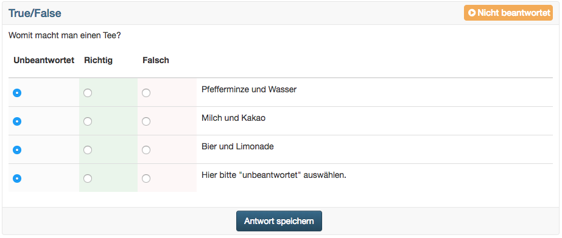{ class="shadow" }

---

## Lückentext {: #gap}

{ class=size24 }

Eine Lückentextfrage besteht aus einem Text in dem (Text-)Lücken integriert sind. Lücken können über das Icon mit den drei Punkten per Editor eingefügt und per Klick auf die Lücke überarbeitet werden. Der Dialog "Lücke erstellen" bzw. "Lücke bearbeiten" zeigt oben die Eingabemethode der Lücke an und stellt die Konfiguration in einer Vorschau dar. [:octicons-tag-16:{ title="ab Release 21.0 (OO-9385)" }](https://track.frentix.com/issue/OO-9385)

Für jede Lücke können folgende Einstellungen vorgenommen werden:

* Lösung: In diesem Feld wird die korrekte und erwünschte Lösung eingetragen.
* Alternative Antworten: Mit diesem Schalter werden weitere akzeptierte Lösungen als Varianten erfasst. Mit "Antwort hinzufügen" wird je ein Feld ergänzt, mit "Mehrfach hinzufügen" werden mehrere Varianten auf einmal erfasst, getrennt durch ein wählbares Trennzeichen.
* Anzeige:
    * Platzhalter: Wenn gewünscht, kann hier ein Platzhaltertext für die Teilnehmer eingetragen werden.
    * Lückenlänge: Hier kann eine maximale Länge für das Lückenfeld eingetragen werden, z.B. zur Formatierung. Es hat keine Auswirkungen auf die tatsächliche Länge des Eintrages.
    * Vorschau: Zeigt an einem Beispielsatz direkt im Dialog, wie die Lücke mit Platzhalter und Lückenlänge dargestellt wird.
* Optionen: Über die Checkbox-Gruppe "Korrektur" wird festgelegt, wie streng die Antworten automatisch korrigiert werden:
    * Gross- und Kleinschreibung beachten: Wenn diese Option gewählt ist, wird die Gross-/Kleinschreibung beachtet. Ansonsten ist es egal, ob die Lösungen gross oder klein geschrieben werden.
    * Leerzeichen ignorieren: Zusätzliche Leerzeichen, Tabulatoren und Zeilenumbrüche in der Antwort führen nicht zur Abwertung. So wird z.B. bei der Lösung "log in" auch eine Eingabe mit doppeltem Leerzeichen als richtig gewertet. [:octicons-tag-16:{ title="ab Release 21.0 (OO-9560)" }](https://track.frentix.com/issue/OO-9560)
    * Wildcard: Das Zeichen * steht in der Lösung für "etwas oder nichts" und kann auch in den Varianten verwendet werden. So deckt z.B. die Lösung "col*r" die Schreibweisen "color", "colour" und "colr" ab. Geben Teilnehmer selbst ein * ein, wird es als normales Zeichen behandelt. Eine Lösung, die nur aus Wildcards besteht, wird beim Speichern nicht akzeptiert. [:octicons-tag-16:{ title="ab Release 21.0 (OO-9384)" }](https://track.frentix.com/issue/OO-9384)

Die Punkte können frei gewählt werden. Es können auch Punkte für Antwortalternativen vergeben werden.

Sobald mindestens zwei Lücken eine identische Antwortmöglichkeit enthalten, ist im Tab "Punkte" die Option "Doppelte Eingaben erlauben" verfügbar. Darüber kann die Eingabe der gleichen Antwort in mehrere Lücken zugelassen oder unterbunden werden.

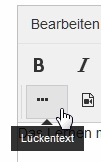

---

## Lückentext mit Dropdown [:octicons-tag-16:{ title="ab Release 17.0.0 (OO-6270)" }](https://track.frentix.com/issue/OO-6270) {: #gap_dropdown}

{ class=size24 }

Beim Lückentext mit Dropdown handelt es sich im Prinzip um eine Kombination aus Lückentext und Single-Choice-Auswahl. Ähnlich wie beim Lückentext werden in einen Fliesstext Lückenelemente eingebaut. Diesen Lücken werden dann unter "Antwortmöglichkeiten" mehrere Antworten zugeordnet; die korrekte Antwort wird als Lösung markiert.

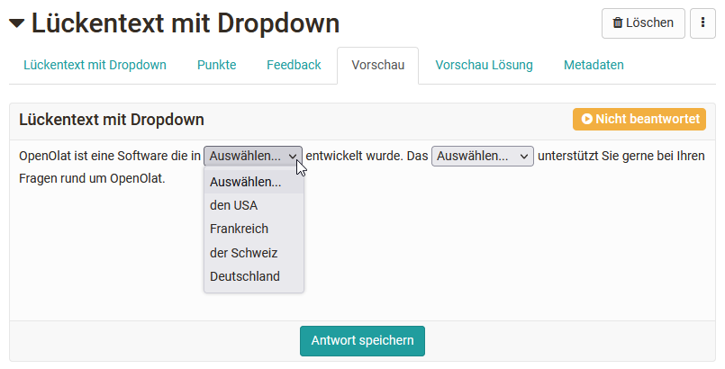{ class="shadow" }

Unter "Anzeige" legt die Option "Reihenfolge der Antwortoptionen" fest, ob die Antworten den Teilnehmern in zufälliger Reihenfolge oder in der vorgegebenen, von Ihnen erfassten Reihenfolge angezeigt werden. [:octicons-tag-16:{ title="ab Release 21.0 (OO-9385)" }](https://track.frentix.com/issue/OO-9385)

Ferner können auch globale Antwortmöglichkeiten für die Lücken verwendet werden. Diese werden über "Globale Antwort hinzufügen" einmal pro Frage definiert und dann in jeder Lücke der jeweiligen Frage angezeigt; der User muss die für diese Lücke passende Antwort auswählen.

Die Punktevergabe kann sowohl pauschal über alle Lücken erfolgen als auch für jede Antwort einer Lücke separat konfiguriert werden.

---

## Lückentext numerisch {: #numeric_input}

{ class=size24 }

Der Lückentext numerisch verhält sich vom Prinzip her gleich wie der Lückentext. Als Lösung können hier jedoch nur Zahlen und nicht Texte eingegeben werden. [:octicons-tag-16:{ title="ab Release 21.0 (OO-9385)" }](https://track.frentix.com/issue/OO-9385)

Für jede Lücke können folgende Einstellungen vorgenommen werden:

* Lösung: In diesem Feld wird die korrekte und erwünschte Lösung eingetragen.
* Toleranz: Ist der Schalter ausgeschaltet, muss die Antwort exakt der eingegebenen Lösung entsprechen. Ist er eingeschaltet, akzeptiert die Lücke Antworten zwischen einer unteren und einer oberen Grenze. Dabei stehen zwei Modi zur Auswahl:
    * Absolut: "Untere Grenze" und "Obere Grenze" werden als absolute Zahlen eingetragen.

		_Beispiel:_ Lösung 20, untere Grenze 18, obere Grenze 20,8 → Alle Lösungen zwischen 18 und 20,8 sind korrekt.

    * Relativ: "Untere Grenze" und "Obere Grenze" werden als relative Zahlen in Prozent eingetragen.

		_Beispiel:_ Lösung 20, untere Grenze 10, obere Grenze 10 → Alle Lösungen zwischen 18 und 22 sind gültig, denn die untere Grenze bedeutet minus 10% (20-2) und die obere Grenze plus 10% (20+2).

* Anzeige:
    * Platzhalter: Wenn gewünscht, kann hier ein Platzhalter eingetragen werden. Dieser erscheint im Text in der Lücke und ist für die Teilnehmer sichtbar.
    * Lückenlänge: Hier kann eine maximale Länge für das Lückenfeld eingetragen werden, z.B. zur Formatierung. Es hat keine Auswirkungen auf die tatsächliche Länge des Eintrages.
    * Vorschau: Zeigt an einem Beispielsatz direkt im Dialog, wie die Lücke dargestellt wird.

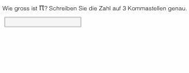{ class="shadow" }

---

## Lückentext gemischt [:octicons-tag-16:{ title="ab Release 21.0 (OO-9385)" }](https://track.frentix.com/issue/OO-9385) {: #gap_mixed}

Der Lückentext gemischt kombiniert die drei Lückenarten in einer einzigen Frage: Text-Lücken, numerische Lücken und Lücken mit Dropdown können gemeinsam in denselben Fliesstext eingebaut werden. So lässt sich z.B. eine Rechenaufgabe samt Begründung in einer Frage abbilden, ohne dafür mehrere Einzelfragen zu erstellen.

Beim Einfügen einer Lücke wird die gewünschte Eingabemethode gewählt. Jede Lücke wird anschliessend über den gleichen Dialog konfiguriert wie beim jeweiligen einzelnen Fragetyp; die Eingabemethode der Lücke wird oben im Dialog angezeigt.

Enthält die Frage Lücken mit Dropdown, können zusätzlich globale Antwortmöglichkeiten definiert werden (siehe [Lückentext mit Dropdown](#gap_dropdown)).

Bestehende Fragen der Typen Lückentext und Lückentext numerisch, die sowohl Text- als auch numerische Lücken enthalten, zeigen im Frageneditor einen Hinweis an. Mit der Aktion "Zu 'Lückentext gemischt' konvertieren" wird eine solche Frage in den neuen Fragetyp umgewandelt.

---

## Hottext [:octicons-tag-16:{ title="ab Release 11.4 (OO-2610)" }](https://track.frentix.com/issue/OO-2610) {: #hottext}

{ class=size24 }

Die Hottext-Frage verhält sich ähnlich wie ein Lückentext. In einem Fliesstext werden verschiedene Begriffe markiert, welche anschliessend vom Testteilnehmer ausgewählt werden können.

Zuerst wird ein kurzer Titel eingegeben.

Anschliessend wird ein Text geschrieben und die gewünschten Auswahlbegriffe als Hottext markiert. Zum Schluss müssen die korrekten Antworten markiert werden, indem die Checkbox angewählt wird.

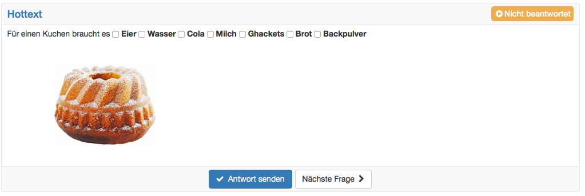{ class="shadow" }

---

## Hotspot {: #hotspot}

{ class=size24 }

Bei einer Hotspot-Frage werden Hotspots bzw. Bereiche grafisch auf einem Bild dargestellt und müssen vom Testteilnehmer korrekt ausgewählt werden. Dabei kann die Frage sowohl als Single- oder Multiple-choice Frage gestaltet werden. Diverse Feineinstellungen wie die Hot-Spotform, die Farbe des Hotspots, Anpassung der Bildgrösse sowie eine erweiterte Bearbeitung ermöglichen eine optimale Darstellung. Die Auswahlspots sind für die Teilnehmenden sichtbar.

### Vorgehen

* Zuerst werden ein kurzer Titel und die Frage eingegeben.
* Anschliessend wird das gewünschte Bild hochgeladen.
* Dann können Spots in Form von Kreis oder Viereck auf dem Bild platziert werden. In der erweiterten Bearbeitung lassen sich Spots auch einfach duplizieren.
* Zum Schluss müssen noch die korrekten Antworten ausgewählt werden.

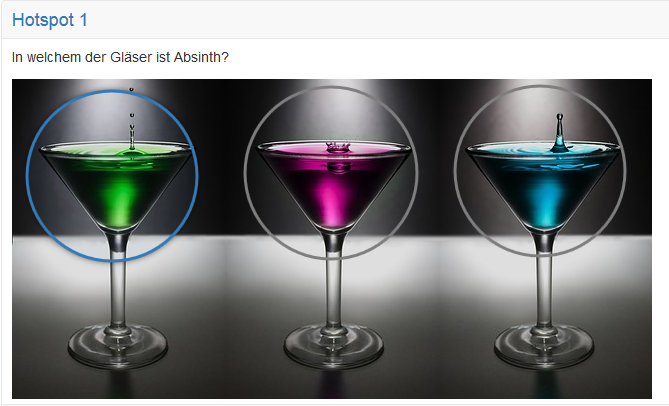{ class="shadow" }

---

## Reihenfolge [:octicons-tag-16:{ title="ab Release 15.0 (OO-4456)" }](https://track.frentix.com/issue/OO-4456) {: #order}

{ class=size24 }

Bei diesem Fragetyp müssen die Lernenden Elemente (Texte oder Bilder) in eine korrekte Reihenfolge bringen. Dabei verhält sich dieser Fragetyp ähnlich wie eine Drag&Drop-Frage.

Zuerst werden der Titel und die Frage eingetragen.

Dann können die Antworten in korrekter Reihenfolge eingetragen und die Ausrichtung der Darstellung vertikal oder horizontal gesetzt werden.

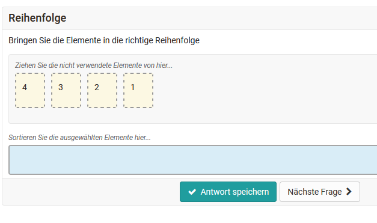{ class="shadow" }

!!! info "Hinweis: Einschränkung auf mobile Geräte"

    Dieser Fragetyp wird durch Ziehen der Antwortelemente bedient und ist für die Touch-Bedienung nicht optimiert. Er eignet sich am besten für Tests, welche die Teilnehmer an einem Desktop-Gerät oder Laptop bearbeiten.

---

## Freitext* {: #essay}

{ class=size24 }

Die Antwort auf die Freitext-Frage füllen Testteilnehmer frei formuliert in ein Textfeld beliebiger Grösse ein. Im Test muss die Freitext-Frage gesondert manuell bewertet werden.

Zuerst werden ein kurzer Titel und die Frage eingegeben.

Anschliessend können folgende Optionen ausgewählt werden:

* Platzhalter: Wenn gewünscht, kann hier ein Platzhaltertext eingetragen werden. Dieser erscheint im Textfeld und ist für die Teilnehmer sichtbar.
* Höhe (Anzahl Zeilen): Hier kann die Grösse des Textfeldes definiert werden. Die Zeilenzahl ist jedoch nicht einschränkend. Das Feld scrollt weiter, wenn Teilnehmer mehr Zeilen eintragen.
* Min. Anzahl Wörter: Diese Anzahl Wörter muss mindestens geschrieben sein, damit die Aufgabe gesendet werden kann.
* Max. Anzahl Wörter: Diese Anzahl Wörter darf maximal geschrieben sein, damit die Aufgabe gesendet werden kann. Die Eingabe dient der Begrenzung der Eingabe.
* Copy/paste erlauben: Hier definieren Sie, ob die Lernenden Inhalte per copy+paste oder per Drag&Drop aus einer externen Quelle einfügen dürfen. Internes Verschieben von Text innerhalb desselben Feldes bleibt davon unabhängig weiterhin möglich. [:octicons-tag-16:{ title="ab Release 20.3.2 (OO-9472)" }](https://track.frentix.com/issue/OO-9472)

Freitext-Fragen sind mit einer festen Schriftbreite und der Tabulator-Funktion ausgestattet. Antworten können somit besser formatiert und zum Beispiel Spalten abgebildet werden.

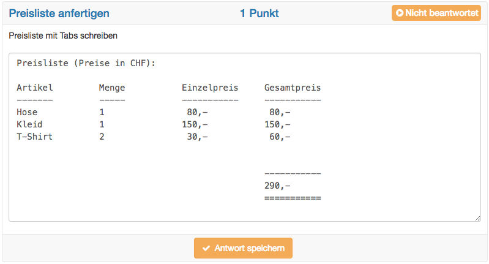{ class="shadow" }

!!! info "Autosave"

	Mit dem Fragetyp Freitext werden oft Aufsätze geschrieben. Dieser Fragetyp hat deshalb eine Autosave-Funktion, welche den geschriebenen Text jede Minute speichert. Weitere Informationen zur Konfiguration von Aufsätzen finden Sie im Exkurs unterhalb dieser Tabelle.

---

## Datei hochladen* [:octicons-tag-16:{ title="ab Release 11.2 (OO-2344)" }](https://track.frentix.com/issue/OO-2344) {: #file_upload}

{ class=size24 }

Bei diesem Fragetyp müssen die Testteilnehmenden als Antwort eine Datei hochladen.

Es werden ein kurzer Titel und die Frage eingegeben sowie definiert wieviele Upload Felder zur Verfügung stehen. Mit den Upload Feldern kann die Anzahl der maximal hochzuladenden Dateien festgelegt werden. Die Höchstzahl beträgt generell 10 Upload Felder.

Eine korrekte Antwort kann nicht markiert, da die Auswertung dieses Fragetyps ausschliesslich manuell möglich ist.

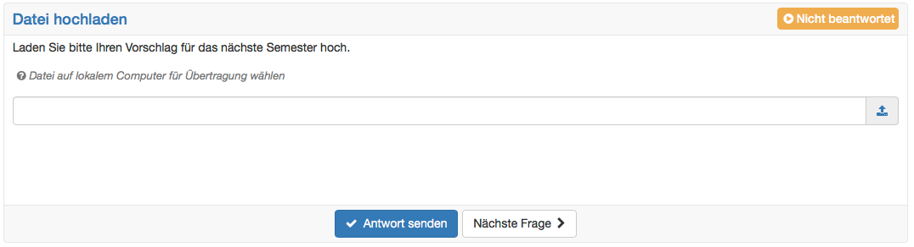{ class="shadow" }

---

## Zeichnen* {: #draw}

{ class=size24 }

Die Testteilnehmenden haben beim Fragetyp Zeichnen die Aufgabe, ein vorgegebenes Bild mit den zur Verfügung stehenden Zeichnungsinstrumenten zu bearbeiten.

Zuerst wird ein kurzer Titel und die Frage, respektive die Bearbeitungsanweisung eingegeben.

Anschliessend wird ein Bild als Hintergrund hochgeladen. Dieses Bild muss dann von den Testteilnehmenden bearbeitet werden. Es muss keine Antwort angegeben werden, da die Auswertung dieses Fragetyps ausschliesslich manuell erfolgt.

Es ist auch möglich Text hinzuzufügen. Die Textgrösse können sie mithilfe der Pinselgrösse steuern.

!!! info "Hinweis: Einschränkung auf mobile Geräte"

    Dieser Fragetyp wird durch freihändiges Zeichnen bedient und ist für die Touch-Bedienung nicht optimiert. Er eignet sich am besten für Tests, welche die Teilnehmer an einem Desktop-Gerät oder Laptop bearbeiten.

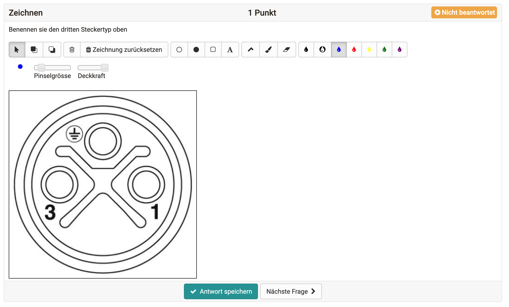{ class="shadow" }

!!! tip "Import von Fragen"

	Neben dem direkten Erstellen können Fragen auch intern aus dem OpenOlat [Fragenpool](../area_modules/Question_Bank.de.md) oder extern aus einer [Excel Datei](../area_modules/Data_Management.de.md#nutzung-der-datei-vorlage-excelimport) importiert werden.

??? abstract "Exkurs: Aufsatz schreiben"

	Mit der Lernressource Test und dem Fragetyp Freitext können im OpenOlat Aufsätze geschrieben werden. Dazu sind folgende Punkte zu beachten:

    * Die Autosave Funktion für den Fragetyp Freitext speichert den geschriebenen Text jede Minute. Die Uhrzeit der letzten Speicherung ist unten rechts sichtbar. Der Autosave verhindert, dass geschriebener Text verloren geht, wenn beispielsweise die Internetverbindung unterbrochen oder ein Session Timeout erreicht wird. Hat ein Teilnehmer die Antwort zur Frage nicht aktiv über den Button "Antwort speichern" abgegeben, wird der bereits per Autosave gespeicherte Inhalt im Korrektur-Workflow mit einem entsprechenden Hinweis angezeigt.
    * Falls es zu einem Unterbruch kommt, sollen die Testteilnehmer den Test nochmals starten können. Dies setzt folgende Einstellungen voraus:
        * Die Anzahl Versuche für den gesamten Test ist nicht eingeschränkt. Damit der Test später (nach Beenden des aktuellen Tests) nicht nochmals gestartet werden kann, wird er entweder im Save Exam Browser durchgeführt, oder die Sichtbarkeit ist auf den Prüfungsmodus beschränkt.
        * Das Unterbrechen des Tests ist erlaubt. So kommt der Testteilnehmer nach einem Unterbruch wieder dorthin zurück, wo er rausgeworfen worden ist. Der Text ist bis zur letzten Speicherung gespeichert. Es kann also zu kleinen Textverlusten kommen.
        * Die Anzahl Versuche für die Freitext Frage ist nicht eingeschränkt. Dies erlaubt es Testteilnehmer:innen, den geschriebenen Text immer wieder abzuschicken und dann weiterzuschreiben. Das regelmässige Abschicken des geschriebenen Textes gibt den Testteilnehmer:innen Sicherheit.
    * Falls der Test eine Zeitbeschränkung hat, wird der Text ganz am Schluss nur dann gespeichert, wenn er vor Ablauf der Zeit nochmals abgeschickt worden ist. Erinnern Sie die Testteilnehmer kurz vor Schluss daran, die Frage nochmals abzuschicken und anschliessend nichts mehr zu schreiben.

	Bei Beachtung dieser Empfehlungen kann ein Aufsatz im OpenOlat geschrieben werden.

[Zum Seitenanfang ^](#question_types)