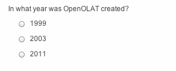
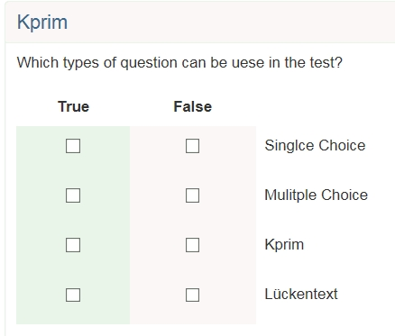
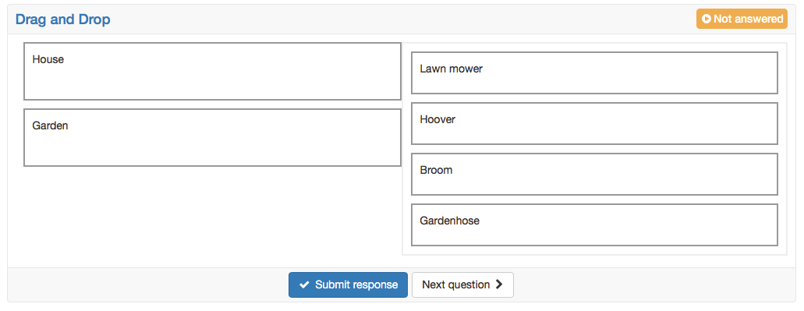
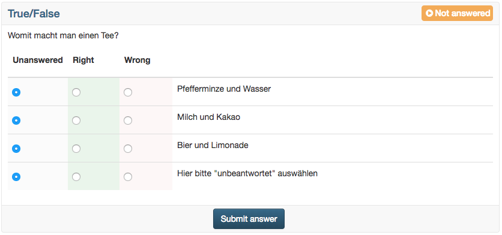
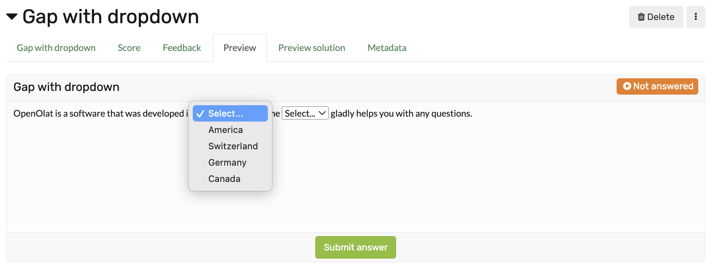
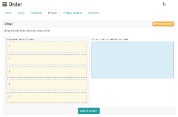
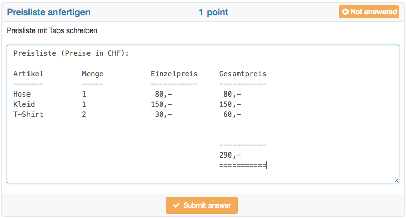
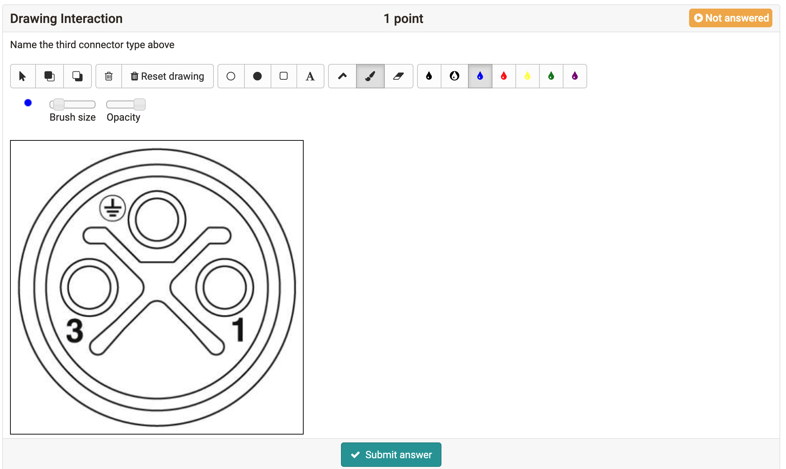

# Test question types {: #question_types}

The following question types can be used in OpenOlat tests:

The question types marked with an * must be evaluated manually.

## Single Choice {: #sc}

{ class=size24 }

A single-choice question consists of a question and answers, of which only one can be selected. In a test only one of those two answers is correct.

First a short title and a question are inserted.

Afterward it needs to be selected, if the questions should be shuffled, if the alignment of the questions is vertically or horizontally and if the checkboxes are aligned left or right.

Then the answer texts can be added. Additional answers can be added with the button { class=size16 }. Questions can be deleted with the button { class=size16 }.

The correct answer can be selected in column _Correct Answer_. The order of the questions can be changed with the arrows.

{ class="shadow" }

---

## Multiple Choice  {: #mc}

{ class=size24 }

A multiple-choice question comprises one question and at least two answers; several answers can be selected. In a test several answers can be correct.

{ class=thumbnail-sm }

**Tab "Choice"** 
First a short title and a question are inserted.

Afterward it need to be selected, if the questions should be shuffled, if the alignment of the questions is vertically or horizontally and if the check-boxes are aligned left or right.

Then the answer texts can be added. Additional answers can be added with the button { class=size16 }. Questions can be deleted with the button { class=size16 }.

The correct answers can be selected in column _Correct Answer_. The order of the questions can be changed with the arrows.

**Tab "Score"** 
3 assessment methods are supported for MC questions:

* **All correct answers** 
To receive the full score, all correct answers must be selected. If one or more correct answers are not selected or one or more incorrect answers are selected, the final score will be 0.

* **Score per answer** 
Positive and negative scoring can be configured for each individual answer option.

* **Partial score** 
A weighted score is added for each correctly selected answer, while a weighted score is subtracted for each incorrectly selected answer. The following formula is used: 
Score = maximum score * (number of correctly marked answers / number of correct answers) - maximum score * (number of incorrectly marked answers / number of incorrect answers)

 

**Tab "Feedback"** 
Furthermore, in the "Feedback" tab, the number of response options for the user can be defined in addition to the exact point allocation.

---

## Kprim {: #kprim}

{ class=size24 }

A Kprim question can only be used in a test. It comprises one questions and exactly four answers. The one taking that test has to decide for every single answer if it is correct or not. 0 to 4 answers can be correct.

First a short title and a question are inserted.

Afterward it needs to be selected, if the questions should be shuffled and if the check-boxes are aligned left or right.

Then answer texts can be inserted. The order of the questions can be changed with the arrows. No more answers can be added and no answers can be deleted. For every answer it must be chosen, if it is true or false.

For the assessment, the following score can be reached:

All correct answers = 100% score  
3 correct answers = 50% score  
2, 1 or 0 correct answers = 0% score

{ class="shadow" }

## Matrix {: #matrix}

{ class=size24 }

A matrix question consists of several rows and columns, where the answer can be filled in for every row, either as single choice or as multiple choice.

{ class="shadow" }

**Tab "Match"** 
Again first a title and the question are inserted.

Afterwards, it needs to be selected, if the questions should be shuffled and if the answers are single or multiple choice.

Then values can be added in the columns as well as in the rows. If more columns or rows are needed, they can be added with the corresponding button. Finally, the correct answer needs to be selected per row. For single choice it is one answer per row, for multiple choice several answers per row are possible.

**Tab "Score"** 
3 assessment methods are supported for MC questions:

* **All correct answers** 
To receive the full score, all correct answers must be selected. If one or more correct answers are not selected or one or more incorrect answers are selected, the final score will be 0.

* **Score per answer** 
Positive and negative scoring can be configured for each individual answer option.

* **Partial score** 
A weighted score is added for each correctly selected answer, while a weighted score is subtracted for each incorrectly selected answer. The following formula is used: 
Score = maximum score * (number of correctly marked answers / number of correct answers) - maximum score * (number of incorrectly marked answers / number of incorrect answers)

## Drag&Drop {: #drag_drop}

{ class=size24 }

In general the Drag&Drop questions has the same behavior as the matrix question. However, the test participants do not select the checkboxes, but move the items in the corresponding category.

{ class="shadow" }

**Tab "Drag and drop"** 
First a title and the question are inserted.

Afterward it need to be selected, if the questions and categories should be shuffled.

If the type single choice is selected, every item can be dropped only once. For multiple choice every item can be dropped in every category once, but not twice in the same category.

The alignment of the answers defines where the items in relation to the categories are set.

Then, the columns categories will be defined. Categories are the fix elements where the items will be dropped into. In the rows the items are added. With drag&drop the items can be moved into the categories afterward.

**Tab "Score"** 
3 assessment methods are supported for MC questions:

* **All correct answers** 
To receive the full score, all correct answers must be selected. If one or more correct answers are not selected or one or more incorrect answers are selected, the final score will be 0.

* **Score per answer** 
Positive and negative scoring can be configured for each individual answer option.

* **Partial score** 
A weighted score is added for each correctly selected answer, while a weighted score is subtracted for each incorrectly selected answer. The following formula is used: 
Score = maximum score * (number of correctly marked answers / number of correct answers) - maximum score * (number of incorrectly marked answers / number of incorrect answers)

!!! info "Note: Restriction to mobiles"

    This question type is not optimized for mobile devices.
  
## True/false {: #true_false}

{ class=size24 }

The question type True/False is similar to Kprim. In each line the
corresponding statement has to be assessed.

User can choose from three options: "Unanswered", "Right", "Wrong". "Unanswered" is selected by default. There is no option to add more columns.

The scores can be defined as needed. You may even give points for the option "Unanswered".

{ class="shadow" }

--

## Gap text {: #gap}

{ class=size24 }

A gap-text question consists of a text in which (text) gaps are integrated. Gaps can be inserted via the icon with the three dots by editor and revised by clicking on the gap.

For every gap the following attributes can be filled in:

* Solution: Fill in the correct and desired solution.
* Placeholder: If desired, a placeholder can be added. It appears in the text in the gap and is visible for the participant.
* Variants: Here, alternative solution possibilities are added via the plus sign in one field each.
Alternative solutions can be added via the plus icon if more than one solution is added, separated by semicolon every solutions gets an own field after saving.
* Gap size: Here you can enter a maximum length for the gap field, e.g. for formatting. It has no effect on the actual length of the entry.
* Case sensitive: If this checkbox is selected, there is a case sensitivity. Otherwise it doesn't matter if a solution is written in upper or lower cases.

The points can be chosen freely. Points can also be awarded for alternative answers.

If at least two gaps contain an identical answer option, the "Allow twice the same input" setting is available in the " Score" tab. This allows or prevents the entry of the same answer in multiple gaps.

{ class="shadow" }

{ class="shadow" }

{ class="shadow" }

---

## Gap text with dropdown {: #gap_dropdown}

{ class=size24 }

Gap text with dropdown is basically a combination of gap text and single-choice selection. Similar to the gap text, gap elements are integrated into a continuous text. These gaps can then be assigned several answer alternatives and the correct answer can be marked.

{ class="shadow" }

Furthermore, global answers can also be used for the gaps. These are then displayed in each gap of the respective question and the user must select the appropriate answer for this gap. 

Scoring can be done across all gaps as well as configured separately for each answer of a gap. 

## Numerical input {: #numeric_input}

{ class=size24 }

In general the numerical input is the same as the gap text. But as solution there are numbers required, not texts.

First a short title is inserted. Afterward the next is written with fields for the gaps. For every gap the following attributes can be filled in:

* Solution: Fill in the correct and desired solution.
* Placeholder: If desired, a placeholder can be added. It appears in the text in the gap and is visible for the participant.
* Gap size: Here you can enter a maximum length for the gap field, e.g. for formatting. It has no effect on the actual length of the entry.
* Tolerance: it can be chosen between three possibilities
    * Exact: The solution correlates exactly with the inserted solution in "Solution"
    * Absolute: A lower or upper bound can be defined for the solution, whereby the lower bound must be less than or equal to the solution and the upper bound must be greater than or equal to the solution. The solution is accepted up to the lower and upper bound. The bound represents an absolute number.

		_Example:_ Solution 20, lower bound 18, upper bound 20.8 → all solutions between 18 and 20.8 are correct.

    * Relative: The solution is accepted until a lower and an upper bound. The bound is a relative number in percent.

		_Example:_ Solution 20, lower bound 10, upper bound 10 → all solutions between 18 and 22 are correct, as the lower bound means minus 10% (20-2) and the upper bound plus 10% (20+2).

{ class="shadow" }

## Hottext {: #hottext}

{ class=size24 }

The hottext questions is similar to the gap text. In a running text different terms are marked, and can then be selected by the test participants.

First a short title is inserted.

Afterward a text is written and the selectable terms are marked as hottext. Finally the correct answers need to be marked by selecting the check boxes.

{ class="shadow" }

## Hotspot {: #hotspot}

{ class=size24 }

In a hotspot question, hotspots/areas are graphically presented on an image and need to be selected by the participant correctly. Thereby the question can be created either as single or as multiple choice question. Various fine adjustments as the hotspot form or color, the adjustment of the size as well as the advanced edit  allow an optimal visualization. The spots are visible for the participant.  

### Approach

* First a short title and a question are inserted.
* Afterward the desired picture is uploaded.
* Then spots in form of circles or rectangles can be placed on the image. In advanced editing, spots can also be easily duplicated.
* Finally, the correct answer needs to be selected.

{ class="shadow" }

## Order {: #order}

{ class=size24 }

This type of question requires learners to put elements (text or images) in a correct order. This question type behaves similar to a drag&drop question.

First the title and the question are entered.

Then the answers can be entered in the correct order and the alignment of the display can be set vertically or horizontally.

!!! info "Note: Restriction to mobiles"

    This question type is not optimized for mobile devices. Please take this into account when creating your question. 

{ class="shadow" }

## Essay* {: #fib}

{ class=size24 }

The answer to a free-text question is inserted into a field of variable size. In a test environment, the Essay question must be evaluated separately and manually.

First a short title and a question are inserted.

Afterward the following attributes can be chosen:

* Placeholder: If desired, a placeholder can be added. It appears in the text in the gap and is visible for the participant.
* Height (number of lines): Here can be defined, which height the textfield should have. This height is not restrictive. A participant can also write more lines than indicated here.
* Min. words: This number of words must at least be written, to be able to send the task.
* Max. words: This number of words can at most be written, to be able to send the task.
* Allow copy/paste: Here you define if the learners are allowed to copy+paste content.

Essay questions come with a pre-defined width and a tab function. Hence, answers can be formatted more easily, e.g. by displaying columns.

{ class="shadow" }
  
!!! info "Autosave"

	As the name already says, with this question type essays are often written. Thus this question type has got an autosave feature, which saves written text every minute. Further information about the configuration of essays can be found in the excursion below this table.

## File upload* {: #file_upload}

{ class=size24 }

For this question type participants need to upload a file.

A short title and the question are entered as well as the number of available upload fields. With the upload fields the maximum number of files to be uploaded can be defined. The maximum number of upload fields is 10.

No correct answer can be marked, as the assessment of this question type is only manually possible.

{ class="shadow" }

## Drawing* {: #draw}

{ class=size24 }

For the questions type drawing the participant get the task to edit a given picture with the available drawing tools.

First a short title and a question, or more an edit instruction are inserted.

Afterward a picture for the background is uploaded. This picture need to be edited by the test participants. No answer needs to be added, as the
assessment of this question type is done manually.

It is also possible for the participants to add text via the text tool. The text size can be customized using the brush size.

!!! info "Note: Restriction to mobiles"

    This question type is not optimized for mobile devices. Please take this into account when creating your question. 

{ class="shadow" }
  
!!! info "Import questions"

	Beside the direct creation, questions can also be imported out of the [question bank](../area_modules/Question_Bank.md) or by [Excel](../area_modules/Data_Management.md#usage-of-the-file-excel-import-template)

??? abstract "Digression – Writing essays"

	With the learning resource test and the question type essay, essays can be written in OpenOlat. The following points need to be considered:

    * The autosave feature for the question type essay saves the written text every minute. The time of the last storage is visible on the bottom right. Autosave prevents the test participants from losing written text, for e.g. if the internet connection is broken or a session time out is reached. If a participant has not actively submitted the answer to the question via the "Submit answer" button, the content already saved via autosave is displayed in the correction workflow with a note to this effect.
    * If it comes to an interruption, the test participants should be able to start the test again. So the following settings need to be met:
        * The number of attempts for the whole test should not be limited. To make sure that the test is not started again at a later point (after the actual test time), it can be done with the Save Exam Browser or in the assessment mode.
        * Suspending the test is allowed. So after an interruption the test participant comes back to where they left. The text is stored until the last saving. There can be some small text losses.
        * The number of attempts for the essay question is not limited. This allows test participants to submit the written text over and over again and continue writing. The regular submitting of the written text gives security to the test participants.
    * If a test has a time limit, the text is saved at the very end only if it is submitted right before the time is running out. Please remind your test participants shortly before test end to submit the question one more time and not writing anything anymore afterward.

	If considering these recommendations an essay can be written in OpenOlat.

[To the top of the page ^](#question_types)