# Test Einstellungen - Administration {: #test_settings}

Im Bereich `Test > Administration` finden Sie, ähnlich wie bei anderen Lernressourcen, weitere Menüs. Hier konfigurieren Sie den Test näher. Besonders wichtig sind dabei die Menüs "Einstellungen" und "Inhalt editieren". Den Bereich sehen Besitzer:innen der Lernressource, Lernressourcenverwalter:innen und Administrator:innen.

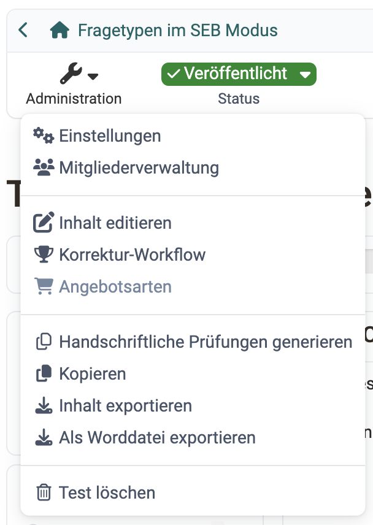{ class="shadow lightbox" }

Die grundsätzliche Konfiguration des gesamten Tests erfolgt grösstenteils in den **"Einstellungen"**, besonders im Tab "Optionen" (siehe unten).

Das Menü **"Mitgliederverwaltung"** ist besonders dann relevant, wenn der Test kursunabhängig verwendet werden soll, ansonsten erfolgt die Mitgliederverwaltung der Test-Teilnehmenden über den verbundenen Kurs. 

Unter "Inhalt editieren" gelangen Sie in den Testeditor. Hier legen Sie den eigentlichen Test an.

!!! note "Testeditor QTI 2.1"
    Übersicht zum Testeditor. 
    [Inhalt editieren](Test_editor_QTI_2.1.de.md)

Das **"Bewertungswerkzeug"** des Tests erscheint nur, wenn der Test kursunabhängig verwendet werden soll: `Test > Administration > Einstellungen > Tab "Freigabe"`, Verwendungszweck "Eigenständige".

Im Menü **"Korrektur-Workflow"** können für den Test Korrektor:innen hinzugefügt werden (siehe unten). 

Das Menü **"Test Statistiken"** erscheint nur bei unabhängigen Tests, ansonsten werden die Test Statistiken im jeweiligen Kursmenü angezeigt.

Das Menü **"Angebotsarten"** ist nur aktiv, wenn der Test buchbar konfiguriert wurde.

Mit Hilfe eines Wizards können basierend auf dem Online-Test **"Handschriftliche Prüfungen"** generiert werden (siehe unten). 

Über die Menüs "Kopieren", "Inhalt exportieren" und "Als Worddatei exportieren" können die Tests kopiert bzw. gespeichert werden. 

**"Test löschen"** löscht die Lernressource Test. Sie finden sie anschliessend im Autorenbereich im Tab "Gelöscht".

Auf dieser Seite finden Sie nähere Erläuterungen zu folgenden Administrationsmenüs der Lernressource Test:

* Einstellungen
* Korrektur-Workflow
* Handschriftliche Prüfungen generieren
* Als Worddatei exportieren

[zum Seitenanfang ^](#test_settings)

---

## "Einstellungen" eines Tests {: #settings}

Wichtig für Tests ist vor allem der Tab "Optionen". Hier konfigurieren Sie den gesamten Test.  

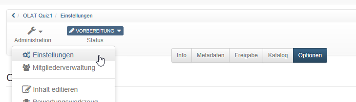{ class="shadow lightbox" }

Darüber hinaus können in den weiteren Tabs "Info", "Metadaten", "Freigabe" und "Katalog" weitere Einstellungen der Lernressource vorgenommen werden. Achten Sie hier besonders darauf, dass die eingestellte Lizenzangabe unter "Metadaten" Ihren Vorstellungen entspricht.

### Tab Optionen [:octicons-tag-16:{ title="ab Release 20.3.0 (OO-8321)" }](https://track.frentix.com/issue/OO-8321)

Folgende Konfigurationen können vorgenommen werden:

**Standardeinstellungen**

Hier wählen Sie eine vorkonfigurierte Auswahl von typischen Einstellungen für unterschiedliche Nutzungssituationen von Tests.

Entscheiden Sie z. B., ob es sich um einen summativen oder formativen Test handelt, oder verwenden Sie eine andere voreingestellte Konfiguration. Das erleichtert es gerade unerfahrenen Autoren schnell zu einer passenden Einstellung zu gelangen. Spätere Änderungen und individuelle Anpassungen sind aber weiterhin möglich.

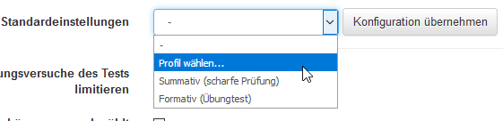{ class="shadow lightbox" }

**Anzahl der Testversuche einschränken**

Aktivieren Sie diese Option, um die Anzahl der möglichen Lösungsversuche für einen Test zu limitieren. Tragen Sie im Feld "Max. Anzahl Versuche" die gewünschte Anzahl ein. Der Wert kann maximal 20 betragen.

**Erster bestandener Lösungsversuch zählt**

Sobald das Ergebnis "bestanden" erreicht wird, können Teilnehmende den Test nicht noch einmal durchführen.

**Anonyme Benutzer (Gäste) erlauben {:#guest}** 

Personen ohne OpenOlat Account können ebenfalls den Test absolvieren. Gäste können den Test jedoch nicht unterbrechen. Es werden nur abgeschlossene Tests gezählt. Die Resultate stehen ebenfalls in der Teststatistik zur Verfügung.

**Nur Modul anzeigen, LMS ausblenden**

Diese Auswahl wird gewählt, um zu verhindern, dass Teilnehmende während eines Tests auf andere OpenOlat-Funktionen Zugriff haben. OpenOlat wird dabei ausgeblendet und erst wieder nach Beenden des Tests angezeigt.

**Fragetitel anzeigen**

Markieren Sie die Checkbox, um den Teilnehmenden die Titel der Fragen anzuzeigen. Wenn die Titel nicht angezeigt werden sollen, aber die Navigation aktiviert ist, dann erscheint in der Menü-Navigation ein anonymisierter Titel.  

**Menu-Navigation anzeigen** 

Wenn Sie die Menu-Navigation _nicht_ erlauben:

* ist am Test "nicht lineare Navigation" eingestellt, kann die Navigation unterhalb der Frage über einen Button aufgerufen werden, um eine andere Frage auszuwählen.
* ist am Test "lineare Navigation" eingestellt, erscheint nach dem Abschicken einer Antwort automatisch die nächste Frage und Teilnehmende können nicht zu anderen Fragen navigieren.

**Persönliche Notizen {:#notes}**

Sie können den Teilnehmenden erlauben, während des Tests persönliche Notizen zu erstellen, die nach Abschluss des Tests nicht mehr zur Verfügung stehen.

**Anzahl Fragen und Fortschritt im Test anzeigen**

Markieren Sie die Checkbox, um den Teilnehmenden die Anzahl Fragen anzuzeigen.  

**Anzahl Punkte und Punktestand im Test anzeigen**

Markieren Sie die Checkbox, um den Teilnehmenden ihre momentane Punktezahl im Testverlauf anzuzeigen.

**Max. Punkte der Frage anzeigen** 

Ist die Checkbox markiert, werden die maximal erreichbaren Punkte pro Frage im Test angezeigt.  

**Unterbrechen erlauben**

Das Ankreuzen der Checkbox bewirkt, dass Teilnehmende den Test unterbrechen können. Hierbei werden die bisherigen Antworten gespeichert und sie haben die Möglichkeit zu einem späteren Zeitpunkt mit der Beantwortung der Fragen fortzufahren.

**Abbrechen erlauben**

Mit dem Ankreuzen der Checkbox erlauben Sie den Teilnehmenden den Test abzubrechen, ohne dass die Antworten gespeichert werden.  

**Testquittung erstellen**

Wenn diese Option angewählt wird, wird nach Beenden des Tests eine Testquittung erstellt, welche als XML-File heruntergeladen werden kann. Es dient der Verifizierung des Tests.

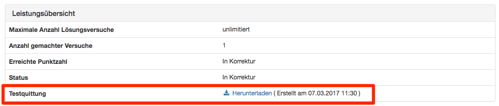{ class="shadow lightbox" }

Wenn die Option "Testquittung erstellen" ausgewählt ist, kann die Option Testquittung per Mail schicken zusätzlich aktiviert werden. Das erstellte XML-File wird dann zusätzlich per Mail an die Teilnehmenden verschickt.

**Feedbacks anzeigen**

Solange diese Checkbox ausgewählt ist, werden die Feedbacks im Testverlauf angezeigt. Wenn die Checkbox nicht mehr ausgewählt ist, werden keine Feedbacks mehr angezeigt. Dies betrifft die Feedbacks aller Frageitems und auch das Feedback, welches auf der Ebene Test hinzugefügt werden kann. Die einzelnen Feedbacks werden im Testeditor konfiguriert.  

**Resultate nach Testabschluss anzeigen {:#results}**

Wenn diese Checkbox ausgewählt ist, wird das Resultat nach Beenden des Tests angezeigt. Was genau angezeigt wird, kann ausgewählt werden.  

* **Testzusammenfassung**: Die Metadaten des gesamten Tests werden als Zusammenfassung angezeigt (inkl. Punkte und Bestanden/Nicht bestanden).
* **Sektionszusammenfassung**: Die Metadaten der Sektion werden als Zusammenfassung angezeigt.
* **Fragezusammenfassung**: Die Metadaten jeder einzelnen Frage werden angezeigt.
* **Antwort der teilnehmenden Person**: Es wird die Fragestellung zusammen mit der Antwort der teilnehmenden Person angezeigt.
* **Lösung**: Es wird die Fragestellung zusammen mit der korrekten Lösung angezeigt. Wenn im Tab Feedback eine korrekte Lösung hinterlegt ist, wird diese in der Resultatansicht mit dieser Option auch angezeigt.

!!! note "Hinweis"

    Die Einstellungen, welche unter Optionen vorgenommen werden, werden beim Einbinden des Tests in einen [Kurs](Tests_at_course_level.de.md) automatisch übernommen und können falls gewünscht im jeweiligen Kursbaustein Test im Kurseditor in den Tabs "Test-Konfiguration" bzw. "Optionen" angepasst werden.

    Ob die Ergebnisse auf der Test-Startseite im Kurs dargestellt werden, wird ebenfalls direkt im Kurs konfiguriert.     

## Korrektur-Workflow [:octicons-tag-16:{ title="ab Release 15.0 (OO-4442)" }](https://track.frentix.com/issue/OO-4442) {: #correction-workflow}

Um einem Test weitere, auch kursübergreifende, Korrektor:innen hinzufügen zu können, muss unter `Test > Administration > Korrektur-Workflow` die Korrektur eingeschaltet werden. Anschliessend können die Korrektor:innen hinzugefügt, Korrekturaufträge vergeben und weitere Einstellungen vorgenommen werden.

### Tab "Konfiguration"

Hier wird die externe Korrektur grundsätzlich eingeschaltet. Anschliessend kann definiert werden ob die Prüflinge anonym oder mit sichtbarem Namen bewertet werden. Der Korrekturzeitraum gibt die maximale Zeit an, die der Korrektor:in zur Verfügung steht.

Die jeweiligen Korrektor:innen werden automatisch benachrichtigt, wenn neue Bearbeitungen des Tests vorliegen. Die Benachrichtigung kann entweder direkt nach Testabschluss oder einmal pro Tag verschickt werden. Hierfür kann ein passender Mailtext hinterlegt werden oder eine Vorlage ("Vorlage Sprache wählen") verwendet werden. Nach der ersten Mailbenachrichtigung können noch zwei Erinnerungsmails in selbst definierten Abständen (Tagen) verschickt werden.

### Tab "Korrektor:innen"

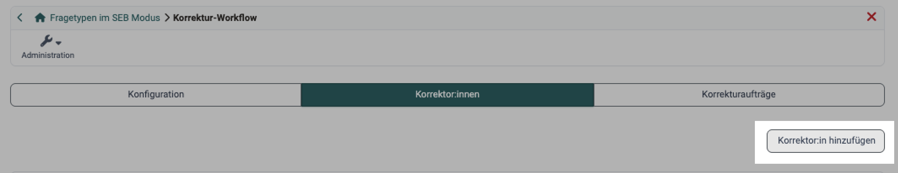{ class="shadow lightbox" }

Hier werden die Personen hinzugefügt, die einen Test bewerten sollen. Dabei ist es egal, welche Rolle die Person in OpenOlat besitzt. Auch Personen mit der Rolle "Benutzer:in" können als Korrektor:in hinzugefügt werden. Über das Zeilenmenü einer Korrektor:in stehen weitere Aktionen bereit, zum Beispiel Korrektor:in kontaktieren, deaktivieren oder entfernen sowie die jeweiligen Korrekturaufträge anzeigen.

### Tab "Korrekturaufträge"

Hier kann der Bearbeitungsstand der Korrekturaufträge der unterschiedlichen Korrektor:innen angezeigt und nach verschiedenen Kriterien gefiltert werden.

### Report / Excel-Export [:octicons-tag-16:{ title="ab Release 21.0 (OO-9569)" }](https://track.frentix.com/issue/OO-9569)

Den Report ziehen Besitzer:innen der Test-Lernressource sowie Lernressourcenverwalter:innen, entweder hier oder kursübergreifend unter `Coaching > Auftragsverwaltung`. Korrektor:innen sehen ihre eigenen Aufträge unter `Coaching > Bewertungsaufträge` und laden dort keinen Report herunter.

Im Tab "Korrektor:innen" öffnen Sie im Zeilenmenü einer Korrektor:in den Eintrag "Report herunterladen". OpenOlat erzeugt daraus eine Excel-Datei mit dem Stand der Korrekturaufträge dieser Korrektor:in. Vor dem Download legen Sie den Umfang fest:

* Mit dem Schalter "Nur erledigte Aufträge" beschränken Sie den Report auf abgeschlossene Korrekturaufträge.
* Über die vordefinierten Zeiträume "Letzter Monat" und "Letztes Jahr" oder über die Felder "Erledigt am" (von und bis) grenzen Sie den Zeitraum ein. Dabei muss mindestens ein Datum angegeben werden.

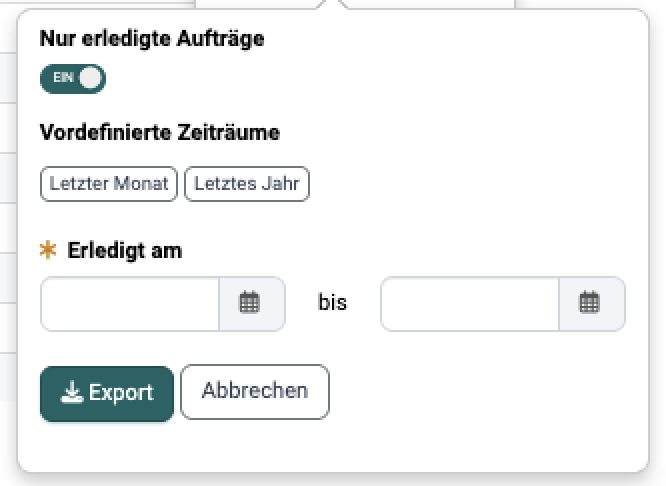{ class="shadow lightbox" }

Im Tab "Korrekturaufträge" erzeugt der Button "Bericht" denselben Report über die dort angezeigten Korrekturaufträge.

Der Report weist zu jedem Korrekturauftrag den Status ("Nicht zugeordnet", "Zugeteilt", "Erledigt"), das "Fälligkeitsdatum", das Datum "Erledigt am" sowie die Kennzeichnung "Frist abgelaufen" aus.

Die erzeugte Excel-Datei enthält die Worksheets "Korrektoren", "Assignments" und "Archive". Das Worksheet "Archive" führt archivierte Korrekturauftrag-Einträge auf, deren Auftragsdatensatz inzwischen entfernt wurde (etwa weil ein Prüfling, ein Korrektor:in oder die Test-Lernressource gelöscht wurde), inklusive Korrekturzeit und Abschlussdatum für die Abrechnung. [:octicons-tag-16:{ title="ab Release 21.0 (OO-6914)" }](https://track.frentix.com/issue/OO-6914)

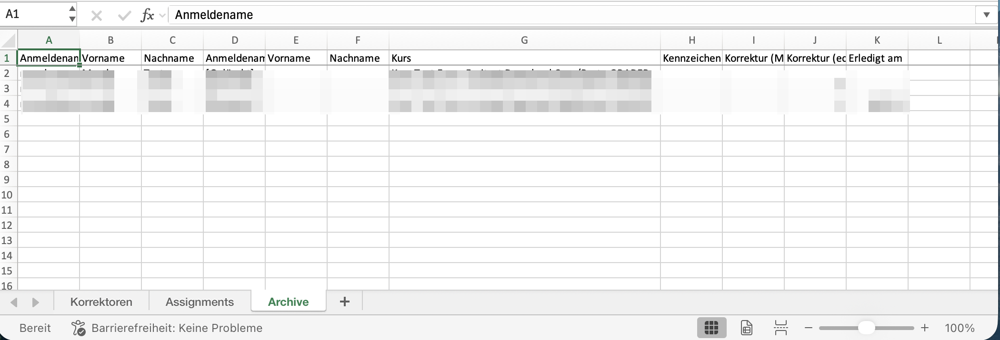{ class="shadow lightbox" }

!!! note "Coaching Tool"
    Weitere Informationen zur kursübergreifenden Korrektur. 
    [Coaching Tool](../area_modules/Coaching.de.md)

[zum Seitenanfang ^](#test_settings)

---

## Handschriftliche Prüfungen generieren {: #create_paper_pencil}

Wenn Sie offline eine Prüfung durchführen wollen, können Sie in diesem Wizard ein Deckblatt und verschiedene Versionen von Ihrer Testressource mit zufällig gewählten Antworten generieren lassen.

1. In den Optionen wählen Sie die Sprache und die Anzahl der Tests sowie einen Präfix für die Dateinamen aus. Sie können auch bestimmen, ob Sie ein Deckblatt oder auch eine zusätzliche Seite mitgenerieren wollen.

    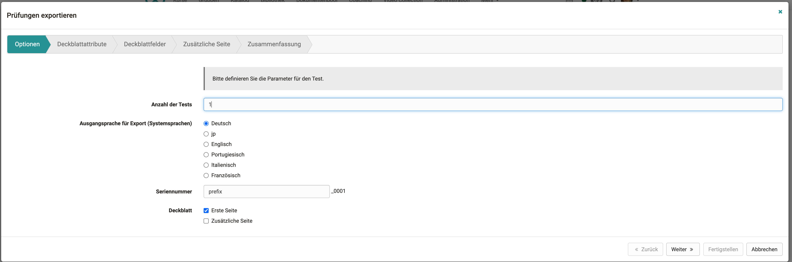{ class="shadow lightbox" }

2. Im zweiten Schritt wählen Sie die Attribute, die auf das Deckblatt kopiert werden sollen. Manche Attribute, wie die Beschreibung der Testressource, sind noch anpassbar.

    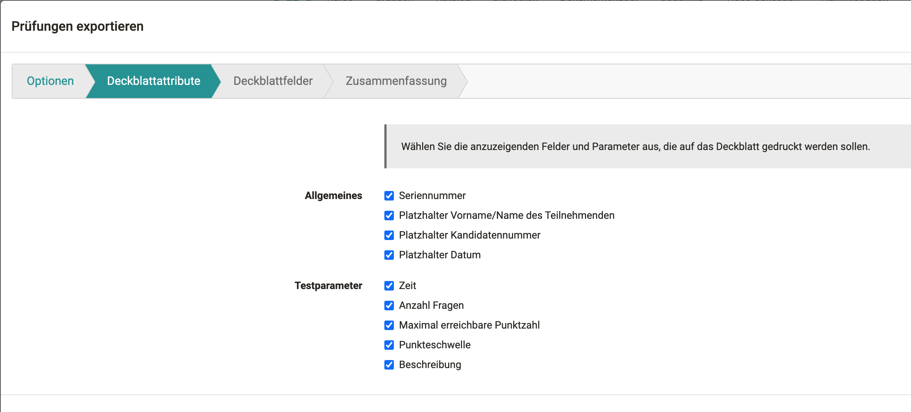{ class="shadow lightbox" }

3. Hier ist die Möglichkeit, bestimmte Felder zu markieren und zu überschreiben. Das Beschreibungsfeld wird von der Testressource herüberkopiert und lässt sich hier nochmals anpassen.

    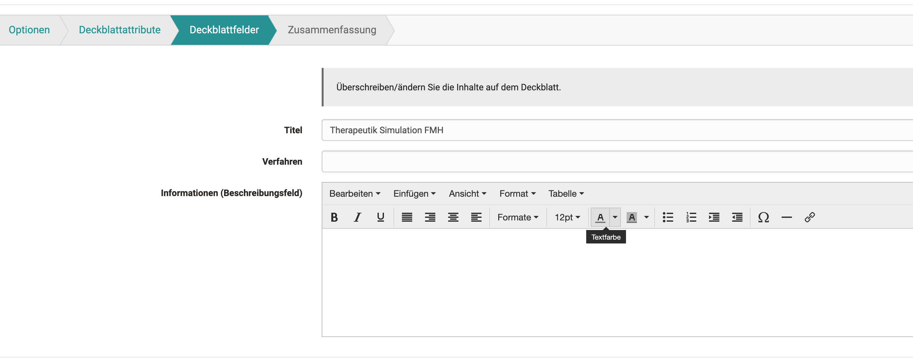{ class="shadow lightbox" }

4. Haben Sie im Schritt "Optionen" die Option "Zusätzliche Seite" aktiviert, erscheint hier der Schritt "Zusätzliche Seite".

5. Die Zusammenfassung beinhaltet eine Übersicht aller getätigten Einstellungen sowie eine Vorschau der zu generierenden Tests. Bitte beachten Sie, dass eine grössere Anzahl von Generierungen etwas dauern kann und der Browser möglicherweise nicht immer reagiert.

    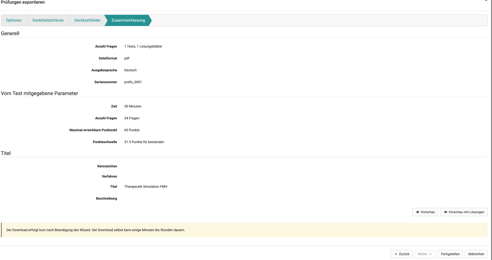{ class="shadow lightbox" }

[zum Seitenanfang ^](#test_settings)

---

## Als Worddatei exportieren {: #export_word}

Der Test wird dann im Zip-Format mit zwei Word-Dateien heruntergeladen, von denen eine Datei nur die Fragen, die andere zusätzlich noch die Lösungen enthält. Die exportierte Datei enthält alle wichtigen Informationen zum Test inklusive der Punktzahl, so dass Sie das Dokument direkt auch weiterverwenden können.

[zum Seitenanfang ^](#test_settings)

---

## Weiterführende Informationen {: #further_information}

**Weiterführend** 
[Wie gehe ich vor, wenn ich einen Test erstelle? >](../../manual_how-to/test_creation_procedure/test_creation_procedure.de.md) 
[Wie bewerte ich einen Test? >](../../manual_how-to/assessing_tests/assessing_tests.de.md) 
[Wie macht man in OpenOlat eine anonyme Test-Korrektur? >](../../manual_how-to/assessing_tests_anonymously/assessing_tests_anonymously.de.md) 
[Bewertungswerkzeug >](../../manual_user/learningresources/Assessment_tool_overview.de.md) 
[Coaching Tool >](../../manual_user/area_modules/Coaching.de.md)

[zum Seitenanfang ^](#test_settings)