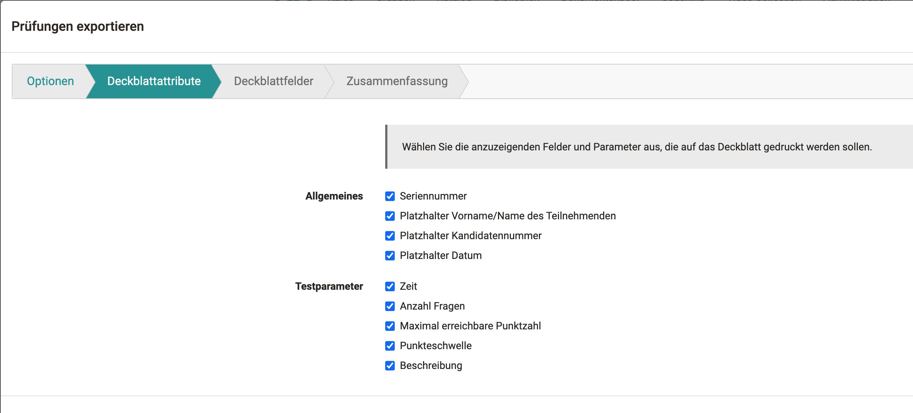
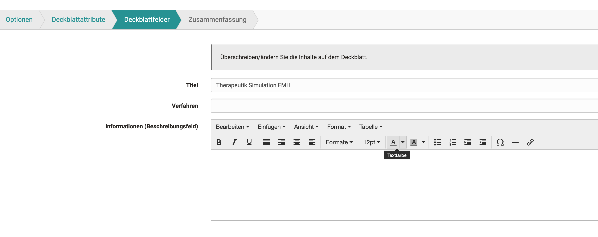
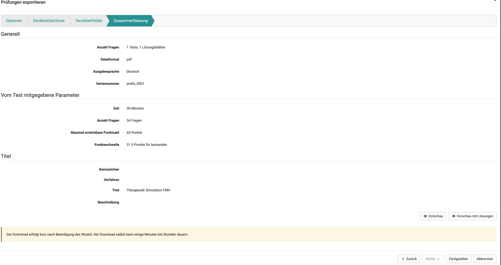

# Test Einstellungen - Administration

Im Bereich "Administration" eines Tests findet man, ähnlich wie bei anderen Lernressourcen weitere Menüs. Hier kann man den Test näher konfigurieren. Besonders wichtig sind dabei die Menüs "Einstellungen" und "Inhalt editieren". 

{ class="shadow" }

Die grundsätzliche Konfiguration des gesamten Test erfolgt größtenteils in den **"Einstellungen"**, besonders im Tab "Optionen" (siehe unten).

Das Menü **"Mitgliederverwaltung"** ist besonders dann relevant, wenn der Test kursunabhängig verwendet werden soll, ansonsten erfolgt die Mitgliederverwaltung der Test-Teilnehmenden über den verbundenen Kurs. 

Unter **["Inhalt editieren"](Test_editor_QTI_2.1.de.md)** gelangt man in den Test Editor. Hier wird der eigentliche Test angelegt.

Das **"Bewertungswerkzeug"** des Tests erscheint nur, wenn der Test kursunabhängig (Einstellungen -> Tab Freigabe -> Verwendungszweck "Eigenständige") verwendet werden soll.

Im Menü **"Korrektur-Workflow"** können für den Test Korrektoren hinzugefügt werden (siehe unten). 

Das Menü **"Test Statistik"** erscheint nur bei unabhängigen Tests, ansonsten wird die Test Statistik im jeweiligen Kursmenü angezeigt. 

Das Menü **"Buchungsmöglichkeiten"** ist nur aktiv, wenn der Test buchbar konfiguriert wurde.

Mit Hilfe eines Wizards können basierend auf dem Online-Test **"Handschriftliche Prüfungen"** generiert werden (siehe unten). 

Über die Menüs "Kopieren", "Inhalt exportieren" und "Als Worddatei exportieren" können die Tests kopiert bzw. gespeichert werden. 

**"Test löschen"** löscht die Lernressource Test. Man findet sie anschliessend im Autorenbereich im Tab "Gelöscht". 

Auf dieser Seite finden Sie nähere Erläuterungen zu folgenden Administrationsmenüs der Lernressource Test: 
* Einstellungen
* Korrektur-Workflow
* Handschriftliche Prüfungen generieren
* Als Worddatei speichern

  
## "Einstellungen" eines Tests

Wichtig für Tests ist vor allem der Tab "Optionen". Hier konfigurieren Sie den gesamten Test.  

{ class="shadow" }

Darüber hinaus können in den weiteren Tabs  "Info", "Metadaten", "Freigabe" und "Katalog" weitere Einstellungen der Lernressource vorgenommen werden. Achten Sie hier besonders darauf, dass die eingestellte Lizenzangabe unter "Metadaten" Ihren Vorstellungen entspricht.

### Tab Optionen

Folgende Konfigurationen können vorgenommen werden:

**Standardeinstellungen**

Hier wählen Sie eine vorkonfigurierte Auswahl von typischen Einstellungen für unterschiedliche Nutzungssituationen von Tests.

Entscheiden sie z.B. ob es sich um einen summativen oder formativen Test handelt oder verwenden Sie eine andere voreinstellte Konfiguration. Das erleichtert es gerade unerfahrenen Autoren schnell zu einer passenden Einstellung zu gelangen. Spätere Änderungen und individuelle Anpassungen sind aber weiterhin möglich.

{ class="shadow" }

**Anzahl Lösungsversuche limitieren**

Tragen Sie hier die maximale Anzahl der möglichen Lösungsversuche für einen Test ein. Der Wert kann maximal 20 betragen.  
  
**Erster bestandener Lösungsversuch zählt**

Sobald das Ergebnis "bestanden" erreicht wird, kann der Benutzer den Test nicht noch einmal durchführen.

**Anonyme Benutzer (Gäste) erlauben {: #guest}** 

Personen ohne OpenOlat Account können ebenfalls den Test absolvieren. Gäste können den Test jedoch nicht unterbrechen. Es werden nur abgeschlossene Tests gezählt. Die Resultate stehen ebenfalls in der Teststatistik zur Verfügung.

**Nur Modul anzeigen, LMS ausblenden**

Diese Auswahl wird gewählt, um zu verhindern, dass ein Benutzer während eines Tests auf andere OpenOlat-Funktionen Zugriff hat. OpenOlat wird dabei ausgeblendet und erst wieder nach Beenden des Testes angezeigt.  

**Fragetitel anzeigen**

Markieren Sie die Checkbox, um den Benutzern die Titel der Fragen anzuzeigen. Wenn die Titel nicht angezeigt werden sollen, aber die Navigation aktiviert ist, dann erscheint in der Menü-Navigation ein anonymisierter Titel.  
  
**Menu-Navigation anzeigen** 

Wenn Sie die Menu-Navigation _nicht_ erlauben:

* ist am Test "nicht lineare Navigation" eingestellt, kann die Navigation unterhalb der Frage über einen Button aufgerufen werden, um eine andere Frage auszuwählen.
* ist am Test "lineare Navigation" eingestellt, erscheint nach dem Abschicken einer Antwort automatisch die nächste Frage und die Testperson kann nicht zu anderen Fragen navigieren.

**Persönliche Notizen  {: #notes}**

Sie können den Benutzern erlauben, während des Tests persönliche Notizen zu erstellen, die nach Abschluss des Tests nicht mehr zur Verfügung stehen.

**Anzahl Fragen und Fortschritt im Test anzeigen**

Markieren Sie die Checkbox, um den Benutzern die Anzahl Fragen anzuzeigen.  

**Anzahl Punkte und Punktestand im Test anzeigen**

Markieren Sie die Checkbox, um den Benutzern ihre momentane Punktezahl im Testverlauf anzuzeigen.

**Max. Punkte der Frage anzeigen** 

Ist die Checkbox markiert, werden die maximal erreichbaren Punkte pro Frage im Test angezeigt.  

**Unterbrechen erlauben**

Das Ankreuzen der Checkbox bewirkt, dass die Benutzer den Test unterbrechen können. Hierbei werden die bisherigen Antworten gespeichert und die Benutzer haben die Möglichkeit zu einem späteren Zeitpunkt mit der Beantwortung der Fragen fortzufahren.

**Abbrechen erlauben**

Mit dem Ankreuzen der Checkbox erlauben Sie den Kursteilnehmenden den Test abzubrechen, ohne dass die Antworten gespeichert werden.  

**Testquittung erstellen**

Wenn diese Option angewählt wird, wird nach Beenden des Tests eine Testquittung erstellt, welche als XML-File heruntergeladen werden kann. Es dient der Verifizierung des Tests.

{ class="shadow" }

Wenn die Option "Testquittung erstellen" ausgewählt ist, kann die Option Testquittung per Mail schicken zusätzlich aktiviert werden. Das erstellte XML-File wird dann zusätzlich per Mail an den Teilnehmer verschickt.

**Feedbacks anzeigen**

Solange diese Checkbox ausgewählt ist, werden die Feedbacks im Testverlauf angezeigt. Wenn die Checkbox nicht mehr ausgewählt ist, werden keine Feedbacks mehr angezeigt. Dies betrifft die Feedbacks aller Frageitems und auch das Feedback, welches auf der Ebene Test hinzugefügt werden kann. Die einzelnen Feedbacks werden im Testeditor konfiguriert.  
  
**Resultate nach Testabschluss anzeigen {: #results}**

Wenn diese Checkbox ausgewählt ist, wird das Resultat nach Beenden des Tests angezeigt. Was genau angezeigt wird, kann ausgewählt werden.  

* **Testzusammenfassung**: Die Metadaten des gesamten Tests werden als Zusammenfassung angezeigt (inkl. Punkte und Bestanden/Nicht bestanden).
* **Sektionszusammenfassung**: Die Metadaten der Sektion werden als Zusammenfassung angezeigt.
* **Fragezusammenfassung**: Die Metadaten jeder einzelnen Frage werden angezeigt.
* **Antwort, vom Teilnehmer abgegeben**: Es wird die Fragestellung zusammen mit der Antwort des Teilnehmenden angezeigt.
* **Lösung**: Es wird die Fragestellung zusammen mit der korrekten Lösung angezeigt. Wenn im Tab Feedback eine korrekte Lösung hinterlegt ist, wird diese in der Resultatansicht mit dieser Option auch angezeigt.
  

!!! info "Hinweis"

    Die Einstellungen, welche unter Optionen vorgenommen werden, werden beim Einbinden des Tests in einen [Kurs](Tests_at_course_level.de.md) automatisch übernommen und können falls gewünscht im jeweiligen Kursbaustein Test im Kurseditor in den Tabs "Test-Konfiguration" bzw. "Optionen" angepasst werden.

    Ob die Ergebnisse auf der Test-Startseite im Kurs dargestellt werden, wird ebenfalls direkt im Kurs konfiguriert.     

## Korrektur-Workflow 

Um einem Test weitere, auch kursübergreifende, Korrektoren hinzufügen zu können, muss in der Administration des Tests im Menü "Korrektur" die Korrektur eingeschaltet werden. Anschließend können die Korrektoren hinzugefügt, Korrekturaufträge vergeben und weitere Einstellungen vorgenommen werden.

### Tab "Konfiguration"

Hier wird die externe Korrektur grundsätzlich eingeschaltet. Anschließend kann definiert werden ob die Prüflinge anonym oder mit sichtbarem Namen bewertet werden. Der Korrekturzeitraum gibt die maximale Zeit an, die dem Korrektor zur Verfügung steht.

Die jeweiligen Korrektoren werden automatisch benachrichtigt, wenn neue Bearbeitungen des Tests vorliegen. Die Benachrichtigung kann entweder direkt nach Testabschluss oder einmal pro Tag verschickt werden. Hierfür kann ein passender Mailtext hinterlegt werden oder eine Vorlage ("Vorlage Sprache wählen") verwendet werden. Nach der ersten Mail Benachrichtigung können noch zwei Erinnerungsmails in selbst definierten Abständen (Tagen) verschickt werden.

### Tab "Korrektoren"

Hier werden die Personen hinzugefügt, die einen Test bewerten sollen. Dabei ist es egal, welche Rolle die Person in OpenOlat besitzt. Auch Benutzer können als Korrektoren hinzugefügt werden. Über das Zahnrad können weitere Konfigurationen vorgenommen werden, z.B. ein Korrektor kontaktiert, deaktiviert oder entfernt sowie die jeweiligen Korrekturaufträge angezeigt werden.

### Tab "Korrekturaufträge"

Hier kann der Bearbeitungsstand der Korrekturaufträge der unterschiedlichen Korrektoren angezeigt und nach verschiedenen Kriterien gefiltert werden.

Weitere Informationen zur kursübergreifenden Korrektur findet man im [Coaching Tool](../area_modules/Coaching.de.md).

## Handschriftliche Prüfungen generieren

Wenn sie offline eine Prüfung durchführen wollen, können sie in diesem Wizard ein Deckblatt und verschiedene Versionen von ihrer Testressource mit zufällig gewählten Antworten generieren lassen.

1. In den Optionen wählen sie die Sprache und die Anzahl der Tests, sowie einen Prefix für die Dateinamen aus. Sie können auch bestimmen, ob sie ein Deckblatt oder auch eine zusätzliche Seite mitgenerieren wollen.

    { class="shadow" }

2. Im zweiten Schritt wählt man die Attribute, die auf das Deckblatt kopiert werden sollen. Manche Attribute, wie die Beschreibung der Testressource, sind noch anpassbar.

    { class="shadow" }

3. Hier ist die Möglichkeit, bestimmte Felder zu markieren und zu überschreiben. Das Beschreibungsfeld wird von der Testressource herüberkopiert und lässt sich hier nochmals anpassen.

    { class="shadow" }

4. Die Zusammenfassung beinhaltet eine Übersicht aller getätigter Einstellung sowie eine Vorschau der zu generierten Tests. Bitte beachten, dass bei einer grösseren Anzahl von Generierungen, diese etwas dauern kann und der Browser möglicherweise nicht immer reagiert.

    { class="shadow" }

## Als Worddatei exportieren 

Der Test wird dann im Zip-Format mit zwei Word-Dateien heruntergeladen, von denen eine Datei nur die Fragen, die andere zusätzlich noch die Lösungen enthält. Die exportierte Datei enthält alle wichtigen Informationen zum Test inklusive der Punktzahl, so dass Sie das Dokument direkt auch weiterverwenden können.