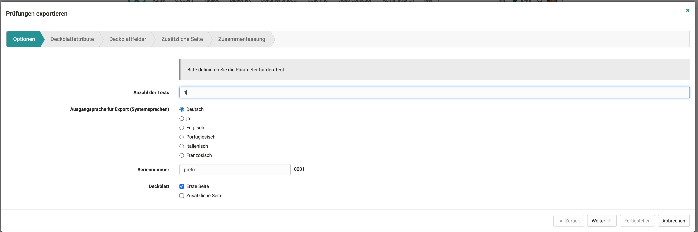
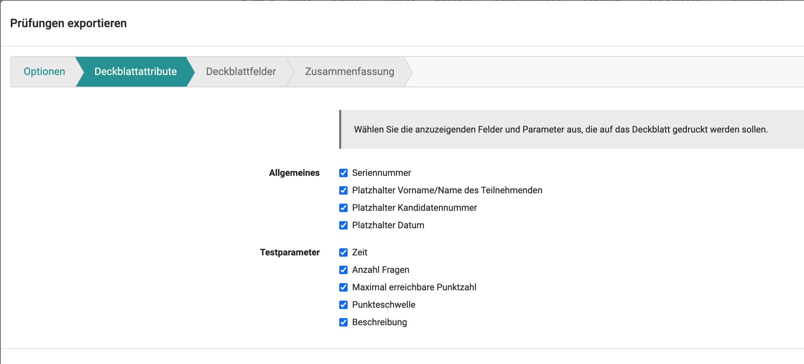
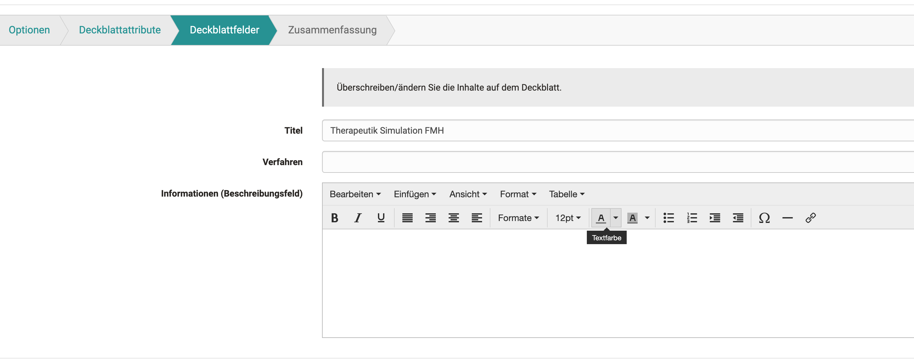
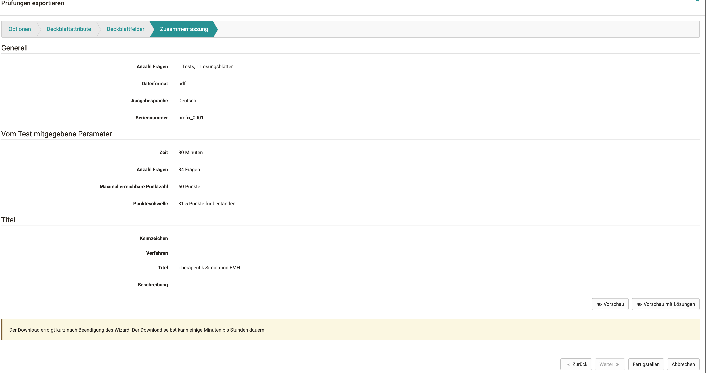
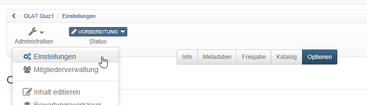
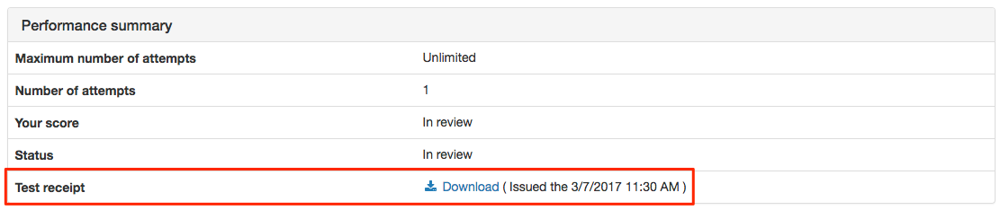
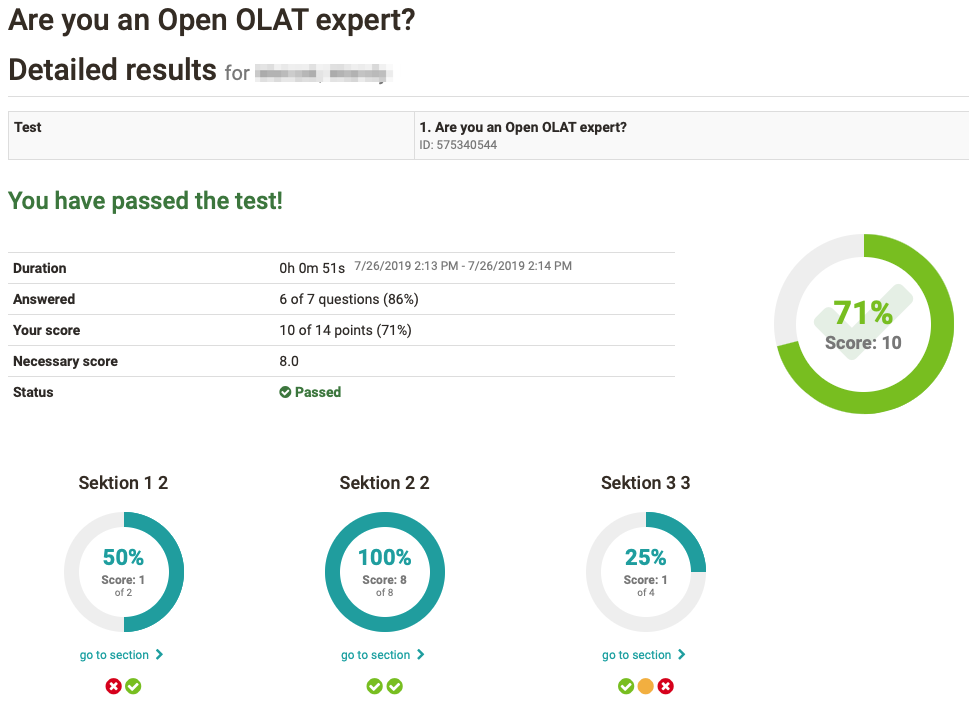

# Test settings

## Test administration

In the "Administration" area of a test, you will find further menus, similar to other learning resources. Here you can configure the test in more detail. The "Settings" and "Edit content" menus are particularly important. The "Assessment Tool" is relevant if the test is to be used independently of the course.  

Under "[Edit content](Test_editor_QTI_2.1.md)" you get to the test editor. The actual test is created here. The basic configuration of the entire test is mostly done in the "Settings", especially in the "Options" tab. The "Options"
tab is explained in more detail in this chapter.

{ class="shadow" }

### Export handwritten exams

If you want to run a test offline, you can use this wizard to generate a cover sheet and different versions of your test resource with randomly selected answers.

1. In the options you select the language and the number of tests, as well as a prefix for the file names. You can also specify whether you want to generate a cover page or an additional page.

    { class="shadow" }

2. In the second step you choose the attributes that should be copied to the cover page. Some attributes, like the description of the test resource, are still customizable.

    { class="shadow" }

3. here is the possibility to select and overwrite certain fields. The description field is copied over from the test resource and can be customized again here.

    { class="shadow" }

4. The summary contains an overview of all settings made and a preview of the tests to be generated. Please note that if there is a large number of generations, it may take some time and the browser may not always respond.

    { class="shadow" }

## Menu "Settings" of a test

General settings for a test are made in the "Settings" in the "Administration" of the test learning resource. Select the tab "Options" and make the desired settings.

{ class="shadow" }

### Settings: Tab Options

The following configurations can be made:

#### Standard settings

Here you select a preconfigured selection of typical settings for different test usage situations.

Decide, for example, whether it is a summative or formative test or use a different default configuration. This makes it easier, especially for inexperienced authors, to quickly find a suitable setting. Later changes and individual adjustments are still possible.

{ class="shadow" }
  
#### Limit number of test attempts

Enter the maximum number of possible solution attempts for a test here. The value can be a maximum of 20.  
  
#### First successful attempt counts

Once the result is "passed", the user cannot perform the test again.  

#### Anonym users (guests) allowed {: #guest}

Persons without OpenOlat account can also complete the course. The results are also available in the test statistics. However, guests cannot interrupt the test. Only completed tests are counted.  

#### Display only module, hide LMS

This is chosen to prevent a user from having access to other OpenOlat functions during a test. OpenOlat is hidden and only displayed again after the test has been completed.  

#### Show question title

Select the checkbox to display the titles of the questions to the users. If the titles should not be displayed but the navigation is activated then an anonymous title appears in the menu navigation.  
  
#### Show menu navigation

If you do _not_ allow menu navigation:

* If "non-linear navigation" is set on the test, the navigation below the question can be accessed via a button to select another question.
* If the test is set to "linear navigation", the next question will automatically appear after an answer is submitted and the test person will not be able to navigate to other questions.

#### Personal notes {: #notes}

You can allow users to create personal notes during the test that are no longer available when the test is complete.  

#### Show number of questions and progress in test

Select the checkbox to display the number of questions to the users.  

#### Show points and score in test

Select the checkbox to show the users current score in the test run.  

#### Show questions max. points

If the checkbox is checked, the maximum achievable points per question are displayed in the test.  

#### Allow to suspend

Selecting the checkbox allows users to interrupt the test. The previous answers are saved and the users can continue answering the questions at a later time.  

#### Allow to cancel

By ticking the checkbox you allow the course participants to cancel the test without saving the answers.  

#### Generate a test receipt

If this option is selected, a test receipt will be generated after the test is finished, which can be downloaded as an XML file. It is used to verify the test.

{ class="shadow" }
  
#### Send the test receipt per mail

If the option "Create test receipt" is selected, the option "Send test receipt by mail" can be activated additionally. The created XML file will then be sent to the participant by e-mail.  

#### Show feedbacks

As long as this checkbox is selected, the feedback will be displayed during the test process. If the checkbox is no longer selected, no more feedback will be displayed. This concerns the feedback of all question items and also the feedback that can be added at the test level. The individual feedbacks are configured in the test editor.  
  
#### Show results after test has been submitted {: #results}

If this checkbox is selected, the result will be displayed when the test is finished. However, the result is not displayed on the test home page. This setting is made in the test course element.

From the following options, you can select the ones you want to display.

* **Test Summary**: The metadata of the entire test is displayed as a summary (including points and passed/failed).
* **Section Summary**: The section's metadata is displayed as a summary.
* **Question Summary**: The metadata of each question is displayed.
* **Answer, submitted by participant**: The question is displayed together with the participant's answer.
* **Solution**: The question is displayed together with the correct solution. If a correct solution is stored in the Feedback tab, it will also be displayed in the result view with this option.

{ class="shadow" }
  
!!! info "Note"

    The settings made under Options are automatically adopted when the test is included in a [course](Tests_at_course_level.md) and, if desired, can be adapted in the respective course element Test in the course editor in the tabs "Test configuration" or "Options".

### Settings: Tab Metadata, Share, Catalog

Further settings of the learning resource will be made in the further tabs of the Settings "Info", "Metadata", "Release" and "Catalog". Make sure that the license information under "Metadata" corresponds to your requirements.

## Grading menu of a test

In order to be able to add further correctors to a test, even across courses, the correction must be activated in the administration of the test in the menu "Grading". Afterwards the graders can be added, grading assignments can be given and further settings can be made.

### Tab "Configuration"

Here the external grading is generally switched on. You can then define whether the test items are evaluated anonymously or with a visible name. The correction period specifies the maximum time available to the grader.

The respective graders are automatically notified when new edits of the test are available. The notification can be sent either immediately after the test is completed or once a day. For this purpose, a suitable mail text can be
stored or a template ("Choose language template") can be used. After the first mail notification, two reminder mails can be sent at user-defined intervals (days).

### Tab "Graders"

Here you add the persons who are to grade a test. It does not matter which role the person has in OpenOlat. Users can also be added as graders. Further configurations can be made via the gear wheel, e.g. a grader can be contacted,
deactivated or removed and the respective grading assignments can be displayed.

### Tab "Grading assignments"

Here the processing status of the grading assignments of the different graders can be displayed and filtered according to various criteria.

For more information on cross-course correction, see the [Coaching Tool](../area_modules/Coaching.de.md).
