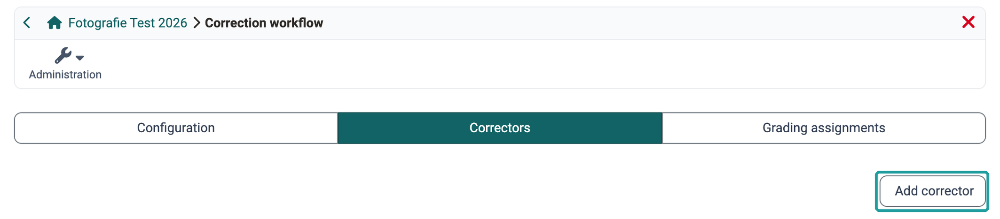
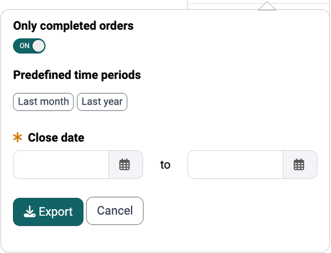

# Test settings - Administration {: #test_settings}

In the `Test > Administration` area you will find further menus, similar to other learning resources. Here you can configure the test in more detail. The "Settings" and "Edit content" menus are particularly important. Owners of the learning resource, learning resource managers and administrators see this area.

{ class="shadow lightbox" }

The basic configuration of the entire test is largely carried out in the **"Settings"**, particularly in the "Options" tab (see below).

The **"Member administration"** menu is particularly relevant if the test is to be used independently of the course, otherwise the member administration of the test participants is carried out via the linked course.

Under "Edit content" you access the test editor. This is where you create the actual test.

!!! note "Test editor QTI 2.1"
    Overview of the test editor. 
    [Edit content](Test_editor_QTI_2.1.md)

The **"Assessment tool"** of the test only appears if the test is to be used independently of the course: `Test > Administration > Settings > Tab "Share"`, purpose "Independent".

Correctors can be added for the test in the **"Correction workflow"** menu (see below). 

The **"Test statistics"** menu only appears for independent tests, otherwise the test statistics are displayed in the respective course menu.

The **"Offer types"** menu is only active if the test has been configured as bookable.

Under **"Export handwritten exams"** a wizard generates exams for printing based on the online test (see below). The entry only appears if the PDF generator is switched on. You find it in the system administration under: `Administration > External tools > PDF generator`.

The tests can be copied or saved using the "Copy", "Export content" and "Export as Word document" menus.

**"Delete test"** deletes the test learning resource. It can then be found in the author area in the "Deleted" tab. 

On this page you will find more detailed explanations of the following administration menus of the learning resource Test:

* Settings
* Correction workflow
* Export handwritten exams
* Export as Word document

[To the top of the page ^](#test_settings)

---

## "Settings" of a test {: #settings}

The "Options" tab is particularly important for tests. This is where you configure the entire test. 

{ class="shadow lightbox" }

In addition, further settings for the learning resource can be made in the other tabs "Info", "Metadata", "Share" and "Catalog". Make sure that the license information under "Metadata" corresponds to your requirements.

### Tab Options [:octicons-tag-16:{ title="from Release 20.3.0 (OO-8321)" }](https://track.frentix.com/issue/OO-8321)

In the "Options" tab you define how participants work through the test: how many attempts they have, what is displayed to them during the test, and what they see after completion.

!!! info "Important"
    The settings made under Options are automatically adopted when the test is included in a [course](Tests_at_course_level.md) and, if desired, can be adapted in the respective course element Test in the course editor in the tabs "Test configuration" or "Options".

    Whether the results are displayed on the test start page in the course is also configured directly in the course.

#### Standard settings {: #default_settings}

Here you can choose a preconfigured selection of typical settings for different test usage situations.

Decide, for example, whether it is a summative or formative test or use a different preset configuration. This makes it easier for inexperienced authors in particular to quickly find a suitable setting. However, later changes and individual adjustments are still possible.

{ class="shadow lightbox" }

#### Limit number of test attempts {: #limit_attempts}

Activate this option to limit the number of possible solution attempts for a test. Enter the desired number in the "Max. number of attempts" field. The value can be a maximum of 20.

#### First successful attempt counts {: #block_after_success}

As soon as the result "passed" is achieved, participants cannot perform the test again.

#### Anonym users (guests) allowed {: #guest}

People without an OpenOlat account can also take the test. However, guests cannot interrupt the test. Only completed tests are counted. The results are also available in the test statistics.

#### Display only module, hide LMS {: #hide_lms}

This selection is made to prevent participants from accessing other OpenOlat functions during a test. OpenOlat is hidden and only displayed again once the test has been completed.

#### Show question title {: #show_question_titles}

Select the checkbox to show participants the titles of the questions. If the titles are not to be displayed but the navigation is activated, an anonymized title will appear in the menu navigation.

#### Show menu navigation {: #show_menu}

If you _do not_ allow menu navigation:

* If "non-linear navigation" is set on the test, the navigation below the question can be called up via a button to select a different question.
* If "linear navigation" is set on the test, the next question appears automatically after submitting an answer and participants cannot navigate to other questions.

#### Personal notes {: #notes}

You can allow participants to create personal notes during the test, which are no longer available after the test has been completed.

#### Show number of questions and progress in test {: #question_progress}

Select the checkbox to show participants the number of questions.

#### Show points and score in test {: #score_progress}

Select the checkbox to show participants their current score in the test history.

#### Show questions max. points {: #max_score_question}

If the checkbox is marked, the maximum achievable points per question in the test are displayed.

#### Allow to suspend {: #allow_suspend}

Ticking the checkbox allows participants to interrupt the test. The previous answers are saved and participants can continue answering the questions at a later time.

#### Allow to cancel {: #allow_cancel}

By ticking the checkbox, you allow participants to cancel the test without saving their answers.

#### Generate a test receipt {: #digital_signature}

If this option is selected, a test receipt is created at the end of the test, which can be downloaded as an XML file. It is used to verify the test.

{ class="shadow lightbox" }

If the "Generate a test receipt" option is selected, the option "Send the test receipt per mail" can also be activated. The XML file created is then also sent to the participant by email.

#### Show feedbacks {: #show_feedbacks}

As long as this checkbox is selected, the feedback is displayed in the test history. If the checkbox is no longer selected, feedback is no longer displayed. This applies to the feedback for all question items and also the feedback that can be added at the test level. The individual feedbacks are configured in the test editor.

#### Show results after test has been submitted {: #results}

If this checkbox is selected, the result is displayed after the test has been completed. You select what exactly is displayed below under "Overview results":

* **Test summary**: The metadata of the entire test is displayed as a summary (incl. points and pass/fail).
* **Section summary**: The metadata of the section is displayed as a summary.
* **Question summary**: The metadata for each individual question is displayed.
* **Answer, submitted by participant**: The question is displayed together with the participant's answer.
* **Solution**: The question is displayed together with the correct solution. If a correct solution is stored in the Feedback tab, it is also displayed in the results view with this option.

## Correction workflow [:octicons-tag-16:{ title="from Release 15.0 (OO-4442)" }](https://track.frentix.com/issue/OO-4442) {: #correction-workflow}

To add additional correctors to a test, including correctors from other courses, you must switch on the correction workflow under `Test > Administration > Correction workflow`. You can then add correctors, assign grading assignments and make further settings.

The correction workflow only concerns the manual correction of a test: who corrects, whether the correction is anonymous and in which period. The correctors award the points, and the assessment results from them. The difference between assessment, correction and levels/grading is explained under [Assessment, correction and levels/grading](../area_modules/Coaching_Assessment_Orders.md#assessment_terms).

### Tab "Configuration"

Here you switch on the correction workflow. You can then define whether examinees are assessed anonymously or with a visible name. The correction period specifies the maximum time available to the corrector.

The respective correctors are automatically notified when new edits of the test are available. The notification can be sent either immediately after the test is completed or once a day. For this purpose, a suitable mail text can be stored or a template ("Choose language template") can be used. After the first mail notification, two reminder mails can be sent at user-defined intervals (days).

### Tab "Correctors"

{ class="shadow lightbox" }

Here you add the persons who are to grade a test. It does not matter which role the person has in OpenOlat. Users can also be added as correctors. Via the row menu of a corrector, further actions are available: "Show assignments", "Send e-mail", "Download report", "Deactivate" or "Activate", "Set absence leave" and "Remove".

The entered correctors find their orders under `Coaching > Assessment orders` in the tab [Grading assignments](../area_modules/Coaching_Assessment_Orders.md#tab_grading_assignments). Two further steps are needed for this: at the course element Test the correction is set to "Manual by graders", and a participant completes the test. Only then is the order created.

If no corrector is available at that moment, the assignment carries the status "Unassigned" and waits in the [Order management](../area_modules/Coaching_Order_Management.md). There, learning resource managers assign it to a person, and it appears in their list.

### Tab "Grading assignments"

Here the processing status of the grading assignments of the different correctors can be displayed and filtered according to various criteria.

### Report / Excel export [:octicons-tag-16:{ title="from Release 21.0 (OO-9569)" }](https://track.frentix.com/issue/OO-9569)

Owners of the test learning resource, learning resource managers and administrators pull the report either here or across courses under `Coaching > Order management`. Correctors see their own assignments under `Coaching > Assessment orders` and do not download a report there.

In the "Correctors" tab, open the "Download report" entry in the row menu of a corrector. OpenOlat generates an Excel file with the state of that corrector's grading assignments. Before the download, you define the scope:

* The "Only completed orders" switch is turned on and limits the report to completed grading assignments. If you turn it off, the report covers all grading assignments without a restriction to a period.
* As long as the switch is turned on, you narrow down the period with the "Predefined time periods" "Last month" and "Last year" or with the mandatory field "Close date". Both date fields must be filled in.

{ class="shadow lightbox" }

In the "Grading assignments" tab, the "Report" button generates the same report for the grading assignments displayed there.

For each grading assignment, the report shows the status ("Unassigned", "Assigned", "Done"), the "Due date", the "Close date" and the "Missed deadline" flag.

The generated Excel file contains the worksheets "Graders", "Assignments" and "Archive". The "Archive" worksheet lists archived grading assignment entries whose assignment record has since been removed (for example because an examinee, a corrector or the test learning resource was deleted), including the correction time and the "Close date" for remuneration. [:octicons-tag-16:{ title="from Release 21.0 (OO-6914)" }](https://track.frentix.com/issue/OO-6914)

{ class="shadow lightbox" }

!!! note "Coaching Tool"
    More information on cross-course correction. 
    [Coaching Tool](../area_modules/Coaching.md)

[To the top of the page ^](#test_settings)

---

## Export handwritten exams {: #create_paper_pencil}

If you want to run a test offline, you can use this wizard to generate a cover sheet and different versions of your test resource with randomly selected answers.

1. In the options you select the language and the number of tests, as well as a prefix for the file names. You can also specify whether you want to generate a cover sheet or an additional sheet.

    { class="shadow lightbox" }

2. In the second step you choose the attributes that should be copied to the cover sheet. Some attributes, like the description of the test resource, are still customizable.

    { class="shadow lightbox" }

3. Here you have the possibility to select and overwrite certain fields. The description field is copied over from the test resource and can be customized again here.

    { class="shadow lightbox" }

4. If you activated the "Additional sheet" option in the "Options" step, the "Additional sheet" step appears here.

5. The summary contains an overview of all settings made and a preview of the tests to be generated. Please note that a large number of generations may take some time and the browser may not always respond.

    { class="shadow lightbox" }

[To the top of the page ^](#test_settings)

---

## Export as Word document {: #export_word}

The test is then downloaded in zip format with two Word files, one of which contains only the questions and the other also contains the solutions. The exported file contains all the important information about the test, including the score, so that you can use the document directly.

[To the top of the page ^](#test_settings)

---

## Further information {: #further_information}

**Mentioned on this page** 
[Test editor >](Test_editor_QTI_2.1.md) 
[Tests at course level >](Tests_at_course_level.md) 
[Coaching - Assessment orders >](../area_modules/Coaching_Assessment_Orders.md) 
[Coaching - Order management >](../area_modules/Coaching_Order_Management.md) 
[Coaching - Overview >](../area_modules/Coaching.md)

**Further reading** 
[How do I proceed when creating a test? >](../../manual_how-to/test_creation_procedure/test_creation_procedure.md) 
[How do I assess a test? >](../../manual_how-to/assessing_tests/assessing_tests.md) 
[How do you grade an anonymous test in OpenOlat? >](../../manual_how-to/assessing_tests_anonymously/assessing_tests_anonymously.md) 
[Assessment tool - overview >](Assessment_tool_overview.md)

[To the top of the page ^](#test_settings)
